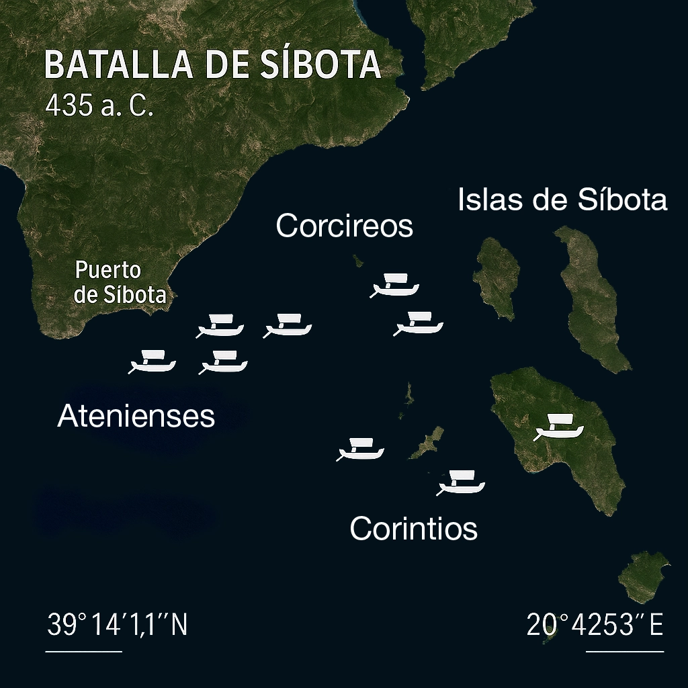

Tucídides. *Historia de la guerra del Peloponeso*. Edición de Juan José Torres Esbarranch. Libros I-II. España, Gredos, 1990.

## Sinopsis

1\. Prólogo. La importancia de la Guerra del Peloponeso.

2-19\. La «Arqueología». Debilidad de épocas anteriores en relación con la Grecia de la Guerra del Peloponeso. Crítica histórica.

20-22\. La investigación de Tucídides. El método histórico.

23\. La magnitud de la Guerra del Peloponeso. Sus causas.

24-55\. Conflicto de Corcira.

29\. Victorias de Corcira.

31\. Embajadas de corcireos y corintios a Atenas.

32-36\. Discurso de los corcireos.

37-43\. Discurso de los corintios.

44-45\. Alianza defensiva de Atenas y Corcira. Intervención ateniense.

46\. Preparativos de los corintios.

47\. Preparativos de los corcireos.

48-52\. Batalla naval de las islas de Síbota.

53\. Conversaciones entre atenienses y corintios.

54\. Corintios y corcireos reivindican la victoria.

55\. Los corintios y los atenienses regresan a su patria.

56-66\. Conflicto de Potidea.

57\. Intrigas de Perdicas contra los atenienses.

58\. Sublevación de Potidea.

59\. Los atenienses en Macedonia.

60\. Ayuda de Corinto.

61\. Expedición de Calías.

62-63\. La Batalla de Potidea.

64-66\. Asedio de Potidea.

67-88\. El debate de Esparta.

68-72\. Discurso de los corintios.

73-79\. Discurso de los atenienses.

80-85\. Discurso de Arquidamo.

86\. Discurso de Estenelaidas.

87\. El tratado ha sido violado.

88\. El miedo de Esparta al poderío de Atenas. La verdadera causa.

89-118\. La «Pentecontecia». Historia de Atenas después de las Guerras Médicas. Formación del Imperio ateniense.

90-93\. La reconstrucción de las murallas de Atenas. Actuación de Temístocles.

94\. Expedición de Pausanias contra Chipre y Bizancio.

95\. Acusaciones contra Pausanias. La hegemonía pasa a los atenienses.

96\. La Confederación ático-delia.

97-100\. Orígenes y crecimiento del poderío ateniense. De la hegemonía al Imperio. Expediciones de Cimón, Tracia, Naxos, Eurimedonte, Tasos.

101\. La rebelión de los hilotas. Rendición de Tasos.

102\. Diferencias entre Esparta y Atenas. El incidente de Itome.

103\. Fin de la resistencia de Itome. Alianza de Mégara y Atenas.

104\. Los atenienses en Egipto.

105-106\. Guerras contra Corinto, Epidauro y Egina.

107\. Expedición lacedemonia a Grecia Central.

108\. Batallas de Tanagra y de Enófita. Expediciones atenienses. Atenas acaba sus Muros Largos.

109-110\. Derrota de los atenienses en Egipto.

111\. Los atenienses en Tesalia, en el Peloponeso y en Acarnania.

112\. Tregua de cinco años con Esparta. Expedición a Chipre. Muerte de Cimón. Victoria de Salamina de Chipre. Guerra Sagrada.

113\. Batalla de Coronea. Derrota ateniense en Grecia Central.

114\. Sublevación de Eubea y de Mégara.

115-117\. La Paz de Treinta años. La Guerra de Samos.

118\. Fin de la «Pentecontecia». Embajada lacedemonia a Delfos.

119-125\. Asamblea de la Liga del Peloponeso en Esparta.

120-124\. Discurso de los corintios.

125\. Se decide la guerra.

126-139\. Reclamaciones y pretextos.

126-127\. Primera embajada lacedemonia a Atenas. El sacrilegio de los Alcmeónidas.

128-134\. Réplica ateniense. El sacrilegio del Ténaro. Traición de Pausanias.

135-138\. El caso de Temístocles.

139-145\. La Asamblea de Atenas.

139\. Nuevas embajadas lacedemonias a Atenas. El ultimátum. La Asamblea.

140-144\. Discurso de Pericles.

145\. Respuesta de Atenas.

146\. Acaba el relato de las causas y antecedentes de la Guerra del Peloponeso.

## 1. Prólogo. La importancia de la Guerra del Peloponeso

1. Tucídides de Atenas1 escribió la historia de la guerra entre los peloponesios y los atenienses2 relatando cómo se desarrollaron sus hostilidades3, y se puso a ello4 tan pronto como se declaró, porque pensaba que iba a ser importante y más memorable que las anteriores5. Basaba su conjetura en el hecho de que ambos pueblos la emprendían en su mejor momento gracias a sus recursos de todo tipo6, y en que veía que los restantes griegos, unos de inmediato y otros disponiéndose a ello, se alineaban en uno u otro bando. [2] Esta fue, en efecto, la mayor conmoción7 que haya afectado a los griegos y a buena parte de los bárbaros8; alcanzó, por así decirlo, a casi toda la humanidad9. Pues los acontecimientos anteriores, y los todavía más antiguos10, era imposible, ciertamente, conocerlos con precisión a causa de la distancia del tiempo; pero por los indicios a los que puedo dar crédito cuando indago lo más lejos posible, no creo que ocurriera nada importante ni en lo referente a las guerras ni en lo demás.

## 2-19. La "Arqueología". Debilidad de épocas anteriores en relación con la Grecia de la Guerra del Peloponeso. Crítica histórica

2. Es evidente11, en efecto, que la tierra que ahora se llama Grecia no estaba habitada antiguamente de forma estable, sino que al principio hubo migraciones y todos abandonaban fácilmente su territorio forzados por otros pueblos cada vez más numerosos. [2] El comercio no existía y las comunicaciones entre los pueblos no eran seguras ni por tierra ni por mar; cada uno sacaba de su propia tierra solo lo indispensable para vivir, y no acumulaban riquezas ni efectuaban plantaciones12, puesto que nadie sabía cuándo otros se les echarían encima y, al no estar protegidos por murallas, los despojarían; en consecuencia, pensando que en cualquier parte iban a conseguir el indispensable alimento cotidiano, emigraban sin dificultad, y por ello no eran poderosos ni por la magnitud de sus ciudades ni por otro tipo de recursos13. [3] Las tierras más fértiles, mayormente, experimentaban continuos cambios de habitantes: así la que ahora se llama Tesalia y Beocia y la mayor parte del Peloponeso14 con la excepción de Arcadia, y de las restantes, las que eran mejores. [4] Gracias a la fertilidad de la tierra, las fortunas de algunos aumentaban y eran causa de disensiones internas que provocaban la ruina de los pueblos, a la vez que los dejaban más expuestos a los ataques de tribus del exterior. [5] Pero el Ática, según esto, por vivir desde los tiempos más remotos sin disensiones internas debido a la aridez de su suelo15, fue habitada sin interrupción por los mismos hombres16. [6] Y una demostración bastante clara de mi teoría la constituye el hecho de que las otras regiones no progresaron en la misma medida a causa de las migraciones. En efecto, los hombres más poderosos, al ser desterrados del resto de Grecia debido a guerras o a disensiones internas, se refugiaban en Atenas por aprecio a su estabilidad y, convirtiéndose en ciudadanos17, desde los primeros tiempos acrecentaron todavía más la población de la ciudad, hasta el punto de que más tarde, al resultar el Ática insuficiente, incluso enviaron colonias a Jonia18.

3. Me demuestra también, y no con menor claridad, la debilidad de los antiguos el hecho de que, antes de la Guerra de Troya19, la Hélade no parece haber acometido ninguna empresa en común; [2] pienso, además, que este nombre20 no solo no designaba todavía al país en su totalidad, sino que antes de Helén, el hijo de Deucalión21, ni siquiera existía tal denominación, y que las diferentes gentes, y sobre todo los pelasgos22, extendían el nombre de su propio pueblo. Pero cuando Helén y sus hijos se hicieron poderosos en la Ftiótide23, y los solicitaban para acudir en auxilio de otras ciudades, los diferentes pueblos, desde entonces, debido a aquellas relaciones, dieron una mayor difusión al nombre de helenos, denominación que, sin embargo, durante mucho tiempo, no pudo imponerse a todos. [3] Homero lo prueba mejor que nadie, pues, aunque vivió en una época muy posterior a la de la Guerra de Troya24, en ninguna parte aplicó el nombre colectivamente, ni tampoco a otros que no fueran los compañeros de Aquiles, procedentes de Ftiótide, que fueron precisamente los primeros helenos25, sino que en sus poemas, al referirse a todos, los llamó dánaos, argivos y aqueos. Tampoco utilizó el término de bárbaros26 por la razón de que los griegos, según creo, todavía no se distinguían con un solo nombre que fuera el contrario. [4] Así, pues, aquellos que recibieron el nombre de helenos, primero separadamente, ciudad tras ciudad a medida que se comprendían entre sí, y en conjunto después, no realizaron nada en común antes de la Guerra de Troya a causa de su debilidad y aislamiento. [5] Y marcharon juntos a esta expedición solo cuando su experiencia del mar fue mayor27.

4. Minos28 fue el primero, de los que conocemos por la tradición29, en procurarse una flota30 y extender su dominio por la mayor parte de lo que hoy llamamos mar griego31; sometió las islas Cícladas32 y fue el primer colonizador de la mayor parte de ellas, expulsando a los carios33 y estableciendo como gobernadores a sus propios hijos. Y, como era natural, para que le llegaran con mayor seguridad los tributos, procuró, hasta donde alcanzó su poder, limpiar el mar de piratas.

5. Los griegos de otro tiempo, en efecto, y los bárbaros que vivían en la costa del continente o en las islas, una vez que empezaron a pasar con sus naves de unas tierras a otras con mayor frecuencia, se dedicaron a la piratería34 bajo el mando de hombres que, sin ser ellos los de menos recursos, buscaban su propio provecho y sustento para los débiles. Cayendo sobre poblaciones sin murallas formadas por aldeas dispersas, las saqueaban y obtenían de allí la mayor parte de sus medios de vida, pues esta actividad no comportaba ningún deshonor, sino que más bien proporcionaba una cierta gloria. [2] Lo demuestran aún hoy algunos pueblos del continente, para quienes el éxito en estas acciones constituye un honor, y también los poetas antiguos, que en todas las ocasiones dirigen la misma pregunta de si son piratas35 a los navegantes que desembarcan, señal de que quienes eran interrogados no desdeñaban aquella actividad, y que aquellos que se preocupaban de informarse no la reprochaban. [3] En tierra también se dedicaban al pillaje unos contra otros. Y hasta nuestros días se vive a la manera antigua en muchas zonas de Grecia, en la región de los locros ozolos36, de los etolios37 y de los acarnanios38 y por aquella parte del continente. La costumbre de llevar armas que tienen estos pueblos continentales es una supervivencia de la antigua piratería.

6. Toda Grecia, en efecto, llevaba armas debido a que sus viviendas carecían de protección y a que las comunicaciones entre los pueblos no eran seguras; se acostumbraron a la vida en armas, igual que los bárbaros. [2] Y las zonas de Grecia que todavía viven así constituyen un indicio de que en otro tiempo formas de vida semejantes se daban por todas partes. [3] Entre aquellos griegos, los atenienses fueron los primeros en abandonar el hierro y pasarse, por la libertad de sus costumbres, a una vida más muelle. No hace mucho tiempo que en Atenas los más viejos de los ricos dejaron de llevar, como signo de su vida de lujo, guitones de lino39 y de recoger las guedejas de su cabello en la cabeza mediante la inserción de cigarras de oro40; de aquí proviene que esta moda imperara también durante mucho tiempo entre los viejos jonios, debido a su parentesco41. [4] Por el contrario, los lacedemonios42 fueron los primeros en usar vestidos sencillos43, a la moda de ahora, y, en general, quienes poseían una mayor fortuna adoptaron, antes que nadie, el mismo modo de vida de la masa. [5] También fueron los primeros en mostrarse desnudos44 y en desvestirse en público y untarse con aceite en los ejercicios gimnásticos. Antiguamente, en cambio, e incluso en los Juegos Olímpicos45, los atletas competían llevando un ceñidor46 que les cubría las vergüenzas, costumbre que se ha perdido no hace muchos años. Pero todavía hoy día hay pueblos bárbaros, en especial los asiáticos, que, al celebrar competiciones de pugilato y lucha, lo hacen cubiertos con taparrabos. [6] En muchos otros aspectos, asimismo, se podría demostrar que el mundo griego antiguo vivía de modo semejante al mundo bárbaro de hoy47.

7. Respecto a las ciudades, las de fundación más reciente, que, por ser las circunstancias más favorables para la navegación, tenían recursos en mayor abundancia, fueron construidas con murallas en la misma costa y cerraron los istmos48 pensando en el comercio y la defensa de cada una frente a sus vecinas. Las ciudades antiguas, por el contrario, tanto las insulares como las continentales, fueron fundadas generalmente lejos del mar49 a causa de la piratería, que se mantuvo durante mucho tiempo (pues no solo se robaban entre sí, sino que también robaban a todos los que, aun sin vivir del mar, habitaban junto a la costa), y hasta hoy día han seguido en el interior.

8. No fueron menos piratas los isleños, que eran carios50 y fenicios51, pueblos que, como es sabido, colonizaron la mayor parte de las islas. He aquí una prueba: cuando, durante la guerra que nos ocupa52, Delos fue purificada por los atenienses53 y fueron retiradas todas las tumbas de los que habían muerto en la isla, se vio que más de la mitad pertenecían a carios54; fueron identificados por el tipo de armas enterradas con ellos y por la forma de enterramiento, que todavía es la misma actualmente. [2] Pero cuando fue creada la flota de Minos, las comunicaciones por mar entre los pueblos resultaron más fáciles (pues expulsó a los malhechores de las islas55 cuando estableció colonias en la mayoría de ellas), [3] y los que habitaban junto al mar acrecentaron su fortuna y empezaron a vivir de forma más estable, e incluso algunos, al verse más ricos de lo que eran antes, se rodearon de murallas. Por el deseo de ganancias, los más débiles aceptaban su sumisión a los más fuertes, y los más poderosos con su abundancia se granjeaban el vasallaje de las ciudades más pequeñas56. [4] Y ya se había consolidado esta situación cuando, posteriormente, emprendieron la expedición contra Troya.

9. Me parece, además, que Agamenón consiguió reunir las fuerzas expedicionarias porque era el más poderoso de sus contemporáneos, y no tanto por ir al frente de los pretendientes de Helena, obligados por el juramento prestado a Tindáreo57. [2] Dicen, por cierto, quienes han recogido de los antepasados las tradiciones más precisas sobre los peloponesios58, que primero Pélope59, gracias a la gran fortuna con la que desde Asia llegó a un pueblo sin recursos, se hizo con el poder y, a pesar de ser extranjero, alcanzó el honor de dar su nombre al país, y que después el poder de sus descendientes todavía aumentó cuando Euristeo60 murió en el Ática a manos de los Heráclidas tras haber confiado, al partir hacia la guerra, Micenas61 y su imperio a Atreo debido a su parentesco, ya que Atreo (desterrado entonces por su padre a causa de la muerte de Crisipo)62 era hermano de la madre de Euristeo. Y como que Euristeo ya no regresó, Atreo heredó el reino de Micenas y todos los dominios de Euristeo, tal como quisieron los micénicos por miedo a los Heráclidas y porque, además, parecía un hombre fuerte y se había ganado al pueblo. Así los Pelópidas se hicieron más poderosos que los Perseidas63. [3] Agamenón, en mi opinión, gracias a que había recibido esta herencia y, además, por tener una mayor fuerza naval que los otros, pudo emprender y llevar a cabo la expedición, no tanto por el reconocimiento de que era objeto como por el temor que inspiraba. Es evidente, en efecto, que fue él quien llegó con el mayor número de naves, y que también proporcionó algunas a los arcadios64, tal como Homero lo demuestra, si su testimonio se considera válido65. [4] Y, además, en la transmisión del cetro66 dice de él que «reinaba en muchas islas y en toda Argos»67. Ahora bien, viviendo en el continente, si no hubiese tenido una flota68, no hubiera podido ejercer su dominio sobre otras islas que no fueran las vecinas (y esas no serían *muchas*). [5] Por esta expedición, asimismo, hay que conjeturar cómo eran las circunstancias anteriores a ella.

10. No se utilizaría un indicio exacto si, basándose en que Micenas era pequeña o en que alguna ciudad de las de entonces parece ahora sin importancia, se pusiera en duda que la expedición fue tan grande como los poetas la han cantado y como la tradición mantiene; [2] pues si fuera desolada la ciudad de los lacedemonios69, y solo quedaran los templos y los cimientos de los edificios, pienso que, al cabo de mucho tiempo, los hombres del mañana tendrían muchas dudas respecto a que la fuerza de los lacedemonios correspondiera a su fama. Sin embargo, ocupan dos quintas partes70 del Peloponeso y su hegemonía se extiende a la totalidad71 y a sus muchos aliados del exterior; pero, a pesar de esto, dado que la ciudad no tiene templos ni edificios suntuosos y no está construida de forma conjunta, sino que está formada por aldeas dispersas72 a la manera antigua de Grecia, parecería muy inferior. Por el contrario, si les ocurriera esto mismo a los atenienses, al mostrarse ante los ojos de los hombres del mañana la apariencia de la ciudad, conjeturarían que la fuerza de Atenas era doble de la real. [3] No hay razón, pues, para plantear dudas ni para prestar más atención a las apariencias de las ciudades que a sus fuerzas reales, sino que hay que creer que aquella expedición fue más importante que las anteriores73, aunque inferior a las de ahora, si es que también en este caso debemos confiar en los versos de Homero74, quien, aunque es verosímil que, como poeta, la ponderara para engrandecerla, aun así, sin embargo, deja clara su inferioridad. [4] En efecto, en la flota de mil doscientas naves atribuye a las de los beocios ciento veinte hombres75 y a las de Filoctetes cincuenta76, indicando, en mi opinión, las mayores y las menores; en el Catálogo de las Naves77 al menos, no se menciona nada acerca del tamaño de las otras. Que todos eran a la vez remeros y combatientes, lo demuestra al referirse a las naves de Filoctetes, pues dice que eran arqueros todos los que manejaban los remos78. Y no es probable que fueran a bordo muchos pasajeros, a excepción de los reyes y de los dignatarios principales, sobre todo dado que tenían que atravesar el mar con los pertrechos de guerra y que no tenían, además, barcos con puentes, sino construidos a la antigua usanza, más bien al modo de los piratas. [5] Así, pues, si sacamos la media de las naves mayores y menores, es evidente que no fueron muchos combatientes, tratándose de una expedición enviada en común por toda Grecia79.

11. La causa no era tanto la escasez de hombres como la falta de recursos. Debido a la dificultad de aprovisionamiento80, transportaron un ejército reducido en proporción a los medios de vida que esperaban obtener en el país mientras combatían. Y después que vencieron en el combate que siguió a su llegada (hecho evidente, pues, de lo contrario, no hubieran construido la fortificación del campamento)81, se ve que ni siquiera entonces utilizaron todas sus fuerzas, sino que, a causa de la dificultad de aprovisionamiento, se dedicaron a cultivar las tierras del Quersoneso y a la piratería82. Por este motivo principalmente, los troyanos, al estar dispersos los griegos, pudieron resistir durante diez años de lucha abierta, ya que sus fuerzas eran equivalentes al retén que sucesivamente quedaba frente a ellos. [2] Por el contrario, si los griegos hubieran llegado con abundancia de provisiones, y si todos a la vez, sin dedicarse a la agricultura y a la piratería, hubieran proseguido la guerra sin interrupción, fácilmente se hubieran impuesto en el combate y hubieran tomado la ciudad, dado que, incluso sin actuar a la vez, solo con la parte del ejército que sucesivamente estaba presente, resistieron; y si se hubieran establecido en torno a ella para sitiarla, hubieran tomado Troya en menos tiempo y con menos dificultades. [3] Pero así como la debilidad de las empresas anteriores fue debida a la falta de recursos, sin duda ocurre lo mismo con la Guerra de Troya, que si bien ha obtenido más renombre que las anteriores, los hechos demuestran que fue inferior a su fama y a la tradición que, gracias a los poetas, prevalece actualmente.

12. Lo cierto es que, incluso después de la Guerra de Troya, Grecia todavía siguió sometida al proceso de migraciones y colonizaciones que impidieron la paz necesaria para desarrollarse. [2] El regreso de los griegos de Ilión después de tanto tiempo provocó muchos cambios, y en la mayor parte de las ciudades se produjeron disensiones internas a consecuencia de las cuales los que eran desterrados fundaban nuevas ciudades. [3] Así, los actuales beocios, sesenta años después de la toma de Ilión83, tras ser expulsados de Arne84 por los tesalios, ocuparon la Beocia de hoy, que antes se llamaba tierra cadmea85 (una rama de este pueblo ya estaba antes en esta tierra, y algunos de ellos participaron en la expedición contra Ilión)86, y, ochenta años después de la misma fecha, los dorios con los Heráclidas se apoderaron del Peloponeso87. [4] Cuando finalmente, después de mucho tiempo, Grecia alcanzó una paz estable y se acabaron las migraciones, empezó a enviar colonias al exterior; los atenienses ocuparon Jonia y las más de las islas88, mientras que los peloponesios colonizaron la mayor parte de Italia89 y de Sicilia90 y algunos lugares del resto de Grecia91. Todas estas colonias fueron fundadas después de la Guerra de Troya.

13. Al hacerse Grecia más poderosa y dedicarse todavía más que antes a la adquisición de riquezas, en la mayoría de las ciudades se establecieron tiranías con el aumento de los ingresos (antes había monarquías hereditarias con prerrogativas delimitadas), y Grecia se puso a equipar flotas y a vivir más de cara al mar. [2] Se dice que los corintios fueron los primeros en ocuparse de las construcciones navales con técnicas muy semejantes a las actuales y que las primeras trirremes92 de Grecia se construyeron en Corinto. [3] Se sabe, asimismo, que Aminocles93, un armador corintio, construyó cuatro naves para los samios; y fue unos trescientos años antes del fin de nuestra guerra94 cuando Aminocles fue a Samos. [4] La más antigua batalla naval de la que tenemos noticia se disputó entre los corintios y los corcireos95, unos doscientos sesenta años antes de la misma fecha96. [5] Los corintios, con su ciudad situada en el istmo, tuvieron ya desde antiguo un centro comercial, dado que antiguamente los griegos, al comunicarse más por tierra que por mar, tanto los de dentro como los de fuera del Peloponeso se relacionaban entre sí a través del territorio de los corintios, que, así, se convirtieron en una potencia económica, como lo demuestran incluso los poetas antiguos al dar al lugar el calificativo de opulento97. Y cuando los griegos se dedicaron más a la navegación, los corintios se procuraron naves y procedieron a eliminar la piratería98, y debido a que ofrecían un centro comercial terrestre y marítimo a la vez, gracias a la afluencia de riqueza, tuvieron una ciudad poderosa. [6] Más tarde, en tiempo de Ciro99, el primer rey persa, y de su hijo Cambises100, los jonios también tuvieron una flota considerable, y en su guerra contra Ciro dominaron durante un cierto tiempo el mar cercano a sus costas101. Policrates, que fue tirano de Samos102 en tiempos de Cambises, asimismo fue poderoso gracias a su flota, y, entre otras islas que sometió, tomó Renea103 y la consagró a Apolo delio104. Y los foceos, que fundaron Marsella105, combatiendo por mar vencieron a los cartagineses106.

14. Estas eran, sin duda, las flotas más poderosas. Pero incluso estas, a pesar de que se formaron muchas generaciones después de la Guerra de Troya, tenían, al parecer, pocas trirremes, y estaban compuestas por pentecóntoros y naves largas, como las flotas antiguas107. [2] Sin embargo, poco antes de las Guerras Médicas108 y de la muerte de Darío, que fue rey de los persas después de Cambises109, los tiranos de Sicilia y los corcireos tuvieron trirremes en número considerable; [3] estas fueron las últimas flotas dignas de mención que hubo en Grecia antes de la expedición de Jerjes110, pues las que poseían los eginetas, los atenienses y algunos otros eran pequeñas y estaban formadas en su mayor parte por pentecóntoros; fue más tarde cuando Temístocles111 persuadió a los atenienses, que estaban en guerra con los eginetas112 a la vez que a la espera del ataque de los bárbaros, a construir las naves con las que combatieron; y estas todavía no tenían puentes en toda su extensión113.

15. Así fueron, pues, las flotas de los griegos, las antiguas y las que se formaron más tarde. Lograron, sin embargo, un poder nada despreciable quienes se dedicaron a ellas, gracias a la afluencia de riqueza y al dominio sobre otros pueblos, pues en sus expediciones navales conquistaban las islas especialmente quienes no tenían un territorio suficiente. [2] Por tierra no se disputó ninguna guerra de la que pudiera derivar algún poder, sino que todas las que se produjeron eran las de cada pueblo con sus propios vecinos, y los griegos no salieron a expediciones al exterior a mucha distancia de su país con miras a la conquista de otros. Esto fue así porque no se habían constituido alianzas bajo la dirección de las ciudades mayores, y ni siquiera emprendían expediciones comunes en igualdad de derechos, sino que las ciudades vecinas se hacían la guerra más bien unas a otras separadamente114. Fue, ante todo, en la guerra [30] que tuvo lugar antiguamente entre los calcideos y los eretrieos115 cuando el resto del mundo griego se dividió para aliarse con uno u otro bando.

16. Cada pueblo encontró obstáculos de distinto tipo en su desarrollo. Así, contra los jonios116, en un momento de gran prosperidad, Ciro y el imperio persa, tras destronar a Creso117 y conquistar todos los territorios situados entre el río Halis118 y el mar, hicieron una expedición y sometieron las ciudades del continente; y Darío, más tarde, gracias a la flota fenicia119, se apoderó también de las islas120.

17. Por lo que respecta a los tiranos, todos los que estaban establecidos en las ciudades griegas, mirando solo por sus intereses, tanto por su seguridad personal como por el engrandecimiento de su propia casa, gobernaban las ciudades con la máxima prudencia posible, y no llevaron a cabo ninguna empresa digna de mención, salvo alguna guerra particular contra sus vecinos respectivos. Los tiranos de Sicilia, en cambio, llegaron a los niveles más altos de poder121. Así, por motivos de todo tipo, Grecia se vio obligada durante mucho tiempo a no realizar nada notable en común y a que las empresas de cada una de sus ciudades carecieran de audacia.

18. Pero después que los tiranos de Atenas122 y los del resto de Grecia —regida también antes en muchos sitios por tiranías—, es decir, la mayoría de los tiranos y los últimos si exceptuamos los de Sicilia123, fueron derrocados por los lacedemonios (pues Lacedemonia, después de su fundación por los dorios124 que la siguen habitando actualmente, aunque fue, de los que conocemos, el país que sufrió disensiones internas durante más tiempo, sin embargo desde muy antiguo tuvo buenas leyes125 y siempre se vio libre de tiranos, con lo que son unos cuatrocientos años o unos pocos más los que han pasado hasta el final de nuestra guerra126 desde que los lacedemonios tienen la misma Constitución127, y por esto se han hecho poderosos y han impuesto su criterio en las otras ciudades), después de la expulsión de los tiranos de Grecia, como decía, no muchos años después, tuvo lugar la batalla de Maratón128 entre los medos129 y los atenienses. [2] Y diez años después de esta vinieron de nuevo los bárbaros contra Grecia con su gran expedición para someterla130. Ante la amenaza de este gran peligro, los lacedemonios, por la superioridad de sus fuerzas, tomaron el mando de los griegos aliados, mientras que los atenienses, al avanzar los medos, decidieron abandonar la ciudad y, recogiendo sus bienes, se embarcaron en las naves y se hicieron marinos131. Tras rechazar en común a los bárbaros, no mucho después, tanto los griegos que se habían rebelado contra el Rey132 como los que se habían aliado frente a él se dividieron en dos bandos en torno a los atenienses y a los lacedemonios133; estos pueblos, en efecto, se habían revelado como los más poderosos134, ya que los unos eran fuertes por tierra y los otros por mar. [3] La alianza militar135 se mantuvo durante corto tiempo; luego los lacedemonios y los atenienses tuvieron divergencias y se hicieron la guerra con la ayuda de sus aliados136; y a partir de entonces los otros griegos, en los casos en que estaban en desacuerdo, acudían a ellos. De modo que desde las Guerras Médicas hasta nuestra guerra, unas veces en paz, otras en guerra, bien entre sí, bien contra sus propios aliados en rebeldía137, prepararon cuidadosamente sus recursos para la guerra y adquirieron más experiencia ejercitándose en medio de los peligros.

19. Los lacedemonios ejercían su hegemonía sin tener a sus aliados sujetos a tributo, pero preocupándose de que su régimen fuera oligárquico, de acuerdo únicamente con su propia conveniencia. Los atenienses, en cambio, con el tiempo se habían apropiado de las naves de las ciudades aliadas, salvo de las de Quíos y Lesbos138, y habían impuesto a todas el pago de un tributo139. Y los recursos militares que ellos tenían separadamente al comienzo de esta guerra eran mayores que los de la época de mayor esplendor con la fuerza de la alianza intacta.

## 20-22. La investigación de Tucídides. El método histórico

20. Así fueron, pues, según mi investigación, los tiempos antiguos, materia complicada por la dificultad de dar crédito a todos los indicios tal como se presentan, pues los hombres reciben unos de otros las tradiciones del pasado sin comprobarlas, aunque se trate de las de su propio país. [2] La mayoría de los atenienses, por ejemplo, cree que Hiparco era el tirano140 cuando fue asesinado por Harmodio y Aristogitón141, y no saben que era Hipias, por ser el mayor de los hijos de Pisístrato, quien gobernaba, y que Hiparco y Tésalo eran sus hermanos, y que, al sospechar Harmodio y Aristogitón, en el día fijado y en el último momento, que algo había sido revelado a Hipias por sus propios cómplices, se apartaron de él creyéndolo advertido; pero, queriendo, antes de ser apresados, arriesgarse en la realización de alguna hazaña, encontraron a Hiparco junto al llamado Leocorio142 mientras organizaba la procesión de las Panateneas143 y lo mataron144. [3] Hay muchos otros hechos, incluso contemporáneos y no olvidados por el tiempo, sobre los cuales los demás griegos tienen ideas inexactas, como la creencia de que los reyes de los lacedemonios dan, cada uno, no un solo voto sino dos, y la de que tienen una *compañía de Pitana*, la cual no ha existido jamás145. ¡Tan poco importa a la mayoría la búsqueda de la verdad y cuánto más se inclinan por lo primero que encuentran!

21. Sin embargo, no se equivocará quien, de cuerdo con los indicios expuestos, crea que los hechos a los que me he referido fueron poco más o menos como he dicho y no dé más fe a lo que sobre estos hechos, embelleciéndolos para engrandecerlos, han cantado los poetas, ni a lo que los logógrafos146 han compuesto, más atentos a cautivar a su auditorio147 que a la verdad, pues son hechos sin pruebas y, en su mayor parte, debido al paso del tiempo, increíbles e inmersos en el mito148. Que piense que los resultados de mi investigación obedecen a los indicios más evidentes y resultan bastante satisfactorios para tratarse de hechos antiguos. [2] Y esta guerra de ahora, aunque los hombres siempre suelen creer que aquella en la que se encuentran ellos combatiendo es la mayor y, una vez acabada, admiran más las antiguas, esta guerra, sin embargo, demostrará a quien la estudie atendiendo exclusivamente a los hechos que ha sido más importante que las precedentes149.

22. En cuanto a los discursos150 que pronunciaron los de cada bando, bien cuando iban a entrar en guerra bien cuando ya estaban en ella, era difícil recordar la literalidad misma de las palabras pronunciadas, tanto para mí mismo en los casos en los que los había escuchado como para mis comunicantes a partir de otras fuentes. Tal como me parecía que cada orador habría hablado, con las palabras más adecuadas a las circunstancias de cada momento, ciñiéndome lo más posible a la idea global de las palabras verdaderamente pronunciadas, en este sentido están redactados los discursos de mi obra. [2] Y en cuanto a los hechos acaecidos en el curso de la guerra, he considerado que no era conveniente relatarlos a partir de la primera información que caía en mis manos, ni como a mí me parecía, sino escribiendo sobre aquellos que yo mismo he presenciado151 o que, cuando otros me han informado, he investigado caso por caso, con toda la exactitud posible152. [3] La investigación ha sido laboriosa porque los testigos no han dado las mismas versiones de los mismos hechos, sino según las simpatías por unos o por otros o según la memoria de cada uno. Tal vez la falta del elemento mítico153 en la narración de estos hechos restará encanto a mi obra ante un auditorio, pero si cuantos quieren tener un conocimiento exacto de los hechos del pasado y de los que en el futuro serán iguales o semejantes154, de acuerdo con las leyes de la naturaleza humana155, si éstos la consideran útil, será suficiente. En resumen, mi obra ha sido compuesta como una adquisición para siempre más que como una pieza de concurso para escuchar un momento156.

## 23. La magnitud de la Guerra del Peloponeso. Sus causas

23. De los hechos anteriores el más importante157 fue la guerra contra los medos, a pesar de que ésta se decidió rápidamente en dos batallas navales y dos terrestres158. La duración de esta guerra nuestra, por el contrario, ha ido mucho más allá, y ha ocurrido que en su transcurso se han producido en Grecia desastres sin parangón en un período igual. [2] Nunca tantas ciudades fueron tomadas y asoladas, unas por los bárbaros159 y otras por los mismos griegos160 luchando unos contra otros (algunas hay incluso que cambiaron de habitantes al ser conquistadas)161; nunca tampoco había habido tantos destierros y tanta mortandad, bien en la misma guerra bien a causa de las luchas civiles. [3] E historias que antes refería la tradición, pero que raramente encontraban una confirmación en la realidad, dejaron de resultar inverosímiles: historias acerca de terremotos162, que afectaron a la vez a extensas regiones y que fueron muy violentos; eclipses de sol163, que ocurrieron con mayor frecuencia de lo que se recordaba en tiempos pasados; y grandes sequías en algunas tierras y hambres como secuela, y, en fin, la calamidad que no menos daños causó y que destruyó a una parte de la población, la peste164. [4] Todos estos males cayeron sobre Grecia junto con esta guerra. La comenzaron los atenienses y los peloponesios al romper el tratado de paz de treinta años que habían concertado después de la conquista de Eubea165. [5] Para explicar por qué rompieron he expuesto en primer lugar las razones de esta ruptura y las diferencias que la ocasionaron, a fin de que nunca nadie se pregunte por qué se produjo entre los griegos una guerra tan importante166. [6] La causa más verdadera167, aunque la que menos se manifiesta en las declaraciones168, pienso que la constituye el hecho de que los atenienses al hacerse poderosos e inspirar miedo a los lacedemonios les obligaron a luchar. Pero las razones declaradas públicamente, por las cuales rompieron el tratado y entraron en guerra, fueron las siguientes por parte de cada bando.

## 24-55. Conflicto de Corcira

24. Epidamno169 es una ciudad situada a la derecha para el que entra en el golfo Jonio170. Vecinos suyos son los taulantios171, bárbaros de raza iliria. [2] La fundaron los corcireos172, pero el fundador fue Falio, hijo de Eratóclides, corintio de nacimiento, del linaje de los Heráclidas, que, según la costumbre antigua, había sido traído de la metrópoli173. Participaron también en la fundación algunos corintios y otras gentes de estirpe dórica. [3] Con el paso del tiempo, la ciudad de los epidamnios se hizo grande y populosa. [4] Pero, tras muchos años de disensiones internas, según se cuenta, a consecuencia de una guerra con sus vecinos bárbaros, se encontraron en la ruina y privados de la mayor parte de su fuerza. [5] Finalmente, antes de esta guerra nuestra174, el pueblo expulsó a los aristócratas, y éstos, atacando en compañía de los bárbaros, se dedicaron a saquear a los de la ciudad tanto por tierra como por mar. [6] Cuando los epidamnios que estaban en la ciudad se vieron en apuros, enviaron embajadores a Corcira, como metrópoli que era, pidiendo que no miraran con indiferencia su destrucción, sino que los reconciliaran con los exiliados y pusieran fin a la guerra con los bárbaros. Formularon esta petición sentándose en el templo de Hera175 como suplicantes. Pero los corcireos no atendieron a la súplica, sino que los despidieron sin conseguir nada.

25. Cuando los epidamnios supieron que no tendrían ninguna ayuda por parte de Corcira, se encontraron en la dificultad de resolver la situación, y, enviando una embajada a Delfos, preguntaron al dios176 si debían entregar su ciudad a los corintios en su condición de fundadores y tratar de obtener de ellos alguna ayuda. El dios les respondió que entregaran la ciudad y se pusieran bajo la protección de los corintios. [2] Los epidamnios marcharon, pues, a Corinto y, de acuerdo con el oráculo, entregaron la colonia, explicando que su fundador era de Corinto177 y comunicándoles la respuesta del oráculo178, y les pidieron que no miraran con indiferencia su destrucción179, sino que los defendieran. [3] Los corintios accedieron a prestarles ayuda180, en parte por razones de justicia, ya que consideraban que la colonia era tan suya como de los corcireos, pero también por odio a éstos porque, a pesar de ser colonos suyos, les hacían poco caso, pues ni les ofrecían los presentes tradicionales181 en las fiestas comunes182 ni concedían a un corintio las primicias de los sacrificios183, como las otras colonias, sino que los trataban con desprecio porque su potencia económica era en aquel tiempo comparable a la de las más ricas ciudades griegas y porque por sus recursos militares eran más poderosos184, y, en cuanto a su flota, se vanagloriaban a veces no sólo de ser muy superiores, sino también por la anterior ocupación de Corcira por los feacios185, cuya fama giraba en torno a sus naves186. Por esta razón se preocupaban todavía más de equipar su flota, en la que precisamente no eran débiles, pues poseían ciento veinte trirremes cuando entraron en guerra.

26. Teniendo, pues, todos estos motivos de queja, los co rintios enviaron gustosos su socorro a Epidamno, ordenando que partieran todos los colonos que quisieran con una guarnición de ampraciotas187, leucadios188 y corintios. [2] Marcharon por tierra hasta Apolonia189, que era colonia de los corintios190, por miedo a los corcireos, temiendo ser obstaculizados por ellos en el caso de una travesía por mar. [3] Cuando los corcireos se enteraron de que los colonos y la guarnición habían llegado a Epidamno y de que su colonia había sido entregada a los corintios, se irritaron, y zarpando rápidamente con veinticinco naves, seguidas luego por otra escuadra191, ordenaron sin contemplaciones a los epidamnios que acogieran a los exiliados192 (pues los desterrados de Epidamno habían ido a Corcira y habían mostrado las tumbas de sus antepasados y recordado su parentesco, invocándolo para pedir que los restableciesen en su patria) y que despidieran a los colonos y a la guarnición que los corintios les habían enviado. [4] Los epidamnios no les hicieron ningún caso; entonces los corcireos se dirigieron contra ellos con cuarenta naves y con los desterrados, con la intención de restablecerlos, y acompañados también por tropas ilirias. [5] Acamparon junto a la ciudad y proclamaron que los epidamnios que quisieran, así como los extranjeros, podían salir sin temor a represalias; pero que si no lo hacían, serían tratados como enemigos. Como no se sometieron, los corcireos pusieron sitio a la ciudad, que está situada en un istmo193.

27. Los corintios, cuando les llegaron mensajeros de Epidamno con la noticia del sitio, se pusieron a preparar una expedición a la vez que decretaron el envío de una colonia a Epidamno, para que fuera quien quisiera con igualdad de derechos194; y si alguno no estaba dispuesto a embarcarse enseguida con los otros, pero quería participar en la colonia, podía quedarse entregando un depósito de cincuenta dracmas corin tias195. Fueron muchos los que se embarcaron y también muchos los que depositaron el dinero. [2] Pidieron además a los megareos196 que los acompañaran con una escolta naval, por si su travesía era obsaculizada por los corcireos, y aquellos se prepararon para acompañarlos con ocho naves, y los paleos de Cefalenia197, con cuatro. Hicieron la misma petición a los epidaurios198, que ofrecieron cinco; los de Hermíone199 ofrecieron una, y los trecenios200, dos; los leucadios, diez, y los ampraciotas201, ocho. A los tebanos les solicitaron dinero y también a los fliasios202, y a los eleos203, naves sin tripulación y dinero. Por parte de los mismos corintios se prepararon treinta naves204 y tres mil hoplitas205.

28. Cuando los corcireos se enteraron de estos preparativos, fueron a Corinto con embajadores lacedemonios y sicionios206, que tomaron como acompañantes, y exhortaron a los corintios a retirar la guarnición y a los colonos que estaban en Epidamno, alegando que no tenían ningún derecho sobre Epidamno. [2] Y si tenían algo que reivindicar, declararon que ellos estaban dispuestos a someterse a un arbitraje en el Peloponeso ante las ciudades que ambos acordasen, y a que aquella de las dos partes a la que fuera adjudicada la colonia se quedara con ella. También estaban dispuestos a remitirse al oráculo de Delfos207. [3] Pero les aconsejaban no provocar la guerra; decían que, en caso contrario, ante su violencia, se verían obligados, en defensa de sus intereses, a buscarse amigos contra su voluntad, amigos muy distintos a los que entonces tenían208. [4] Los corintios les respondieron que, si retiraban de Epidamno las naves y los bárbaros, negociarían; pero que no estaba bien que, mientras los de Epidamno sufrían un asedio, ellos se sometiesen a un arbitraje209. Los corcireos replicaron que así lo harían si también los corintios retiraban a los que tenían en Epidamno, y que también estaban dispuestos a que ambas partes permanecieran en sus posiciones y mantuvieran una tregua hasta que se pronunciara el arbitraje.

29. Los corintios no aceptaron ninguna de estas propuestas, sino que cuando tuvieron equipadas sus naves y se hubieron presentado los aliados, después de enviar por delante a un heraldo210 para declarar la guerra a los corcireos, zarparon con setenta y cinco naves y dos mil hoplitas211 y dirigieron su navegación hacia Epidamno para combatir contra los corcireos. [2] Los comandantes de las naves eran Aristeo, hijo de Pélico, Calícrates, hijo de Calias, y Timánor, hijo de Timantes, y los de la infantería, Arquetimo, hijo de Euritimo, e Isárquidas, hijo de Isarco212. Cuando estuvieron en Accio, en el territorio de Anactorio213, donde se encuentra el templo de Apolo, a la entrada del Golfo de Ampracia, los corcireos enviaron a su encuentro a un heraldo en una barca para intimarles a no avanzar contra ellos; al mismo tiempo completaron la tripulación de sus naves, después de sustituir los baos de las viejas de modo que estuvieran en condiciones de navegar, y de poner a punto las otras224. [4] Y como el heraldo volvió sin un mensaje de paz de parte de los corintios, y tenían sus naves equipadas, en número de ochenta (pues cuarenta estaban sitiando Epidamno), se dirigieron contra el enemigo y, tras situarse en orden de combate, trabaron batalla. [5]Los corcireos vencieron ampliamente y destruyeron quince naves de los corintios. En el mismo día también ocurrió que sus tropas que sitiaban Epidamno la forzaron a una rendición que obligaba a vender a los extranjeros y a retener encadenados a los corintios hasta que se tomara otra resolución215.

30. Después de la batalla naval, los corcireos levantaron un trofeo216 en Leucimna217, promontorio de Corcira, y mataron a los prisioneros que habían capturado, salvo a los corintios, a quienes guardaron en prisión218. [2] Luego, cuando los corintios y sus aliados regresaron vencidos con sus naves hacia su patria, los corcireos se convirtieron en dueños de todo el mar en aquella zona, y dirigiendo su flota contra Léucade, la colonia corintia, asolaron una parte de su territorio, e incendiaron Cilene, el puerto de los eleos219, porque habían proporcionado naves y dinero a los corintios. [3] Durante la mayor parte del tiempo que siguió a la batalla naval, mantuvieron su dominio sobre el mar y sus ataques llevaron la destrucción a los aliados de los corintios, hasta que los corintios, al verano siguiente220, visto que sus aliados se hallaban en apuros, enviaron naves y un ejército, y se establecieron en Accio221 y junto al Quimerio222, en la Tesprótide223, para protección de Léucade y de las otras ciudades que eran sus amigas. [4]Los corcireos, a su vez, se establecieron enfrente, en Leucimna, con sus naves y su infantería. No se atacaron unos a otros, pero, durante este verano, permanecieron en sus posiciones frente a frente, y ya en invierno unos y otros regresaron a su patria224.

## 31. Embajadas de corcireos y corintios a Atenas

31. Durante todo el año que siguió a la batalla naval y el año posterior225, los corintios, a quienes irritaba el recuerdo de la guerra contra los corcireos, se dedicaron a construir naves y a preparar con todo empeño una expedición naval reclutando remeros del mismo Peloponeso y del resto de Grecia con el incentivo de una buena soldada. [2] Cuando los corcireos se enteraron de sus preparativos, se asustaron, y, dado que no estaban ligados por ningún tratado con ninguna ciudad griega y no se habían preocupado de inscribirse ni en la confederación ateniense ni en la lacedemonia226, decidieron dirigirse a los atenienses, hacerse sus aliados e intentar conseguir de ellos alguna ayuda. [3] Los corintios, al enterarse de esto, fueron, también ellos, a Atenas a negociar, para evitar que la flota ateniense, uniéndose a la de los corcireos, les impidiera dirimir la guerra como querían. [4] Tuvo lugar una asamblea y se entabló un debate. He aquí lo que dijeron los corcireos227:

## 32-36. Discurso de los corcireos

32. «Es justo, atenienses, que quienes, sin mediar un servicio prestado anteriormente ni una alianza, acuden a otros228, como hacemos nosotros ahora, a pedir ayuda, demuestren en primer lugar que su petición implica sobre todo utilidad y, si no, que al menos no es perjudicial, y, en segundo lugar, que conservarán una gratitud inquebrantable; si no fundamentan con seguridad ninguno de estos dos puntos, no es justo que se irriten si no tienen éxito. [2] Por éso, pues, nos han enviado los corcireos, porque creen que, con la petición de alianza, también pueden ofrecer garantías sobre los puntos citados. [3] Sucede, sin embargo, que nuestra política resulta al mismo tiempo absurda en relación con nuestra petición ante vosotros y perjudicial para nuestros propios intereses en el presente. [4] Absurda, porque nosotros, que hasta este momento nunca hemos querido ser aliados de nadie, venimos ahora a pedir esto de otros; y perjudicial a la vez, porque por la misma razón nos encontramos solos en la guerra actual con los corintios. Y lo que antes parecía prudencia nuestra —no compartir, en una alianza con otros, los peligros motivados por sus decisiones— ha cambiado y ahora se ha revelado como insensatez y debilidad. [5] Es cierto que en la pasada batalla nosotros solos, sin ninguna ayuda, conseguimos rechazar a los corintios; pero una vez que se han puesto en movimiento contra nosotros con mayor armamento, sacado del Peloponeso y del resto de Grecia, y que nosotros vemos que somos incapaces de superarlos sólo con nuestras fuerzas, y que además corremos un gran peligro si caemos bajo su poder, la necesidad nos obliga a pediros ayuda a vosotros y a cualquier otro, y merecemos indulgencia si, no con malicia, sino más bien como reconocimiento de un error de apreciación, nos atrevemos a emprender una política contraria a nuestro retraimiento anterior229.

33. Nuestra petición será para vosotros, si nos hacéis caso, una hermosa oportunidad por muchas razones. En primer lugar, porque procuraréis vuestra ayuda a un pueblo que es víctima de la injusticia y que no perjudica a otros; después, porque, al acoger a gentes cuyos mayores intereses están en peligro, prestaréis un servicio que os hará acreedores de un testimonio de gratitud230 que siempre será recordado de la mejor manera; y, finalmente, porque poseemos una flota superior a todas, excepto a la vuestra231. [2] Y considerad qué dicha es más rara o cuál es más dolorosa para el enemigo que el que una potencia por cuya alianza vosotros hubierais ofrecido mucho dinero y gratitud, esta potencia, se presente a vosotros espontáneamente, entregándose a sí misma sin riesgos ni gastos, y aportándoos además gloria232 a los ojos de la mayoría, agradecimiento de parte de aquellos a quienes socorreréis, y para vosotros mismos fuerza. Son ventajas que todas a la vez se les han ofrecido a pocos a lo largo de la historia, y pocos también, al solicitar una alianza, se presentan ante aquellos a quienes apelan ofreciéndoles tanta seguridad y consideración como ellos esperan recibir. [3] Y en cuanto a la guerra, en la que podríamos ser útiles, si alguno de vosotros cree que no tendrá lugar, tiene una opinión equivocada233 y no se da cuenta de que los lacedemonios por el miedo que les inspiráis desean la guerra234, y de que los corintios son influyentes ante ellos y son enemigos vuestros y comienzan ahora por intentar someternos con el objeto de emprender después el ataque contra vosotros235, para que no estemos unidos contra ellos por nuestro odio común y para no dejar ellos de coger la delantera en el logro de uno de sus dos objetivos: o debilitarnos a nosotros o fortalecerse a sí mismos236. [4] Interés nuestro es, por tanto, sacar ventaja, por un lado ofreciendo la alianza y por vuestra parte aceptándola, y tomar la iniciativa preparando el ataque contra ellos antes que tener que disponer el contraataque.

34. Y si los corintios dicen que no es justo que vosotros acojáis a sus colonos, que sepan que toda colonia, cuando recibe buen trato, honra a su metrópoli, pero si se la trata injustamente, se aparta de ella; pues los colonos son enviados no para ser esclavos, sino para ser iguales que los que se quedan. [2] Y que nos trataron injustamente, es evidente: invitados a un arbitraje sobre el asunto de Epidamno237, prefirieron sostener sus reivindicaciones con la guerra antes que con la justicia. [3] Que su conducta respecto a nosotros, sus parientes, os sirva de aviso, para que no os dejéis burlar por sus engaños y no les asistáis tampoco en caso de que os lo pidan abiertamente; pues el que tenga menos remordimientos por haber condescendido con sus enemigos es el que vivirá más seguro.

35. Y ni siquiera romperéis el tratado con los lacedemonios238 si nos acogéis, puesto que no somos aliados ni de unos ni de otros. [2] En él se dice, en efecto, que cualquier ciudad griega que no esté aliada con nadie podrá unirse con aquella de las dos partes que le plazca. [3] Y resulta escandaloso que los corintios puedan sacar las tripulaciones de sus naves no sólo de sus aliados sino también del resto de Grecia, y en especial de vuestros propios súbditos239, mientras que a nosotros nos quieran excluir de una alianza que está a nuestro alcance y de la ayuda de cualquier otra parte; ¡y que os acusen luego de injusticia si atendéis a nuestras peticiones! [4] Mucho más os podremos reprochar nosotros si no llegamos a convenceros; pues en ese caso nos rechazaréis a nosotros, que estamos en una situación de peligro y que no somos enemigos, mientras que para ellos, que son enemigos y nos atacan, no sólo no seréis obstáculo, sino que consentiréis además que saquen fuerzas de vuestro imperio. Y no es justo que hagan esto, sino que o debéis impedirles que recluten mercenarios procedentes de vuestro imperio o enviarnos también a nosotros una ayuda en la forma en que logremos convenceros, y lo mejor de todo es que nos aceptéis abiertamente como aliados y nos socorráis. [5] Muchas son, como indicamos al principio240, las ventajas que os presentamos, y la mayor es que nuestros enemigos son los mismos241 (lo que constituye la garantía de fidelidad más segura), y éstos no son débiles, sino capaces de causar daño a quienes se separan242. Además, cuando la alianza que se ofrece es de una potencia marítima y no de tierra, no os va lo mismo en el rechazo, sino que os conviene sobre todo, si podéis, impedir que nadie más posea una flota, o, si no, contar con la amistad de aquel que sea más fuerte.

36. Y quien crea en las ventajas a las que nos referimos, pero tema romper la tregua243 si se deja convencer por ellas, sepa que su miedo, asociado a la fuerza, atemorizará más a sus adversarios, mientras que la confianza debida al hecho de no habernos acogido, al ser débil frente a enemigos poderosos, será menos temible; sepa, además, que ahora no está deliberando tanto sobre Corcira como sobre Atenas, y que no planea lo más ventajoso para su patria cuando, atendiendo al momento presente, vacila en granjearse, para la guerra que viene y que casi ya está aquí244, a un país cuya amistad o enemistad son de vital importancia. [2] Pues está magníficamente situado en la ruta de cabotaje245 a Italia y Sicilia para impedir que venga de allí una flota en auxilio de los peloponesios 246 y para dejar pasar a la que vaya de aquí a aquellas tierras, y por lo demás ofrece muchas ventajas. [3] Con una brevísima consideración final, que encierra todo el discurso y cada uno de sus puntos, podéis daros cuenta de que no debéis abandonarnos. Es la siguiente: en Grecia hay tres flotas dignas de mención: la vuestra, la nuestra y la de los corintios. Si consentís que dos de ellas se conviertan en una, después que los corintios nos hayan conquistado, tendréis que combatir por mar a los corcireos y a los peloponesios a la vez, mientras que, si nos acogéis, podréis luchar contra ellos con nuestras naves unidas a las vuestras». [4] Así hablaron los corcireos; y a continuación los corintios, de este modo:

## 37-43. Discurso de los corintios

37. «Dado que los corcireos aquí presentes no sólo han hablado en su discurso de que los acojáis como aliados, sino que también han sostenido que nosotros cometemos injusticia y ellos son atacados sin razón, es necesario que también nosotros nos refiramos primero a estos dos puntos antes de pasar al resto de nuestro discurso, a fin de que conozcáis con mayor seguridad nuestra justa reclamación y rechacéis no sin razón la petición que la necesidad les dicta. [2] Dicen que por prudencia247 nunca han aceptado la alianza de nadie; pero la verdad es que han seguido esta política con ánimo malévolo y no por virtud, pues no querían tener ningún aliado testigo de sus injusticias ni querían avergonzarse al solicitar su ayuda. [3] Y su ciudad, además, al estar situada en una posición independiente, les hace jueces de los daños que causan a otros en lugar de estar sujetos a tratados248, por el hecho de que salen muy poco de su isla para ir a los puertos de sus vecinos, mientras que continuamente reciben a los otros, que arriban por necesidad. [4] En estas condiciones, se escudan en la hermosa apariencia de esta política de no alineamiento249 no para evitar su participación en las injusticias de otros, sino con la intención de cometer ellos solos sus propias injusticias y de actuar con violencia en los casos en que son los más fuertes, de sacar ventaja cuando pasan desapercibidos y de no avergonzarse si alguna vez se hacen con alguna ganancia. [5] Si verdaderamente fueran hombres honrados, como dicen, cuanto más fuera del alcance de otros pueblos estuvieran, tanto más claramente podrían mostrar su virtud ofreciendo y aceptando los arbitrajes de la justicia250.

38. Pero no son así ni con los demás ni con nosotros, sino que, a pesar de ser colonos nuestros, han estado siempre apartados de nosotros, y ahora nos hacen la guerra alegando que no fueron enviados como colonos para sufrir malos tratos. [2] Nosotros por nuestra parte argumentamos que tampoco fundamos la colonia para sufrir su insolencia, sino para mantener nuestra hegemonía y ser tratados con la consideración debida251. [3] Sabido es que nuestras restantes colonias nos honran, y nadie es más amado que nosotros por sus propios colonos. [4] Y es evidente que si somos gratos a la mayoría, ninguna razón podría explicar que únicamente éstos estuvieran descontentos de nosotros, y que no prepararíamos contra ellos una expedición excepcional si no fuésemos también víctimas de una injusticia extraordinaria. [5] Y aun en el caso de que la falta fuera nuestra, sería honroso para ellos ceder a nuestra ira, y vergonzoso para nosotros violentar su moderación; [6] ellos, sin embargo, con su insolencia y la desmesura que les da su riqueza, nos han faltado en otras muchas ocasiones como en el caso de Epidamno, colonia nuestra252 sobre la que no hacían ninguna reivindicación cuando se encontraba en apuros, mientras que ahora, cuando nosotros hemos ido a defenderla, se han apoderado de ella y la retienen por la fuerza.

39. Dicen, ciertamente, que estuvieron dispuestos primero a someterse a un arbitraje, pero no debemos creer en el ofrecimiento de arbitraje de quien lo propone partiendo con ventaja y desde una posición segura, sino de aquel que se coloca en un plano de igualdad, tanto en los hechos como en las palabras, antes de recurrir a las armas253. [2] Éstos, en cambio, no antes de poner sitio a la plaza, sino cuando comprendieron que nosotros no lo consentiríamos, sólo entonces hicieron su especiosa oferta de arbitraje; y han venido aquí, no sólo con sus propias faltas de allí, sino pretendiendo que vosotros ahora seáis, no sus aliados, sino los cómplices de sus injusticias, y que los acojáis en vuestra alianza cuando están en desavenencia con nosotros. [3] Cuando disfrutaban de la mayor seguridad, entonces debían haberse presentado, y no cuando nosotros somos víctimas de su injusticia y ellos corren peligro, ni cuando vosotros, que entonces nada obtuvisteis de su fuerza, les haréis partícipes de vuestra ayuda y, sin haber tomado parte en sus faltas, tendréis una parte igual en nuestras acusaciones; hace tiempo que debíais haber compartido vuestra fuerza para compartir ahora las consecuencias254.

40. Que nosotros venimos con reclamaciones legítimas y que ellos son violentos y ambiciosos, queda demostrado; pero es preciso ahora que comprendáis que no podríais acogerlos en vuestra alianza justamente. [2] Pues, aunque está estipulado en el tratado que las ciudades no inscritas pueden unirse a uno de los dos bandos libremente, el acuerdo no vale para quienes entran en una alianza con la intención de dañar a otros, sino para todo el que, sin desligarse de otro255, necesite seguridad, y para el que no traiga a quienes lo acogen, si son prudentes, la guerra en lugar de la paz; y esto os podría ocurrir ahora a vosotros si no nos hicierais caso. [3] Entonces no seríais solamente sus protectores, sino que también os convertiríais en enemigos nuestros, en lugar de estar ligados a nosotros por un tratado de paz. Pues será necesario que, si vais con ellos, nosotros tomemos represalias contra ellos sin excluiros a vosotros. [4] Lo más justo es, sin embargo, que vosotros os mantengáis al margen de las dos partes, o si no, que, por el contrario, vengáis con nosotros contra ellos (pues con los corintios estáis ligados por un tratado, mientras que con los corcireos nunca habéis llegado a concertar ni siquiera un simple pacto)256, y no implantéis la costumbre de acoger a los que quieren salirse de la alianza contraria, [5] Pues nosotros, con motivo de la sublevación de los samios257, cuando el resto de los peloponesios estaban divididos en su votación respecto a si debían ayudarles, no votamos en contra vuestra, sino que nos opusimos abiertamente proclamando que cada ciudad era libre de castigar a sus propios aliados. Si vosotros acogéis y ayudáis a los que han obrado mal, aparecerán también aliados vuestros, no menos numerosos, que se pasarán a nosotros, e implantaréis una costumbre que irá más contra vosotros mismos que contra nosotros.

41. Éstas son, pues, las razones de derecho que alegamos ante vosotros, razones válidas según las leyes que rigen entre los griegos; pero también venimos con una exhortación y una pretensión de reconocimiento, un reconocimiento con el que, no siendo tan enemigos como para perjudicaros ni tan amigos como para mantener relaciones más estrechas, consideramos que debemos ser correspondidos en la situación presente. [2] Cuando hace algún tiempo andabais escasos de naves de guerra258 para la lucha contra los eginetas259 anterior a las Guerras Médicas260, recibisteis veinte naves de los corintios; y este servicio, así como el que os prestamos en el caso de los samios, al no ayudarlos los peloponesios gracias a nuestra intervención, os permitieron la victoria sobre los eginetas261 y el castigo de los samios, y estos hechos ocurrieron en uno de estos momentos críticos en los que los hombres, en marcha contra sus propios enemigos, son especialmente indiferentes a todo salvo a la victoria; [3] pues consideran amigo a quien los asiste, aunque antes haya sido hostil, y enemigo al que se les enfrenta, aunque se dé el caso de que sea amigo, puesto que descuidan incluso sus propios intereses262 a causa del deseo de victoria que en aquel momento les embarga.

42. Recordad estos hechos, informaos los más jóvenes de boca de los más viejos, y considerad de justicia pagarnos con la misma moneda; y no penséis que la justicia está en lo que decimos, pero que vuestro interés, en caso de guerra, será otro. [2] Porque el interés está generalmente al lado de quien comete menos errores, y la guerra futura, con la que los corcireos os atemorizan y os incitan a la injusticia, está todavía en el terreno de lo incierto; y no vale la pena que, impulsados por ella, os ganéis una enemistad, cierta ya y no futura, de parte de los corintios, sino que es más prudente disipar el recelo existente con anterioridad a causa de los megareos263 [3] (pues el servicio prestado en último lugar, si llega con oportunidad, aunque sea menor, puede enmendar una ofensa mayor), [4] y no dejarse arrastrar por aquello de que ofrecen una gran alianza naval; pues el no cometer injusticia contra los iguales es una fuerza más segura que intentar sacar ventaja en medio de peligros, impulsados por una apariencia momentánea.

43. Hemos caído en la situación que nosotros mismos advertíamos en Esparta, al proclamar que cada ciudad era libre de castigar a sus propios aliados264, y ahora pretendemos recibir el mismo trato de vosotros y que, después de haber sacado provecho de nuestro voto, no nos perjudiquéis con el vuestro. [2] Correspondednos con una recompensa equivalente, y daos cuenta de que éste es aquel momento crítico en que el que te asiste es más amigo y el que se enfrenta, enemigo. [3] Y no acojáis como aliados a estos corcireos contra nuestra voluntad, ni los ayudéis en sus injusticias. [4] Si lo hacéis así, actuaréis como es debido y decidiréis lo más conveniente para vosotros mismos. »

## 44-45. Alianza defensiva de Atenas y Corcira. Intervención ateniense

44. Así hablaron a su vez los corintios. Los atenienses, después de escuchar a unos y a otros, celebraron dos asambleas; en la primera acogieron los argumentos de los corintios con no menor aceptación, pero en la del día siguiente decidieron, cambiando de opinión, no concertar con los corcireos una alianza plena que estipulara los mismos amigos y enemigos (pues en eí caso de que los corcireos les llevaran a navegar con ellos contra los corintios, quedaría roto el tratado con los peloponesios); pero concertaron una alianza defensiva265 con el acuerdo de ayuda mutua en caso de que alguien atacase Corcira o Atenas o a los aliados de estas ciudades. [2] Creían que de todas formas se verían abocados a la guerra contra los peloponesios, y su intención era no abandonar Corcira, dueña de una flota tan grande, a los corintios, sino dejarles chocar unos contra otros lo más posible, a fin de entrar ellos en guerra, en caso necesario, cuando los corintios y demás poseedores de una flota266 fueran más débiles. [3] Veían, además, que la isla estaba magníficamente situada en la ruta de cabotaje de Italia y Sicilia267.

45. Con este ánimo los atenienses acogieron en su alianza a los corcireos, y no mucho tiempo después de marcharse los corintios, enviaron a Corcira un socorro de diez naves268; [2] las mandaban Lacedemonio, hijo de Cimón269, Diótimo, hijo de Estrómbico270, y Proteas, hijo de Epicles271. [3] Habían recibido órdenes de no librar batalla contra los corintios, a no ser que navegaran contra Corcira o contra alguno de sus territorios y fueran a desembarcar; en tal caso debían impedirlo con todas sus fuerzas. Les dieron estas órdenes a fin de evitar la ruptura del tratado. Las naves llegaron, pues, a Corcira.

## 46. Preparativos de los corintios

46. Los corintios, cuando estuvieron listos sus preparativos, pusieron rumbo a Corcira con ciento cincuenta naves. Había diez de los eleos, doce de los megareos, diez de los leucadios, veintisiete de los ampraciotas, una de los anactorios, y noventa de los propios corintios. [2] Los distintos contingentes tenían sus propios comandantes según la ciudad de cada uno, y los de los corintios eran Jenóclides, hijo de Euticles272, y otros cuatro. [3] Cuando, tras zarpar de Léucade, arribaron a la costa del continente que mira a Corcira, echaron anclas en Quimerio273, en la Tesprótide. [4] Es un puerto encima del cual, a cierta distancia del mar, en la parte de la Tesprótide llamada Eleátide274, está la ciudad de Éfira275. Cerca de ella vierte sus aguas al mar la laguna Aquerusia; el río Aqueronte276, que corre a través de la Tesprótide, desemboca en la laguna, que toma su nombre del río. Fluye también por allí el río Tíamis277, que señala los límites entre la Tesprótide y Cestrina278, y entre estos dos ríos se levanta el cabo Quimerio279. [5] En aquel punto del continente anclaron, pues, los corintios y establecieron su campamento.

## 47. Preparativos de los corcireos

47. Los corcireos, cuando supieron que se estaban acercando, equiparon ciento diez naves, a cuyo man­do iban Milcíades, Esímides y Euríbato280, y acamparon en una de las llamadas islas de Síbota281; también se encontraban allí las diez naves atenienses282. [2] En el promontorio de Leucimna283 estaba su infantería y mil hoplitas de los zacintios284 que habían acudido en su auxilio. [3] Al lado de los corintios también había en el continente un gran número de bárbaros como tropas auxiliares, pues los habitantes de aquella parte del continente son amigos suyos desde siempre.

## 48-52. Batalla naval de las islas de Síbota

48. Cuando los preparativos de los Batalla naval de las islas de Síbota corintios estuvieron listos, tomaron víveres para tres días y se hicieron a la mar de noche desde Quimerio con la intención de librar batalla; [2] y estaban navegando cuando, al amanecer, divisaron las naves de los corcireos en alta mar y navegando contra ellos. [3] Cuando se vieron las dos flotas, se colocaron frente a frente en orden de batalla: a continuación del ala derecha de los corcireos, las naves atenienses, mientras que ellos ocupaban el resto de la formación con las naves distribuidas en tres divisiones286, cada una bajo el mando de uno de los tres almirantes. Así se colocaron los corcireos. [4] Por el lado corintio, las naves megareas y las ampraciotas ocupaban el ala derecha, en el centro los otros aliados, cada contingente por separado, y los mismos corintios, con las naves más marineras, ocupaban el ala izquierda, frente a los atenienses y al ala derecha de los corcireos287.

49. Tan pronto como por ambos lados fueron alzadas las señales288, se encontraron y entablaron la batalla289; ambas flotas llevaban muchos hoplitas en los puentes, y muchos arqueros290 y lanzadores de dardos291, pues todavía estaban equipadas a la manera antigua, con bastante inexperiencia. [2] La batalla naval fue violenta, y se caracterizó no tanto por la habilidad de maniobra como porque se parecía más a una batalla de tierra; [3] pues cuando se producía un abordaje, difícilmente se despegaban debido al número y a la aglomeración de las naves, y a que para la victoria confiaban sobre todo en los hoplitas de los puentes, que combatían a pie firme cuando las naves estaban quietas; y no se produjeron penetraciones de la línea enemiga292, sino que se combatió con valor y fuerza más que con ciencia. [4] Por todas partes había un gran tumulto y la batalla era desordenada; en ella las naves áticas acudían al lado de los corcireos allí donde eran acosados, y provocaban el miedo de los contrarios, pero no trababan batalla porque los estrategos respetaban el mandato de los atenienses293. [5] El ala derecha de los corintios era la más castigada, pues los corcireos con veinte naves la pusieron en fuga y, persiguiéndola en su desbandada, navegaron hacia la costa del continente llegando hasta su campamento294, donde desembarcaron e incendiaron las tiendas desiertas tras apropiarse del botín. [6] Por este lado, pues, los corintios y sus aliados eran derrotados295 y los corcireos se imponían; pero allí donde estaban los propios corintios, en el ala izquierda, vencían con mucha ventaja, al faltarles a los corcireos, de un número ya inferior inicialmente, las veinte naves, de vuelta de la persecución. [7] Pero los atenienses, al ver que los corcireos eran acosados, ya empezaron a auxiliarlos con mayor decisión; primero se habían mantenido distantes para evitar cualquier choque, pero cuando sobrevino claramente la fuga y los corintios pasaban a la persecución, entonces todo el mundo ya se puso en acción y no hubo más vacilaciones, sino que se llegó a un punto en que se hizo inevitable que corintios y atenienses combatieran entre sí296.

50. Después que se produjo la fuga, los corintios no se preocuparon de sujetar con cables y remolcar los cascos de las naves que habían averiado, sino que pasando de un lado a otro se dirigían contra los hombres, más para matar que para coger prisioneros, y sin reconocerlos daban muerte a sus propios amigos297, al no darse cuenta de que los del ala derecha habían sido derrotados. [2] Pues, debido al gran número de naves de ambas flotas y a la gran extensión de mar que ocupaban, no era fácil, una vez que trabaron batalla, hacer la distinción entre vencedores y vencidos; esta batalla naval fue, en efecto, la más importante, por el número de naves, de todas las que hasta entonces habían enfrentado a griegos contra griegos. [3] Después de perseguir a los corcireos hasta tierra298, los corintios volvieron para ocuparse de los restos del naufragio y de sus propios muertos, y recuperaron la mayor parte, de modo que les fue posible llevárselos a Síbota, donde las fuerzas de tierra de los bárbaros habían acudido en su auxilio; Síbota es un puerto desierto de la Tesprótide299. Tras ocuparse de esto, se reunieron de nuevo e hicieron rumbo contra los corcireos. [4] Éstos, con los barcos que estaban en condiciones de navegar y con todos los que les quedaban300, juntamente con las naves áticas, también navegaron al encuentro del enemigo, por miedo a que intentasen desembarcar en su tierra. [5] Era ya tarde y habían cantado el peán301 para el ataque, cuando los corintios, súbitamente, se pusieron a ciar302: habían divisado, navegando hacia ellos; veinte naves de Atenas, que los atenienses habían enviado como refuerzo de las diez primeras303, temiendo, como ciertamente ocurrió, que los corcireos fueran vencidos y que sus diez naves resultaran insuficientes para prestarles ayuda.

51. Los corintios vieron, pues, estas naves antes que nadie, y sospechando que procedían de Atenas, no cuantas veían sino más, se fueron retirando. [2] Los corcireos, sin embargo, no las veían, pues caían fuera del alcance de su vista, y se extrañaban de que los corintios ciaran, hasta que algunos las vieron y dieron la voz de que por allí se acercaban unas naves. Entonces también ellos se retiraron, pues ya oscurecía, y los corintios viraron poniendo fin al combate. [3] Así se produjo la separación de ambas flotas, y la batalla naval terminó al caer la noche. [4] Los corcireos estaban acampados en Leucimna, y estas veinte naves procedentes de Atenas, que estaban bajo el mando de Glaucón, hijo de Leagro, y de Andócides, hijo de Leógoras304, avanzando a través de cadáveres y de restos de embarcaciones, arribaron al campamento, no mucho después de ser vistas. [5] Los corcireos temieron que fueran enemigas, pues era ya de noche, pero luego las reconocieron, y echaron anclas.

52. Al día siguiente, las treinta naves atenienses y todas las corcireas que estaban en condiciones de navegar se hicieron a la mar y se dirigieron hacia el puerto de Síbota305, en el que estaban anclados los corintios, para saber si querían trabar batalla. [2] Pero éstos, después de sacar sus naves de la costa y de alinearlas en alta mar, se quedaron quietos, con la intención de no iniciar la batalla si no se les obligaba, pues veían que se habían unido al enemigo naves de refresco procedentes de Atenas y que ellos se encontraban con muchas dificultades, tanto en lo concerniente a la vigilancia de los prisioneros que guardaban en las naves como a la falta de medios para reparar las naves en aquel lugar desierto; [3] se preocupaban sobre todo de cómo harían la travesía de regreso a su patria, porque temían que los atenienses considerasen que se había roto el tratado, al haber entrado en combate, y no les dejasen partir.

## 53. Conversaciones entre atenienses y corintios

53. Decidieron, pues, embarcar en una chalupa unos cuantos hombres sin caduceo307 y enviarlos a los atenienses para hacer una prueba. Los enviaron con el siguiente mensaje: «Faltáis a la justicia, atenienses, iniciando una guerra y rompiendo el tratado; pues os habéis puesto por medio tomando las armas contra nosotros cuando estábamos castigando a nuestros enemigos. Si vuestra intención es impedirnos navegar contra Corcira o hacia cualquier otro sitio que queramos y rompéis el tratado, comenzad por cogernos a nosotros aquí presentes y tratadnos como a enemigos308». [3] Así fue su mensaje; y por parte del ejército corcireo todos los que lo oyeron se pusieron a gritar que los cogieran en el acto y los mataran, pero los atenienses contestaron de este modo: [4] «No iniciamos la guerra, peloponesios, ni rompemos el tratado, sino que hemos venido en auxilio de los corcireos aquí presentes, que son aliados nuestros. Si queréis, pues, navegar hacia cualquier otra parte, no os lo impedimos; pero si navegáis contra Corcira o alguno de sus territorios, con todos los medios a nuestro alcance no lo consentiremos».

## 54. Corintios y corcireos reivindican la victoria

54. Tras esta respuesta de los atenienses, los corintios se prepararon para la travesía de regreso a su patria y levantaron un trofeo en Síbota del continente309, los corcireos, entre tanto, recogieron los restos del naufragio y los cadáveres310 que estaban cerca de ellos, arrastrados por la corriente y el viento, que había soplado durante la noche y los había dispersado por todas partes, y levantaron a su vez un trofeo en la isla de Síbota como vencedores. [2] Unos y otros reivindicaban la victoria por las siguientes razones: los corintios habían dominado en la batalla naval hasta la noche, de modo que les había sido posible llevarse, en su mayor parte, sus naves averiadas y sus muertos, y tenían no menos de mil prisioneros y habían echado a pique unas setenta naves; por esto levantaron el trofeo311. Los corcireos habían destruido alrededor de treinta naves y, después de la llegada de los atenienses, habían recogido los restos de sus naves y los cadáveres de los suyos que se encontraban cerca de ellos; y, además, el día anterior los corintios, al ver las naves áticas, habían retrocedido ciando ante ellos y se habían retirado, y, después de llegar los atenienses, no habían salido de Síbota312 a su encuentro; por estas razones levantaron un trofeo. De este modo unos y otros pretendían la victoria.

## 55. Los corintios y los atenienses regresan a su patria

55. Los corintios, en la travesía de regreso, tomaron, por medio de una estratagema, Anactorio313, que está situada en la embocadura del Golfo de Ampracia (era de ellos y de los corcireos en común), y, tras establecer en ella colonos corintios, se retiraron hacia su patria; y de los prisioneros corcireos vendieron ochocientos, que eran esclavos314, y guardaron en prisión doscientos cincuenta, tratándolos con gran consideración a fin de que al repatriarse ganasen Corcira para su causa315; pues se daba la circunstancia de que en su mayor parte eran, por su influencia, los primeros de su ciudad. [2] Así, pues, Corcira aventajó en esta guerra a los corintios316, y las naves de los atenienses se retiraron de la isla. Este fue el primer motivo de guerra que tuvieron los corintios contra los atenienses: el hecho de que, estando vigente el tratado de paz, habían participado en compañía de los corcireos en un combate naval contra ellos.

## 56-66. Conflicto de Potidea

56. Inmediatamente después de estos acontecimientos317, sobrevinieron nuevas diferencias entre atenienses y peloponesios conducentes a la guerra. Fueron las siguientes. Mientras los corintios hacían por vengarse de los atenienses, éstos, que sospechaban su enemistad, ordenaron a los potideatas318 —que habitan en el Istmo de Palene, y que, aun siendo colonos de los corintios, eran aliados tributarios de Atenas319— que demolieran la muralla por el lado que mira a Palene320, que les entregaran rehenes, y que despacharan y no recibieran en el futuro a los *epidemiurgos*321 que todos los años les enviaban los corintios, pues temían que, persuadidos por Perdicas322 y los corintios, se rebelasen e incitasen a la rebelión a los demás aliados de la costa de Tracia323.

## 57. Intrigas de Perdicas contra los atenienses

57. Éstas fueron las precauciones que tomaron los atenienses inmediatamente después de la batalla naval de Corcira; [2] pues la hostilidad de los corintios ya era manifiesta, y Perdicas, hijo de Alejandro y rey de los macedonios, que antes había sido aliado y amigo, se había convertido en enemigo324. [3] Se había enemistado porque los atenienses habían concertado una alianza con Filipo325, su hermano, y con Derdas326, que de común acuerdo le hacían frente. [4] Movido por el miedo, enviando embajadores a Esparta, hacía por provocar una guerra entre atenienses y peloponesios, y procuraba ganarse a los corintios con vistas a la sublevación de Potidea. [5] También entraba en negociaciones con los calcideos327, limítrofes con Tracia, y con los botieos328, a fin de que se unieran a la sublevación, pues pensaba que, si contaba con la alianza de estos pueblos cuyo territorio era contiguo, haría la guerra más fácilmente con su ayuda. [6] Al enterarse los atenienses de estas intrigas, queriendo anticiparse a la sublevación de las ciudades, dieron orden a sus almirantes (pues precisamente entonces se disponían a enviar contra el territorio de Perdicas una expedición de treinta naves y mil hoplitas bajo el mando de Arquéstrato329, hijo de Licomedes, y de otros cuatro estrategos)330 de tomar rehenes entre los potideatas y demoler la muralla, y de mantener la vigilancia sobre las ciudades vecinas para que no se sublevaran.

## 58. Sublevación de Potidea

58. Los potideatas habían enviado embajadores a los atenienses por si podían inducirlos a no tomar ninguna medida con respecto a ellos, y también habían ido a Esparta en compañía de los corintios para procurarse una asistencia en caso de necesidad; pero una vez que, después de mucho empeño, no consiguieron de los atenienses ningún resultado positivo, sino que, por el contrario, las naves destinadas contra Macedonia se dirigieron también contra ellos mismos, y que las autoridades de los lacedemonios les prometieron que, si los atenienses atacaban Potidea, invadirían el Ática331, entonces precisamente, aprovechando estas circunstancias, juramentándose de común acuerdo con los calcideos y los botieos332, se sublevaron333. [2] Perdicas, por su parte, indujo a los calcideos a abandonar y destruir sus ciudades de la costa334 para ir a establecerse tierra adentro, en Olinto335, y fortificar esta única ciudad. Y a estos pueblos que abandonaban sus ciudades les concedió para que las cultivasen, mientras durara la guerra contra los atenienses, tierras de su territorio de Migdonia, en torno al lago Bolbe336. Fueron, pues, a establecerse en el interior337, destruyendo sus ciudades, y se prepararon para la guerra.

## 59. Los atenienses en Macedonia

59. Cuando las treinta naves de los atenienses llegaron a las costas de Tracia, se encontraron con que Potidea y las otras ciudades ya se habían sublevado. [2] Los estrategos, considerando que, con las fuerzas que tenían, era imposible hacer la guerra a la vez contra Perdicas y contra las regiones sublevadas, cambiaron de rumbo, dirigiéndose a Macedonia, contra la que habían sido enviados primero, y, una vez allí, se pusieron a hacer la guerra de acuerdo con Filipo y los hermanos de Derdas338, que, procedentes del interior339, habían invadido el país con su ejército.

## 60. Ayuda de Corinto

60. En estas circunstancias, con la sublevación de Potidea y la presencia de las naves áticas en MacedonIa, los corintios, temiendo por la región y considerando el peligro como propio, enviaron voluntarios340 del mismo Corinto y mercenarios del resto del Peloponeso en un total de mil seiscientos hoplitas y cuatrocientos soldados de infantería ligera341. [2] Los mandaba Aristeo342, hijo de Adimanto343 (y fue sobre todo por afecto hacia su persona por lo que le siguieron la mayoría de los voluntarios de Corinto), pues siempre había sido amigo de los potideatas. [3] Estas tropas llegaron a Tracia cuarenta días después de la sublevación de Potidea.

## 61. Expedición de Calías

61. La noticia de que las ciudades se habían sublevado también llegó enseguida a los atenienses, que, al enterarse de que las tropas de socorro de Aristeo ya estaban en camino344, enviaron contra las ciudades sublevadas dos mil hoplitas de la misma Atenas y cuarenta naves, bajo el mando de Calías345, hijo de Calíades, y de otros cuatro estrategos346. [2] Estas fuerzas llegaron primero a Macedonia y se encontraron con que los mil hombres enviados anteriormente347 acababan de tomar Terme348 y estaban sitiando Pidna349. [3] Después de acampar frente a la ciudad también ellos intervinieron en el asedio de Pidna; pero luego llegaron a un acuerdo con Perdicas350 y, concertando una alianza forzada por la necesidad, puesto que Potidea y la llegada de Aristeo los reclamaban urgentemente, se retiraron de Macedonia. [4] Llegaron al territorio de Berea y de allí a Estrepsa351, y, tras hacer una intentona contra la plaza sin conseguir tomarla, marcharon por tierra contra Potidea, con tres mil hoplitas propios, además de muchos aliados y de seiscientos jinetes de los macedonios, conducidos por Filipo y Pausanias352; simultáneamente setenta naves bordeaban la costa. [5] Avanzaron despacio y al tercer día llegaron a Gigono353 y acamparon354.

## 62-63. La Batalla de Potidea

62. Los potideatas y los peloponesios de Aristeo, en espera de los atenienses, estaban acampados en el istmo por la parte que mira a Olinto, y habían puesto un mercado en las afueras de la ciudad355. [2] Los aliados habían elegido General de toda la infantería a Aristeo, y de la caballería a Perdicas, que se había apresurado a abandonar de nuevo a los atenienses356 y combatía al lado de los potideatas, después de haber puesto a Yolao357 en su lugar al frente de Macedonia. [3] El Plan de Aristeo era mantener su propio ejército en el Istmo para vigilar a los atenienses, por si atacaban, mientras que los calcideos, los aliados de fuera del istmo358 y los doscientos jinetes de Perdicas permanecerían en Olinto; y cuando los atenienses avanzasen contra él, las fuerzas de Olinto acudirían en su auxilio por la espalda y encerrarían al enemigo en medio de los dos ejércitos359. [4] Pero, a su vez, Calías, el estratego de los atenienses, y sus colegas enviaron hacia Olinto a la caballería macedonia360 y a un pequeño número de aliados para impedir a los de allí que acudieran en auxilio de Aristeo, mientras que ellos levantaron el campamento y se dirigieron contra Potidea. [5] Y cuando se aproximaron al Istmo y vieron que sus adversarios se preparaban para la batalla, también ellos se situaron enfrente en formación de combate, y no mucho después entablaron la lucha. [6] La misma ala de Aristeo y las tropas de élite de Corinto y de otras ciudades que estaban en torno a él pusieron en fuga al ala que estaba enfrente y recorrieron largo trecho persiguiéndola; pero el resto del ejército de los potideatas y peloponesios fue derrotado por los atenienses361 y se refugió detrás de las murallas.

63. Al volver Aristeo de la persecución, cuando vio que el resto del ejército había sido derrotado, estuvo en duda respecto al camino que se arriesgaría a tomar362, si el del lado de Olinto o el que conducía a Potidea; decidió, finalmente, reunir a sus hombres en una formación lo más compacta posible y a la carrera abrirse paso hasta entrar en Potidea, y consiguió pasar por el rompeolas363 de la muralla a través del mar, hostigado por los proyectiles y con dificultades, perdiendo unos pocos hombres, pero salvando a la mayor parte. [2] Las tropas que, partiendo de Olinto, debían auxiliar a los potideatas (la ciudad dista unos sesenta estadios364 y es visible desde Olinto)365, cuando comenzó la batalla y las señales fueron alzadas366, avanzaron un trecho con la intención de acudir a prestar su ayuda, y la caballería macedonia se situó enfrente para impedírselo; pero una vez que se produjo enseguida la victoria de los atenienses y que las señales fueron bajadas, se retiraron detrás de las murallas, y los macedonios se reunieron con los atenienses; y la caballería no entró en combate367 en ninguno de los dos bandos. [3] Después de la batalla los atenienses levantaron un trofeo y, en virtud de una tregua, devolvieron a los potideatas sus muertos; murieron poco menos de trescientos hombres de los potideatas y sus aliados, y de los atenienses ciento cincuenta368, entre los que estaba el estratego Calías.

## 64-66. Asedio de Potidea

64. Acto seguido, los atenienses construyeron un muro de bloqueo frente a la muralla de la ciudad por el lado del Istmo369 y montaron la guardia; pero la parte que mira a Palene370 no fue bloqueada, pues no se consideraban bastante fuertes para mantener la guardia en el Istmo y, a la vez, pasar a Palene para construir otro muro; temían que, al dividir sus fuerzas, los potideatas y sus aliados los atacasen. [2] Luego, cuando supieron en Atenas que Palene no tenía muro de bloqueo, enviaron mil seiscientos hoplitas atenienses a las órdenes de Formión371, hijo de Asopio; éste llegó a Palene y, partiendo de Afitis372, condujo su ejército contra Potidea, avanzando lentamente a la vez que arrasaba el territorio; [3] y como nadie salía a presentar batalla, construyó un muro frente a la muralla del lado de Palene. Así, Potidea ya estaba fuertemente sitiada por ambos lados y por la parte del mar, gracias al bloqueo conjunto de las naves.

65. Aristeo, con la ciudad bloqueada y sin ninguna esperanza de salvación, a no ser que contra toda previsión viniera algún auxilio del Peloponeso o cualquier otra ayuda, propuso que todos los defensores, salvo quinientos, aguardaran un viento favorable y se hicieran a la vela, a fin de que los víveres duraran más tiempo373, y él mismo se ofrecía para ser uno de los que se quedasen; pero como no consiguió convencerlos, queriendo buscar las salidas que todavía quedaban y con la intención de que los asuntos del exterior estuvieran dispuestos de la manera más favorable, se escapó por mar burlando la vigilancia de los atenienses. [2] Permaneció entre los calcideos y, además de colaborar en otras acciones de guerra, mató a muchos sermilios tendiéndoles una emboscada junto a su ciudad374; y negoció en el Peloponeso la forma en que podría obtener alguna ayuda. [3] Formión, por su parte, después de finalizar los muros de bloqueo de Potidea375, se puso a devastar la Calcídica376 y la Botica377 con sus mil seiscientos hoplitas, y tomó algunas plazas378.

66. De esta forma los atenienses y los peloponesios se encontraron con nuevos motivos de enfrentamiento: los corintios los tenían porque los atenienses estaban sitiando Potidea, que era colonia suya, con corintios y peloponesios dentro de ella, y los atenienses con respecto a los peloponesios, porque éstos habían instigado la sublevación de una ciudad que era su aliada y les pagaba tributo, y porque habían ido allí y habían combatido abiertamente contra ellos al lado de los potideatas. La verdadera guerra, sin embargo, todavía no había estallado, sino que aún seguía vigente la tregua, pues los corintios habían actuado por su cuenta379.

## 67-88. El debate de Esparta

67. El asedio de Potidea mantenía en movimiento a los corintios, porque allí estaban encerradas sus tropas y también porque temían por la plaza. Sin demora, convocaron a los aliados380 a Esparta y, una vez allí, cubrieron de improperios a los atenienses acusándolos de haber roto el tratado y de cometer agresión contra el Peloponeso. [2] Los eginetas, por miedo a los atenienses381, no enviaron embajadores abiertamente, sino en secreto, y se distinguieron, juntamente con los corintios, por su incitación a la guerra, alegando que no eran autónomos de acuerdo con lo estipulado en el tratado382. [3] Los lacedemonios también citaron a quien quisiera de sus aliados que declarara haber sufrido algún otro daño de parte de los atenienses y, reuniendo su asamblea ordinaria, les invitaron a hablar. [4] Otros varios tomaron la palabra y cada uno expuso sus propias acusaciones, y sobresalió la intervención de los megareos que, entre otros considerables motivos de discordia, destacaron el hecho de que, en contra del tratado, se les impedía el acceso a los puertos del Imperio ateniense y al mercado ático383. [5] Finalmente tomaron la palabra los corintios, después de dejar que los otros enardecieran primero los ánimos de los lacedemonios, y hablaron de este modo:

## 68-72. Discurso de los corintios

68. «La buena fe que preside vuestras relaciones interiores, tanto públicas como privadas, os hace, lacedemonios, más incrédulos respecto a los de fuera cuando formulamos alguna acusación384; y si por un lado probáis vuestro buen sentido, en los asuntos exteriores adolecéis más bien de falta de agudeza385. [2] Muchas veces, en efecto, os hemos advertido sobre los daños que iban a ocasionarnos los atenienses, pero vosotros nunca habéis prestado atención a nuestras informaciones; preferíais sospechar de quienes formulaban la acusación suponiendo que os hablaban movidos por sus intereses particulares; y por esta razón, no antes de sufrir daños, sino cuando ya estamos ante hechos consumados, habéis convocado a los aliados aquí presentes, entre los que nos corresponde a nosotros más que a nadie tomar la palabra, tanto más cuanto tenemos los motivos de queja más graves, puesto que los atenienses nos injurian y vosotros nos abandonáis.
[3] Si los atenienses cometieran sus agresiones contra Grecia de alguna forma encubierta, sería preciso que se os diera información como a gente que no está al corriente; pero ahora, ¿qué necesidad hay de largos discursos cuando veis que a unos386 los tienen sometidos y que tienden asechanzas contra otros387, principalmente contra nuestros aliados, y que están preparados desde hace mucho tiempo por si se da el caso de que han de entrar en guerra? [4] Si no fuese así, no nos habrían robado Corcira ni la retendrían contra nuestra voluntad, ni estarían asediando Potidea. De ellas, ésta es la plaza mejor situada para utilizarla como base de operaciones en la costa de Tracia, y aquélla habría proporcionado a los peloponesios la flota más importante.
69. Y de esta situación vosotros sois los responsables, al haberles permitido primero fortificar su ciudad388 después de las Guerras Médicas, y construir luego los Muros Largos389; vosotros, que hasta hoy siempre habéis ido defraudando de su libertad no sólo a las víctimas de su opresión sino también a vuestros aliados, pues no es el opresor el auténtico responsable de la opresión, sino el que, pudiendo evitarla, se desentiende, incluso si goza de una fama de virtud como libertador de Grecia390. [2] A duras penas hemos conseguido ahora reunirnos, pero ni siquiera ahora tenemos objetivos claros. Pues ya no deberíamos considerar si sufrimos injusticia, sino de qué modo nos defenderemos, porque quienes, tras tomar una decisión, pasan a la acción se dirigen sin vacilar contra aquellos que todavía no se han determinado391. [3] Conocemos el camino por el que marchan los atenienses y sabemos que avanzan contra sus vecinos paso a paso. Ahora, mientras se creen inadvertidos debido a vuestra falta de perspicacia, muestran menos audacia, pero cuando sepan que vosotros estáis enterados y que no prestáis ninguna atención, presionarán con fuerza. [4] Vosotros, lacedemonios, sois los únicos griegos que no os movilizáis; os defendéis de los ataques, no con vuestras fuerzas, sino con intenciones392; y sois los únicos que no cortáis el crecimiento de vuestros enemigos cuando comienza, sino cuando se duplica393. [5] ¡Y pensar que se os consideraba seguros! Vuestra fama, sin duda, era superior a la realidad. Bien sabemos que el Medo394 pudo llegar desde los confines de la tierra hasta el Peloponeso antes que vosotros le salierais convenientemente al encuentro; y ahora no prestáis atención a los atenienses, que no están lejos, como aquél, sino cerca, y en lugar de atacarlos vosotros preferís defenderos de su ataque y poneros en manos de la fortuna luchando contra enemigos que serán mucho más poderosos; y eso sabiendo que los bárbaros han sido responsables casi siempre de sus propias derrotas395, y que frente a los mismos atenienses nosotros396 ya hemos tenido no pocos éxitos más por sus errores que por vuestra ayuda397; pues es evidente que las esperanzas puestas en vosotros ya han sido causa de la ruina de algunos que por confiar estaban desprevenidos398. Y que ninguno de vosotros crea que decimos esto por enemistad, sino como reproche, pues el reproche se dirige a los amigos que se equivocan, y la acusación a los enemigos culpables de injusticia399.

70. Además, si alguien tiene derecho a dirigir su crítica contra otros, pensamos que somos nosotros, sobre todo cuando están en juego grandes intereses de cuya importancia, por lo que parece, no os dais cuenta, como tampoco parece que hayáis reflexionado nunca sobre cómo son los atenienses, contra los cuales sostendréis la lucha, ni sobre cuán absolutamente diferentes son de vosotros. [2] Ellos son innovadores400, resueltos en la concepción y ejecución de sus proyectos401; vosotros tendéis a dejar las cosas como están, a no decidir nada y a no llevar a cabo ni siquiera lo necesario402. [3] Además, ellos son audaces hasta más allá de sus fuerzas, arriesgados por encima de toda reflexión, y esperanzados403 en medio de los peligros; lo vuestro, en cambio, es actuar por debajo de vuestras fuerzas, desconfiar de la seguridad de vuestras reflexiones, y pensar que nunca os veréis libres de peligros. [4] Ellos son decididos y vosotros vacilantes, y son aficionados a salir de su país, mientras que vosotros estáis apegados a la tierra: ellos creen que con su ausencia pueden lograr alguna ganancia, y vosotros que con una expedición perderíais incluso lo que ya tenéis. [5] Cuando vencen al enemigo, avanzan lo más posible; vencidos, son los que menos retroceden. [6] Y entregan sus cuerpos al servicio de su patria como si no fueran suyos, mientras que disponen de la absoluta propiedad de su mente404, también para actuar en su servicio. [7] Si no alcanzan el objetivo previsto, piensan que han perdido algo propio, pero cuando en una expedición consiguen la propiedad de algún territorio, lo consideran un pequeño logro en comparación con lo que esperan obtener en el futuro; y si fracasan en alguna tentativa, compensan su frustración con nuevas esperanzas, pues son los únicos para quienes tener y esperar lo que se han propuesto es la misma cosa gracias a la rapidez con que ejecutan sus proyectos. [8] En todo este quehacer se afanan durante toda su vida en medio de dificultades y peligros, y disfrutan muy poco de lo que tienen debido a que siempre siguen adquiriendo405 y a que consideran que no hay otra fiesta406 que la del cumplimiento del deber, y que una tranquilidad ociosa es mayor adversidad que una actividad en medio de dificultades407. En consecuencia, si alguien dijera resumiendo que han nacido para no tener tranquilidad ellos mismos y para no dejar que los otros la tengan, diría la verdad.

71. Enfrente de una ciudad como ésta, vosotros, lacedemonios, seguís vacilando sin pensar que la tranquilidad es más duradera para aquellos hombres que practican la justicia ocupándose de su armamento, y que, con su actitud, dejan claro que, si sufren una agresión, no la tolerarán; vuestro ejercicio de la justicia, por el contrario, se basa en el principio de no lesionar a los otros y no sufrir ningún daño permaneciendo a la defensiva. [2] Este objetivo apenas lo alcanzaríais si vivierais cerca de una ciudad semejante a la vuestra; pero en la situación presente, como os acabamos de demostrar, vuestra política resulta anticuada en comparación con la suya. [3] Y necesariamente, al igual que pasa en las técnicas, las novedades siempre se imponen408. Para una ciudad que vive tranquila409, lo mejor es la estabilidad de las costumbres410, pero a quienes se ven forzados a enfrentarse a muchas situaciones les hace falta también mucha imaginación. Ésta es la razón por la que la política de los atenienses, debido a su extensa experiencia, se ha modernizado mucho más que la vuestra. [4] Termine, pues, aquí mismo vuestra lentitud; ayudad ahora a los potideatas y a los demás, como prometisteis411; invadid el Ática enseguida a fin de no dejar en manos de sus peores enemigos a hombres que son amigos y parientes vuestros, y de no obligarnos a nosotros, los demás pueblos, a volvernos, en nuestro descorazonamiento, hacia cualquier otra alianza412. [5] Si tal hiciéramos, no cometeríamos ninguna injusticia ni ante los dioses testigos de nuestros juramentos, ni ante los hombres conscientes de la situación; pues no rompen un tratado413 quienes se pasan a otros debido a su indefensión, sino quienes no prestan ayuda a los aliados a los que han jurado defender. [6] Pero si estáis dispuestos a ser animosos, nosotros permaneceremos, pues, si cambiáramos, no actuaríamos de acuerdo con las leyes divinas, ni podríamos encontrar otros aliados más afines. [7] Meditad bien sobre esto y procurad que el Peloponeso414 no sea, bajo vuestra hegemonía, menos importante que el que os dejaron vuestros padres. »

72. Así hablaron los corintios. Una embajada ateniense se encontraba precisamente en Esparta desde hacía unos días para discutir otros asuntos, y cuando se enteraron de los discursos, resolvieron que debían presentarse ante la asamblea de los lacedemonios y, sin pretender defenderse de ninguna de las acusaciones que formulaban las ciudades, hacer ver que no les convenía una deliberación apresurada sobre la cuestión en su conjunto, sino que debían examinarla más detalladamente. Querían, al mismo tiempo, destacar la importancia del poderío de su ciudad, y recordar a los viejos lo que ya sabían e informar a los jóvenes sobre hechos que no habían vivido415; pensaban que gracias a sus palabras se inclinarían a la paz más que a la guerra. Se personaron, pues, ante los lacedemonios y les dijeron que ellos también querían dirigir la palabra a su asamblea, si no había ningún inconveniente. Aquéllos les invitaron a comparecer y los atenienses se presentaron y dijeron lo siguiente:

## 73-79. Discurso de los atenienses

73. «La misión de nuestra embajada no era el debate con vuestros aliados, sino la negociación para la que nuestra ciudad nos envió; pero al enterarnos de que un considerable clamor se había levantado contra nosotros, nos hemos presentado, no para replicar a las acusaciones de las ciudades (puesto que vosotros no sois los jueces ante quienes nuestros alegatos y los suyos pueden ser expuestos), sino para evitar que, fácilmente convencidos por vuestros aliados en cuestiones trascendentales, toméis una decisión menos acertada. Queremos, además, dejar claro, a propósito de toda la cuestión suscitada respecto a nosotros, que no tenemos nuestras posesiones indebidamente; y que nuestra ciudad es digna de consideración. [2] ¿Para qué hablar de hechos muy antiguos, atestiguados por los relatos a los que se presta oído más que por la vista del auditorio? En cambio, de las Guerras Médicas y de hechos que vosotros mismos conocéis, aunque pueda resultar un tanto enojoso que los aduzcamos siempre como argumento, es preciso que hablemos. Pues lo cierto es que, en el curso de aquellas acciones, se corrió un riesgo para prestar un servicio, y si vosotros participasteis de los efectos de ese servicio, nosotros no debemos ser privados de toda posibilidad de hablar de ello, si nos resulta útil. [3] Nuestro discurso no será tanto un discurso de justificación como de testimonio y de aclaración, para que os deis cuenta de contra qué ciudad tendrá lugar la contienda si no deliberáis bien. [4] Afirmamos, ciertamente, que en Maratón nosotros solos afrontamos el peligro ante los bárbaros416, y que cuando más tarde volvieron, al no poder defendernos por tierra, nos embarcamos con todo el pueblo en las naves417 y participamos en la batalla de Salamina; esto fue; precisamente, lo que impidió que aquéllos atacaran por mar y saquearan, ciudad tras ciudad, el Peloponeso, pues no hubiera sido posible una ayuda mutua contra tantas naves418. [5] Y la mayor prueba de esto la dieron los mismos bárbaros: al ser vencidos por mar, consideraron que sus fuerzas ya no eran iguales y se retiraron a toda prisa con el grueso de su ejército419.

74. Así fue, sin duda, cómo ocurrieron estos hechos, en los que se demostró claramente que la suerte de los griegos dependía de las naves; y nosotros contribuimos a ello con los tres factores más útiles: el mayor número de naves, el general más inteligente y el ardor más decidido: las naves, en poco menos de las dos terceras partes de un total de cuatrocientas420, Temístocles421 como jefe, que fue el principal artífice de que la batalla naval se librara en el estrecho (lo que, sin duda alguna, salvó la situación), y precisamente por esta razón vosotros mismos lo honrasteis más que a cualquier otro extranjero que os haya visitado422; [2] y en cuanto al ardor, el más audaz con mucha diferencia lo mostramos nosotros, que, cuando nadie acudía en nuestra ayuda por tierra, estando ya sometidos los otros pueblos hasta nuestra frontera, nos consideramos en el deber de abandonar nuestra ciudad y entregar nuestros bienes a la ruina, y no traicionar, en aquellas circunstancias, la causa de los aliados que quedaban ni resultar inútiles dispersándonos, sino embarcarnos423 y afrontar el peligro sin irritarnos porque no nos hubierais ayudado antes. [3] Afirmamos, por tanto, que el servicio que os prestamos no fue menor que el que nosotros recibimos. Vosotros, en efecto, desde ciudades habitadas, y para poder seguir habitándolas en el futuro, acudisteis en nuestra ayuda una vez que empezasteis a temer por vosotros mismos más que por nosotros (lo cierto es que, cuando todavía estábamos indemnes, no comparecisteis); nosotros, en cambio, partimos de una ciudad que ya no lo era, y afrontando el peligro por ella cuando sus esperanzas eran exiguas, contribuimos a vuestra salvación salvándonos a nosotros mismos. [4] Pero si nosotros hubiésemos comenzado por pasarnos al Medo, temiendo, como hicieron otros424, por nuestro país, o si, después, por considerarnos perdidos, no nos hubiésemos atrevido a embarcarnos en las naves, ya no hubiera servido de nada que vosotros, sin tener naves suficientes, hubierais entablado una batalla naval, sino que la situación hubiera evolucionado tranquilamente según los deseos del Medo.

75. ¿Acaso no merecemos, lacedemonios, en atención al ardor de entonces y a la inteligencia de nuestra decisión, que no se nos mire por parte de los griegos con un resentimiento tan excesivo por el imperio que poseemos? [2] En realidad, este imperio no lo hemos de agradecer a la fuerza, sino a que vosotros no quisisteis proseguir425 la lucha contra los restos del ejército bárbaro, y a que los aliados acudieron a nosotros y libremente nos pidieron que tomáramos el mando426. Y por el mismo ejercicio del mando nos vimos obligados desde un principio a llevar el imperio a la situación actual, primero por temor427, luego por honor, y finalmente por interés428; y una vez que ya éramos odiados por la mayoría, y que algunos ya habían sido sometidos después de haberse sublevado429, y que vosotros ya no erais nuestros amigos como antes, sino que os mostrabais suspicaces y hostiles430, no parecía seguro correr el riesgo de aflojar (pues, indudablemente, se hubieran producido sublevaciones para pasarse a vosotros). [5] Disponer bien de los propios intereses cuando uno se enfrenta a los mayores peligros no puede provocar el resentimiento de nadie.

76. En todo caso, vosotros mismos, lacedemonios, ejercéis vuestra hegemonía sobre las ciudades del Peloponeso431 dirigiendo su política de acuerdo con vuestros intereses432; y si entonces, prosiguiendo hasta el fin, hubierais suscitado odios en el ejercicio de vuestra hegemonía, como en nuestro caso, estamos convencidos de que vosotros no hubierais sido para los aliados menos molestos que nosotros y de que os hubierais visto obligados o a ejercer el mando con firmeza o a poneros en peligro vosotros mismos. [2] Así, pues, nosotros no hemos hecho nada extraordinario ni ajeno a la naturaleza humana si hemos aceptado un imperio que se nos entregaba y no hemos renunciado a él, sometiéndonos a los tres motivos más poderosos: el honor, el temor y el interés433; por otra parte, tampoco hemos sido los primeros en tomar una iniciativa semejante, sino que siempre ha prevalecido la ley de que el más débil sea oprimido por el más fuerte434; creemos, además, que somos dignos de este imperio, y a vosotros así os lo parecíamos hasta que ahora, calculando vuestros intereses, os ponéis a invocar razones de justicia, razones que nunca ha puesto por delante nadie que pudiera conseguir algo por la fuerza para dejar de acrecentar sus posesiones. [5] Y son dignos de elogio quienes, aun obedeciendo a la humana naturaleza de dominar sobre otros, son más justos de lo que corresponde al poder que está en sus manos. [6] En todo caso, creemos que si otros ocuparan nuestro sitio, harían ver perfectamente lo moderados que somos; sin embargo, por esta misma moderación nos han tocado, contra toda razón, más críticas que elogios. 77. En efecto, nosotros, que nos amoldamos en los procesos dependientes de acuerdos435 con nuestros aliados y que en nuestros tribunales de Atenas vemos los pleitos de acuerdo con leyes comunes436, tenemos fama de picapleitos437. [2] Y nadie se pregunta por qué no se hace este mismo reproche a los que tienen un imperio en cualquier otra parte y son menos moderados que nosotros con sus súbditos; la razón es que quien puede utilizar la fuerza no tiene ninguna necesidad de acudir a pleitos. [3] Nuestros aliados, en cambio, habituados a tratar con nosotros de igual a igual, si, a causa de una decisión o de una medida de fuerza tomadas en el ejercicio de nuestro imperio, sufren, en contra de su idea de lo que es debido, alguna desventaja, por pequeña que sea, no sienten gratitud por no ser privados de la mayor parte de sus derechos, sino que están más disgustados por aquello que les falta que si desde un principio, desembarazándonos de la ley, hubiésemos ido abiertamente en pos de la ventaja. En tal caso ni siquiera ellos se hubieran opuesto con la pretensión de que el más débil no debe ceder ante el más fuerte. [4] Los hombres, al parecer, se irritan más cuando son tratados con injusticia que cuando son víctimas de la violencia, pues lo primero les parece el fraude de un igual, y lo segundo la imposición de un superior. [5] Lo cierto es que el trato del Medo fue peor, y lo soportaron438; pero nuestro imperio les parece duro, y es natural: el presente es siempre insoportable para los súbditos. [6] En todo caso, si vosotros nos vencierais y tomarais la dirección del imperio, rápidamente perderíais la simpatía que os habéis atraído gracias al miedo que nosotros inspiramos, si es que ahora seguís pensando de la misma forma que dejasteis ver durante el breve período en que tuvisteis el mando contra el Medo439 . Pues las costumbres que tenéis en vuestro país os aíslan de los otros440, y, además, cada vez que uno de vosotros sale del país no sigue ni estas costumbres ni las del resto de Grecia.

78. Deliberad, pues, con calma, pues no se trata de una cuestión sin importancia; y, por hacer caso de opiniones y de quejas ajenas, no os impongáis una responsabilidad que será vuestra. Todo lo que una guerra tiene de incalculable consideradlo previamente, antes de entrar en ella; [2] pues, cuando se prolonga, tiende por lo general a evolucionar según las vicisitudes de la fortuna, de las que nos encontramos a igual distancia, y se afronta el riesgo en la ignorancia de por cuál de los dos bandos se decidirá la suerte. [3] Cuando los hombres entran en guerra, comienzan por la acción, lo que debería ser su último recurso, pero cuando se encuentran con la desgracia, entonces ya recurren a las palabras. [4] Nosotros, sin embargo, dado que nunca hemos caído en este error y que vemos que lo mismo os ocurre a vosotros, os exhortamos, en tanto que una decisión prudente todavía se ofrece a la libre elección de ambos, a no romper el tratado y a no violar los juramentos, y a resolver las diferencias por medio de un arbitraje, de acuerdo con lo estipulado en el tratado; si no, invocaremos el testimonio de los dioses protectores de los juramentos e intentaremos rechazar a los agresores siguiendo el camino por el que nos habréis guiado. »

79. Así hablaron los atenienses. Cuando los lacedemonios hubieron escuchado las acusaciones de sus aliados contra los atenienses y lo que dijeron los atenienses, los hicieron salir a todos y se pusieron a deliberar ellos solos sobrela situación. [2] Las opiniones de la mayoría coincidían: los atenienses ya eran culpables y se debía entrar en guerra cuanto antes; pero Arquidamo441, el rey de los lacedemonios, que tenía fama de hombre inteligente y sensato, se adelantó y les habló de este modo:

## 80-85. Discurso de Arquidamo

80. «Yo mismo, lacedemonios, ya tengo experiencia de muchas guerras442, y veo entre vosotros a algunos que son de mi misma edad, razón suficiente para no desear la guerra por inexperiencia443, como podría ocurrir a la mayoría, o por considerarla buena y segura. [2] Descubriríais que ésta sobre la que ahora deliberáis no sería de poca importancia, si se procediera a un cálculo sensato sobre ella. [3] Frente a peloponesios y a los pueblos vecinos444, nuestra fuerza es muy semejante445, y podemos llegar rápidamente a cualquier objetivo; pero contra unos hombres cuyo país está lejos446, y que, además, son expertísimos marinos y están muy bien provistos de todo lo demás —riqueza privada y pública447, naves, caballos, armas y una población numerosa como no se encuentra en ningún otro lugar de Grecia—, y que, por si fuera poco, cuentan con muchos aliados sujetos a tributo, ¿cómo se puede emprender una guerra a la ligera contra hombres como éstos y en qué hay que confiar para precipitarse sin estar preparados? [4] ¿En la flota? Pero somos inferiores; y si hemos de adiestrarnos y equiparnos contra ellos, será necesario tiempo. ¿En el dinero, tal vez?448. En esto todavía nos quedamos mucho más atrás, y no lo tenemos en el tesoro público ni estamos en condiciones de obtenerlo fácilmente de los recursos privados449.

81. Tal vez alguno confiará en que les superamos en armamento450 y en efectivos, hasta el punto de poder invadir su territorio y devastarlo451. [2] Pero tienen otras muchas tierras bajo su dominio, e importarán por mar lo que necesiten452. [3] Y si intentamos, además, que sus aliados se subleven, será preciso prestarles ayuda con una flota al ser isleños en su mayoría. [4] ¿Qué guerra será entonces la nuestra? Porque si no los vencemos por mar o les cortamos los ingresos con los que mantienen su flota, apenas haremos otra cosa que sufrir daños. [5] Y en esta situación ni hacer la paz será ya honroso, sobre todo si parece que nosotros hemos sido los responsables del conflicto. [6] No nos dejemos, pues, llevar por la esperanza de que la guerra acabará rápidamente si arrasamos su territorio. Temo más bien que la dejemos a nuestros hijos en herencia: tan probable es que los atenienses, con su orgullo, no quieran ser esclavos de sus tierras453 ni sientan el espanto de la guerra como si fueran inexpertos.

82. No es que os exhorte a permitir insensiblemente que ellos hagan daño a nuestros aliados y a no descubrir sus manejos; lo que os pido es que no toméis todavía las armas y que enviéis embajadores a exponer nuestras quejas, sin demasiadas alusiones a la guerra pero sin concesiones, y que, entretanto, nos ocupemos de nuestros preparativos acudiendo a la captación de aliados, tanto griegos como bárbaros, con tal de poder conseguir de donde sea un aumento de nuestra potencia naval o económica (y no es censurable que aquellos que son objeto de las asechanzas de los atenienses, como ahora es nuestro caso, se salven captándose la alianza no sólo de griegos sino también de bárbaros)454; y todo ello sin descuidarnos de nuestros propios recursos. [2] Y si atienden a nuestros embajadores, mucho mejor; pero si no, transcurridos dos o tres años, cuando ya contemos con mejores defensas, marcharemos contra ellos, si os parece. [3] Y tal vez entonces, cuando vean nuestros preparativos y nuestras palabras en consonancia con ellos, estarán más dispuestos a ceder, al tener su territorio todavía intacto y deliberar sobre unos bienes todavía enteros y no en ruinas. [4] Pensad que sus tierras son para vosotros lo mismo que si tuvierais rehenes, y que son más valiosas cuanto mejor cultivadas estén; es preciso que las respetéis el mayor tiempo posible, y que no hagáis a los atenienses más difíciles de vencer por haberlos empujado a la desesperación. [5] Pues si nosotros, impulsados por las quejas de nuestros aliados, arrasamos sus tierras sin estar preparados, mirad que no nos coloquemos en una situación más vergonzosa y difícil para el Peloponeso455. [6] Es posible, en efecto, encontrar solución a las quejas de ciudades y de particulares; pero cuando, por motivos particulares456, se emprende colectivamente una guerra que no se puede saber cómo evolucionará, no resulta fácil encontrar un final honroso.

83. Y que no le parezca a nadie una cobardía el que siendo muchos no ataquemos rápidamente a una sola ciudad. [2] Pues ellos también tienen aliados en número no inferior, que les pagan tributo, y la guerra, sobre todo para continentales que se enfrentan a gentes de mar, no es tanto cuestión de armas como de dinero, gracias al cual las armas son útiles. [3] Empecemos, por tanto, por procurarnos dinero, antes de dejarnos arrastrar por los discursos de nuestros aliados; y puesto que somos nosotros quienes cargaremos con la mayor parte de la responsabilidad de los acontecimientos, en uno u otro sentido, también nos coresponde a nosotros efectuar alguna previsión sobre ellos con tranquilidad.

84. Respecto a la lentitud y a las vacilaciones, que tanto nos reprochan457, no os avergoncéis. Pues si os apresuráis, acabaréis la guerra más lentamente por haberla emprendido sin estar preparados; y, además, vivimos en una ciudad que siempre ha sido libre y muy gloriosa458. Y esto que nos reprochan puede ser muy bien prudencia consciente. [2] Gracias a ella somos los únicos que en los éxitos no nos excedemos y en las desgracias cedemos menos que otros; y no nos dejamos arrastrar por el placer de los elogios si con ellos nos incitan a aventuras en contra de nuestro parecer; y si alguien nos provoca con acusaciones, no somos más fáciles de persuadir porque se nos haya importunado. [3] Somos valerosos en la guerra y prudentes en las decisiones gracias a la moderación de nuestra conducta459; lo primero, porque el sentimiento del honor está muy ligado a la moderación, y de este sentimiento de vergüenza ante el deshonor arranca el valor460; y somos prudentes en las decisiones porque hemos sido educados con demasiada sencillez para poder sentir desprecio por las leyes, y con una moderación tan unida al rigor que no podemos dejar de escucharlas; y no censuramos con hermosas palabras461, en una manifestación de exceso de inteligencia sin ninguna utilidad, los preparativos de los enemigos para después no responder del mismo modo con los hechos, sino que pensamos que la inteligencia de los otros es parecida a la nuestra, y que las vicisitudes de la fortuna462 no están determinadas por la razón. [4] En nuestros preparativos siempre contamos con que nuestros adversarios deciden con prudencia; y así no hemos de basar nuestras esperanzas en los posibles errores de aquéllos, sino en la seguridad de nuestras propias previsiones; y no hay que pensar que existe mucha diferencia entre un hombre y otro hombre463, sino que es más fuerte quien está educado en medio de las más duras dificultades.

85. No abandonemos, pues, estas costumbres que nuestros padres nos dejaron y que nosotros hemos mantenido siempre con provecho, y no tomemos con prisas, en una breve fracción de día, una decisión que afecta a muchas vidas, bienes, ciudades y reputaciones; decidamos con calma. Podemos hacerlo más que otros gracias a nuestra fuerza. [2] Enviad una embajada a los atenienses para tratar el asunto de Potidea, enviadla también para el asunto de las injusticias que dicen haber sufrido nuestros aliados, tanto más que los atenienses están dispuestos a someterse a un arbitraje464; y cuando uno se somete a juicio, no es justo que se comience por marchar contra él como si fuera culpable. Al mismo tiempo preparad la guerra. Una decisión en este sentido será, sin duda, la mejor, y la que más intimidará a nuestros adversarios. » [3] Así fue el discurso de Arquidamo. Se adelantó finalmente Estenelaidas465, que era entonces uno de los éforos466, y habló a los lacedemonios de esta manera:

## 86. Discurso de Estenelaidas

86. «No llego a entender los largos discursos de los atenienses; se han alabado largamente a sí mismos, pero en ninguna parte han replicado que ellos no cometen injusticias contra nuestros aliados y contra el Peloponeso. Sin embargo, si entonces frente a los Medos su actuación fue buena, y ahora respecto a nosotros es mala, son merecedores de un castigo doble, porque de buenos han pasado a ser malos467. [2] Nosotros, entonces y ahora, somos los mismos, y no toleraremos, si somos sensatos, que nuestros aliados sean víctimas de la injusticia, ni aplazaremos nuestra venganza, puesto que los males que ellos sufren de ningún modo se aplazan. [3] Otros tienen, en efecto, muchas riquezas, naves y caballos468, pero nosotros contamos con unos buenos aliados, que no deben ser entregados a los atenienses, y no hay que evaluar con juicios y palabras los daños que no hemos sufrido de palabra, sino que es preciso tomar venganza rápidamente y con todas nuestras fuerzas. [4] Y que nadie nos explique, cuando somos víctimas de sus injusticias, que nos conviene deliberar469; es más conveniente que deliberen largo tiempo quienes van a cometer la injusticia. [5] Votad pues, lacedemonios, la guerra, en una votación digna de Esparta; no permitáis que los atenienses se engrandezcan, y no traicionemos a nuestros aliados; por el contrario, con la ayuda de los dioses, marchemos contra los culpables470.

## 87. El tratado ha sido violado

87. Después de hablar así, él mismo, como éforo que era, sometió el asunto a la votación de la asamblea de los lacedemonios. [2] Afirmó luego (dado que toman las decisiones por aclamación y no mediante escrutinio)471 que no podía distinguir cuál de las dos aclamaciones era la más fuerte; quería incitarles más a la guerra, al tener que manifestar claramente su opinión, y les dijo: «Aquellos de vosotros, lacedemonios, que piensen que el tratado ha sido violado y que los atenienses son culpables, que se levanten y se sitúen en aquel lado», —y les señaló un lugar determinado- «y los que piensen lo contrario en el otro lado». [3] Procedieron a levantarse y se dirigieron a uno u otro lado, y fueron muchos más los que pensaban que el tratado había sido violado. [4] Llamaron entonces a sus aliados y les dijeron que en su opinión los atenienses eran culpables, pero que querían convocar una asamblea de todos los aliados472 y someter la cuestión a votación, a fin de tomar en común la decisión de emprender la guerra, si eran de esta opinión. [5] Después de llegar a este resultado, los aliados regresaron a su patria, y también lo hicieron los embajadores de los atenienses, una vez que hubieron negociado los asuntos que habían motivado su viaje. [6] Esta decisión de la asamblea, de que el tratado había sido violado, fue tomada en el año catorce473 desde el comienzo de la tregua de treinta años que se había acordado después de los sucesos de Eubea474.

## 88. El miedo de Esparta al poderío de Atenas. La verdadera causa

88. Los lacedemonios votaron que el tratado había sido violado y que se debía hacer la guerra, no tanto La verdadera causa porque hubieran sido persuadidos por los discursos de sus aliados como porque temían que los atenienses se hicieran más poderosos475, al ver que la mayor parte de Grecia estaba ya bajo su dominio.

## 89-118. La «Pentecontecia». Historia de Atenas después de las Guerras Médicas. Formación del Imperio ateniense

89. Los atenienses llegaron a esta situación de crecimiento del modo siguiente476. [2] Después que los medos se retiraron de Europa, vencidos por mar y por tierra por los griegos, y que el resto de sus fuerzas, que se habían refugiado con las naves en Mícale, fueron derrotadas477, Leotíquidas478, el rey de los lacedemonios, que mandaba a los griegos en Mícale, regresó a su patria con los aliados del Peloponeso479. Pero los atenienses y los aliados de Jonia y del Helesponto, que ya se habían sublevado contra el Rey480, permanecieron y pusieron sitio a Sesto481, que estaba en poder de los medos; y después de pasar el invierno, la tomaron482 al abandonarla los bárbaros; luego partieron del Helesponto hacia sus ciudades respectivas. [3] Por su parte, el pueblo de Atenas483, tan pronto como los bárbaros se hubieron retirado de su tierra484, fue a buscar de los lugares485 donde los había puesto a salvo a niños y mujeres y los enseres que quedaban, y se dispuso a reconstruir la ciudad y las murallas. Sólo estaban en pie pequeños trozos del recinto fortificado, y la mayor parte de las casas estaban en ruinas; quedaban unas pocas, aquellas en las que se habían alojado los dignatarios persas486.

## 90-93. La reconstrucción de las murallas de Atenas. Actuación de Temístocles

90. Los lacedemonios, al enterarse de lo que se preparaba, fueron a Atenas en embajada, en parte porque ellos mismos hubieran visto con mayor agrado que ni los atenienses ni ningún otro pueblo tuvieran murallas, pero principalmente porque sus aliados los incitaban por su temor a la potencia de la flota ateniense, que antes no era tan grande487, y a la audacia que habían desplegado en la guerra contra los medos. [2] Les pidieron, pues, que no levantaran sus murallas, sino que optaran por colaborar con ellos en el derribo de los recintos fortificados de todas las ciudades de fuera del Peloponeso que los tuvieran en pie; sin manifestar sus verdaderas intenciones ni su disposición de desconfianza respecto a los atenienses, alegaron que los bárbaros, en el caso de una nueva invasión, no dispondrían de una plaza fortificada de donde lanzar sus ataques, como acabada de ocurrir con Tebas488; el Peloponeso era, en su opinión, un refugio y una base de operaciones suficiente para todos. [3] Los atenienses, por consejo de Temístocles489, despidieron enseguida a los lacedemonios que les habían comunicado estas pretensiones, respondiéndoles que les enviarían embajadores para tratar sobre el asunto del que habían hablado. Luego, Temístocles les propuso que le enviaran a él mismo a Esparta cuanto antes, pero que no mandaran enseguida a otros embajadores que, además de él, fueran elegidos; debían esperar hasta que hubieran levantado la muralla lo suficiente para defenderse desde el mínimo de altura indispensable; y todos los que estaban en la ciudad, hombres, mujeres y niños, debían trabajar en masa en la construcción de la muralla, sin respetar ningún edificio, ni privado ni público, que fuera de alguna utilidad para la obra; había que aprovecharlo todo. [4] Después de dar estas instrucciones y de indicar que él arreglaría lo demás en Esparta, partió. [5] Y llegado a Esparta, no fue a presentarse a las autoridades, sino que dejaba pasar el tiempo y buscaba excusas, y siempre que alguien que ocupaba un cargo público le preguntaba por qué no se presentaba al gobierno, decía que estaba aguardando a sus colegas, que se habían quedado atrás debido a una dificultad que les había surgido, pero que esperaba que llegarían rápidamente y se extrañaba de que todavía no estuvieran allí.

91. Quienes oían las explicaciones de Temístocles le daban crédito en virtud de su amistad490, pero, ante las declaraciones de otros491 que iban llegando y que denunciaban claramente que las murallas estaban siendo levantadas y que ya ganaban altura, no tenían motivo para ponerlas en duda. Al advertirlo Temístocles, les exhortó a que no se dejaran engañar por los rumores492 y a que enviaran antes a algunos embajadores elegidos entre ellos mismos, que serían honorables y les darían una información fidedigna de lo que habrían observado. [3] Enviaron pues a los embajadores, y, respecto a ellos, Temístocles envió en secreto un mensaje a los atenienses recomendándoles que los retuvieran de la forma menos manifiesta que fuera posible y que no los dejaran partir antes de que ellos mismos estuviesen de regreso (pues ya habían llegado a él sus colegas de embajada, Abrónico493, hijo de Lisicles, y Arístides494 , hijo de Lisimaco, con la noticia de que las murallas ya eran suficientes); [4] temía, en efecto, que los lacedemonios, cuando se enteraran exactamente de lo ocurrido, no les dejaran partir. Retuvieron pues los atenienses a los embajadores como se les había encargado, y Temístocles se presentó ante los lacedemonios y entonces les dijo abiertamente que su ciudad ya estaba amurallada de modo suficiente para proteger a sus habitantes y que si los lacedemonios o sus aliados querían enviarles una embajada; debían, en adelante, dirigirse a ellos como a un pueblo que sabía distinguir sus propios intereses y los intereses generales. [5] Porque cuando habían pensado que era preferible abandonar la ciudad y embarcarse en las naves, habían tomado aquella audaz decisión sin contar con los lacedemonios, y, además, en todas las ocasiones que habían deliberado con ellos se había demostrado que en sus decisiones no eran inferiores a nadie495. [6] Por consiguiente, ahora pensaban igualmente que era preferible que su ciudad tuviera murallas, y que esto sería más ventajoso tanto para los ciudadanos en particular como para los aliados en general496; [7] pues no era posible, sin apoyarse en un poder militar equivalente, intervenir en las deliberaciones comunes en igualdad de condiciones y con los mismos derechos. Por lo tanto, era preciso, afirmó, o constituir una alianza en la que todos estuviesen sin murallas, o considerar que aquellas disposiciones suyas eran correctas.

92. Ante estas palabras los lacedemonios no exteriorizaron su ira contra los atenienses (pues la misión de la embajada que habían enviado no era, como puede suponerse, declarar su oposición a la obra, sino la recomendación de un proyecto de interés general497; y además, en aquél entonces sentían por ellos una extraordinaria amistad debido al ardor desplegado frente al Medo); sin embargo, al no alcanzar su propósito, se disgustaron sin manifestarlo498. Y los embajadores de unos y de otros regresaron a su patria sin presentar ninguna queja.

93. De esta manera los atenienses amurallaron su ciudad en poco tiempo499. [2] Y aún hoy se ve que la construcción se realizó con prisas500, pues las hiladas inferiores están formadas por piedras de todo tipo y en algunos sitios no aparejadas, sino puestas tal como las llevaban; se mezclaron también muchas estelas sacadas de tumbas y piedras labradas con otro fin. El recinto fortificado ensanchaba el perímetro de la ciudad en todas las direcciones, y por esto, en su apresuramiento, lo removían todo sin distinción. [3] Temístocles también les persuadió a finalizar las construcciones del Pireo que faltaban (habían sido iniciadas anteriormente, en tiempo de la magistratura que había desempeñado durante un año en Atenas)501; consideraba, en efecto, que el lugar, con sus tres puertos naturales502, era pertecto, y que, al haberse convertido en un pueblo de marinos503, les resultaría de gran utilidad para procurarse recursos. [4] Fue, en efecto, el primero que se atrevió a decir que debían dedicarse al mar, y desde el principio colaboró en el establecimiento del imperio504. [5] También fue por consejo suyo que se construyó la muralla con el grosor que todavía hoy puede verse en torno al Pireo505; por encima podían cruzarse dos carros506 al transportar las piedras; y en el interior no había ni cascotes ni mortero507, sino grandes piedras cortadas a escuadra y encajadas, ligadas entre si por la parte de fuera con hierro y plomo. [6] La altura que se alcanzó fue aproximadamente la mitad de la que él había proyectado. Su intención era frustrar los planes508 de los enemigos gracias a la elevación y al grosor de la muralla, y pensaba que la defensa de unos pocos hombres, incluso los más ineptos, sería suficiente, y que los otros podrían embarcarse509. [7] Su principal preocupación era la flota, porque veía, según creo, que un ataque del ejército del Rey era más fácil por mar que por tierra; pensaba que el Pireo era más util que la ciudad alta, y frecuentemente exhortaba a los atenienses a que, si alguna vez se veían en un aprieto por tierra, bajaran al Pireo y desafiaran con las naves a todos sus enemigos510. [8] Así, pues, inmediatamente después de la retirada de los medos, los atenienses construyeron sus murallas y comenzaron a prepararse en todo lo demás.

## 94. Expedición de Pausanias contra Chipre y Bizancio

94. Entretanto Pausanias511, hijo Cleómbroto512, fue enviado desde Esparta, como comandante en jefe de los griegos513, con veinte naves del Peloponeso; se unieron a esta flota los atenienses con treinta naves514 y un contingente de los otros aliados. Se dirigieron contra Chipre515 y sometieron una buena parte de la isla, y luego contra Bizancio516, que estaba en poder de los medos, y, tras un asedio, la tomaron, todavía bajo el mando de Pausanias517.

## 95. Acusaciones contra Pausanias. La hegemonía pasa a los atenienses

95. Pero, debido a la violencia de su carácter518, todos los demás griegos, y en especial los jonios y los que recientemente se habían liberado del Rey519, se sintieron molestos. Así, se dirigieron repetidamente a los atenienses y les pidieron que, en atención a su parentesco520, fueran sus jefes521, y que no soportaran a Pausanias en caso de violencia. [2] Los atenienses acogieron estas proposiciones y se decidieron a poner fin a su tolerancia y a organizar lo demás del modo que les pareciera mejor. [3] Entretanto los lacedemonios llamaron a Pausanias522 para interrogarlo acerca de los informes que recibían, pues era acusado de muchas injusticias por los griegos que llegaban a Esparta, y su actuación se parecía más a una imitación de tiranía que a un mandato militar. [4] Y ocurrió que lo llamaron coincidiendo con que los aliados, a excepción de los soldados del Peloponeso, se pasaban a los atenienses por el odio que él les inspiraba. [5] Llegado a Esparta fue llevado a juicio por sus atropellos contra algunos particulares, pero fue absuelto de las acusaciones más graves; se le acusaba principalmente de simpatizar con los medos523, y parecía que el asunto era muy cierto. [6] En consecuencia ya no lo enviaron a él como comandante, sino que enviaron a Dorcis524 y a algunos otros al frente de una expedición no muy numerosa; pero los aliados ya no les confiaron el mando. [7] Ellos, al darse cuenta, se volvieron, y los lacedemonios ya no enviaron después a otros, temiendo que quienes salieran de Esparta se corrompieran525 como habían visto en el caso de Pausanias; deseaban también liberarse de la guerra contra los medos, y pensaban que los atenienses estaban capacitados para el mando, y en aquel tiempo los consideraban amigos.

## 96. La Confederación ático-delia

96. Una vez que los atenienses hubieron recibido la hegemonía526 de este modo, por la voluntad de los aliados a causa del odio hacia Pausanias, determinaron qué ciudades debían aportar dinero para la guerra contra el bárbaro y cuáles debían contribuir con naves527; el motivo528 declarado era devastar el territorio del Rey para vengarse de los daños que habían sufrido. [2] Entonces los atenienses instituyeron la nueva magistratura de los helenotamías529, que recaudaban el tributo530, nombre que se dio a la contribución en dinero. El primer tributo531 que se fijó fue de cuatrocientos sesenta talentos; el tesoro público estaba en Delos532 , y las asambleas533 se celebraban en el santuario.

## 97-100. Orígenes y crecimiento del poderío ateniense. De la hegemonía al Imperio. Expediciones de Cimón, Tracia, Naxos, Eurimedonte, Tasos

97. Inicialmente los atenienses ejercían su hegemonía sobre aliados autónomos y que deliberaban con ellos en las asambleas generales; pero entre la guerra contra los medos y esta guerra que nos ocupa, emprendieron toda una serie de acciones, tanto militares como políticas, que les enfrentaron con los bárbaros, con sus propios aliados cuando se rebelaban, y con aquellos peloponesios que no dejaban de intervenir en todos los asuntos. [2] He escrito sobre ello y me he permitido esta digresión debido a que este periodo ha sido descuidado por todos mis predecesores, que se han ocupado o de la historia griega anterior a las Guerras Médicas o de las mismas Guerras Médicas534; quien ciertamente tocó el tema fue Helánico535 en su Historia del Ática, pero lo recordó brevemente y sin exactitud cronológica. Por otra parte, mi relato de este período ofrece una explicación del modo como se estableció el imperio de los atenienses536.

98. Primero, bajo el mando de Cimón537, hijo de Milcíades538, asediaron y tomaron Eyón la del Estrimón539, que estaba en poder de los medos, y redujeron a la esclavitud a sus habitantes540. [2] Luego sometieron Esciro541, isla del Egeo habitada por los dólopes542, y fundaron allí una colonia. [3] Tuvieron también una guerra contra los caristios543 sin la intervención del resto de Eubea, y al cabo de un tiempo llegaron a un acuerdo. [4] A continuación hicieron la guerra contra los naxios, que se habían sublevado, y los redujeron por medio de un asedio544. Naxos fue la primera ciudad aliada que fue subyugada en contra de lo establecido545, pero después las demás, una tras otra, sufrieron la misma suerte.

99. Entre las diversas causas de las sublevaciones, las más importantes eran la mala disposición para el tributo y la contribución de naves y, en ocasiones, la deserción546 pues los atenienses eran exigentes y, al imponer su ley, resultaban molestos a gentes que ni estaban acostumbradas a las penalidades ni querían sufrirlas. [2] En algunos otros aspectos los atenienses tampoco ejercían el mando a satisfacción de todos como antes; su participación en las expediciones no se realizaba en condiciones de igualdad con los aliados y les resultaba fácil reducir a los que intentaban sublevarse. Los culpables de esta situación fueron los propios aliados porque, [3] debido a este retraimiento suyo de las obligaciones militares, la mayor parte de ellos, para no alejarse de su patria, se hicieron fijar547 una cantidad de dinero para aportarlo en lugar de las naves como contribución equivalente; y así la flota de los atenienses crecía a costa del dinero con el que contribuían los aliados, mientras que éstos, cuando se sublevaban, entraban en guerra sin preparativos militares y sin experiencia548.

100. A continuación se libró la batalla terrestre y naval del río Eurimedonte, en Panfilia549, que enfrentó a los atenienses y sus aliados con los medos, y en el mismo día los atenienses vencieron en los dos campos de batalla bajo el mando de Cimón, hijo de Milcíades, y capturaron o destruyeron unas doscientas trirremes fenicias en total. [2] Un tiempo después550 sobrevino la sublevación de los tasios551, debido a su desacuerdo respecto a los mercados de la costa de Tracia situada enfrente y a las minas que ellos explotaban552. Los atenienses se dirigieron con sus naves553 contra Tasos y, tras vencer en una batalla naval, desembarcaron en su territorio. [3] Por el mismo tiempo enviaron al Estrimón554 diez mil colonos, en parte propios y en parte de sus aliados, con la intención de colonizar el lugar que entonces se llamaba Nueve Caminos y ahora Anfípolis555; consiguieron apoderarse de Nueve Caminos, que ocupaban los edonos556, pero, habiendo avanzado hacia el interior de Tracia, fueron aniquilados en Drabesco557, en el territorio de los edonos, por el conjunto de los tracios558, para los cuales una fundación en el lugar suponía una actitud hostil559.

## 101. La rebelión de los hilotas. Rendición de Tasos

101. Entretanto los tasios, vencidos en los campos de batalla y sitiados, recurrieron a los lacedemonios y les pidieron que los ayudasen invadiendo el Ática. [2] Ellos se lo prometieron a escondidas de los atenienses560 y tenían intención de cumplir su promesa, pero se lo impidió el terremoto561 que sobrevino en la época en que los hilotas562 con los periecos563 de Turia564 y de Etea565 se les sublevaron y se refugiaron en Itome566. La mayor parte de los hilotas la constituían los descendientes de los antiguos mesenios antaño reducidos a la esclavitud567; por eso todos fueron designados con el nombre de mesenios. [3] Así, mientras la guerra enfrentaba a los lacedemonios con los sublevados de Itome, los tasios, al tercer año568 sí del asedio, llegaron a un acuerdo con los atenienses569 por el que desmantelaban las fortificaciones y entregaban las naves, les era fijado el dinero que debían pagar en el acto y el tributo para el futuro, y renunciaban al continente y a las minas570.

<!-- ḗ ṓ ỳ -->

## 102. Diferencias entre Esparta y Atenas. El incidente de Itome

102. Los lacedemonios, viendo que la guerra contra los de Itome se prolongaba, recurrieron a sus aliados, y en particular a los atenienses; éstos acudieron con no pocas fuerzas bajo el mando de Cimón. [2] Recurrieron especialmente a los atenienses porque tenían fama de expertos en dirigir el asalto de fortificaciones573, pero, al alargarse el asedio, se hizo patente su inferioridad respecto a esta fama; en caso contrario, hubieran tomado la plaza al asalto. [3] Y, a consecuencia de esta expedición, salió por primera vez a la luz el desacuerdo entre los lacedemonios y los atenienses574. Los lacedemonios, en efecto, en vista de que la plaza no era tomada al asalto, recelosos del carácter emprendedor y del espíritu revolucionario de los atenienses, y considerando, por añadidura, que eran de otra raza, los despidieron, a ellos solos de entre los aliados, por temor a que, si se quedaban, fueran incitados por los de Itome a tramar alguna acción revolucionaria; sin manifestar su sospecha, dijeron que ya no necesitaban nada de ellos. [4] Pero los atenienses se dieron cuenta de que no habían sido despedidos con la mejor de las intenciones, sino porque había surgido alguna sospecha; lo llevaron a mal y, considerando que no merecían este trato de parte de los lacedemonios, tan pronto como se hubieron retirado, abandonaron la alianza que habían pactado con ellos contra el Medo y se hicieron aliados de los argivos, enemigos de los lacedemonios; y los mismos juramentos y la misma alianza unieron a ambos pueblos con los tesalios575.

## 103. Fin de la resistencia de Itome. Alianza de Mégara y Atenas

103. Los de Itome, a los diez años de asedio576, en vista de que ya no podían resistir, llegaron a un acuerdo con los lacedemonios por el que se comprometían a salir del Peloponeso bajo la protección del pacto y a no poner los pies allí nunca más; cualquiera que luego fuera apresado, sería esclavo de quien lo hubiera capturado577. [2] Existía además un oráculo pític578, pronunciado con anterioridad a los lacedemonios, con la prescripción de que dejaran marchar al suplicante de Zeus Itometa. [3] Salieron, pues, los de Itome con sus hijos y mujeres, y los atenienses, por su enemistad ya declarada contra los lacedemonios, los acogieron y los establecieron en Naupacto579, que precisamente acababan de tomar a los locros ozolos580, que la ocupaban. [4] También los megareos concertaron una alianza581 con los atenienses, separándose de los lacedemonios, porque los corintios los acosaban en una guerra por una cuestión de fronteras582. Los atenienses ocuparon Mégara y Pegas583 y construyeron para los megareos los Muros Largos que se extienden desde la ciudad hasta Nisea, e instalaron allí una guarnición ateniense. Y de este episodio sobre todo surgió la primera causa del violento odio de los corintios contra los atenienses585.

## 104. Los atenienses en Egipto

104. El libio Inaro586, hijo de Psamético, rey de los libios vecinos de Egipto587, partiendo de Marea588 ciudad situada tierra adentro detrás de Faro589, como base de operaciones, sublevó la mayor parte de Egipto contra el rey Artajerjes590 y, tras ponerse él mismo al frente de la sublevación, llamó en su auxilio a los atenienses591. [2] Estos, que precisamente entonces estaban dirigiendo una expedición contra Chipre592 con doscientas naves593 propias y de sus aliados, dejaron Chipre y acudieron a su llamada; desde el mar remontaron el Nilo y, tras adueñarse del río594 y de las dos terceras partes de Menfis595 , iniciaron la ofensiva contra la otra parte, que se llama Alcázar Blanco596; allí se encontraban los persas y los medos597.

## 105-106. Guerras contra Corinto, Epidauro y Egina

105. Por otra parte los atenienses, que habían desembarcado en Halias598, se enfrentaron en una batalla a los corintios y los epidaurios600, y vencieron los corintios601. Más tarde se libró una batalla naval entre los atenienses y una flota peloponesia a la altura de Cecrifalia602, y vencieron los atenienses603. [2] A continuación, habiendo estallado una guerra entre los atenienses y los eginetas, tuvo lugar una gran batalla naval cerca de Egina604 entre atenienses y eginetas, con la asistencia de los aliados de cada bando; vencieron los atenienses y, después de apresar setenta naves de los eginetas, desembarcaron en la isla y pusieron sitio a la ciudad605, bajo el mando de Leócrates606 , hijo de Estrebo. [3] Luego los peloponesios, queriendo ayudar a los eginetas, hicieron pasar a Egina trescientos hoplitas que antes habían combatido como tropas auxiliares de los corintios y los epidaurios; mientras tanto, los corintios con sus aliados ocuparon las alturas de la Gerania607 y bajaron al territorio de Mégara, creyendo que los atenienses no estarían en condiciones de socorrer a los megareos al estar ausente gran parte de su ejército en Egina y en Egipto; o que, si los socorrían, tendrían que retirarse de Egina. [4] Los atenienses, sin embargo, no movieron el ejército de Egina, sino que los más veteranos y los más jóvenes608 de entre las fuerzas que quedaban en la ciudad acudieron a Mégara bajo el mando de Mirónides609. [5] Y tras una batalla indecisa contra los corintios, los dos ejércitos se separaron, y unos y otros pensaron que no habían llevado la peor parte en la acción. [6] Los atenienses, que, a pesar de todo, fueron superiores, después de retirarse los corintios, erigieron un trofeo; pero los corintios; cubiertos de reproches por los viejos que habían quedado en la ciudad, se prepararon y, unos doce días después, volvieron y se pusieron a erigir a su vez un trofeo como si ellos también hubieran vencido610. Entonces los atenien- ses efectuaron una salida desde Mégara, mataron a los que estaban erigiendo el trofeo y, trabando combate con los demás, los vencieron.

106. Los corintios, vencidos, se retiraron, y una parte considerable de ellos, acosada y extraviada, cayó en una propiedad privada, que estaba cercada por un gran foso y no tenía salida. Los atenienses, al darse cuenta, bloquearon la entrada con los hoplitas y, disponiendo en derredor la infantería ligera, apedrearon a todos los que habían entrado, lo que fue un duro golpe para los corintios. Entonces el grueso de su ejército se retiró hacia su patria611.

## 107. Expedición lacedemonia a Grecia Central

107. También por esta época612 los atenienses comenzaron a construir los Muros Largos hasta el mar, uno hacia el Falero y otro hacia el Pireo613. [2] Por otra parte, dado que los focenses614 habían dirigido una expedición contra la Dóride615, la metrópoli de los lacedemonios, concretamente contra Beo, Citinio y Eríneo616, en la que habían tomado una de estas plazas, los lacedemonios, bajo el mando de Nicomedes617, hijo de Cleómbroto618, en representación del rey Plistoanacte619, hijo de Pausanias, que todavía era menor de edad, acudieron en auxilio de los dorios con mil quinientos hoplitas propios y diez mil de sus aliados620; y después de obligar a los focenses a capitular y a devolver la ciudad, emprendieron el camino de regreso. [3] Pero el viaje por mar, en el caso de que pretendieran pasar por el Golfo de Crisa621, los atenienses, cuyas naves habían dado la vuelta al Peloponeso, iban a impedírselo; y, al ocupar los atenienses Mégara y Pegas622, tampoco les parecía seguro marchar a través de la Gerania; la Gerania623, difícil de atravesar efectivamente, estaba, además, permanentemente custodiada por una guarnición ateniense, y se daban cuenta de que, si llegaba el caso, también les iban a impedir el paso por allí. [4] Decidieron, pues, quedarse en Beocia y mirar el modo de pasar con mayor seguridad. En esta decisión también influyó el hecho de que algunos atenienses los animaran en secreto624, con la esperanza de poner fin a la democracia y a la construcción de los Muros Largos. [5] Los atenienses entonces acudieron contra ellos con todas sus fuerzas625 y con la ayuda de un millar de argivos y de los contingentes de los otros aliados; en total eran catorce mil hombres. [6] Se dirigieron contra ellos suponiendo que no sabían por dónde pasar, y también influyó algo la sospecha de que se intentaba acabar con la democracia626. [7] De acuerdo con el tratado de alianza627, también se unieron a los atenienses tropas de la caballería tesalia, que en el curso de la acción se pasaron a los lacedemonios:

## 108. Batallas de Tanagra y de Enófita. Expediciones atenienses. Atenas acaba sus Muros Largos

108. La batalla se libró en Tanagra628 de Beocia; vencieron los lacedemonios y sus aliados, pero la matanza fue grande en ambos bandos629 . [2] Luego los lacedemonios penetraron en la Megáride, y, después de talar los árboles630, volvieron a su patria a través de la Gerania y del istmo631. Los atenienses, sesenta y un días después de la batalla632, emprendieron una expedición contra los beocios bajo el mando de Mirónides633; [3] después de vencerlos en una batalla que se libró en Enófita634, se adueñaron de Beocia635 y de Fócide636, derribaron las murallas de Tanagra y tomaron como rehenes a los cien hombres más ricos de entre los locros opuntios637; acabaron, además, sus Muros Largos638. [4] Después de estos acontecimientos, los eginetas también aceptaron las condiciones de los atenienses639: desmantelar sus murallas, entregar las naves, y que les fuera fijado un tributo para el futuro. [5] Luego los atenienses circunnavegaron el Peloponeso bajo el mando de Tólmides640, hijo de Tolmeo; incendiaron el arsenal de los lacedemonios641, tomaron Calcis, ciudad de los corintios642, y, en un desembarco, vencieron a los sicionios643 en una batalla.

## 109-110. Derrota de los atenienses en Egipto

109. Entretanto los atenienses y sus aliados que se encontraban en Egipto644 permanecían todavía allí, afrontando una guerra de muy diversa suerte645. [2] Al principio los atenienses se hicieron los dueños de Egipto, y el Rey646 envió a Esparta al persa Megabazo647 con dinero para persuadir a los peloponesios a invadir el Ática y forzar así la retirada de los atenienses de Egipto648. [3] Pero, al ver que su intento no tenía éxito y que se gastaba el dinero inútilmente, ordenó el regreso de Megabazo a Asia con el dinero que quedaba y envió al persa Megabizo649, hijo de Zópiro650, al frente de un gran ejército651. [4] Éste a su llegada por tierra venció a los egipcios y a sus aliados en una batalla, expulsó a los griegos de Menfis y, finalmente, los encerró en la isla de Prosopitis652, donde los tuvo sitiados durante un año y seis meses, hasta que, desecando el canal y desviando el agua por otro conducto, dejó las naves en seco y unió la mayor parte de la isla a tierra firme; entonces pasó a pie y tomó la isla.

110. Así fracasó la causa de los griegos después de seis años de guerra653; unos pocos de entre muchos lograron salvarse dirigiéndose a Cirene654 a través de Libia, pero la mayor parte pereció655. [2] Egipto volvió a estar bajo la autoridad del Rey, a excepción de Amirteo656, el rey de las marismas; a éste no pudieron someterlo debido a la extensión de la marisma y a que, además, los habitantes de las marismas son los mejores guerreros de Egipto. [3] Inaro, el rey de los libios; que había tramado todo el asunto de Egipto, fue capturado a traición y empalado657. [4] Entretanto, cincuenta trirremes de refresco, que procedentes de Atenas y de las otras ciudades de la alianza navegaban hacia Egipto, arribaron al brazo de Mendes658, sin saber nada de lo que había ocurrido; tropas de infantería, que las atacaron desde tierra, y la flota fenicia, que lo hizo por mar, acabaron con la mayor parte de las naves; las [5] menos consiguieron escapar y regresaron. Éste fue el fin de la gran expedición de los atenienses y sus aliados a Egipto659.

<!-- ḗ ṓ ỳ -->

## 111. Los atenienses en Tesalia, en el Peloponeso y en Acarnania

111. Orestes660, hijo del rey de los tesalios Equecrátidas661, desterrado de Tesalia, persuadió a los atenienses a que lo restauraran662; entonces los atenienses, con refuerzos de beocios y focenses, que eran aliados suyos663, se dirigieron contra Fársalo664 de Tesalia. Y conseguían el control del territorio en tanto que no se alejaban mucho de sus puestos, pues la caballería tesalia los mantenía a raya, pero no pudieron tomar la ciudad ni tuvieron éxito en ninguno de los otros objetivos que habían motivado la expedición, sino que se retiraron con Orestes sin conseguir nada. [2] No mucho tiempo después de estos acontecimientos665, mil atenienses se embarcaron en las naves que estaban en Pegas666 (ellos eran entonces los dueños de Pegas) y navegaron costeando hasta Sición, bajo el mando de Pericles667, hijo de Jantipo668; [3] desembarcaron y vencieron en una batalla a los sicionios que se les enfrentaron669. Luego, con el refuerzo de unas tropas aqueas670, pasaron a la costa de enfrente, se dirigieron contra Eníadas671 de Acarnania y la sitiaron; pero, al no poder tomarla, regresaron a su patria.

## 112. Tregua de cinco años con Esparta. Expedición a Chipre. Muerte de Cimón. Victoria de Salamina de Chipre. Guerra Sagrada

112. Más tarde, al cabo de un intervalo de tres años672, se concluyó un tratado de paz por cinco años673 entre los peloponesios y los atenienses. Entonces los atenienses renunciaron a la guerra en Grecia, pero emprendieron una expedición contra Chipre674 con doscientas naves propias y de sus aliados, bajo el mando de Cimón. [3] Sesenta de estas naves se hicieron a la vela para Egipto a petición de Amirteo675, el rey de las marismas, y las otras pusieron sitio a Citio676. [4] Pero al morir Cimón677 y sobrevenir el hambre678, se retiraron de Citio679, y cuando su flota navegaba a la altura de Salamina680 de Chipre, combatieron por mar y por tierra a la vez contra fuerzas fenicias, chipriotas681 y cilicias682; luego, después de vencer en los dos campos de batalla, se retiraron hacia su patria683 junto con las naves que habían regresado de Egipto684, Después de esto, los lacedemonios emprendieron la llamada Guerra Sagrada685; se adueñaron del santuario de Delfos y lo entregaron a los delfios; pero luego, después de retirarse los lacedemonios, los atenienses dirigieron a su vez una expedición686, se adueñaron del santuario y lo entregaron a los focenses.

## 113. Batalla de Coronea. Derrota ateniense en Grecia Central

113. Pasado algún tiempo687, debido a que los exiliados beocios688 ocupaban Orcómeno689, Queronea690 y algunas otras plazas de Beocia, los atenienses se dirigieron contra estas plazas enemigas con mil hoplitas propios y con los diversos contingentes de los aliados, bajo el mando de Tólmides691, hijo de Tolmeo. Tomaron Queronea, la redujeron a la esclavitud y, después de establecer una guarnición, emprendieron el regreso. [2] Pero en el camino los exiliados beocios de Orcómeno, con la ayuda de locros692, de exiliados de Eubea693 y de todos los otros que tenían las mismas ideas, los atacaron en Coronea694, y venciéndolos en una batalla, mataron a una parte de los atenienses695 y a otros los hicieron prisioneros. [3] Entonces los atenienses abandonaron toda Beocia696, después de concertar un tratado por el que recuperaban a los prisioneros. [4] Así volvieron los exiliados beocios, y con todos los demás fueron de nuevo autónomos697.

## 114. Sublevación de Eubea y de Mégara

114. No mucho después de estos acontecimientos, Eubea se sublevó contra los atenienses698. Y Pericles ya había pasado a la isla con un ejército ateniense cuando le fue anunciado que Mégara se había sublevado, que los peloponesios estaban a punto de invadir el Ática y que las guarniciones atenienses habían sido aniquiladas por los megareos699, a excepción de los hombres que se habían refugiado en Nisea700. Los megareos se habían sublevado tras conseguir la ayuda de los corintios, sicionios y epidaurios. Enseguida Pericles retiró su ejército de Eubea. [2] Luego los peloponesios invadieron y devastaron el Ática llegando hasta Eleusis701 y Tría702, bajo el mando de Plistoanacte703, hijo de Pausanias, rey de los lacedemonios, y sin avanzar más allá regresaron a su patria704. [3] Entonces los atenienses pasaron de nuevo a Eubea, bajo el mando de Pericles705, y la sometieron totalmente; en virtud de un acuerdo706 organizaron según sus intereses toda la isla a excepción de Hestiea707; a los hestieos los desalojaron y ellos mismos ocuparon su territorio708.

## 115-117. La Paz de Treinta años. La Guerra de Samos

115. No mucho después de su regreso de Eubea709, concluyeron con los lacedemonios y sus aliados un tratado de paz de treinta años710, por el que devolvían Nisea, Pegas711, Trecén712 y Acaya713, esto es, los territorios peloponesios que estaban en poder de los atenienses714. [2] En el sexto año de paz715 estalló una guerra entre los samios y los milesios por la posesión de Priene716; y los milesios717, que en la guerra llevaban las de perder, acudieron a los atenienses y se lamentaron contra los samios. Los apoyaban algunos particulares de la misma Samos, que querían cambiar de régimen718. [3] Zarparon, pues, los atenienses hacia Samos con cuarenta naves; una vez allí establecieron la democracia, tomaron como rehenes cincuenta niños samios y un número igual de hombres, los instalaron en Lemnos719, y después de dejar una guarnición720, se retiraron. [4] Pero hubo algunos samios que no soportaron esta situación, sino que huyeron al continente, concluyeron una alianza con los ciudadanos más poderosos que se habían quedado en la ciudad721 y con Pisutnes722, hijo de Histaspes, que entonces gobernaba Sardes723, y después de reunir una tropa de unos setecientos mercenarios, pasaron a Samos al anochecer. [5] Primero se levantaron contra los demócratas y redujeron a la mayoría; luego, después de llevarse furtivamente de Lemnos a sus propios rehenes, se sublevaron, entregaron a Pisutnes la guarnición ateniense y los representantes de Atenas724 que estaban en la isla, y enseguida se prepararon para una expedición contra Mileto. Los bizantinos725 también se sublevaron con ellos.

116. Cuando los atenienses se enteraron, se hicieron a la mar contra Samos con sesenta naves. Dieciséis de estas naves no entraron en combate (habían partido, unas con rumbo hacia Caria726 en misión de reconocimiento de la flota fenicia727, otras hacia Quíos y Lesbos con la orden de que enviaran refuerzos)728, pero con las cuarenta y cuatro naves restantes, bajo el mando de Pericles y de otros nueve estrategos729, combatieron junto a la isla de Tragia730 contra setenta naves samias, de las cuales veinte eran transportes de tropas (toda esta flota venía entonces de Mileto), y vencieron los atenienses. Después contaron con los refuerzos de cuarenta naves que llegaron de Atenas y con veinticinco procedentes de Quíos y de Lesbos; desembarcaron y, al ser superiores por tierra, pusieron sitio a la ciudad con tres muros731 y la bloquearon al mismo tiempo por mar. Pero Pericles, con sesenta de las naves que imponían el bloqueo, zarpó a toda prisa hacia Cauno732 y Caria, pues había recibido informes de que naves fenicias estaban navegando contra ellos; ello era debido a que Esteságoras y otros, con cinco naves, habían salido de Samos en busca de la flota fenicia.

117. Aprovechando la circunstancia, los samios de repente efectuaron una salida con sus naves733 y, cayendo sobre el campamento naval enemigo, que estaba sin protección734, destruyeron las naves de vigilancia, vencieron en una batalla a las que salieron a su encuentro, y durante catorce días fueron dueños del mar que baña sus costas, controlando las entradas y salidas como querían735. Pero, al volver Pericles, fueron de nuevo bloqueados por la flota ateniense. Luego llegaron nuevos refuerzos de Atenas: cuarenta naves con Tucídides736, Hagnón737 y Formión738, y veinte con Tlepólemo739 y Anticles740; de Quíos y de Lesbos llegaron treinta. Los samios entablaron todavía una batalla naval de escasa importancia, pero, incapaces de resistir, a los nueve meses de asedio741 se avinieron a un acuerdo por el que desmantelaban las fortificaciones, daban rehenes, entregaban sus naves y accedían a que se les fijara la indemnización por gastos de guerra742 a pagar en plazos determinados. Los bizantinos también convinieron en seguir siendo súbditos como antes743.

## 118. Fin de la «Pentecontecia». Embajada lacedemonia a Delfos

118. A continuación de estos acontecimientos, y no muchos años después, ocurrieron los hechos que ya hemos narrado más arriba: las cuestiones de Corcira y de Potidea y todo lo que constituyó el motivo inmediato de la guerra que nos ocupa744. [2] Todas las acciones a las que acabamos de referirnos, acciones de los griegos en sus enfrentamientos entre ellos y en su lucha contra el bárbaro, ocurrieron en los cerca de cincuenta años transcurridos entre la retirada de Jerjes y el comienzo de esta guerra745. En estos años los atenienses consolidaron su Imperio y ellos mismos alcanzaron un alto grado de poder746. Los lacedemonios, aun dándose cuenta, no intentaron impedirlo más que con medidas de corto alcance747, y, bien porque antes ya no eran demasiado diligentes para entrar en guerra, si no eran forzados a ello, bien porque entonces estaban metidos en guerras intestinas748, se inhibieron la mayor parte del tiempo hasta que el crecimiento del poder de los atenienses se hizo evidente y empezaron a poner mano en sus aliados. Entonces estimaron que la situación ya no era tolerable749 y decidieron que era preciso intervenir con toda energía y destruir, si podían, el poder de Atenas, emprendiendo esta guerra.
 [3] Así, pues, los lacedemonios, por su parte, decidieron750 que el tratado había sido violado y que los atenienses eran culpables; enviaron entonces una embajada a Delfos para preguntar al dios si hacer la guerra sería lo mejor. El dios les respondió, según se cuenta, que si combatían con todas sus fuerzas obtendrían la victoria y les declaró que él mismo, invocado o no invocado, les prestaría su ayuda751.

## 119-125. Asamblea de la Liga del Peloponeso en Esparta

## 120-124. Discurso de los corintios

119. Luego convocaron de nuevo a los aliados752 con la intención de someter a votación la cuestión de si se debía hacer la guerra. Y una vez llegados los embajadores de la alianza y reunida la asamblea, tras manifestar los otros su parecer, acusando la mayoría a los atenienses y pidiendo que se hiciera la guerra, los corintios, que ya anteriormente, por temor a que Potidea cayera antes de su intervención, habían solicitado a cada ciudad en particular que votara la guerra, y que entonces también estaban allí, tomaron la palabra en último lugar y hablaron de este modo:

120. «A los lacedemonios, aliados, ya no podemos acusarlos753 de no haber votado la guerra ellos mismos y de no habernos reunido754 ahora a nosotros con este fin. Quienes tienen la hegemonía deben, en efecto, a la vez que se ocupan por igual de los intereses particulares755, ser los primeros en cuidarse del interés general, del mismo modo que en otros casos son los primeros756 de todos en recibir los honores. [2] Por nuestra parte, cuantos ya han tenido tratos con los atenienses no necesitan instrucción para ponerse en guardia contra ellos; pero quienes habitan más al interior y lejos de las rutas marítimas, deben saber que, si no ayudan a los de la costa, les será más difícil la exportación de sus productos y, en sentido inverso, la importación de las mercancías que el mar a su vez proporciona a la tierra757; y no deben ser jueces negligentes de lo que ahora decimos, como si no les afectara, sino que deben hacerse a la idea de que, si traicionan los intereses de los países costeros, un día el peligro llegará también hasta ellos; ahora, por tanto, deben deliberar sobre una cuestión que les interesa tanto a ellos como a los demás. [3] Por esto mismo tienen la obligación de no vacilar en el paso de la paz a la guerra. Es propio, sin duda, de hombres prudentes estar en paz si no son tratados injustamente, pero es de hombres valerosos dejar la paz para entrar en guerra cuando son víctimas de la injusticia, y luego, cuando la situación es favorable, dejar la guerra para volver a la concordia, sin exaltarse por los éxitos obtenidos en la guerra y sin soportar la injusticia por el placer que proporciona la tranquilidad de la paz. [4] De hecho, quien vacila a causa de este placer, si permanece en paz, puede verse privado muy pronto del goce del bienestar que es causa de su vacilación; y quien en la guerra se vuelve arrogante a causa de sus éxitos no se da cuenta de que [5] su exaltación procede de una confianza engañosa. Son frecuentes ciertamente los casos de proyectos mal concebidos que alcanzan el éxito porque se encuentran con peores planes del adversario, pero todavía son más las decisiones correctas en apariencia que paran en un final vergonzoso, contrariamente a lo esperado; y ello se debe a que nadie lleva a la práctica un plan con la misma fe que lo idea, sino que forjamos nuestros planes en una situación de seguridad758, mientras que al actuar lo hacemos con miedo y fracasamos.

121. Nosotros promovemos ahora la guerra porque hemos sufrido injusticias y tenemos motivos de queja suficientes, y cuando hayamos rechazado a los atenienses, la acabaremos en el momento oportuno759. [2] Por muchas razones hemos de confiar en la victoria: primero porque somos superiores en número760 y en experiencia de guerra, y luego, porque a la voz de mando acudimos todos a una; [3] y en cuanto a la flota, en la que ellos son poderosos, nosotros también equiparemos la nuestra con los recursos que cada ciudad tiene a su disposición761 y con los fondos de Delfos y de Olimpia762; si hacemos un empréstito estamos en condiciones de atraer con una soldada mayor a sus marineros extranjeros763, pues la potencia de Atenas es más mercenaria que propia; la nuestra, por el contrario, adolece menos de este defecto, puesto que basa su fuerza más en los hombres que en el dinero764. [4] Es muy probable que caigan en nuestras manos con una sola victoria en una batalla naval; y en el caso de que resistan, nosotros tendremos más tiempo para practicar el arte naval765, y cuando nuestros conocimientos estén a la misma altura que los suyos, les superaremos indudablemente por nuestro valor; pues esta cualidad que nosotros poseemos por naturaleza, ellos no pueden hacerla suya mediante la instrucción, mientras que la superioridad que ellos tienen gracias a sus conocimientos, nosotros podemos contrarrestarla a fuerza de práctica. [5] Para alcanzar este objetivo, aportaremos nuestro dinero. De lo contrario, sería indignante que, mientras los aliados de los atenienses no dejan de aportarlo para sufragar su propia esclavitud, nosotros, en cambio, no lo gastáramos para castigar a nuestros enemigos y salvarnos a la vez a nosotros mismos, y para evitar además que este mismo dinero sea la causa de nuestra desgracia766 al sernos arrebatado por aquéllos.

122. Están también a nuestra disposición otros métodos de guerra: la sublevación de sus aliados767 —que implica sobre todo la supresión de los ingresos en los que basan su fuerza—, la construcción de fortificaciones en su territorio768, y otras medidas que de momento es imposible prever; pues la guerra es lo que menos se desarrolla según las previsiones; por lo general ella misma discurre sus propias medidas según las circunstancias; en esta situación, quien se ocupa de ella con ánimo sosegado tiene más garantías de éxito, mientras que quien se acerca a ella con ánimo exaltado se expone más al fracaso. [2] Advirtamos, asimismo, que si se tratara de divergencias por cuestiones de fronteras769 que nos enfrentaran por separado a adversarios de igual fuerza, la cuestión sería soportable; pero lo cierto es que los atenienses se bastan contra todos nosotros juntos y son mucho más poderosos frente a cada ciudad por separado; en consecuencia, si no nos defendemos de ellos todos a una, animados cada pueblo y cada ciudad por una misma idea, nos someterán sin ningún esfuerzo al encontrarnos divididos. Y la derrota -sépase, aunque resulte doloroso oirlo— no tiene más salida que la que conduce directamente a la esclavitud. [3] La sola mención de esta posibilidad constituye una vergüenza para el Peloponeso, lo mismo que la suposición de que tantas ciudades puedan verse maltratadas por una sola. En esta situación, se diría de nosotros o que sufríamos lo que merecíamos, o que lo tolerábamos por cobardía y nos mostrábamos inferiores a nuestros padres, que libertaron a Grecia770, mientras que nosotros ni siquiera aseguramos nuestra propia libertad, sino que permitimos que subsista una ciudad tirana771 a la vez que pretendemos derrocar a los señores absolutos de cada ciudad en particular. [4] Y no entendemos cómo esta conducta pueda verse libre de tres males especialmente graves: la estupidez, la blandura o la desidia. Pues no es presumible que, si habéis escapado de estos males, hayáis caído en el desprecio consciente del adversario, el mal más nocivo, que, por engañar a muchos, ha cambiado su nombre por el nombre contrario y se llama inconsciencia772.

123. Pero, ¿qué necesidad hay de seguir reprochando el pasado en mayor medida de lo que es útil para el presente? Es preciso, en cambio, ocuparse del presente con la vista puesta en el futuro e intensificar los esfuerzos, pues para vosotros es una tradición que por medio del esfuerzo se consigue el mérito; y no debéis cambiar esta costumbre, aunque ahora llevéis una cierta ventaja en riqueza y poder; no es justo que lo que se consiguió en la dificultad se pierda en la abundancia. Hay que entrar en guerra con confianza, por muchos motivos: el dios por medio de su oráculo ha hablado y ha prometido su ayuda773, y todo el resto de Grecia luchará a vuestro lado, unos por miedo, otros por interés. [2] Además, no seréis los primeros en violar el tratado, puesto que el dios, al animaros a la guerra, considera que ya ha sido transgredido; más bien lo defenderéis de la injusticia que ha sufrido, pues no violan un tratado quienes se defienden, sino quienes atacan primero774.

124. En consecuencia, dado que desde todos los puntos de vista las circunstancias os son favorables para entrar en guerra, y que nosotros os lo aconsejamos en interés de todos, y siendo así que constituye la garantía más segura el hecho de que tanto las ciudades como los particulares tengan los mismos intereses, no tardéis en prestar vuestra ayuda a los potideatas, que son dorios y que, en una situación contraria a la de antes, están sitiados por jonios775, ni en procurar la libertad a los demás; pues ya no es admisible la espera cuando unos ya son agredidos y otros —si se sabe que estamos aquí reunidos y que no nos atrevemos a defendernos— no tardarán mucho en sufrir la misma suerte. [2] Creed, pues, aliados, que hemos llegado a una situación limite, y además que estos consejos que os damos son los mejores; y votad la guerra sin que os espante el peligro del momento, sino aspirando a la paz más duradera que le seguirá776. Después de la guerra la paz se hace más segura, pero evitar la guerra tras una época de tranquilidad no garantiza del mismo modo una situación sin peligro. [3] Pensando, pues, que la ciudad que se ha constituido en tirana de Grecia se ha constituido contra todos sin distinción, que ya ejerce su dominio sobre unos y sobre otros tiene intención de hacerlo, marchemos contra ella y subyuguémosla; vivamos sin peligro en el futuro, y libertemos a los griegos que ahora están esclavizados. » De este modo hablaron los corintios.

## 125. Se decide la guerra

125. Los lacedemonios, después de escuchar la opinión de todos, hicieron votar a todos los aliados que estaban presentes, uno tras otro, ciudades grandes y pequeñas777; y la mayoría votó la guerra778 . [2] Pero, una vez decidida, emprenderla inmediatamente les resultaba imposible, al no estar preparados; determinaron, pues, que cada ciudad se procurara lo necesario, y que lo hiciera sin retrasos. A pesar de esto, mientras se abastecían de lo que les hacía falta, no pasó un año, pero poco menos779, hasta que invadieron el Ática e iniciaron abiertamente la guerra.

## 126-139. Reclamaciones y pretextos

## 126-127. Primera embajada lacedemonia a Atenas. El sacrilegio de los Alcmeónidas

126. En este entretanto enviaron embajadores a los atenienses para presentar sus reclamaciones, a fin de tener el mejor pretexto posible para emprender la guerra si no hacían caso de su protesta. [2] En una primera misión780 los lacedemonios enviaron embajadores para exigir a los atenienses que expiaran el sacrilegio781 cometido contra la diosa782. [3] El sacrilegio era el siguiente. Vivió en otro tiempo un ateniense llamado Cilón, vencedor en los Juegos Olímpicos, noble y poderoso 783; estaba casado con una hija de Teágenes de Mégara, que en aquella época era tirano de Mégara784. En una ocasión en que Cilón consultó al oráculo de Delfos, el dios le respondió que ocupara la Acrópolis de Atenas durante «la mayor fiesta de Zeus». [5] Entonces él, tras obtener unas fuerzas de Teágenes y decidir a sus amigos, cuando llegaron las fiestas olímpicas del Peloponeso785 ocupó la Acrópolis para instaurar la tiranía, creyendo que aquella era «la mayor fiesta de Zeus» y que en cierto modo tenía relación con él, que había sido un vencedor olímpico. [6] Pero si se trataba de la mayor fiesta del Ática, o de algún otro sitio, ni a él se le pasó más por las mientes ni el oráculo lo dijo claro. (Los atenienses también tienen las Diasias786, nombre con el que se conoce la mayor fies- ta de Zeus Miliquio787; se celebra fuera de la ciudad y en ella el pueblo entero participa en los sacrificios, muchos no con víctimas, sino con ofrendas <incruentas>788 del lugar. ) Cilón, sin embargo, convencido de que su interpretación era correcta, puso las manos en el asunto. [7] Los atenienses, al enterarse, acudieron en masa desde los campos789 contra los agresores y, acampando al pie de la Acrópolis, les pusieron sitio. [8] Luego, pasado un tiempo, la mayor parte de los atenienses, agotados por el asedio, se volvieron, confiando la guardia a los nueve arcontes790 y dándoles plenos poderes791 para organizarlo todo de la forma que juzgaran más conveniente. En aquella época los nueve arcontes792 llevaban el mayor peso en la dirección de los asuntos públicos. [9] Entretanto los que estaban sitiados con Cilón se encontraban en una situación crítica debido a la falta de víveres y de agua. [10] En tales circunstancias Cilón y su hermano se escaparon; y los otros, como se veían en un aprieto y algunos incluso morían de hambre, se sentaron como suplicantes en el altar793 de la Acrópolis. [11] Los atenienses a quienes había sido confiada la guardia, al verlos en el templo en trance de muerte, los hicieron levantar, bajo promesa de que no les harían ningún daño, pero luego se los llevaron y los mataron. Incluso acabaron con algunos que al pasar se sentaron junto a los altares de las augustas diosas794. Y por este motivo ellos795 y su descendencia fueron declarados sacrílegos y profanadores de la diosa. [12] Así, pues, los atenienses expulsaron a estos sacrílegos796, y también los expulsó más tarde el lacedemonio Cleómenes797, que intervenía en apoyo de un partido ateniense798; y no sólo expulsaron a los vivos, sino que desenterraron los huesos de los muertos y los echaron fuera del país. Sin embargo, luego regresaron, y su descendencia todavía habita en la ciudad799.

127. Este era, pues, el sacrilegio cuya expiación exigían los lacedemonios; ante todo, según decían, para vengar a las diosas800, pero en realidad porque sabían que Pericles, hijo de Jantipo, estaba implicado en el sacrilegio por la parte de su madre801, y creían que, si él era desterrado, la política de los atenienses evolucionaría de forma más favorable para ellos. [2] No obstante, no confiaban tanto en que le sucediera esto como en que se propagara por la ciudad la acusación de que la guerra sobrevendría en parte debido a su desgracia802; [3] pues él, que era el hombre más poderoso de su tiempo y que dirigía la política de Atenas803, se oponía en todo a los lacedemonios, y no permitía que se hicieran concesiones, sino que incitaba a los atenienses a la guerra.

## 128-134. Réplica ateniense. El sacrilegio del Ténaro. Traición de Pausanias

128. Los atenienses replicaron exigiendo a los lacedemonios que expiaran el sacrilegio del Ténaro804 En cierta ocasión, efectivamente, los lacedemonios habían hecho salir del templo de Posidón805 del Ténaro a unos suplicantes hilotas, y, una vez que se los hubieron llevado, los mataron; por este motivo, por cierto, creen que les sobrevino el gran terremoto de Esparta806. [2] También les exigieron que expiaran el sacrilegio de Atenea Calcieco807, que había ocurrido del modo siguiente. [3] Después que, por primera vez808, el lacedemonio Pausanias recibió de los espartiatas809 la orden de regresar de su puesto de mando en el Helesponto, y que, tras ser juzgado, fue absuelto de las culpas que se le imputaban810 , ya no fue enviado fuera de la ciudad en misión oficial811; pero él, a título personal, sin el consentimiento de los lacedemonios, cogió una trirreme de Hermíone y llegó al Helesponto; el pretexto era la guerra que sostenían los griegos812, pero en realidad su objetivo era proseguir sus negociaciones con el Rey en la línea que ya había emprendido anteriormente movido por su aspiración a conseguir el imperio sobre Grecia. [4] El primer servicio que había prestado al Rey, con el que había iniciado todo el asunto, fue el siguiente. [5] Cuando, en su primera estancia813, después de su regreso de Chipre, hubo tomado Bizancio -ocupada por los medos814, entre los que había algunos amigos y parientes del Rey, que allí cayeron entonces en su poder—, le devolvió al Rey, a escondidas de los otros aliados, estos prisioneros que había capturado; su versión, sin embargo, fue que se le habían escapado. [5] Ejecutaba su plan contando con la complicidad de Góngilo815 de Eretria816, a quien había confiado Bizancio y los cautivos. Envió, además, a Góngilo, con una carta817 al Rey, cuyo contenido, como más tarde se descubrió, era el siguiente818: [7] «Pausanias, caudillo de Esparta, queriendo hacerte un favor, te devuelve estos hombres capturados con su lanza819. Tengo el propósito820 , si te parece bien, de casarme con tu hija821 y de someter a tu poder Esparta y el resto de Grecia. Creo que soy capaz de lograrlo si me entiendo contigo. Por consiguiente, si alguna de mis proposiciones te satisface, envía a la costa a un hombre de confianza, por medio del cual podamos seguir comunicándonos. » Esto es todo lo que el escrito revelaba.

129. Jerjes se alegró822 con la carta y envió a la costa a Artabazo823, hijo de Farnaces, con la orden de hacerse cargo de la satrapía824 de Dascilio825 y en sustitución de Megábates 26, que la gobernaba hasta entonces; le encomendó una carta de respuesta para que la hiciera llegar cuanto antes a Pausanias, en Bizancio; debía mostrarle el sello827, y si Pausanias le daba algún encargo tocante a sus propios intereses, debía llevarlo a cabo del mejor modo y con la mayor fidelidad. [2] Artabazo, una vez llegado, ejecutó todo lo demás como se le había mandado e hizo llegar la carta. [3] La respuesta estaba escrita en estos términos: «El rey Jerjes dice a Pausanias lo siguiente828: En cuanto a los hombres que me has salvado sacándolos de Bizancio, al otro lado del mar, el servicio te queda registrado en nuestra Casa para siempre829; y tus proposiciones me complacen. Que ni la noche ni el día830 te entretengan hasta el punto de cejar en el cumplimiento de alguna de las promesas que me haces; y que no surja ningún obstáculo por el gasto de oro y plata o por el número de tropas, si es necesario que acudan a cualquier sitio; por el contrario, de acuerdo con el noble Artabazo, que te he enviado, ocúpate con confianza de mis intereses y de los tuyos de la forma que sea más honrosa y más ventajosa para ambos».

130. Al recibir esta carta, Pausanias, que ya gozaba antes de gran consideración entre los griegos debido a su mando en Platea831, se hinchó entonces mucho más, y ya no pudo vivir de la forma habitual; salía de Bizancio ataviado con vestidos persas, y una escolta de medos y egipcios lo acompañaba en sus viajes a través de Tracia; se hacía servir la mesa al estilo persa, y no podía ocultar sus intenciones, sino que en pequeños detalles revelaba las acciones de mayor envergadura que su mente proyectaba para el futuro. [2] Se hacía inabordable832 y mostraba un genio tan difícil con todo el mundo por igual que nadie podía acercársele; y fue éste el principal motivo de que los aliados se pasaran a los atenienses833.

131. Por esta conducta ya lo habían llamado la primera vez834 los lacedemonios así que se enteraron; y después que, tras zarpar la segunda vez con la nave de Hermíone sin que se lo ordenaran, se vio que actuaba de la misma forma, y que, tras ser forzado por el asedio de los atenienses835 a capitular y a salir de Bizancio, no regresó a Esparta, y después que, finalmente, llegó un informe a los lacedemonios de que, instalado en Colonas de Tróade836 estaba intrigando con los bárbaros y de que su permanencia allí no obedecía a nada bueno, entonces ya no esperaron más: los éforos le enviaron un heraldo con la escítala837; le decían que no se separara del heraldo, y que, si no obedecía, los espartiatas le declaraban la guerra. [2] Él, queriendo resultar lo menos sospechoso posible y confiando en librarse de la acusación con dinero, regresó por segunda vez838 a Esparta. Primero fue metido en prisión por los éforos (pues los éforos tienen el derecho de hacer esto con el rey)839; luego, después de arreglárselas para salir, se ofreció a ser juzgado por quienes quisieran presentar pruebas al respecto.

132. En realidad, los espartiatas —ni sus enemigos ni la ciudad colectivamente840 —no tenían ningún indicio evidente en el que poder basarse con seguridad para castigar a un hombre que era miembro de la familia real y que en aquel momento desempeñaba un cargo (pues ejercía la regencia como tutor de su primo Plistarco841 el hijo de Leónidas, que era el rey, pero que todavía era menor de edad); [2] sin embargo, con su desprecio por las costumbres y su imitación de los bárbaros daba pie a muchas sospechas de que no quería conformarse con aquel estado de cosas; así procedieron a examinar atentamente todas sus actuaciones, por si alguna vez se hubiese apartado de las costumbres establecidas, y se fijaron sobre todo en que una vez, en el trípode842 que los griegos habían consagrado en Delfos como primicia del botín arrancado a los medos, se había considerado con derecho a grabar por su cuenta el siguiente dístico843:
«Tras destruir el ejército medo, el capitán de los griegos, Pausanias, consagró a Febo este recuerdo. » [3] Entonces los lacedemonios se habían apresurado a borrar este dístico del trípode y habían grabado los nombres de todas las ciudades que, después de contribuir a vencer al bárbaro, habían dedicado la ofrenda844; y aunque ya entonces habían considerado este hecho como una falta de Pausanias, luego que se hubo colocado en aquella situación sospechosa, resultó mucho más evidente que su actuación de aquella vez guardaba correspondencia con sus intenciones presentes. [4] Averiguaron, asimismo, que estaba tramando algo con los hilotas y así era realmente, pues les prometía su liberación y los derechos de ciudadanía, si se levantaban con él y le ayudaban a alcanzar todos sus objetivos. [5] Pero ni aun así quisieron dar crédito a algunos delatores hilotas y tomar medidas serias contra él, ateniéndose al procedimiento acostumbrado cuando se trata de ellos mismos, esto es, no precipitarse en tomar una decisión irreparable acerca de un espartiata sin contar con pruebas irrefutables; hasta que, según se dice845, el que debía llevar a Artabazo la última carta para el Rey, un argilio846, que en otro tiempo había sido el amigo de Pausanias y que era de su entera confianza, se convirtió en su delator; le había entrado miedo al caer en la cuenta de que en ningún caso había regresado ninguno de los mensajeros que le habían precedido; falsificó el sello a fin de evitar que Pausanias llegara a descubrir su treta, si él se engañaba en su suposición, o si aquél quería efectuar alguna modificación; abrió la carta, en la que sospechaba que se había añadido alguna orden en aquel sentido, y encontró que estaba escrito que lo mataran.

133. Luego que les mostró el documento, los éforos ya estuvieron más seguros847; pero quisieron todavía que sus oídos fueran testigos de las palabras del propio Pausanias; así, según un plan premeditado, el mensajero se fue al Ténaro como suplicante y levantó una cabaña dividida en dos compartimientos por una pared; en su parte interior escondió a algunos éforos, que, cuando Pausanias acudió a encontrarse con él y le preguntó el motivo por el que se había hecho suplicante, pudieron enterarse de todo claramente: el mensajero le reprochaba lo que había escrito sobre él y revelaba con detalle las demás circunstancias, diciendo que jamás le había comprometido en sus misiones ante el Rey y que, sin embargo, se le seleccionaba848 para la muerte de la misma manera que a otros muchos servidores; Pausanias admitía todo aquello y pretendía que no se irritara por lo sucedido, le daba garantías para salir del santuario, y le pedía que se pusiera en marcha cuanto antes y que no obstaculizara las negociaciones.

134. Una vez que lo hubieron oído todo sin perder detalle, los éforos, de momento, se fueron, pero, al saberlo ya con certeza, procedieron a su detención en la ciudad. Se cuenta que, cuando iba a ser detenido en la calle, al fijarse en la cara de uno de los éforos que se acercaba, comprendió para qué iba, y que, luego que otro, por amistad, le alertó con un imperceptible movimiento de cabeza, se dirigió a todo correr al santuario de la Calcieco849 y se refugió allí antes de que lo alcanzaran, pues el recinto sagrado estaba cerca. Entró en un pequeño edificio que pertenecía al santuario, para no soportar la intemperie, y se quedó allí. [2] Primeramente, los éforos quedaron atrás en la persecución, pero después quitaron el techo del edificio y, cuidando de que estuviera dentro, lo encerraron y tapiaron las puertas850 y, sitiándolo, lo redujeron por hambre. [3] Cuando estaba a punto de expirar en aquella situación dentro del edificio, se dieron cuenta y lo sacaron del templo todavía con vida851 y, una vez que estuvo fuera, murió al instante. [4] Su primera intención fue lanzarlo al Céadas852, donde suelen arrojar a los criminales; pero después decidieron enterrarlo en un sitio cercano. Más tarde, sin embargo, el dios de Delfos ordenó a los lacedemonios, por medio de un oráculo, que trasladaran la tumba al sitio donde había muerto (y ahora reposa la entrada del recinto sagrado, tal como indica una inscripción de las estelas)833; y, como su acción constituía un sacrilegio, les ordenó también que compensaran a la diosa Calcieco con dos cuerpos en lugar de uno. Entonces ellos hicieron dos estatuas de bronce854 y las consagraron en sustitución de Pausanias855.

## 135-138. El caso de Temístocles

135. Los atenienses, a su vez, ordenaron a los lacedemonios que expiaran su acción, dado que el mismo dios la había declarado sacrílega. Del medismo de Pausanias, sin embargo, los lacedemonios, enviando en su día embajadores a los atenienses, habían acusado también a Temístocles, de acuerdo con los descubrimientos que habían hecho en el curso de su investigación sobre Pausanias, y habían reclamado que lo castigaran del mismo modo856. Los atenienses les hicieron caso y, al darse la circunstancia de que Temístocles, condenado al ostracismo857, residía en Argos y viajaba con frecuencia por el resto del Peloponeso858, enviaron unos hombres con los lacedemonios, que estaban dispuestos a colaborar en la persecución, con la orden de llevárselo detenido dondequiera que lo encontraran.

136. Temístocles, prevenido, huye del Peloponeso hacia Corcira859, de la que tenía el título de benefactor860. Pero los corcireos le dicen que tienen miedo de darle asilo y de incurrir por ello en la enemistad de los lacedemonios y los atenienses, y se encargan de trasladarlo a la costa del continente que está en frente de su isla. [2] Perseguido por aquellos que habían recibido la orden de detenerlo, según se enteraban del camino por donde iba, se ve obligado, en un momento de apuro, a detenerse en casa de Admeto, el rey de los molosos861, que no era amigo suyo862. [3] Admeto estaba ausente, pero Temístocles se presenta como suplicante ante su mujer, que le da el consejo de sentarse delante del hogar863 con su hijo en los brazos. [4] No mucho tiempo después llega Admeto; Temístocles le explica quién es y le dice que, si bien se había opuesto a alguna de sus peticiones a los atenienses, sería indigno que él tomara venganza en un fugitivo: en aquella situación, en efecto, al ser mucho más débil, podía ser víctima de sus vejaciones, pero lo noble era vengarse de los iguales y en igualdad de condiciones. Le dice, además, que se había enfrentado a él por una demanda cualquiera y no para salvar su persona, mientras que si él lo entregaba (y le explicó entonces quiénes lo perseguían y con qué fin) le privaría de la posibilidad de salvar la vida.

137. Admeto lo escucha y hace que se levante con su propio hijo en brazos (tal como se había sentado con el niño, lo que constituía la actitud de súplica más impresionante); y no mucho después, cuando llegan los lacedemonios y los atenienses, a pesar de su insistencia, no se lo entrega, sino que lo envía por tierra hasta el otro mar864, a Pidna865 la ciudad de Alejandro865, dado que quería presentarse ante el Rey867. [2] En Pidna encuentra un barco mercante868 que se hacía a la mar rumbo a Jonia y se embarca; pero una tempestad lo lleva al campamento de la flota ateniense que estaba sitiando Naxos869. Entonces tiene miedo y, puesto que viajaba de incógnito, declara al capitán quién es y por qué huye, y le dice que, si no lo salva, contará que se ha dejado sobornar para llevarlo; la seguridad exige que nadie desembarque hasta que se pueda reemprender la navegación y, si le obedece, añade, sabrá agradecérselo dignamente. El capitán así lo hace y, después de permanecer fondeado durante un día y una noche a cierta distancia del campamento, llega más tarde a Éfeso870. [3] Temístocles lo recompensó con una suma de dinero (pues luego sus amigos le hicieron llegar los fondos que tenía a buen recaudo en Atenas y en Argos)871; después se puso en marcha hacia el interior en compañía de un persa de la costa y dirigió una carta al rey Artajerjes, hijo de Jerjes, que reinaba desde hacía poco872. [4] Su contenido era el siguiente: «Yo, Temístocles, acudo a ti, yo, el griego que ha causado mayores males a vuestra Casa durante todo el tiempo en que me vi forzado a defenderme contra los ataques de tu padre; pero los bienes que le dispensé durante su retirada, cuando yo estaba en una situación de seguridad y él en peligro, fueron todavía mucho más grandes. Se me debe, pues, un servicio» (y se refería aquí al anuncio con que le previno en Salamina873 de la retirada de los griegos, y a su intervención de entonces para evitar la destrucción de los puentes874, servicio que se atribuía indebidamente) «y ahora, con la posibilidad de proporcionarte grandes beneficios, estoy aquí, perseguido por los griegos a causa de la amistad que te profeso. Mi deseo es esperar un año y explicarte luego personalmente el motivo por el que he venido».

138. El Rey, según se cuenta875 celebró su propósito y le invitó a actuar como decía. Temístocles, en el tiempo en que estuvo esperando, se instruyó tanto como pudo en la lengua persa y en las costumbres del país; [2] y cuando al cabo de un año acudió a la corte se convirtió en un personaje influyente ante el Rey, como no lo había sido hasta entonces ningún griego, debido al prestigio que ya tenía y a las esperanzas que le hacía concebir de someter el mundo griego, pero sobre todo porque daba fundadas muestras de ser inteligente. [3] Temístocles, en efecto, era un hombre que mostraba de la forma más evidente la capacidad de su talento natural, y en este aspecto especialmente más que en ningún otro era digno de admiración; por su propia inteligencia, y sin necesidad de prepararla o de desarrollarla con el estudio876, daba la mejor resolución a los asuntos del momento con la reflexión más rápida y respecto al futuro su visión era la de más largo alcance. Lo que tenía entre manos era capaz de explicarlo a la perfección, y respecto a aquello en lo que no tenía experiencia, no dejaba de dar un juicio adecuado; preveía, además, extraordinariamente las ventajas y los inconve- nientes cuando todavía eran imprevisibles. En una palabra, este hombre, gracias a los recursos de su talento natural y a la brevedad de sus preparativos, era muy hábil para improvisar lo que hacía falta877. [4] Una enfermedad acabó con su vida878; algunos, sin embargo, dicen879 que se envenenó voluntariamente, por considerar que no podía cumplir las promesas que había hecho al Rey. [5] En todo caso, su tumba está en Magnesia880 de Asia, en la plaza; pues gobernaba este territorio, ya que el Rey le había dado, para pan881 , Magnesia, que le producía cincuenta talentos882 al año, para vino, Lámpsaco883, región que era considerada la más vinícola de aquel tiempo, y para condumio884, Miunte885; [6] pero sus huesos, según cuentan sus parientes, fueron repatriados por disposición suya y enterrados en el Ática a escondidas de los atenienses886, pues no era lícito sepultarlo dado que era un exiliado acusado de traición887. Así acabaron las vidas de Pausanias el lacedemonio y de Temístocles el ateniense, que fueron los griegos más ilustres de su tiempo888.

## 139-145. La Asamblea de Atenas

## 139. Nuevas embajadas lacedemonias a Atenas. El ultimátum. La Asamblea

139. Tales fueron, pues, los requerimientos de los lacedemonios y las intimaciones que recibieron como réplica con ocasión de su primera embajada respecto a la expulsión de los sacrílegos889. Luego repitieron varias veces el viaje a Atenas, y exigieron a los atenienses que levantaran el sitio de Potidea890 y que permitieran la autonomía de Egina891; Y, ante todo y de la forma más clara, proclamaron que no habría guerra si derogaban el decreto sobre los megareos; en el que se les prohibía la utilización de los puertos del Imperio ateniense y del mercado ático892. [2] Pero los atenienses ni hicieron caso de las otras exigencias
ni derogaron el decreto, acusando a los megareos del cultivo ilícito de la tierra sagrada893 y del territorio sin delimitar894, y de dar acogida a los esclavos fugitivos895. [3] Finalmente llegaron de Esparta los embajadores del ultimátum, Ranfias896, Melesipo897 y Agesandro898, que no repitieron ninguna de las reclamaciones usuales en las embajadas anteriores, sino que tan sólo declararon esto: «Los
lacedemonios quieren que haya paz, y la habrá si dejáis
que los griegos sean autónomos899». Entonces los atenienses convocaron una asamblea y entablaron un debate, y
decidieron dar una respuesta después de deliberar de una
vez sobre todas las cuestiones. [4] Muchos se adelantaron para tomar la palabra y se pronunciaron en uno u otro sentido: para unos era necesario hacer la guerra, mientras
que para otros el decreto no debía ser un obstáculo para
la paz, sino que había que derogarlo900; también tomó la
palabra Pericles, hijo de Jantipo, el hombre que en aquel
tiempo era el primero de los atenienses, el de mayor capacidad para la palabra y para la acción911, y les aconsejó de la forma siguiente:

## 140-144. Discurso de Pericles

140. «Mi opinión, atenienses, es la misma de siempre: no ceder ante los peloponesios; esto es así, aunque sé que el ardor de los hombres no es el mismo en el momento en que se persuaden a emprender la guerra y cuando se enfrentan a la acción, y que cambian de opinión a medida que cambian las circunstancias. Entiendo, por tanto, que también ahora os he de dar los mismos o parecidos consejos, y pretendo que aquellos de vosotros que se dejen persuadir apoyen las decisiones tomadas en común, incluso en el caso de encontrarnos con algún fracaso, o que en caso contrario, si tenemos éxitos, no los atribuyan a su inteligencia; pues puede suceder que las vicisitudes de los distintos asuntos se desarrollen de una forma no menos imprevisible que los proyectos de los hombres; y ésta es la razón por la que tenemos la costumbre de culpar al azar siempre que algo ocurre en contra de lo previsto902. [2] Ya antes estaba claro que los lacedemonios maquinaban contra nosotros, y ahora lo está más que nunca. Aunque el tratado dice, en efecto, que unos y otros ofrezcamos y aceptemos un arbitraje para resolver nuestras diferencias, y que entretanto cada una de las dos partes conserve sus posesiones, ni ellos han solicitado nunca que nosotros nos sometamos a arbitraje ni lo aceptan cuando nosotros se lo ofrecemos; quieren resolver sus reclamaciones con la guerra y no con razones y ya no se presentan para formular acusaciones, sino para comunicar órdenes903. [3] Nos exigen que levantemos el sitio de Potidea, que permitamos la autonomía de Egina, y que deroguemos el decreto sobre los megareos; y ahora estos que han venido con el ultimátum nos conminan a dejar que los griegos sean autónomos. [4] Que ninguno de vosotros crea que haríamos la guerra por una nimiedad904 si no derogamos el decreto sobre los megareos, decreto cuya derogación, según alegan insistentemente, evitaría la guerra; no dejéis que quede en vuestro interior el remordimiento de haber entrado en guerra por una pequeñez. [5] Pues esta minucia implica la total confirmación y prueba de vuestra resolución; si cedéis en esto, al punto recibiréis otras órdenes de mayor importancia, pues creerán que esta vez habréis obedecido por miedo; si, por el contrario, os mantenéis firmes les haréis ver con claridad que es preferible que os traten en pie de igualdad.

141. De aquí debe salir, por tanto, vuestra decisión: u obedecer antes de sufrir algún daño, o, si hacemos la guerra, lo que me parece la mejor solución, disponeros a no ceder ante ningún pretexto, ni grande ni pequeño, y a no tener con miedo nuestras posesiones. Pues tanto la demanda más grande como la más pequeña, cuando se presentan como una orden a los otros pueblos por parte de sus iguales antes de recurrir a un arbitraje, tienen el mismo significado: la esclavitud. [2] En cuanto a la guerra y a los recursos de los dos bandos905, escuchadme con atención y os daréis cuenta de que no seremos los más débiles906. [3] Los peloponesios trabajan ellos mismos la tierra907 y no tienen capital ni privado ni público; a esto se une que no tienen experiencia en guerras largas y de ultramar porque, a causa de su pobreza, sólo toman las armas para breves luchas entre ellos. [4] Tales pueblos no pueden ni equipar naves ni enviar a menudo ejércitos de tierra, debido a que con ello se ausentan de sus propios campos y gastan sus propios recursos, y a que, por añadidura, el mar les está vedado908; [5] y son las reservas monetarias, más que las contribuciones obligato- rias, las que sostienen las guerras909. Los hombres que trabajan ellos mismos la tierra están más dispuestos a contribuir a la guerra con su persona que con su dinero; los anima la creencia de que sobrevivirán a los peligros, pero no tienen la seguridad de que el dinero no se agote antes de tiempo, sobre todo si se encuentran con que la guerra, como es verosímil, se prolonga más de lo que esperaban910. [6] Es cierto que en una sola batalla los peloponesios y sus aliados son capaces de enfrentarse a todos los griegos juntos, pero son incapaces de sostener una guerra contra una organización militar que no es como la suya, puesto que, al no contar con una asamblea única911, no pueden llevar nada a término sobre la marcha y rápidamente; y, al tener todos un voto igual sin ser del mismo pueblo, cada uno se preocupa por sus propios intereses912; por esto no suele llevarse nada a término. [7] Así, los unos quieren vengarse lo más que puedan de algún agravio, y los otros causar el menor daño posible a sus propios bienes. Se reúnen muy de tarde en tarde, y en un momento examinan algún asunto de interés general, mientras que dedican la mayor parte del tiempo a ocuparse de sus intereses particulares913; cada uno piensa que su propia negligencia no redundará en perjuicios, y que es problema de otro tomar alguna precaución en su lugar; y de este modo, en virtud de este mismo razonamiento que todos se hacen particularmente, el interés común se va arruinando de forma conjunta, sin que se den cuenta.

142. Pero lo principal es el obstáculo que les supondrá su escasez de recursos monetarios914, cuando anden en continuas dilaciones por la lentitud con que se los procuran; [2] y en la guerra las ocasiones no esperan. Además, no merece la pena tener miedo ni de sus obras de fortificación en nuestro territorio915 ni de su flota. [3] En cuanto a lo primero, si ya es difícil en tiempo de paz fortificar una ciudad916 frente a otra en igualdad de fuerzas917, con mayor motivo les serán dificultosas las obras de fortificación en territorio enemigo y teniendo nosotros dispuestas contra ellos obras no inferiores. [4] Si ellos consiguen levantar un fuerte, podrán causar algunos daños a una parte de nuestro territorio con sus incursiones y con las deserciones de esclavos918, pero esto no bastará para impedir que vayamos por mar a su territorio y que allí nos fortifiquemos919 y nos defendamos con la flota, que constituye nuestra fuerza. [5] Pues merced a nuestra experiencia naval nosotros tenemos, a pesar de todo, una experiencia en la guerra por tierra mayor que la que aquellos tienen en la naval gracias a su experiencia por tierra. [6] Y llegar a ser expertos marinos no les resultará fácil. [7] Ni siquiera vosotros, que os ejercitáis en ello desde las mismas Guerras Médicas, habéis llegado a la perfección. ¿Cómo es posible, pues, que consigan algo que merezca la pena unos hombres que son campesinos y no marineros, y que además ni siquiera tendrán la posibilidad de ejercitarse al estar continuamente bloqueados por nuestra numerosa flota? [8] Si fuesen vigilados por unas pocas naves, posiblemente se arriesgarían contra ellas infundiendo arrogancia a su impericia con su superioridad numérica, pero si están encerrados por una flota numerosa, no se moverán, y con su falta de ejercicio se volverán más torpes y, por ende, más vacilantes. [9] La navegación es cuestión de técnica, como cualquier otra cosa, y no admite ser practicada según las circunstancias y de forma accidental; exige más bien que ninguna otra actividad secundaria coexista con ella920.

143. Y si, destinando a otro fin parte de los fondos depositados en Olimpia o en Delfos921, intentaran atraer a los marineros extranjeros922 con la oferta de una mayor soldada, se crearía una situación grave en el caso de que, embarcándonos nosotros y los metecos923, no tuviésemos las mismas fuerzas924; pero ahora contamos con esta posibilidad y, lo que es importantísimo, tenemos ciudadanos como pilotos y nuestra restante marinería925 en mayor número y mejor que la de todo el resto de Grecia. [2] Además, ante el peligro, ningún extranjero aceptaría ser desterrado de su propia patria926 y combatir al lado de ellos con menor esperanza por unos pocos días de una gran soldada. [3] Esta me parece que es poco más o menos la situación de los peloponesios; la nuestra, sin embargo, creo que está libre de los defectos que les he criticado y que tiene, por otra parte, grandes ventajas que no están a su alcance. [4] Si ellos atacan por tierra nuestro país, nosotros atacaremos por mar el suyo927, y desde luego no será lo mismo que sea devastada una parte del Peloponeso y que lo sea el Ática entera: ellos no tendrán la posibilidad de compensarlo en otras tierras si no es luchando, mientras que nosotros tenemos mucha tierra en las islas y en el continente928; el dominio del mar es verdaderamente importante. [5] Reflexionad un momento: si fuésemos isleños929, ¿quiénes serían más inexpugnables? Pues bien, es menester que nos atengamos lo más posible a esta idea y que, abandonando la tierra y las casas, vigilemos el mar y la ciudad930 que, a pesar de estar irritados por la pérdida de aquéllas, evitemos trabar batalla con los peloponesios, muy superiores en número (porque, venciéndolos, tendremos que luchar de nuevo con fuerzas no menos numerosas, y si sufrimos una derrota, perdemos a la vez el apoyo de nuestros aliados, fundamento de nuestra fuerza, pues no estarán quietos si nosotros no somos capaces de enviar una expedición contra ellos); no debemos lamentarnos por las casas y por la tierra, sino por las personas: estos bienes no consiguen hombres, sino que son los hombres quienes consiguen los bienes931. Y si creyera que os podía persuadir, os exhortaría a salir y a destruirlos vosotros mismos para mostrar a los peloponesios que por estos bienes vosotros no os someteréis932.

144. Tengo además otras muchas razones para esperar la victoria, si estáis dispuestos a no extender el imperio durante la guerra y a no correr riesgos voluntariamente933; pues temo más nuestros propios errores que los proyectos del adversario. [2] Pero esto se verá en otro discurso, cuando llegue el momento de actuar934. Despachemos ahora a estos embajadores con la respuesta siguiente: que permitiremos que los megareos utilicen nuestro mercado y nuestros puertos si a su vez los lacedemonios renuncian a las expulsiones de extranjeros935 que nos afectan a nosotros y a nuestros aliados (pues en el tratado no figura ninguna prohibición ni para lo uno ni para lo otro); que dejaremos que las ciudades sean autónomas936, si ya eran autónomas al concluir el tratado, y si también ellos conceden a sus ciudades que se gobiernen con autonomía, no según sus conveniencias, sino según las de cada ciudad, de acuerdo con sus deseos; y finalmente, que estamos dispuestos a someternos a un arbitraje, de conformidad con el tratado, y que no tomaremos la iniciativa de la guerra, pero que nos defenderemos de los que la inicien937. Ésta es la respuesta justa y al mismo tiempo la que conviene a nuestra ciudad. [3] Es preciso saber, sin embargo, que la guerra es inevitable (y cuanto más voluntariamente la aceptemos, menos insistentes en sus ataques serán nuestros adversarios) y que de los mayores peligros, tanto para una ciudad como para un particular, resultan los mayores honores. [4] Nuestros padres, ciertamente, se enfrentaron a los medos y, sin el apoyo de tantos recursos, sino abandonando incluso sus bienes, gracias a la reflexión más que a la suerte y con más audacia que fuerza, rechazaron al bárbaro y llevaron nuestros recursos a la prosperidad actual. Nosotros no debemos ser inferiores a ellos, sino defendernos de nuestros enemigos por todos los medios y tratar de legar a nuestros descendientes estos recursos sin merma938».

## 145. Respuesta de Atenas

145. Así habló Pericles. Los atenienses, considerando que les aconsejaba lo mejor, votaron como les proponía y respondieron a los lacedemonios según su criterio, exponiendo cada uno de los puntos conforme a sus instrucciones y diciéndoles en esencia que ellos no aceptarían ninguna imposición939, pero que estaban dispuestos, de acuerdo con el tratado, a resolver las querellas por medio de un arbitraje en completa igualdad de condiciones. Así, aquellos embajadores regresaron a su patria, y ya no fueron enviadas más embajadas.

## 146. Acaba el relato de las causas y antecedentes de la Guerra del Peloponeso

146. Tales fueron las acusaciones y las diferencias940 que surgieron entre los dos bandos antes de la guerra y que se iniciaron inmediatamente después de los hechos de Epidamno y de Corcira. Sin embargo, durante ese período, mantuvieron relaciones yendo de un país a otro sin heraldo941, pero no sin sospechas. Lo que estaba ocurriendo suponía, en efecto, una violación del tratado y un motivo para emprender la guerra.