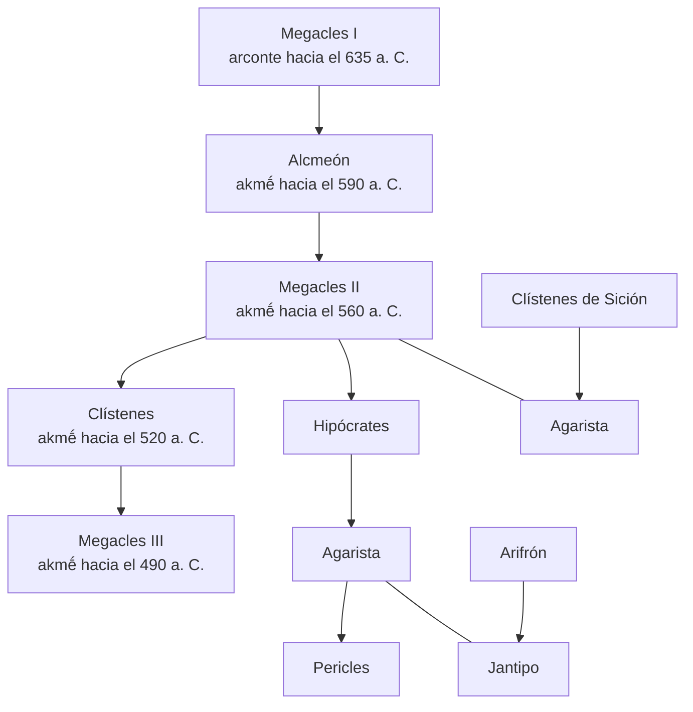

## Notas de Juan José Torres Esbarranch

<!-- ḗ ṓ ỳ -->

1. El historiador no se dirige exclusivamente a sus conciudadanos (cf. pasajes como II 19, 2; 34, 7; VIII 67, 2, con explicaciones superfluas para un ateniense), sino que piensa en un público amplio y en la posteridad. Por eso da su nombre unido al nombre de su ciudad, como habían hecho Hecateo (cf. F. JACOBY, *Die Fragmente der griechischen Historiker [FGrHist]*, Berlín-Leiden, 1923. . . , 1, F 1) y Heródoto (I, *Proemio*) en una línea de afirmación de la personalidad que se inició con la lírica. Sin embargo, cuando habla de sí mismo como estratego ateniense (cf. *infra*, IV 104, 4) se cita con el nombre con el que se le conocía oficialmente en Atenas: Tucídides de Óloro (*Thoukydídēs Olórou*).
2. Esta guerra del 431-404 supuso la culminación de la oposición entre Atenas y Esparta.
3. Es la historia de cómo evolucionó la guerra y de la política relacionada con ella. No se trata de una historia general de la época y otros aspectos pasan a segundo plano. El objetivo de la investigación tucididea es la guerra en sí misma en sus diversas fases y con todas sus causas, implicaciones y consecuencias, y no es la guerra en su aspecto superficial —aunque es un magnífico observador y narrador de los hechos bélicos—, sino que se interesa de forma especial por su trasfondo, sus raíces y derivaciones; le importan las causas profundas y los motivos que se esgrimieron, así como las consecuencias morales que provocó. Y todo ello sabe mirarlo con ojo clínico. Una guerra para un historiador imbuido del método hipocrático era como una enfermedad. Así como en el estado normal de salud no pueden observarse las anomalías fisiológicas, del mismo modo en las épocas de paz no se patentizan los desarreglos y alteraciones del organismo social. Igual que el médico estudia la salud y sus características mediante la observación de cuerpos enfermos, el historiador y el sociólogo pueden entender mejor las leyes que rigen la comunidad humana mediante el análisis de las guerras, las épocas críticas en las que se pone de manifiesto el trasfondo de la salud de los pueblos. Quedan entonces al descubierto todas las alteraciones y las tendencias elementales de la sociedad, el fenómeno del poder, el derecho y la fuerza, la ambición política, etc. Todas esas cuestiones constituyen el centro del interés de la Historia de Tucídides (cf. sobre ello el libro de J. ALSINA, *Tucídides: Historia, ética y política*, Madrid, 1981). El tema, pues, está perfectamente delimitado desde el principio: «la guerra entre los peloponesios y los atenienses». No es una historia «cultural» de su tiempo, y en función de esto se explican algunos «silencios» del historiador; se ciñe a unos hechos militares y políticos concretos: la guerra y sus causas profundas, los móviles que la desencadenaron, las fuerzas, leyes e ideas subyacentes, su evolución y el papel de los políticos y de los pueblos. . . En resumen, un objetivo restringido, y vasto a la vez, dentro de cuyos límites Tucídides aspira a lograr un *ktêma es aieí*, es decir, una «adquisición para siempre» (cf. *infra*, I 22, 4).
4. Su preocupación por narrar la guerra comenzó con la guerra misma, y su genio lo llevó a analizar con extraordinaria profundidad los sucesos contemporáneos. Desde el principio de la guerra, comenzó, por tanto, a reunir y preparar los materiales de su *Historia*.
5. En comparación con el pasado remoto, al que se refiere la *Arqueología*, y con el pasado reciente y actuante de la *Pentecontecia*, Tucídides analiza su época y la guerra que le ha tocado vivir; ello le lleva a una afirmación de la importancia y superioridad del presente y a minimizar, en relación con la Guerra del Peloponeso, todas las anteriores, la de Troya inclusive.
6. Y del mismo modo que sitúa su guerra frente a las que la precedieron, él mismo pretende distanciarse de sus predecesores; su obra quiere ser distinta en concepción y métodos y, a lo largo de sus páginas, encontramos frecuentes pruebas de su voluntad de novedad y singularidad. Su obra, en consonancia con su época, ha de ser *borrón y cuenta nueva* respecto a concepciones y a métodos anteriores, en relación con Homero, con los logógrafos y con Heródoto, y, junto a esta pretensión de novedad y singularidad, se evidencia, asimismo, la voluntad de permanencia de una obra concebida como «adquisición para siempre», como lección y ejemplo para generaciones futuras y con el mismo afán de utilidad en que se inspiran las observaciones clínicas de un médico (cf. *infra*, II 48, 3). Estas aspiraciones tucidídeas se evidencian a lo largo de una obra tan densa y ardua como atractiva, una obra en la que se reflejan una inteligencia que constantemente relaciona, un pensamiento profundamente analítico y un espíritu apasionado, un intelectual y un artista, una obra llena de tensiones y contrastes donde tan pronto sobresale la época y el ambiente y su formación sofística como la original personalidad del historiador, donde unas veces prima lo racional y otras lo irracional y lo trágico; donde coexiste el científico, su afán de precisión, concisión y su espíritu antitético, con el poeta que quiere atraer la atención sobre la grandiosa y trágica aventura de su patria, sobre una guerra que considera más memorable que las anteriores. Todo ello se refleja perfectamente en su léxico y en su estilo, en los que se conjugan asimismo las influencias de una época y los rasgos únicos de una extraordinaria individualidad, tal como se revela a quien lo lee sin precipitación.   Cf. *infra*, I 19, y 118, 2.
7. *Kínēsis*. Sobre este término, cf. H. PATZER, reseña de F. BIZER, *Untersuchungen zur Archäologie des Thukydides*, tesis, 1937, *Gnomon* 16 (1940), 350; N. G. L. HAMMOND, «The arrangement of the thought in the proem and in other parts of Thucydides I», *The Classical Quarterly* 11 (1952), pág. 132.
8. Los griegos utilizaban el término *bárbaros* para designar al extranjero que no pertenecía a su estirpe, mientras que *xénos* servía para indicar al extranjero griego (cf. HERÓDOTO, II 160, 4), que era ciudadano de una *pólis* distinta a la propia. Los espartanos, sin embargo, no hacían distinción alguna (cf. HERÓDOTO, IX 11, 2; 53, 2; 55, 2). *Bárbaros* es una forma onomatopéyica indoeuropea para designar a una persona que tiene dificultad para hablar una lengua, que hace *«bar-bar»* al hablar (piénsese, por ejemplo, en la raíz sánscrita *barbara* para significar «tartamudear»); y de ahí la idea de «extranjero». Cf. J. POKORNY, *Indogermanisches etymologisches Wörterbuch* I, Berna-Berlín, 1959, págs. 91 ss.
9. Muchos pueblos no griegos, como los epirotas, tracios, macedonios, sículos y, en cierta medida, los persas, se vieron implicados en la contienda. Si la guerra arquidámica (431-421) fue esencialmente griega, después de la Paz de Nicias los horizontes se ampliaron. Cf. A. W. GOMME, *A historical commentary on Thucydides* I, Oxford, 1945, pág. 91.
10. Pasaje de dudosa interpretación. Se ha discutido mucho sobre el sentido de «los acontecimientos anteriores, y los todavía más antiguos». Para Stahl, lo primero se refería a la época entre la Guerra de Troya y las Guerras Médicas, y lo segundo a los lejanos tiempos anteriores a Troya. Schadewaldt piensa que «los acontecimientos anteriores» (*tà prò autôn*) se refieren a las Guerras Médicas y «los todavía más antiguos» (*tà éti palaítera*), a la Guerra de Troya. Según Classen, en lo primero habría una alusión a los sucesos inmediatamente anteriores a la Guerra del Peloponeso a partir de las Guerras Médicas, y en lo segundo, a los acontecimientos anteriores al enfrentamiento con Persia. Pero resulta chocante que la dificultad señalada por Tucídides para llegar a un conocimiento preciso pueda referirse a los cercanos hechos de la *Pentecontecia* (años 479-432; cf. *infra*, I 89-118), de los que no debían de faltar los testimonios. El mismo Tucídides —en I 97, 2— dice que ha estudiado este período de forma más amplia y precisa que Helánico. También se contaba con el testimonio de Heródoto para las Guerras Médicas. Parece, pues, más verosímil que, cuando Tucídides habla de dificultades para conocer los hechos con precisión, piense sobre todo en la historia más antigua, a la que se aproxima mediante indicios menos seguros.
11. Si tenemos presente la síntesis de la historia de Grecia anterior a la Guerra del Peloponeso que Tucídides hace en la llamada Arqueología (I 2-19), es fácil llegar a la conclusión de que la expresión *tà prò autôn* («los acontecimientos anteriores» a «la mayor conmoción —*kínēsis*— que haya afectado a los griegos») —si no creemos que sea un caso de corrupción del texto (como piensan Steup y otros)— se refiere a la historia de Grecia que va desde la Guerra de Troya hasta la del Peloponeso, dejando un poco al margen la época inmediatamente anterior (tratada de forma sucinta en la *Arqueología* —I 18-19—, pero desarrollada luego ampliamente en los capítulos de la *Pentecontecia* I 89-118), mientras que «los todavía más antiguos» se referirían a la misma Guerra de Troya y a los tiempos anteriores a ella. La Guerra de Troya marcaría, pues, la línea divisoria (cf. I 11, 3-12, 1). En la Arqueología, efectivamente, Tucídides toma como frecuente punto de referencia la Guerra de Troya (cf. *infra*, I 3, 1; 3, 3; 3, 4; 8, 4; 9, 5; 11, 3-12, 1; 12, 4; 14, 1) y continuamente habla del «antes» y el «después» de esta guerra. Por un lado estaría, pues, la historia posterior a la Guerra de Troya y anterior a la del Peloponeso, sobre todo en sus épocas peor conocidas, y por otro, la misma Guerra de Troya y los acontecimientos todavía más antiguos, la leyenda, en suma. La llamada *Arqueología* sirve para demostrar la primera afirmación de Tucídides respecto a que la guerra que historió era más grande y memorable que las precedentes debido a que Grecia, antes de la Guerra del Peloponeso, no estaba preparada ni económica ni militarmente para guerras importantes.
12. De árboles frutales, cepas y olivos, cuyo fruto no hubieran podido recoger. Solo cultivaban la tierra para satisfacer sus necesidades inmediatas. Tampoco se había iniciado la acumulación de riqueza (cf. *infra*, 7; 13, 1), tan importante luego en el ámbito político-social.
13. Inestabilidad en los asentamientos, inseguridad en las comunicaciones, provisionalidad y pobreza: tales eran las características de la Grecia primitiva por oposición a la forma de vida posterior, ligada a un centro urbano y un territorio, con una organización estable y una capacidad para la creación de riqueza. La idea de «progreso» preside toda la *Arqueología*. Cf. J. DE ROMILLY, «Thucydide et l'idée de progrès», *Annali della Scuola Normale Superiore di Pisa* 35 (1966), 143-191.
14. Peloponeso: «Isla de Pélope» (cf. *infra*, nota 59), por cuanto que estaba casi completamente rodeado por el mar (salvo los 8 km del istmo de Corinto). El Peloponeso, excepto la zona central, la Arcadia feliz, que era poco apta para la agricultura, como tierra montañosa, y pobre en recursos, era una tierra rica y contaba con los fértiles valles de Laconia y Mesenia.
15. El territorio del Ática, con un terreno poco apto para los cereales, de los que debía abastecerse mediante importación, se prestaba, sin embargo, al cultivo de árboles y, en especial, al del olivo. Paradójicamente, la organización política y la ausencia de disensiones se unen a la pobreza del suelo. Cf. M. H. B. MARSHALL, «Urban Settlement in the second chapter of Thucydides», *The Classical Quarterly* 69 (1975), 26-40.
16. Los atenienses se consideraban autóctonos. Cf. *infra*, la afirmación que se hace en el discurso fúnebre (II 36, 1) y EURÍPIDES, *Medea* 825-26.
17. Esta facilidad para obtener la ciudadanía ateniense pertenecía, desde luego, al pasado. En el siglo V, Atenas era mucho más reacia a ampliar su ciudadanía.
18. Sobre la colonización de Asia Menor, cf. *infra*, I 12, 4, y HERÓDOTO, I 142-148. Sobre el origen ateniense de los jonios de las Cícladas y de Asia Menor, cf. *infra*, VII 57, 4, y HERÓDOTO, I 146-147; V 97, 2; VII 51, 2; VIII 46, 2-3; IX 106, 3. La propaganda política insistía en el liderazgo de Atenas sobre los jonios.
19. Acontecimiento que se toma con frecuencia como punto de referencia. Según las principales fuentes cronológicas, su fecha fue el 1184 a. C. (cf. *infra*, I 12, 3, n. 83). Tucídides la colocaba en torno al 1200, o hacia mediados del siglo XIII a. C. , según otros.
20. *Hellás*, «Hélade». *Hellás* fue, originariamente, una zona de Tesalia, próxima a Ftía, que se hallaba bajo el dominio de Aquiles. Cf. Ilíada IX 395.
21. Deucalión era un héroe, hijo de Prometeo, que se casó con Pirra, hija de Epimeteo y de Pandora, la primera mujer. Deucalión y Pirra fueron los únicos supervivientes del diluvio con el que Zeus decidió castigar a los hombres. Por consejo de Prometeo, construyeron un arca en la que flotaron durante nueve días y nueve noches salvándose del diluvio. Se establecieron luego en Tesalia, donde reinaron sobre los primeros hombres que, tras el diluvio, surgieron de las piedras —los huesos de la Tierra— que Deucalión y Pirra lanzaron por orden de Zeus. Uno de sus hijos fue Helén, mítico fundador de los helenos, de cuyos hijos, Doro, Eolo y Juto, descienden los dorios, eolios, jonios y aqueos. (Cf. DIODORO, IV 60, 2; APOLODORO, I 7, 2–3. )

    En la interpretación del mito que nos ofrece Tucídides es de destacar la idea de que el nombre de helenos se difundió debido a la fuerza de Helén y sus hijos. Un nombre se difundía igual que se extendían los dominios, debido a la fuerza. No se dan pruebas. Solo está la afirmación de que la difusión del nombre debió de producirse porque Helén y sus hijos se hicieron poderosos. El poderío de Helén se infiere de la difusión de su nombre, y subyace la idea de la fuerza como elemento determinante de la historia.

    He aquí el árbol genealógico de esta familia mítica:

 <div class="mermaid">
 graph TD
 A[Deucalión = Pirra]
 A --> B[Helén = Orseida]
 A --> C[Melancia]
 A --> D[Anfictión]
 A --> E[Protogenia]
 B --> F[Doro]
 B --> G[Juto - Creúsa]
 B --> H[Eolo]
 G --> I[Diomede]
 G --> J[Aqueo]
 G --> K[Ión]
 </div>

22. Con los nombres de pelasgos, léleges y carios se conocía a los primitivos habitantes de las tierras que luego fueron ocupadas por los griegos o helenos. Estos pueblos, antes de la llegada de los griegos, se extenderían por toda Grecia, y los pelasgos, en concreto, según los testimonios de Homero (cf. *Ilíada* II 681-684 y 840-843) y de Heródoto, estarían situados preferentemente en las regiones septentrionales, de donde se verían obligados a emigrar al producirse las invasiones de los grupos indoeuropeos. Heródoto (I 56-58) los consideraba autóctonos e indicaba que su lengua no era griega; los pueblos autóctonos pelásgicos, como era el caso de los atenienses, que luego se convirtieron en griegos, cambiaron sin duda de lengua (cf. HERÓDOTO, I 57, 2-3; VIII 44). Una vez instalados los helenos y ya helenizada la población autóctona ateniense, los pelasgos no asimilados quedarían como grupos marginales; tal sería el caso de los que se instalaron en Lemnos tras ser expulsados del Ática por los atenienses, pelasgos que realizarían incursiones contra el Ática y sobre los que se organizaría una campaña propagandística a mediados del siglo V a. C. para justificar la toma de Lemnos por Milcíades (cf. HERÓDOTO, VI 137-140; E. LUPPINO, «I Pelasgi e la propaganda política del V secolo a. C. », *Contributi dell'Istituto di Storia Antica* I [1972], 71-77). De todas formas, el planteamiento de Heródoto del problema pelásgico es, por lo menos, algo complicado (cf. HERÓDOTO, I 56-58; 146, 1; II 51-52; VI 137-140; VII 94-95; VIII 44). Su identificación histórica no es segura, y ya Éforo en el siglo IV a. C. señalaba que los nombres de estos pueblos eran términos imprecisos que servían para designar a distintos grupos que habitaban en la cuenca del Egeo cuando llegaron los griegos. Tucídides no profundiza en el complejo problema de los pelasgos y se limita a considerarlos como la población más numerosa y extendida de la Grecia prehelénica. Sobre esta cuestión, cf. F. LOCHNER VON HÜTTENBACH, *Die Pelasger*, Múnich, 1960, y la reseña de G. NEUMANN, *Gnomon* 34 (1962), 370-374.
23. Región situada al sudeste de Tesalia, en la que se encontraba Ftía, la patria de Aquiles.
24. Cf. HERÓDOTO, II 53. Según Heródoto, Homero y Hesíodo fueron contemporáneos y vivieron a mediados del siglo IX a. C.
25. Cf. HOMERO, *Ilíada* II 683-684; IX 395; 447-448; XVI 595; Odisea XI 496.
26. En *Ilíada* II 867, sin embargo, se habla de los carios *barbaróphōnoi* (cf. ESTRABÓN, XIV 2, 28), por lo que se piensa que Tucídides desconocía el verso o rechazaba su autenticidad o su valor probatorio respecto al uso del término *bárbaroi* (cf. *supra*, nota 8).
27. Cf. *infra*, I 9, 3-4.
28. Mítico rey de Creta, cuyo nombre representa probablemente un título o un gentilicio, hijo de Zeus y de Europa según la tradición. Tucídides le atribuye la creación de la primera gran flota, base de la talasocracia cretense. Este dominio minoico sobre el Egeo y el Mediterráneo oriental, aunque ha sido objeto de controversias e incluso negado por algunos, está de acuerdo con los testimonios antiguos (cf., por ej. , HERÓDOTO, I 171, 2-3; III 122, 2; PLATÓN, *Leyes* 706a-b; ÉFORO, *FGrHist* 70 F 149; ARISTÓTELES, *Política* II 7, 2 [1271b]; ESTRABÓN, X 4, 8; DIODORO, IV 60, 3; PAUSANIAS, I 27, 9) y ha sido confirmado por las modernas investigaciones arqueológicas que evidencian una supremacía de la cultura y economía cretense sobre las Cícladas, Chipre, Asia Menor y Egipto durante la primera mitad del II milenio hasta el siglo XVI a. C. La talasocracia minoica no es, por tanto, una invención ateniense en la búsqueda de un ilustre precedente para su imperio del siglo V a. C. , aunque Tucídides proyecte en cierto modo las condiciones políticas y económicas de la Atenas de su época sobre el pasado más lejano. Ya antiguamente para crear un imperio las condiciones que se precisaban eran, según el historiador, recursos financieros y la posesión de una flota, tributos y naves, es decir, las circunstancias que permitieron la expansión imperial ateniense. Tucídides identifica imperio y talasocracia (cf. *infra*, I 8, 2-4) desde su óptica de una ciudad marítima e imperial.
29. La *akoḗ*, la tradición oral. Cf. *infra*, I 23, 3; 73, 2, etc.
30. Cf. *infra*, I 8, 2. Sobre la construcción naval en Creta, cf. S. MARINATOS, «La marine créto-mycénienne», *Bulletin de Correspondance Hellénique* 62 (1933), 170-235.
31. El Egeo.
32. Archipiélago del Egeo meridional, al sudeste del Ática y de Eubea, con islas como Naxos (la mayor de ellas con una extensión de unos 450 km<sup>2</sup>), Paros, Andros. . . , formando un círculo (*kýklos*) alrededor de Delos.
33. Cf. *infra*, I 8, 1. Sobre los orígenes de este pueblo, véase HERÓDOTO, I 171 (cf. HERÓDOTO, *Historia* I-II, intr. F. R. ADRADOS, trad. y notas de C. SCHRADER, Madrid, BCG 3, 1977, págs. 230-231. ) Tucídides está en desacuerdo con otras fuentes respecto a la expulsión de los carios de las islas, que, según él, fue obra de Minos. Según Heródoto, sin embargo, fueron expulsados por los dorios y los jonios (cf. HERÓDOTO, I 171, 5). Según el historiador de Halicarnaso, los carios no se dedicarían a la piratería y estarían en buenas relaciones con Minos, cuya supremacía reconocerían, e incluso contribuirían a equipar sus naves (cf. HERÓDOTO, 171, 2). En época histórica vivían en el suroeste de Asia Menor. Sobre ellos, cf., asimismo, ESTRABÓN, XIV 2, 27-28.
34. En estos capítulos de la Arqueología, el tema del mar, de la importancia de su dominio y de su relación con el progreso, es un *leitmotiv*, tal como demuestran las continuas referencias al uso y al control de las rutas marinas (cf. I 2, 2; 3, 5; 4, 7; 8, 2-3; 9, 3-4; 10, 4; 13, 1-6; 14, 1-3; 15, 1) y al tema de la piratería (cf. I 7; 8, 1-3; 10, 4; 11, 1-2; 13, 5). La valoración tucidídea de la piratería no es negativa; va unida al desarrollo de la navegación y al progreso de las comunidades, procura medios de subsistencia a los más débiles y poder, autoridad y gloria a los más poderosos, que con está actividad se aseguran el apoyo y la obediencia de los primeros. Este juicio positivo coincide perfectamente con la visión de PLATÓN (*Leyes* VII 823b) y de ARISTÓTELES (*Política* I 3, 4, 1256a), para los cuales la piratería es un *modus vivendi* tan natural como la agricultura, la pesca o la caza. Cf. en este sentido *infra*, I 11, 1, donde Tucídides, al hablar de la actividad de los griegos en Troya, dice que «a causa de la dificultad de aprovisionamiento, se dedicaron a cultivar las tierras del Quersoneso y a la piratería». La piratería, igual que la práctica del bandidaje en tierra (cf. *infra*, I 5, 3), está en muchos aspectos relacionada con la guerra y con la actividad comercial. Su desarrollo y sus modalidades van cambiando según las épocas, pero difícilmente desaparece. Coexiste peor, sin embargo, con la existencia de una talasocracia. Así, por ejemplo, campó menos a sus anchas durante el período de la hegemonía marítima de Atenas, que impuso su ley y se preocupó de combatirla (cf. PLUTARCO, *Cimón* 8, 3-5; *Pericles* 19, 1), pero en otras épocas de la historia de Grecia experimentó un notable auge e incluso fue reglamentada y en cierto modo institucionalizada como guerra de corso; así ocurrió en muchos Estados de la época helenística. Es, pues, un fenómeno ligado al progreso, que perduró en el Mediterráneo. Sobre este tema, cf. H. A. ORMEROD, *Piracy in the Ancient World*, Londres, 1924; G. BIRAGHI, «La pirateria greca in Tucidide», *Acme* 5 (1952), 471-477; Y. GARLAN, «Signification historique de la piraterie grecque», *Dialogues d'histoire ancienne* 4 (1978), 1-16.
35. Cf. HOMERO, *Odisea* III 71-74; IX 252-255; *Himno a Apolo* 452-455.
36. Habitantes de la Lócride Ozolia o Hesperia, en la parte occidental de la costa norte del golfo de Corinto, entre la Fócide y la Etolia. Se distinguen de los locros opuntios, que habitaban la Lócride Opuntia u Oriental, territorio que se extendía frente a Eubea, al norte de Beocia. Cf. *infra*, I 103, 3; 108, 3.
37. Habitantes de Etolia, territorio situado al norte de la Lócride Ozolia y del golfo Calidonio, su salida al mar.
38. Población de Acarnania, región al oeste de Etolia, bañada por el mar Jonio. El río Aqueloo la separa de Etolia.
39. El quitón era el vestido normal en Grecia, usado tanto por los hombres como por las mujeres. El de estas solía ser largo hasta los pies, mientras que era más corto el de aquellos. Sus características particulares dependían de una serie de factores como la edad, el sexo, los gustos y las modas, etc. Sin embargo, en líneas generales, había que distinguir entre dos tipos: el jónico y el dórico. El quitón jónico era una fina túnica de lino, con mangas (por lo que se le llamaba *cheirodōtós chitṓn*) y cosida por ambos lados, de modo que no fueran necesarias las fíbulas, mientras que el vestido dórico era de lana, no tenía mangas y solo iba cerrado por un costado; por el otro estaba abierto (de ahí la denominación de *schistós chitṓn* y el que Íbico llamara a las espartanas *phainomêrídas* por enseñar las piernas por ese lado) y se abrochaba con fíbulas. La evolución del vestido masculino a la que se refiere Tucídides en este pasaje no coincide, sin embargo, con el cambio de la moda femenina al que hace referencia Heródoto en V 87-88, donde el historiador nos da una explicación anecdótica (la muerte del único superviviente ateniense de una expedición contra Egina a manos de las mujeres atenienses, que, a punzadas de fíbula, hicieron pagar a aquel la muerte de sus maridos) para justificar el paso del vestido dórico, con fíbulas, al jónico, evitando así la utilización de las fíbulas. La moda del quitón de lino sin aquel «peligroso cierre» procedía de Jonia, y los jonios, se cree, la habrían recibido de los carios (cf. HERÓDOTO, I 146, 2; V 88); en enterramientos arcaicos atribuidos a carios, según se ha observado (cf. R. LONG, «Greeks, Carians and the Purification of Delos», *American Journal of Archaeology* 62 [1958], 303), no aparecen fíbulas. Según este pasaje de Tucídides, por el contrario, la evolución no fue del modelo dórico al jónico, tal como explica Heródoto, sino viceversa. Y las representaciones que nos ofrecen la escultura y la cerámica permiten pensar que en Atenas, durante la época arcaica, se usaba el vestido jónico, y que, después de las Guerras Médicas, se fue imponiendo el modelo dórico, posiblemente como reacción contra el lujo y refinamiento orientales.
40. Se refiere a la moda de recoger los cabellos en la coronilla o encima de la nuca, que podemos observar en las figuras de los vasos del período comprendido entre mediados del s. VI y el 470 a. C. , aproximadamente. Las «cigarras» (*téttiges*) serían unos adornos o pasadores para sujetar el pelo. Se han identificado con unas espirales que se insertaban en los cabellos. Sobre este uso, cf. ARISTÓFANES, *Caballeros* 1321-34, *Nubes* 984-986. Es probable que el nombre se debiera a su forma, aunque faltan testimonios seguros al respecto. Cf., asimismo, ATENEO, XII 512b-c.
41. Todas estas modas lujosas que compartieron los jonios y los atenienses no debieron de iniciarse en Atenas y pasar luego a Jonia, sino que debió de ocurrir al revés.
42. El término «lacedemonios» era la denominación oficial de los espartanos y se refería tanto a los espartiatas, los ciudadanos de pleno derecho, como a los periecos (cf. *infra*, n. 563 y 809).
43. *Metríāi esthêti* se refiere a la sencillez del modo de vestir dorio, pero también nos hace pensar en el largo del vestido. El dorio era más corto que el jonio.
44. Cf. PLATÓN, *República* V 452c. Platón dice que los cretenses fueron los primeros en usar los gimnasios (dando a esta palabra su sentido etimológico, es decir, refiriéndola a los lugares en que los hombres se ejercitaban desnudos), y que luego les siguieron los lacedemonios. Según otras fuentes, sin embargo, la costumbre de la desnudez en los ejercicios atléticos fue introducida por un personaje concreto: por el lacedemonio Acanto, según DIONISIO DE HALICARNASO (VII 72, 3), y por el megareo Orsipo, según PAUSANIAS (I 44, 1) y el escolio a este pasaje de Tucídides. Esta supresión del *diázōma* se habría producido en la XV Olimpíada, en el 720 a. C.
45. Juegos panhelénicos que se celebraban cada cuatro años en Olimpia, en la Élide. La lista de los vencedores de las Olimpíadas se iniciaba en el 776 a. C. , y la referencia a los años olímpicos constituía un sistema cronológico.
46. El *diázōma* es una especie de taparrabo.
47. En el pasaje citado de Platón se recuerda, refiriéndose al hecho de dejarse ver desnudos, que «no ha mucho les parecía a los griegos vergonzoso y ridículo lo que ahora se lo parece a la mayoría de los bárbaros». Cf. también a este respecto HERÓDOTO, 10, 3.
48. Tal es el caso de Corinto (cf. *infra*, I 13, 5), Epidamno (I 24, 1-2; 26, 5) y Potidea (I 56, 2; IV 120, 3), entre otros.
49. Puede pensarse en ciudades como Argos, Micenas, Cnoso y en la misma Atenas.
50. Cf. *supra* 4, n. 33.
51. Respecto a los fenicios en el Egeo, cf. HERÓDOTO, I 1, sobre el mítico rapto de Ío por los fenicios; II 44, 4, donde se habla de la colonización de Tasos por navegantes fenicios; II 54 y 56, sobre la intervención en la fundación del oráculo de Dodona de una mujer consagrada, raptada por los fenicios en Tebas de Egipto y vendida en Grecia; III 107, acerca de la exportación de incienso a Grecia por los fenicios; y IV 147, 4-5, sobre los fenicios en la isla de Tera.
52. Literalmente «esta guerra», que se refiere naturalmente a la que es objeto de la *Historia* de Tucídides; cf. *infra*, 97, 1; II 47, 1, etc.
53. En el 426 a. C. ; cf. III 104, 1-2. Esta afirmación de Tucídides ha sido confirmada por el hallazgo en Renea (cf. *infra*, I 13, 6, n. 103) de un depósito de material funerario correspondiente en general al período que va del siglo VIII al V a. C.
54. El problema relativo a las tumbas carias es complejo. Lo cierto es que quienes efectuaron la purificación de que habla Tucídides se encontraron con tumbas muy diferentes a las suyas, que no podían identificar. Probablemente se trata en general de enterramientos griegos de época arcaica. De todas formas, con apreciaciones como esta se demuestra el interés de Tucídides por los datos arqueológicos. Cf. R. M. COOK, *Annual of the British School at Athens* 50 (1955), 266-270.
55. Cf. *supra* 4, nota 33. En cuanto a la importancia de la proximidad al mar y del amurallamiento, de lo que se habla a continuación, recuérdese que son precisamente dos elementos a evitar en la ciudad ideal de PLATÓN (*Leyes* 704d-707d; 778d; cf. D. PLÁCIDO SUÁREZ, «Platón y la Guerra del Peloponeso», *Gerión* 3 [1985], 43-62).
56. Sobre la comunidad de intereses entre débiles y poderosos, cf. *supra*, I 5, 1, n. 34. Es una idea que encontramos en diversos pasajes. El imperio puede resultar útil a los súbditos y a los dominadores. La unión hace la fuerza. Cf. en particular, en el discurso de Eufemo, VI 87, 3-4.
57. Padre «humano» de Helena (hija, en realidad, de Zeus y de Leda), que, siguiendo el consejo de Ulises, hizo jurar a los pretendientes de su hija que aceptarían la elección de esta y que ayudarían, en caso de necesidad, al elegido. Este fue el juramento invocado por Menelao para que todos los caudillos griegos emprendieran la expedición contra Troya. Cf. ISÓCRATES, X 40; APOLODORO, III 10, 9, y PAUSANIAS, III 20, 9. Tucídides racionaliza el mito.
58. Probable alusión a Helánico (s. V a. C), que escribió un libro titulado *Argoliká*, en el que recogía tradiciones peloponesias. Cf. *infra*, I 97, 2. Algunos fragmentos conservados se referirían a Atreo y Euristeo; cf. F. JACOBY, *FGrHist* 4, F 155 y 157.
59. El mítico Pélope, hijo de Tántalo, era originario de Asia Menor, y emigró a Europa, expulsado por Ilo. Llegó a Grecia, que era un país pobre, cargado de tesoros, e introdujo el lujo oriental. Después de vencer a Enómao, se casó con su hija Hipodamía, y de este matrimonio nacieron muchos hijos, entre los que se contaban Atreo y Tiestes. Fue rey de Pisa y de la Élide, y extendió su poder por gran parte del Peloponeso, tierra a la que dio nombre (cf. *supra*, n. 14).
60. Euristeo era hijo de Esténelo y nieto de Perseo. Su madre era Nicipe, hija de Pélope. Reinó en Micenas debido a una astucia de Hera, que logró que Euristeo naciera antes que Heracles, otro perseida, a quien Zeus destinaba al trono. Impuso los «trabajos» a Heracles, que se había puesto al servicio de Euristeo por mandato del oráculo. Siempre temeroso de Heracles, procuraba mantenerlo alejado y, tras la muerte del héroe, persiguió a sus descendientes, los Heráclidas, que se refugiaron en el Ática. Finalmente marchó contra los atenienses y fue vencido y muerto por Hilo, que iba al frente de los Heráclidas. Sus dominios pasaron entonces a manos de un pelópida, Atreo, hermano de Nicipe, la madre de Euristeo. Cf. HERÓDOTO, IX 27, 2; DIODORO, IV 57-58; PAUSANIAS, 44, 10; APOLODORO, II 8, 1.
61. La famosa ciudad de la Argólide que ha dado nombre al mundo micénico y que tuvo un papel capital en la Grecia de los siglos XVI-XII a. C. Con posterioridad fue una ciudad débil que acabó incorporada a Argos (hacia el 468; cf. DIODORO, XI 65, 1-5).
62. Crisipo era hijo de Pélope y de la ninfa Axíoque; era hermanastro, por tanto, de Atreo. En una de las versiones que existen sobre su muerte, fue muerto por Atreo a instigación de Hipodamía.
63. Con Atreo, al que pasaron los dominios de Euristeo, los Pelópidas sustituyeron en la hegemonía a los Perseidas. Tomando en consideración una tradición según la cual los Perseidas tendrían su sede en Tirinto y los Pelópidas en Micenas, se podría pensar aquí en una fase en que la segunda se impusiera sobre la primera.
64. Cf. *Ilíada* II 576-580 y 609-614: cien naves de Agamenón y sesenta proporcionadas a los arcadios.
65. Tucídides da poco crédito a Homero; piensa que su poesía embellece los hechos y aumenta su importancia. Cf. *infra*, I 10, 3; II 41, 4, y VI 2, 1. A pesar de ello, lo utiliza para la reconstrucción de la historia más antigua (cf. *supra*, I 5, 2, nota 35).
66. Cf. *Ilíada* II 100-109: el cetro había sido obra de Hefesto para el Crónida Zeus, quien lo entregó a Hermes, y de este pasó a Agamenón a través de Pélope, Atreo y Tiestes.
67. Cf. *Ilíada* II 108. En Homero «Argos» puede referirse tanto a la ciudad de este nombre como a la Argólide o a Grecia en general, especialmente al Peloponeso o a los territorios continentales del reino de Agamenón, como en este caso.
68. Tucídides insiste en la importancia del dominio del mar como base de poderío, de influencia política y de expansión económica. Cf., por ejemplo, *supra*, I 3, 5; 4; 7, 1; *infra* 13, 1; 143, 4; II 62, 2; 65, 7; 89, 10. Es uno de los principios básicos del historiador.
69. Esparta constituye un buen ejemplo para el razonamiento de Tucídides de que la potencia de una ciudad no está en relación directa con la magnificencia de sus edificios.
70. No se refiere a las regiones, ya que estas eran seis: Laconia, Mesenia, Élide, Acaya, Argólide y Arcadia. Aun uniendo Mesenia a Laconia, a la que estaba sometida, no podría referirse a las regiones, puesto que entonces se trataría de una quinta parte. Seguramente, Tucídides se refiere a que Laconia y Mesenia suponían los dos quintos del territorio peloponesio, aunque la extensión de las dos regiones era en realidad inferior a las dos quintas partes.
71. Es una afirmación exagerada, puesto que Argos, la segunda potencia del Peloponeso, se mantenía aparte y no intervino hasta la segunda fase de la guerra, después de la Paz de Nicias, y entonces se alineó al lado de Atenas hasta el 404. Esta afirmación ha sido utilizada en relación con el problema de la composición de la Historia de Tucídides. F. W. ULLRICH, *Beiträge zur Erklärung des Thukydides*, Hamburgo, 1846, pág. 124 ss. : considerando que la hegemonía de Esparta, después de la derrota de Atenas en el 404, se extendería, más que al Peloponeso, a toda Grecia, concluyó que este pasaje habría sido compuesto con anterioridad al 404. Por el contrario, W. H. FORBES, *Thucydides* I, Oxford, 1895, defendió la tesis de que fue escrito no después del 421, sino con posterioridad al 404, argumentando que Argos fue aliada de Atenas entre el 420 y el 404.
72. Cf. *supra*, I 5, 1. Esparta no era una ciudad-estado con la estructura urbana de otras ciudades griegas contemporáneas. Era en realidad una agrupación de *ōbaí*, aldeas (Limnas, Cinosura, Mesoa, Pitana y Amiclas) que habían llegado a la unidad mediante un proceso de sinecismo. Cf. PAUSANIAS, III 2, 6; 16, 9; 19, 6; POLIBIO, V 19, 1-2; W. G. FORREST, *A History of Sparta* 950-192 B. C. , Londres, 1968, págs. 24-34.
73. También HERÓDOTO (VII 20, 2) consideraba que la expedición contra Troya había sido inferior a la expedición de Jerjes.
74. Cf. *supra*, I 9, 3, nota 65.
75. Cf. *Ilíada* II 510.
76. Cf. *Ilíada* II 719.
77. Se trata del libro II de la Ilíada, que constituye una relación de los pueblos que participaron en la Guerra de Troya y de las fuerzas con que contaban.
78. Cf. *Ilíada* II 719-720.
79. Según el cálculo de Tucídides, se alcanza un total de 102. 000 hombres, partiendo de una media de 85 hombres por barco (dado que las naves beocias, que eran las más grandes, llevaban 120 hombres y las de Filoctetes, las más pequeñas, 50) y de un número de 1. 200 naves. Era una cifra considerable, tratándose de una expedición por mar y comparándola incluso con expediciones atenienses de las que nos habla luego Tucídides (cf., por ejemplo, *infra* 116, 1-2; 117, 2; II 56, 1-2; 58, 1-3, etc. ). Es cierto, de todos modos, que se trataba de una expedición panhelénica, lo que reducía la significación de aquel número.
80. En la antigua Grecia, las guerras no solían ser de larga duración y en su mayor parte enfrentaban a pueblos vecinos por cuestiones de fronteras. En estos casos el problema del abastecimiento de las tropas tenía menos importancia; los mismos soldados llevaban sus víveres. Sin embargo, cuando se emprendían expediciones más largas y lejos de la propia ciudad, los soldados solo llevaban provisiones para un período corto y tenían que preocuparse luego del abastecimiento, que podía ser facilitado por los aliados o podían conseguirlo mediante compra, estableciendo un mercado, por ejemplo, como en Potidea, o por medio del saqueo de territorios enemigos (cf. *infra*, 62, 1; IV 6, 1; 80, 1; 83, 5; V 47, 6; etc. ). Tanto en esta cuestión del aprovisionamiento como en otros detalles que siguen, el relato de Tucídides respecto al desembarco griego en Troya presenta notables analogías con operaciones y desembarcos que tuvieron lugar en la misma Guerra del Peloponeso: ocupación o desembarco de un territorio asegurándose el terreno mediante una victoria inicial, después de lo cual viene el establecimiento de un campamento y su fortificación o el bloqueo de la ciudad objeto del ataque, si ello es posible (cf. *infra*, III 6, 1-2; VI 23, 2; 66, 2, etc. ). Se trata, pues, en cierto modo, de otra proyección del presente sobre el pasado.
81. (*Dêlon dè: tò gàr éryma tôi stratopédōi ouk àn eteichísanto*). Ha sido objeto de polémica el conflicto entre estas diez palabras de Tucídides relativas a la construcción de una fortificación tras el desembarco, en el primer año, y los pasajes de la *Ilíada* (VII 336-343; 436-463), donde se describe la construcción de una fortificación en el décimo año y no se hace referencia a una fortificación construida en el primero, de la que tampoco parece estar enterada la tradición épica, aunque algunos testimonios parecen sugerir su existencia (HERÓDOTO, II 118; PROCLO, resumen de los *Cantos Ciprios*; cf. sobre el tema y los problemas que puede plantear la interpretación de este pasaje: E. DOLIN, «Thucydides on the Trojan War: a Critique of the text of I 11. 1», *Harvard Studies in Classical Philology* 87 [1983], 119-149). Tucídides se refiere a una fortificación (*éryma*) construida rápidamente tras el desembarco, tal como era usual, según hemos dicho, en su época; en un día se levantó la de VI 66 y en dos y medio la de IV 90, 2. Cf. E. WATSON WILLIAMS, «Eryma; Thucydides I, 11», *Eranos* 60 (1962), 101-104; O. TSAGARAKIS, «The Achaean Wall and the Homeric Question», *Hermes* 97 (1969), 129-135.
82. Sobre lo primero no habla la *Ilíada*. Posiblemente lo hacían los *Cantos Ciprios*. Respecto a la piratería, cf. *Ilíada* I 366 ss. , IX 328 ss. y XX 91 ss. Lo notable es que la agricultura y la piratería están en el mismo plano. Cf. *supra*, I 5, 1, n. 34.
83. Los logógrafos (cf. *infra*, I 21, 1) habían establecido las fechas de los principales acontecimientos de la historia antigua, incluso de los sucesos míticos (cf. HERÓDOTO, II 142 ss. ). Tucídides puede haber tomado estas fechas de Helánico (cf. *supra*, I 9 nota 58), que había escrito sobre los sucesos posteriores a la caída de Troya. Esta fue tomada, según Eratóstenes (s. III a. C), en el 1184 a. C. , pero según los modernos descubrimientos arqueológicos la caída se produjo hacia el 1250 a. C. , fecha con la que están de acuerdo los cálculos de HERÓDOTO (II 145, 4).
84. La ciudad de Arne estaba situada en Tesalia central. Los tesalios, según HERÓDOTO, VII 176, 4, procedían de Tesprotia, región del Epiro.
85. De Cadmo, mítico fundador de Cadmea, acrópolis de Tebas. Había salido de Tiro en busca de su hermana Europa, raptada por Zeus. En cumplimiento de una orden del oráculo de Delfos fundó la ciudadela cadmea en el sitio que luego se llamó Tebas. Cf. HERÓDOTO, V 57 ss.; ESTRABÓN, IX 2, 3; PAUSANIAS, IX 5, 1-2. Sobre la migración beocia, cf. D. W. PRAKKEN, «The Boeotian Migration», *American Journal of Philology* 64 (1943), 417-423.
86. Cf. *Ilíada* II 494-510.
87. Después de vencer a Euristeo (cf. *supra*, I 9 y n. 60), los Heráclidas conducidos por Hilo se establecieron en el Peloponeso. Pero, al cabo de un año, sobrevino una peste, que el oráculo atribuyó a la cólera divina, provocada por el hecho de que los Heráclidas habían regresado al Peloponeso antes del tiempo fijado por el destino. Entonces los Heráclidas, obedientes al oráculo, abandonaron el Peloponeso y volvieron al Ática, donde se pusieron a esperar que llegara el momento de regresar al Peloponeso. Una vez que llegó el momento indicado por el oráculo (a «la tercera cosecha»), Hilo, al frente de los suyos, avanzó por el istmo de Corinto, pero le salió al encuentro Équemo, rey de Tegea. Entre los dos jefes se acordó un combate singular. Si vencía Équemo, los Heráclidas renunciarían a todo intento de entrar en el Peloponeso durante cien años (o cincuenta según otros). Hilo fue vencido y muerto, y los Heráclidas se retiraron. Su nieto Aristómaco fue de nuevo a consultar el oráculo que le prometió la victoria si atacaba «por el camino estrecho». Entendió que se refería al istmo y fue por allí. Encontró la muerte y los Heráclidas fueron vencidos otra vez. Finalmente, Témeno, hijo de Aristómaco, logró que el oráculo le ayudara a dar una interpretación correcta a sus respuestas. Por «tercera cosecha» debía entenderse «tercera generación», y el «camino estrecho» se refería a los «estrechos» entre la costa de Grecia continental y la del Peloponeso. Prepararon una flota, pero un desafortunado incidente fue causa de un nuevo fracaso. Al fin, sin embargo, con la ayuda de Óxilo, rey de la Élide, el tuerto montado en su caballo, que era el guía «de tres ojos» al que se había referido el oráculo, lograron apoderarse del Peloponeso, después de vencer a Tisámeno, el hijo de Orestes. La tradición ha solido identificar este retorno de los Heráclidas con la invasión doria (siglo XII a. C.). La emigración doria y su entrada en el Peloponeso sería el regreso de los descendientes de Heracles a la tierra de su antecesor. Este movimiento de los dorios ha sido diversamente valorado e interpretado por la historiografía moderna. Unos insisten en el carácter destructivo e innovador de la llamada invasión de los dorios y de los movimientos de pueblos que acabaron con la civilización micénica y pusieron las bases para el desarrollo de un mundo nuevo, el de los siglos X-IX a. C. Otros, por el contrario, creen que debe reducirse la dimensión y el alcance de este acontecimiento, que no significaría una ruptura entre dos períodos y dos culturas. Posiblemente ambas tendencias interpretativas tienen parte de razón. Es cierto que la invasión doria fue un movimiento violento y que supuso una transformación e innovaciones importantes, pero tampoco deben olvidarse los elementos de continuidad, las afinidades étnicas y los fenómenos de aculturación entre los invasores y las poblaciones anteriores.
88. Cf. *supra*, I 2, 6 y nota 18. Algunas islas, sin embargo, fueron colonizadas por dorios. Tal era el caso de Melos, Tera y Rodas.
89. HERÓDOTO (cf. III 136 y 138) y TUCÍDIDES (cf. VI 44, 2; VII 33, 4 y VIII 91, 2) llamaban Italia al extremo sur de Italia actual (la Calabria y Lucania de hoy, incluyendo Tarento).
90. Sobre la colonización de Sicilia, cf. *infra*, VI 3-5.
91. Colonias como Corcira (cf. *infra*, I 24, 2; 25, 2-3), Léucade (cf. *infra*, I 30, 2) y Ampracia (cf. *infra*, II 80, 3).
92. Cf. *infra*, I 13, 3 nota 94; 14, nota 107.
93. Nada más sabemos sobre este personaje que impulsó las construcciones navales. Cf., asimismo, DIONISIO DE HALICARNASO, *Tucídides* 19; PLINIO, *Historia natural* VII 207.
94. En este pasaje y en otros semejantes se ha discutido sobre si Tucídides se refiere a la Guerra del Peloponeso en su totalidad (hasta el 404) o solo al final de la guerra arquidámica (421). De ello depende, naturalmente, la determinación de las fechas en cuestión. Nosotros nos inclinamos por la primera hipótesis, con lo que el viaje de Aminocles a Samos se habría realizado hacia el 704 a. C. , fecha en que, según este testimonio, y si se considera, de acuerdo con el contexto, que las naves construidas para los samios eran realmente trirremes, lo que no queda del todo claro, podría haberse iniciado la construcción de este nuevo modelo en Grecia. Esta fecha, sin embargo, considerada excesivamente alta, tiene un valor aproximado. Sobre ella se ha venido discutiendo y modernamente investigadores sobre la marina en la Antigüedad apoyan una fecha cercana a la de Tucídides para las primeras trirremes; el cálculo de nuestro historiador, teniendo en cuenta una posible diferencia en el cómputo de las generaciones, podría rebajarse unos 50 años, pero en el siglo VII a. C. debió de darse el paso de la birreme a la trirreme, cuyo uso se propagaría lentamente a partir del 650 a. C. más o menos (cf. J. S. MORRISON, R. T. WILLIAMS, *Greek Oared Ships* 900-322 B. C. , Cambridge, 1968, págs. 158-159; L. CASSON, *Ships and Seamanship in the Ancient World*, Princeton, 1971 [reed. 1986], pág. 81; A. B. LLOYD, «Were Necho's triremes Phoenician?», *Journal of Hellenic Studies* 95 [1975], 45-61; J. S. MORRISON, «The first triremes», *The Mariner's Mirror* 65 [1979], 53-63; J. S. MORRISON-J. F. COATES, *The Athenian Trireme, The history and reconstruction of an ancient Greek warship*, Cambridge, 1986, págs. 36-45); otros, sin embargo, expresan sus reservas al respecto (cf. J. A. DAVISON, «The first Greek Triremes», *The Classical Quarterly* 41 [1947], 18-24; C. G. STARR, «Thucydides on sea power», *Mnemosyne*, s. 4, 31 [1978], 343-350). Así, aceptando el testimonio de Tucídides, se puede defender la hipótesis de una invención en Corinto, en una fecha no muy lejana a la calculada a partir de ese pasaje, y de una difusión a partir de la segunda mitad del siglo VII a. C. , durante el reinado de Cipselo o el de Periandro. Es posible, pues, pensar en un origen corintio, admitiendo la anterioridad de las trirremes griegas respecto a las fenicias, tema sobre el que se ha mantenido una importante controversia que ha opuesto a dos investigadores como A. B. LLOYD y L. BASCH (cf. A. B. LLOYD, art. cit., *Journal of Hellenic Studies* 95 [1975], 45-61; L. BASCH, «Trières grecques, phéniciennes et égyptiennes», *Journal of Hellenic Studies* 97 [1977], 1-10; A. B. LLOYD, «M. Basch on triremes: some observations», *Journal of Hellenic Studies* 100 [1980], 195-198; L. BASCH, «M. Le Professeur Lloyd et les trières: quelques remarques», *Journal of Hellenic Studies* 100 [1980], 198-199). Lloyd afirma que la trirreme griega es anterior a la fenicia sobre la que influyó, mientras que Basch insiste en la anterioridad de la trirreme fenicia, que habría servido de modelo a la egipcia. Una posición intermedia es la que ofrecen E. VAN'T DACK, H. HAUBEN («L'apport égyptien à l'armée 95navale lagide», en *Das ptolemäische Ägypten"*, Maguncia, 1978, pág. 68, n. 79), quienes afirman que la trirreme fue una invención griega, pero que Necao no las construyó en su forma original, ya que sus ingenieros eran fenicios. El obstáculo que supone la ausencia de representaciones de trirremes en la cerámica de la época se salvaría con la consideración de que la trirreme todavía no había sustituido al pentecóntero como principal barco de guerra, hecho que se fue produciendo posteriormente hasta llegar al siglo V, en que la trirreme se convirtió en la nave fundamental de las armadas griegas. Cf. *infra* 14, 1, nota 107.   
95. Corcira, que al parecer estaba habitada por un pueblo ilírico, fue colonizada por los corintios en el siglo VIII (el año 733 a. C. es la fecha tradicional). Corinto, muy interesada en las islas por su situación estratégica en la ruta comercial entre Grecia e Italia, fundó la capital y los puertos más importantes. Pero la colonia prosperó y surgieron las diferencias. Tenemos escasa información respecto a esta batalla del siglo VII a. C. entre Corcira, la actual Corfú, y su metrópoli Corinto. Constatamos aquí su enemistad, enemistad que se manifestó de forma violenta a raíz del asunto de Epidamno en los años que precedieron a la Guerra del Peloponeso (cf. *infra*, I 24-56), a pesar de sus relaciones coloniales, y que venía de antiguo (cf. *infra*, I 38, 1; HERÓDOTO, III 48-53).
96. Es decir, hacia el 664 a. C. , si calculamos también en este caso a partir del 404. Es frecuente, como se ve, el uso de la Guerra del Peloponeso como punto de referencia cronológico. Cf. *infra*, I 18, 1-3; 118, 1-2.
97. Cf. HOMERO, *Ilíada* II 570, donde aparece el mismo adjetivo (*aphneiós*) utilizado por Tucídides, y PÍNDARO, *Olímpicas* 13, 4. Era proverbial la opulencia de Corinto; su lujo y su riqueza derivaban de su extraordinaria actividad comercial favorecida por su situación estratégica en el istmo; desde antiguo cobró elevados derechos de tránsito por el paso de mercancías y en época romana se seguía celebrando el lujo corintio y el refinamiento y cotización de sus prostitutas: *non licet omnibus adire Corinthum*.
98. Corinto, como Minos (cf. *supra*, 4, n. 28 y 33) y como cualquier talasocracia, combatía la piratería.
99. Ciro el Grande, hijo de Cambises y de Mandane, hija del rey de los medos Astiages, de la familia de los Aqueménidas, rey de Anyan desde el 559, derrotó a Astiages y acabó con la supremacía meda en el año 550; fue el iniciador del poderío persa y su reinado (hasta el 530, o hasta el 529 a. C. , según CTESIAS, F. JACOBY, *FGrHist* 688, F 8, y JUSTINO, 8) se caracterizó por una política expansiva; entre sus conquistas estuvo la de Lidia, con la sumisión de Creso y la toma de Sardes (546 a. C), que puso en contacto las ciudades griegas de la costa asiática como el Imperio persa.
100. Hijo de Ciro y de Casandane, reinó desde el 530, tras sofocar algunos intentos de rebelión a la muerte de su padre, hasta el 522 a. C. (cf. A. T. OLMSTEAD, *A History of the Persian Empire*, Chicago, 1948, págs. 86 ss. ). Se caracterizó, según la tradición, por su carácter violento.
101. Cf. *infra*, I 16; HERÓDOTO, I 161-169. El relato de Heródoto no dice nada de un control temporal del mar por los jonios en una guerra que acabó con la sumisión de estos al dominio persa. Se puede pensar, sin embargo, en un cierto dominio inicial del mar a partir de comentarios de Heródoto sobre la potencia naval de algunas ciudades jonias (cf. HERÓDOTO, I 17, 3; 27; 151, 3).
102. Policrates, hijo de Éaces, perteneciente a una de las más importantes familias de Samos, enriquecido mediante la fabricación de objetos de bronce, derrocó el régimen oligárquico de los grandes terratenientes con el apoyo del partido popular (cf. C. MOSSÉ, *La tyrannie dans la Grèce Antique*, París, 1969, págs. 15-20). Gobernó Samos entre el 540 y el 522 a. C. , año en que el sátrapa persa Oretes le dio una muerte infame. Cf. HERÓDOTO, III 39-47; 54-57 y 120-125. Policrates se preocupó por el dominio del mar y contaba con una gran escuadra, de cien pentecónteros, según HERÓDOTO, III 39.
103. Isla separada de Delos por un canal. Era la necrópolis de Delos y los hallazgos de las excavaciones allí realizadas se hallan en gran parte en el Museo Arqueológico de la vecina isla de Míconos. Tucídides vuelve a hablar de ella en III 104, 2. Cf. *supra* nota 53.
104. En la isla de Delos, en las Cícladas, estaba uno de los más importantes santuarios de Apolo (cf. *infra*, III 104, 3-6). Centro religioso de los jonios, fue elegida como sede de la Liga ático-delia.
105. Massalía, hoy Marsella, fue fundada hacia el 600 a. C. , según una buena parte de las fuentes antiguas (cf. TIMEO, F. JACOBY, *FGrHist* 566, F 71; ARISTÓTELES, fr. 549 Rose; JUSTINO, XLIII 3, 4, etc. ), cronología alta con la que están de acuerdo los hallazgos arqueológicos y que es admitida por la mayor parte de los historiadores modernos. Existe, sin embargo, otra tradición antigua que conecta la fundación de esta colonia con la emigración de los foceos que huyeron de su ciudad asediada por los persas poco después de la toma de Sardes en 546-545 a. C. , tradición que comporta importante rebajamiento en la cronología (cf. ISÓCRATES, *Discursos* I, VI 84, pág. 347; Intr. , trad. y notas de J. M. GUZMÁN HERMIDA, Madrid, BCG, 1979; TIMÁGENES, F. JACOBY, *FGrHist* 88, F 2; PAUSANIAS, X 8, 6 etc. ). Steup piensa que Tucídides participa de esta tradición (J. STEUP, *Thukydides* 1, 5. ªed, Berlín, 1919). Este pasaje de Tucídides, sin embargo, es un caso aparte, que ha sido diversamente interpretado. Cf. nota siguiente. Acerca de Massalía, cf. M. CLAVEL-LEVEQUE, *Marseille grecque, Marsella*, 1977; sobre la colonización focea, cf. *I Focei dall'Anatolia all'Oceano*, Nápoles, 1984.
106. *Phōkaês te Massalían oikízontes Karchēdoníous eníkōn naumachoûntes*. Es este un texto problemático. Se ha discutido si esta victoria naval de los foceos sobre los cartagineses tiene que ver con la de Alalia o si se trata de otra batalla anterior o posterior o si, en fin, el pasaje sería una referencia general a un dominio del mar manifestado en una serie de victorias. Todo estriba en la interpretación que demos a estas pocas palabras. ¿Cuál es la relación entre los dos acontecimientos, la fundación de Marsella (*Massalían oikízontes*) y la victoria naval sobre los cartagineses (*Karchēdoníous eníkōn naumachoûntes*)? ¿Es estricta la simultaneidad que, según la interpretación más general y ortodoxa, expresa el participio de presente *oikízontes* en relación con la acción expresada por *eníkōn*?, ¿o hay una cierta laxitud en ello con un sentido general que encubra una anterioridad real incluso? ¿En qué época sitúa Tucídides los hechos?, ¿de qué batalla se trata? Estas y otras cuestiones relativas al valor exacto de los verbos y al contexto histórico y cronológico son las que han hecho correr mucha tinta respecto a este pasaje. Todo ello, por supuesto, aceptando el texto tal como ha sido transmitido por los manuscritos y sin recurrir a otras «soluciones», como la de ver una interpolación en el Massalían *oikízontes* o la de proponer la corrección del texto. Si entendemos «los foceos, cuando estaban fundando Marsella, vencieron a los cartagineses en una batalla naval» y situamos a Tucídides en la tradición que fechaba la fundación de Marsella hacia el 600 a. C. , hemos de pensar en una victoria masaliota por aquellas fechas, tal como hacía A. SCHULTEN (*Fontes Hispaniae Antiquae* III, Barcelona, 1935, pág. 4) basándose en este pasaje y relacionando esta victoria con los hechos narrados por JUSTINO, XLIII 5, 2; pero un enfrentamiento entre cartagineses y griegos coincidiendo con la fundación de Marsella se considera improbable. Si no se admite, pues, esta posibilidad, debemos pensar que Tucídides se refería a un enfrentamiento naval de época posterior y hemos de tratar de resolver el problema de la relación temporal entre los dos hechos. HERÓDOTO, I 166-167, nos cuenta que los foceos, después de huir de Focea a causa del ataque persa, se refugiaron en Alalia, colonia de reciente fundación en la costa oriental de Córcega. Allí, el choque de intereses con los etruscos y cartagineses los llevó a la batalla naval de Alalia, que tuvo lugar hacia el 540 a. C. ; vencieron los foceos, pero fue una victoria pírrica (o «cadmea» como la llama Heródoto en alusión al combate fratricida entre Polinices y Eteocles, descendientes de Cadmo, fatal para ambos), pues sufrieron graves pérdidas y, según el relato de Heródoto, abandonaron Alalia dirigiéndose al sur de Italia, a Regio, de donde partieron después para establecerse en Hiélē (Elea o Velia, ya ocupada con anterioridad), a pesar de lo cual Alalia no supuso un corte del comercio griego, como ha demostrado la arqueología.
107. La trirreme (*triḗrēs*) era el barco de guerra por excelencia; fue un navío que alcanzó gran difusión en el siglo V a. C. y constituyó un instrumento esencial del poderío ateniense. Las noticias sobre sus orígenes son inseguras, lo que ha dado lugar a conjeturas (cf. *supra*, nota 94). Las relaciones y diferencias entre la trirreme griega iniciada en Corinto y la trirreme fenicia también son, como vimos, objeto de polémica. De acuerdo con la cronología de Tucídides, el análisis de A. B. LLOYD da la precedencia a la griega. Para Lucien Basch, sin embargo, la invención sería fenicia y, según un texto de CLEMENTE DE ALEJANDRÍA (*Stromateis* I 16, 76), debería situarse en Sidón en la primera mitad del siglo VII a. C. La trirreme que se generalizó en Grecia llevaba tres hileras de remeros en cada banda a distinto nivel. El tema de la colocación de los remeros también ha sido objeto de debate. Según J. S. MORRISON (*op. cit.*, págs. 170-176; 269-289), estaban dispuestos en tres hileras a distinto nivel; J. TAILLARDAT («La trière athénienne et la guerre sur mer», en J. P. VERNANT, *Problèmes de la guerre et Grèce ancienne*, París-La Haya, 1968, págs. 183-205) apoya esta tesis en contra de la teoría que rechazaba tal superposición, teoría que aún mantiene CH. G. STARR en el artículo «Trireme» de Oxford Classical Dictionary, 2. ªed, 1970, pág. 1095.
108. *Tà Mēdiká*, las «Guerras Médicas», término con el que Tucídides se refiere al conflicto entre griegos y persas, comprendiendo las expediciones de Darío y de Jerjes (490-479 a. C.). El uso de términos como *Mêdoi*, *tà Mēdiká*, etc. , para referirse a los persas es, sin duda, una pervivencia de la denominación dada por los griegos al imperio asiático antes del cambio de supremacía. Sobre el valor en Tucídides de las expresiones *tà Mēdiká*, *tò Mēdikón* y *ho Mēdikòs pólemos*, cf. N. G. L. HAMMOND, «Tò Mēdikón and tà Mēdiká», *The Classical Review* 71 (1957), 100-101.
109. Darío reinó desde el 522 hasta el 486 a. C.
110. Hijo de Darío, reinó entre el 486 y el 465 a. C.
111. Uno de los grandes atenienses del siglo V, muy admirado por Tucídides. Cf. *infra*, I 74, 1; 90, 3-93, 8; 135, 2-138, 6. Es esta la primera mención de Temístocles en la Historia de Tucídides.
112. Sobre el enfrentamiento entre Atenas y Egina a finales del s. VI a. C. , cf. HERÓDOTO, V 82-89; VI 49-50 y 85-93. Temístocles había hecho construir la flota que venció a los persas en Salamina para luchar contra Egina (cf. HERÓDOTO, VII 144). Cf. N. G. L. HAMMOND, «The war between Athens and Aegina, c. 505-481 B. C. », *Historia* 4 (1955), 406 ss; A. ANDREWES, «Athens and Aegina 510-480», *Annual of the British School of Athens* 37 (1936/37), ss.; L. H. JEFFERY, «The campaign between Athens and Aegine (VI, 87-93)», *American Journal of Philology* 83 (1962), 44 ss.
113. Cf. *supra*, I 10, 4; 13, 2. Según PLUTARCO, *Cimón* 12, 2, fue Cimón quien, con ocasión de la batalla de Eurimedonte, unió el puente de proa al de popa para posibilitar un aumento del número de combatientes y dar más capacidad ofensiva a las trirremes.
114. Guerras entre vecinos, resultado del individualismo y de la pasión autonómica de las *póleis* griegas sin pensar en alianzas ni en empresas comunes de mayor alcance.
115. La guerra lelantina, en la que se enfrentaron Calcis y Eretria, ciudades de la costa occidental de Eubea, por el dominio de la llanura de Leíanlo. Fue algo más que una guerra entre ciudades vecinas, pues diversas ciudades se alinearon a su lado dando lugar a un enfrentamiento entre dos ligas por el control del comercio entre Asia Menor y la Magna Grecia. Probablemente se inició como un conflicto entre vecinos durante el siglo VIII a. C. y luego se generalizó en el siglo VII. Acabó con la victoria de Calcis hacia el 570 a. C. (cf. HERÓDOTO, V 99; ESTRABÓN, X 1, 12; 3, 6; PLUTARCO, *Diálogo sobre el amor* 17, 760e-761b; C. BERARD, *Eretria* III, Berna, 1970, págs. 68 ss. ).
116. Cf. HERÓDOTO, 141-171.
117. En el 546 a. C. , Creso, hijo de Aliates, de la familia de los Mérmnadas, fue el último rey de Lidia. Cf. *supra*, I 13, 6, nota 99; HERÓDOTO, I 46-86.
118. El río Halis, el actual Kizilirmak, recorre el centro de Asia Menor formando un amplio meandro y desemboca en el mar Negro. En tiempo de Creso señalaba la frontera entre Lidia y Persia (cf. HERÓDOTO, I 6, 1; 72, 2-3). Luego, Ciro construyó una serie de fortalezas a lo largo de su curso para controlar la zona (cf. JENOFONTE, *Ciropedia* VII 6, 1). Sobre el sometimiento de las ciudades griegas de Asia Menor en tiempos de Ciro, cf. HERÓDOTO, I 161-169.
119. Persia era una potencia terrestre; en el mar utilizó siempre las flotas de países sometidos, en particular la de los fenicios. Cf. *infra*, I 100, 1; 110, 4; etc.
120. En el 494 y 493 a. C. , después de la batalla naval de Lade. Cf. HERÓDOTO, VI 14 ss.; VI 31-32.
121. En este breve inciso alude, como en I 18, 1, al caso aparte de los tiranos de Sicilia, Gelón, Hierón y Terón, posteriores a los de Grecia y con un proyecto de Estado territorial que significaba una superación de la ciudad-estado; cf. *supra*, I 15, 2, n. 114.
122. En el 510 a. C. acabó la tiranía de Hipias, expulsado de Atenas por la intervención de los Alcmeónidas (cf. n. 140) y con la ayuda del rey espartano Cleómenes (cf. *infra*, VI 59, 4; HERÓDOTO, V 62-65; ARISTÓTELES, *Constitución de los atenienses* 19, 4). La colaboración de Esparta se debió probablemente, más que a su odio a las tiranías, a su deseo de extender la confederación peloponesia al norte del istmo incluyendo a Atenas entre sus aliados; debía de preocuparles, asimismo, la política proargiva de los Pisistrátidas, que suponía un peligro para su preeminencia en el Peloponeso (cf. J. A. O. LARSEN, «Sparta and the Ionian Revolt. A study of Spartan foreign policy and the genesis of the Peloponnesian League», *Classical Philology* 27 [1932], 136 ss. ).
123. Como en I 17, se contempla como caso aparte el de los tiranos de Sicilia.
124. Cf. *supra*, I 12, 3 n. 87.
125. Sobre la *eunomía* espartana, cf. *infra*, VIII 24, 4; HERÓDOTO, I 65-66.
126. Cf. *supra*, n. 94.
127. Según este pasaje de Tucídides, la *eunomía* de Esparta no tendría su origen a fines del VII o a comienzos del VI a. C. , sino que se originaría hacia los años 830-810. La idea de Tucídides parece apuntar a que la Constitución espartana se mantenía desde hacía cuatro siglos a pesar de un largo período de luchas civiles. Ello no está en desacuerdo con un mejoramiento de las leyes hacia el 600. Tucídides no dice nada sobre la oscura figura del legislador; sobre Licurgo, cf. HERÓDOTO, I 65-66; PLUTARCO, *Licurgo*; PAUSANIAS, III 16, 6.
128. En el 490 a. C. Famosa batalla en que los plateos lucharon al lado de los atenienses (cf. HERÓDOTO, VI 108 ss). Tucídides se refiere a esta acción destacándola del conjunto de las Guerras Médicas en diversos pasajes (cf. *infra*, I 73, 4; II 34, 5; VI 59, 4). 
129. Cf. *supra*, n. 108.
130. Alusión a la expedición de Jerjes del 480.
131. Si la expedición de Darío fue rechazada por tierra, en Maratón, la victoria contra Jerjes se consiguió fundamentalmente en el mar, en Salamina, gracias a la flota de Temístocles. Ambas victorias son hitos importantísimos en la historia de Grecia, y en este caso se prestigia la vocación marinera de Atenas, base de su política imperialista del siglo V a. C.
132. El rey por antonomasia es el de Persia.
133. Los atenienses estaban al frente de la Liga de Delos, que fue fundada en el 477 a. C. (cf. *infra*, I 96). Esta liga prosiguió la guerra contra los persas hasta la Paz de Calias (449 a. C). Comprendía la mayor parte de la costa de Asia Menor, la mayoría de las islas del Egeo y gran parte de la costa norte del Egeo. Esparta dirigía la Liga del Peloponeso, ya existente en la segunda mitad del siglo VI, a la que estaban vinculados la mayoría de los Estados peloponesios y algunos de Grecia central (cf. *infra*, la *Pentecontecia* I 89-118). Si antes de las Guerras Médicas Esparta era la primera potencia de Grecia, después de ellas, tras las victorias navales, Atenas aumentó enormemente su prestigio; las restantes *póleis* se fueron alineando en uno u otro bando y el mundo griego se fue dividiendo en dos grandes bloques, división que en el 431 llevó a la Guerra del Peloponeso.
134. Cf. HERÓDOTO, I 56, 1-2. Según Heródoto, ya eran los más poderosos en tiempos de Creso (546 a. C). Apreciación seguramente exagerada en el caso de Atenas.
135. *Homaichmía*, alianza militar frente a una situación de emergencia, no una verdadera *symmachía*.
136. Los enfrentamientos entre Atenas y Esparta fueron frecuentes entre el 460-459 a. C. y la paz de treinta años del 445. Cf. *infra*, I 103-115.
137. Deseosos de recuperar su independencia. Cf. *infra*, I 98, 4; 100, 2-101, 3.
138. Quíos y Lesbos conservaban una situación de cierto privilegio dentro de la Liga (cf. *infra*, III 3, 1; VI 85, 2; VII 57, 4-5); eran autónomas por cuanto poseían una marina propia y contribuían con sus recursos militares en lugar de pagar un tributo. En otros aspectos, como el jurídico, estaban subordinadas a Atenas, hecho que explica el valor originario del término autónomo: «el que posee su propia parte», sin referencia al aspecto jurídico, es decir, relacionado con *némō* «distribuir», no con *nómos*, «ley». Cf. E. J. BICKERMAN, «Autonomia. Sur un passage de Thucydide (I 144, 2)», *Revue Internationale des Droits de l'Antiquité* 5 (1958), 313-344.
139. Cf. *infra*, I 96, n. 530.
140. En este asunto Tucídides está de acuerdo con HERÓDOTO (V 55, 62 ss.; VI 123; cf., asimismo, ARISTÓTELES, *Constitución de los atenienses* 18, 1; 19, 1), contrariamente a la opinión del escoliasta que ve una acusación a Heródoto. En realidad, la crítica de Tucídides sale al paso de un error que circulaba por Atenas, error que contaba con el apoyo de altas esferas y que había sido acogido por Helánico (cf. F. JACOBY, *Atthis. The Local Chronicles of Ancient Athens*, Oxford, 1949, págs. 158-159; sobre Helánico, cf. *supra*, n. 58). Se creía que Hiparco era el hijo mayor de Pisístrato y, como tal, su sucesor, cuando en realidad lo era Hipias. El error se encuentra en otros textos (cf. D. L. PAGE, *Poetae Melici Graeci*, Oxford, 1962, fr. 893, 895-896; PLATÓN, *Hiparco* 228b, y *Marmor Parium* A 45). Según este error, Harmodio y Aristogitón, al matar a Hiparco (en el 514 a. C), habrían liberado a Atenas de la tiranía, lo que no era cierto, puesto que Hipias siguió en su puesto (hasta el 510 a. C). Esta exaltación de Harmodio y Aristogitón, sin duda, era fomentada por los adversarios de los Alcmeónidas, cuyos partidarios afirmaban que eran estos los verdaderos liberadores de Atenas con su intervención en el derrocamiento de la tiranía (cf. A. J. PODLECKI, «The political signifiance of the Tyrannicide-cult», *Historia* 15 [1966], 129 ss. , y C. W. FORNARA, «The cult of Harmodius and Aristogeiton», *Philologus* 114 (1970), 155 ss. Cf. el análisis del pasaje en K. VON FRITZ, *Die griechische Geschichtsschreibung*, Berlín, 1967, Anmerkungen, págs. 269-273, n. 51).
141. Harmodio y Aristogitón pertenecían a los Gefireos, clan establecido en el norte del Ática y procedente, al parecer, de Eubea (cf. K. J. Davies, *Athenian Propertied Families* 600-300 B. C. , Oxford, 1972, págs. 472-479).
142. Templo en honor de las hijas del héroe ático Leo, sacrificadas para devolver la abundancia a Atenas. Su ubicación es problemática. Estaba en la zona del Cerámico o, concretamente, en el extremo noroeste dei Ágora. Cf. J. TRAVLOS, *Pictorial Dictionary of Ancient Athens*, Nueva York, 1971, 3, 5, 578; R. E. WYCHERLY, *The Stones of Athens*, Princeton, N. J. , 1978, págs. 63, 98. Sobre el Leocorio, cf., asimismo, DEMÓSTENES, 54, 7-8.
143. Las Panateneas eran una fiesta anual en honor de Atenea que se celebraban con especial solemnidad cada cuatro años (las Grandes Panateneas). Éstas tenían lugar en el tercer año de las Olimpíadas, durante el mes de hecatombeón (julio-agosto). La culminación de las fiestas era la procesión que partía del Cerámico y se dirigía a la Acrópolis a través del Ágora. Se llevaba a Atenea un peplo nuevo que nueve meses antes de la fiesta habían comenzado a tejer las doncellas seleccionadas por el arconte rey. El cortejo fue perpetuado por Fidias en ei célebre friso del Partenón.
144. Tucídides se referirá de nuevo a este episodio en VI 53, 3-59, 4.
145. Estos dos errores se encuentran en Heródoto, aunque la alusión de Tucídides es más general. En Heródoto, VI 57, 5 se entiende que los reyes espartanos disponen de dos votos cada uno; afirma que, si ellos no asisten a las sesiones del Consejo de Ancianos, los miembros de este consejo más estrechamente emparentados con ellos disponen de dos votos además de un tercero a título personal (cf. A. W. Gomme, *op. cit.*, I, págs. 137-38). En IX 53, 2, Heródoto se refiere a la presencia de la compañía de Pitana en la batalla de Platea. Pitana era una de las aldeas (*ōbaí*) que formaron Esparta (cf. *supra*, I 10, 2, n. 72), y seguramente las divisiones del ejército no estaban basadas en ellas (sobre la organización del ejército espartano, cf. *infra*, V 67, 1). Para un análisis sobre diversos puntos y aspectos de la crítica de Heródoto efectuada por Tucídides, cf. S. Cagnazzi, «Tre note tucididee», *Studi Italiani di Filología Classica* 49 (1977), 197-208, que se refiere, asimismo, a los pasajes en que Heródoto parece servir de fuente a Tucídides. Herodiano, historiador influenciado por Tucídides (cf. Herodiano, *Historia del Imperio Romano después de Marco Aurelio*, trad. , introd. y notas por J. J. Torres Esbarranch, Madrid, B. C. G. 80, 1985, págs. 12, 32-33, 51, 60, 118 n. 95, etc. ), cuenta que Caracalla creó una «cohorte laconia de Pitaña». Parece que el Emperador seguía más a Heródoto (cf. HERODIANO, *op. cit.*, IV 8, 3, pág. 226, n. 331).
146. Los prosistas, por oposición a los poetas; se refiere sobre todo a Heródoto y a otros historiadores y cronistas anteriores y contemporáneos. El término logographos, que originariamente sólo significaría «escritor de obras en prosa», adquirió un valor negativo de «narrador de historias poco fiables« (cf. Aristóteles, *Retórica* II II, 7 [1388b]; Polibio, VII 7, 1-8), y más tarde se utilizó también para denominar a los que escribían discursos por encargo. En el caso de Tucídides, a pesar de ser él mismo un «escritor de obras en prosa», es claro que se sitúa frente a los logógrafos, con indudable propósito de hacer una historia nueva (cf. *supra*, n. 5), con lo que el término ya parece tener una cierta connotación negativa relativa al modo de hacer la historia, aunque algunos comentaristas como Gomme (cf. *op. cit.*, pág. 139) no lo juzgan necesario, considerando que el matiz negativo no está en el término mismo sino en todo caso en el contexto.
147. En las lecturas públicas que hacían los logógrafos y los poetas. El mismo Heródoto presentó su obra en estas lecturas, que exigían una obra más agradable y atractiva que rigurosa y profunda. Con Tucídides se pasa de una historiografía de tono básicamente oral a otra marcada por el carácter escrito de la transmisión. Sobre el tránsito de Heródoto a Tucídides, cf. D. PLÁCIDO, «De Heródoto a Tucídides», *Gerión* 4 (1986), 17-46.
148. Cf. *infra*, I 22, 4.
149. Cf. *supra*, II.
150. La *Historia* de Tucídides está compuesta de discursos (*lógoi*) y hechos (*érga*). Por un lado el relato exacto de los acontecimientos, ordenados cronológicamente según su principio de la estación del buen tiempo y la del mal tiempo de cada año. Estos hechos son presentados de una forma objetiva, con escasos comentarios por parte del historiador (aunque se trata de una objetividad sometida a discusión: piénsese, por ejemplo, en la persuasión subliminal de la que habla W. P. Wallace (*Phoenix* 18 (1964), 251), o en la tesis relativa al desacuerdo entre la verdad de Tucídides y la realidad histórica de D. Kaoan, *The Outbreak of the Peloponnesian War*, Ithaca - Londres, 1969, especialmente págs, 345-374), o en su visión de Cleón (cf. A. G. Woodhead, «Thucydides portrait of Cleon», *Mnemosyne* s. 4. 13 (1960), 289-317), o en la habilidad tucidídea para la relación y repetición de palabras y motivos o *topoi*, que serían una guía para el lector, en sus paralelismos de esquemas, situaciones y personajes (cf. V. HUNTER, *Thucydides the artful reporter*, Toronto, 1973; «The composition of Thucydides' History: a new answer to the problem», Historia 26 (f<sup>977</sup>), 269-294; la precisión y el amor a la verdad de Tucídides han sido, sin embargo, tradicionalmente reconocidas, a pesar de las humanas limitaciones). Para dar a entender los móviles de los hechos están los discursos.
151. Ahí radica un aspecto importantísimo de la originalidad de Tucídides respecto a Heródoto y a sus predecesores. Tucídides hará historia rigurosamente contemporánea.
152. En el relato de los acontecimientos, la precisión es primordial; no cabe el parecer o la interpretación, como era posible en los discursos, en los que el historiador atendía a la idea general de las palabras verdaderamente pronunciadas. El afán de exactitud, al que se refiere en este pasaje en el que se trasluce su deseo de oponerse a los logógrafos y a Heródoto, es constante en la exposición de los hechos. Tucídides observa los hechos y deja que éstos hablen por sí mismos y si merece el nombre de historiador es porque parte de los hechos que ha investigado personalmente con rigor y porque ¡as ideas generales que pone ante nosotros proceden de los hechos (cf. H. D. F. KITTO, *Poiesis. Structure and Thought*, Berkeley-Los Ángeles, 1966, págs. 285 ss. ). Hay, no obstante, junto a la exactitud y a la eficacia expositiva, la elección de la materia, que depende, lógicamente, de la concepción del historiador. «Tucídides —decía Hobbes, que se sirvió de nuestro historiador en su apología de la monarquía inglesa— construye sus narraciones sobre la base de una elección determinada de la materia, las expone según un preciso juicio y se expresa de una manera tan perspicua y eficaz que, como dice Plutarco, convierte a quien lo escucha en un espectador» (Th. Hobbes, ed. W. MOLESWORTH, *The English Works* VIII, Londres, 11 vols. , 1839-45 (reed. fot. Aalen, 1961), pág. VIII). En la Historia de Tucídides, en suma, la objetividad está unida paradójicamente a la intervención del autor. Lo expresó certeramente J. DE ROMILLY (*Histoire et raison chez Thucydide*, París, 1956, págs. 12-13).
153. Cf. *supra* 21, 1. El elemento mítico o fabuloso era frecuente en otros historiadores como Heródoto.
154. Hallamos aquí la idea de la repetición o paralelismo de los procesos históricos, la concepción cíclica de la historia que explica la aspiración de Tucídides de que su *Historia* sea una enseñanza útil para el futuro, una adquisición para siempre. Pensemos, a este respecto, en las palabras de A. J. TOYNBEE: «La guerra de 1914 me encontró explicando a Tucídides a los estudiantes de Balliol que se preparaban para seguir las *Litterae Humaniores*; y en ese momento mí entendimiento se iluminó de súbito. La experiencia por que estábamos pasando en nuestro mundo actual ya había sido vivida por Tucídides en el suyo. Ahora, en una nueva lectura, lo comprendía en otra forma, percibía el verdadero significado de sus palabras, los sentimientos latentes en sus frases, que sólo ahora me conmovían, al hallarme a mi vez en esa crisis histórica que le indujo a escribir su obra. Tucídides, tal se veía, había pisado antes ese mismo terreno. Él y la generación a que pertenecía habían estado antes que yo, antes que mi propia generación, en el estadio de la experiencia histórica al que, respectivamente, habíamos arribado; en realidad su presente había sido mi futuro. Pero esto convertía en absurda la notación cronológica que calificaba a mi mundo como «moderno» y como «antiguo» al de Tucídides. Pese a lo que pudiera sostener la cronología, el mundo de Tucídides y el mío propio acababan de probar que eran filosóficamente contemporáneos» (cf. J. A; TOYNBEE, *Civilization on trial = La civilización puesta a prueba* [trad. M. C. ], Buenos Aires, 1949, pág. 15). La Guerra del Peloponeso ha sido llamada la «primera guerra europea o mundial de Occidente» y muchos autores han insistido ciertamente en esta contemporaneidad de Tucídides, sobre todo a raíz de las dos guerras europeas y de la llamada «guerra fría» entre los dos bloques encabezados por los Estados Unidos y la Unión Soviética, y han pensado en la similitud general de dichos enfrentamientos y en paralelismos concretos como el del sometimiento de Melos por los atenienses y las intervenciones de las grandes potencias contemporáneas en Hungría y Vietnam (cf. J. BERENGUER AMENÓS, «Atenas, una democracia imperialista: Melos, 416 a. C. Hungría 1956 - Vietnam 1966», *Destino* 1503, 28 de mayo de 1966, 40-41). Entre las muchas publicaciones en este sentido, merece la pena citar algunas: A. THIBAUDET, *La campagne avec Thucydide*, Ginebra, 1922; W. DEONNA, «L'éternel présent», *Revue des Études Grecques* 35 (1922), 71 ss.; L. E. LORD, *Thucydides and the World War*, Cambridge Mass. , 1945; A. G. WOODHEAD, *Thucydides on the nature of Power*, Cambridge Mass. , 1970. Por otra parte, esta correspondencia entre pasado y futuro ya habría sido puesta de relieve por el mismo Tucídides en la estructura de su *Historia*, según la tesis defendida por Hunter R. Rawlings III, en el sentido de que Tucídides habría pretendido dividir la Guerra del Peloponeso en dos conflictos paralelos de diez años, de forma que ciertas partes de la primera mitad (libros I-IV) encontrarían sus paralelos o correspondencias en la segunda mitad (libros V-VIII). Cf. H. R. RAWLINGS III, *The Structure of Thucydides History*, Princeton, N. J. , 1981. En cuanto a los paralelismos, cf., asimismo, los trabajos de Virginia Hunter con sus correspondencias entre la guerra arquidámica y la campaña de Sicilia.
155. Se ha situado a Tucídides al principio de una corriente de pensadores realistas con una idea del poder como móvil básico de la naturaleza humana, idea de la fuerza en la que se fundamentan sus concepciones sobre el comportamiento del hombre y de los Estados. En esta corriente se hallan pensadores como Maquiavelo, Hobbes y Nietzsche, respecto a los cuales se han señalado con frecuencia coincidencias con Tucídides. Decía, por ejemplo, Maquiavelo: *«Perché gli uomini in sostanza sono sempre gli stessi ed hanno le medessime passioni: cosi quando le eircunstanze sono identiche, le medessime ragioni portano i medessimi efetti, e quindi gli stessi fatti debbono suggerire le stesse rególe di condotta»* (palabras citadas por P. SHOREY, «On the implicit Ethics and Psychology of Thucydides», *Transactions of the American Philological Society* 24 (1983), n. 51). Y sobre cómo profundiza Tucídides en la naturaleza humana, cuyo conocimiento le lleva a creer en la similitud de los procesos históricos, ha dicho P. SHOREY: «ha estudiado la naturaleza humana a la luz reveladora de la guerra, la peste y la revolución, y, por más arropadas que estén las figuras que halla en su vida cotidiana, su penetrante imaginación descubre al hombre desnudo que se oculta en el fondo» (art. cit., 66, y trad. de J. Alsina, *op. cit.*, pág. 278).
156. Es una «adquisición para siempre», «una posesión para la eternidad», (*ktêma es aieí*), no una «pieza de concurso» (*agṓnisma*) para deleite momentáneo. Alusión a los concursos en los que Heródoto había leído su obra. Este deseo de permanencia se reñeja en el estilo: «Tanto Tucídides como Tácito —decía Nietzsche— han pensado, al confeccionar sus obras, en la inmortalidad: si no lo supiésemos por otros medios lo adivinaríamos por su estilo. El uno creía dar dureza a sus ideas reduciéndolas por ebullición, y el otro, poniendo sal en ellas; y ninguno de los dos, según parece, se equivocó» (cf. F. NIETZSCHE, *El viajero y su sombra*, Barcelona [s. a. ], págs. 94-95 n. 144). Hobbes, cuya primera publicación fue la *Peloponnesian Warre*, la traducción de la *Historia* de Tucídides, consideraba a nuestro Historiador el punto culminante de la Antigüedad en cuanto a la narración de la verdad que debía ser puesta delante de los hombres como testimonio permanente para el futuro, como «posesión para la eternidad» (cf. *Th*. HOBBES, *op. cit.* VIII, pág. XXI).
157. La magnitud o importancia de los acontecimientos era para Tucídides una categoría fundamental del conocimiento histórico. Cf. *supra*, I 1, 2; n. 11.
158. La «guerra contra los medos»: *tò Mēdikón*. Tucídides se refiere probablemente, tal como anotaba el escoliasta, a Artemisio y Salamina (480 a. C.) y a las Termopilas (480 a. C.) y Platea (479 a. C.). Piensa que el enfrentamiento contra los persas en la Segunda Guerra Médica se decidió en Europa y por ello no alude a la batalla de Mícale (a fines del otoño del 479 a. C.), cuyo escenario ya fue el Asia Menor. Esta «guerra contra los medos» se refiere sólo a la expedición de Jerjes. Cf. *infra*, I 90, 1; 97, 1; HERÓDOTO, VII 61-100.
159. Tal fue el caso de Colofón (cf. *infra*, III 34) y de Micaleso (cf. *infra*, VII 29-30).
160. Como lo fueron, por ejemplo, Platea (cf. *infra*, III 68, 3) y Tirea (cf. *infra*, IV 57).
161. Como Solio (cf. *infra*, II 30), Potidea (cf. *infra*, II 70), Anactorio (cf. *infra*, IV 49), Escione (cf. *infra*, V 32, I) y Melos (cf. *infra*, V 114-116).
162. Cf. *infra*, II 8; III 87, 4; 89, 1-5; IV 52, 1; V 45, 4 y 50, 5; VIII 6, 5; 41, 2. En las creencias populares había una conexión entre la guerra y estas catástrofes naturales que agravaban los efectos de aquélla.
163. La *Historia* de Tucídides hace mención de dos: el del 3 de agosto del 431 a. C. (cf. II 28) y el del 21 de marzo del 424 (cf. IV 52, 1). Ha llamado la atención que Tucídides no mencionara aquí los eclipses de luna, uno de los cuales —el del 413 descrito en VII 50, 4— fue importante para las tropas atenienses en Sicilia.
164. La peste que afectó principalmente a Atenas. Cf. *infra*, II 47-54, y III 87.
165. La revuelta de Eubea tuvo lugar en el 446 a. C. ; fue inmediatamente sofocada por los atenienses, que en el invierno del 446-445 concluyeron un tratado de paz con Esparta, tratado aí que se alude con frecuencia a lo largo del libro I (cf. *infra*, I 35, 1; 36, 1; 40, 2; etc. ). Sobre la conclusión de este tratado (*spondaí*), cf. *infra*, I 115, 1.
166. Nótese el mismo espíritu que inspira la descripción médica de la peste en II 48, 3.
167. Tucídides distingue aquí entre «la causa más verdadera» (*tḗn mén alēthestátēn próphasin*), es decir, la causa profunda, y «las razones declaradas» (*hai d'es tò phaneròn legómenai aitíai*), los motivos inmediatos (*aitíai en este caso*) frente a la verdadera causa (expresada aquí con el término *próphasis*): el motivo psicológico profundo, que no era otro que el temor que inspiraba a los lacedemonios el poderío de Atenas. Por un lado, las cuestiones de Corcira y Potidea (cf. *infra*, I 24-66), con la breve referencia al decreto contra Mégara (cf. *infra*, I 67, 4); por el otro, el extraordinario crecimiento del poder de Atenas (cf. *infra*, I 89-117). El término *próphasis*, sin embargo, utilizado en este pasaje para referirse a la «causa profunda», tiene con mayor frecuencia el valor de «pretexto» (opuesto a menudo a *aitíai*, «causa»), sentido con el que suele emplearlo Tucídides a partir del libro III (cf. P. HUART, *Le vocabulaire de l'analyse psychologique dans l'oeuvre de Thucydide*, París, 1968, pág. 259; sobre el doble valor de *próphasis*, cf. K. WEIDAUER, *op. cit.*, pág. 14).
168. La idea del temor inspirado por la expansión de Atenas no era nueva (cf. nota anterior) y estaba presente en discursos y comentarios. Sin embargo, la *próphasis* no se sacaba a relucir en las embajadas (cf. *infra*, I 126, 1-2; 139, 1-3), en las que se esgrimían las *aitíai*; la causa más verdadera era la menos aparente en las declaraciones, y también debía aparecer menos que las *aitíai* en los comentarios populares. Atenas, además, no confesaría que su propia expansión fuera la causa de la guerra.
169. Luego la romana *Dyrrachium* y hoy Durrës, puerto de Albania central cercano a Tirana (en italiano, Durazzo). En tiempos de Roma y Bizancio también fue un enclave muy importante; además de su importancia en las comunicaciones marítimas, salía de allí la via Egnatia, que, a través de Iliria, se dirigía a Tesalónica y a Bizancio. Cf. ESTRABÓN, VII 7, 4.
170. El Adriático. Obsérvese, por otra parte, la descripción desde el punto de vista del navegante: *polis en dexiái espléonti es ton lónion kólpon*, una característica del estilo de las *periḗgēsis* o guías geográficas.
171. Cf. HECATEO (F, Jacoby, *FGrHist* 1, F 99 y 101); ESTRABÓN, VII 7, 8.
172. En el 626 o 625 a. C.
173. Cuando una colonia fundaba a su vez otra colonia, la fundación era presidida, conforme al derecho sagrado, por un fundador (*oikistḗs*) de la metrópoli. La ciudad fundadora —en este caso Corcira— solicitaba a su metrópoli —aquí Corinto— la intervención de un miembro de su aristocracia (aquí «del linaje de los Heráclidas»). De ahí que tanto Corcira como Corinto se consideraran con derecho sobre Epidamno. El *oikistḗs* era responsable de la colonia (*apoikía*) en su fase de fundación, y una vez constituida la nueva polis solía ser honrado en la ciudad que había fundado e incluso era venerado después de su muerte (cf. *infra*, V 11, 1).
174. Las referencias cronológicas sobre los hechos anteriores a la Guerra del Peloponeso son a veces imprecisas. Los acontecimientos a los que aquí se alude ocurrieron, según DIODORO SÍCULO, XII 30, 2, hacia el 439-438 a. C., pero actualmente se piensa que esta fecha es inexacta y se sitúa el enfrentamiento entre demócratas y oligarcas de Epidamno en el 435. Así, el conflicto de Corcira se desarrollaría entre el 435 (batalla de Leucimna) y el 433 (batalla de las islas de Síbota).
175. Sobre este templo, cf. *infra*, III 75, 5; 79, 1; 81, 2; DIODORO, XIII 48, 6. Sus restos han sido hallados en recientes excavaciones. Cf. P. G. KALLIGAS, «Tò en Kerkýrāi hieròn tês Akraías Hēras», *Archaiologikòn Deltíon* XXIV (1969), 51-58.
176. Apolo, que se manifestaba por medio del oráculo de Delfos (cf. *infra*, I 25, 2, n. 178).
177. Cf. *supra*, I 24, 2.
178. El santuario de Delfos había jugado un importante papel en la colonización griega de los siglos VIII y VII a. C. ; con sus directrices, había orientado el movimiento colonizador. En el siglo V, aún era el centro de las cuestiones coloniales, donde se dirimían los asuntos que afectaban a las colonias y las diferencias entre una colonia y su metrópoli (cf. DIODORO, XII 35, 3); seguía, asimismo, presidiendo las fundaciones que se produjeron durante este siglo (cf. *infra*, III 92, 5). Sobre este tema, cf., asimismo, *infra* VI 3, 1; HERÓDOTO, IV 150-164; V 42-48; VI 34-37; ESTRABÓN, VI 1, 6; 2, 4; 3, 2; M, LOMBARDO «Le concezioni degli antichi sul ruolo degli oracoli nella coíonizzazione greca», *Ricerche sulla colonizzazione greca (Annali della Scuola Normale Superiore di Pisa*, 1972), pág. 63 ss; H. W. PARKEE, D. E. WORMELL, *The Delphic Oracle* I, Oxford, 1956, págs. 49-81. En este caso, los epidamnios del partido democrático, tras la negativa de los corcireos a prestarles ayuda, recurrieron a Corinto, la metrópoli de su metrópoli; pero antes de dar este paso, acudieron a Delfos para preguntar si podían considerar a Corinto como ciudad fundadora y solicitar de este modo su ayuda, puesto que según el «derecho colonial» eran culpables las colonias que recurrían a una ciudad que no fuera su metrópoli para solucionar sus problemas internos. Los epidamnios preguntarían al dios si, al ser su *oikistḗs* un corintio, podían romper los lazos con Corcira, su metrópoli, para establecerlos con Corinto. Con la respuesta afirmativa se despejaban los escrúpulos religiosos facilitando la intervención de Corinto, ya muy interesada en la empresa.
179. Obsérvese paralelismo de esta petición con la efectuada antes a los corcireos. Cf. *supra*, I 24, 6.
180. Corinto encontraba aquí una ocasión para intervenir en los asuntos de Corcira e imponer su autoridad como Atenas hacía en sus cleruquías. Si llegaba a dominar Corcira, podría controlar además la ruta del Adriático. Sobre la antigua y permanente enemistad entre Corinto y Corcira, cf. *supra*, I 13, 4; *infra*, I 38; HERÓDOTO, III 49. Junto a las causas políticas y económicas, Tucídides observa las de tipo psicológico, como hace en este caso al aludir al hecho de que los corintios se sentían postergados por los corcireos. A los motivos políticos y económicos se unía la profunda hostilidad de Corinto contra una colonia que se había hecho más poderosa. Así, Corinto, cuyo gobierno era oligárquico, se decidió a intervenir en favor de un gobierno democrático.
181. Los *géra*, los presentes que las colonias ofrecían como homenaje a las metrópolis.
182. Probablemente las comunes a Corinto y a sus colonias, celebradas en la metrópoli; no las panhelénicas.
183. El significado exacto de la expresión griega es discutido; comportaría probablemente un privilegio de los corintios en los ritos sagrados, privilegio que no les era reconocido por los corcireos.
184. Que los corintios (complemento sobreentendido del comparativo dynatṓieroi); no por encima de todas las ciudades griegas, entre las que se encontraba Atenas, cuya superioridad en el mar será reconocida en seguida por los corintios (cf. *infra*, I 33, 1).
185. Según HOMERO (cf. *Odisea* VI-VIII y XIII), los feacios, que acogieron a Ulises antes de su regreso a Ítaca, habitaban la isla de Esqueria, isla que los antiguos identificaron con Corcira, la actual Corfú. Cf. *infra*, III 70, 4, donde se habla de la existencia en Corcira de un recinto sagrado consagrado a Alcínoo.
186. Cf. *Odisea* VII 34-36. Las naves de los feacios —decía Homero— eran «tan ligeras como las alas o el pensamiento».
187. De Ampracia o Ambracia, (actual Arta), ciudad del Epiro meridional, cercana al golfo de su nombre; era una colonia de Corinto. Cf. *infra*, II 80, 3.
188. De Léucade (la actual Lefkda), isla situada frente a la costa de Acarnania, también colonizada por Corinto. Cf. *infra*, I 30, 2; III 94, 2.
189. Luego Aulona, la actual Vlorë (Vlona, ital. Valona), puerto de Albania. Situada al sur de Epidamno y al norte de Corcira. Importante base naval, utilizada por los submarinos alemanes en la Segunda Guerra Mundial.
190. Según otras fuentes fue fundada por Corinto y Corcira en común. Cf. ESTRABÓN, VII 5, 8; Ps. ESCIMNO, 439-400; y PAUSANIAS, V 22, 4, basándose los tres probablemente en Éforo.
191. Este segundo contingente debía de ser de quince naves, puesto que después totalizan cuarenta (cf. *infra*, 26, 4 y 29, 4). Éstas y las ochenta de la batalla (cf. *infra*, 29, 4) dan el total de ciento veinte de I 25, 4.
192. Los aristócratas expulsados (cf. *supra*, 24, 5).
193. Lo que hacía el asedio más fácil para un enemigo como los corcireos, que dominaban el mar; no necesitaban así muchas tropas para bloquear la ciudad por tierra.
194. Igualdad de derechos con los ciudadanos de Epidamno y con los colonos recién enviados (cf. *supra*, 26, 1-2).
195. La dracma constituía la unidad monetaria de plata de los sistemas monetarios griegos. Tenía múltiplos y subdivisiones: una mina equivalía a cien dracmas y un talento a seis mil, mientras que un óbolo era una sexta parte de la dracma (cf. *infra*, I 96, 2, n. 531; II 13, 5, n. 95). La dracma corintia (2, 90 gr) correspondía a dos tercios de la euboicoática (4, 36 gr); era el resultado de la transformación de un antiguo didracma en un tridracma sin cambiar de peso.
196. De Mégara, ciudad situada al noreste de Corinto, en el golfo Sarónico. Su territorio estaba muy bien situado por el hecho de dar a dos mares, el golfo Sarónico y el de Corinto, con sus puertos de Nisea y Pegas.
197. La isla de Cefalenia o Cefalonia está situada al sur de Léucade (cf. *supra*, 26, 1, n. 188). Pale era colonia de Corinto (cf. *infra*, II 30, 2, n. 241).
198. De Epidauro, situada al este de Argos, en el golfo Sarónico.
199. Hermíone, en la costa sur de la península que separa el golfo Sarónico y el de Argos.
200. De Trecén, situada al noreste de Hermíone.
201. Sobre los leucadios y los ampraciotas, cf. *supra*, 26, 1, n. 187 y 188.
202. De Fliunte, al sur de Sición y al suroeste de Corinto.
203. De la Elide, al noroeste del Peloponeso. Los corcireos incendiaron luego su puerto (cf. *infra*, I 30, 2) como represalia por la ayuda prestada a los corintios.
204. Número pequeño frente a las ciento veinte de Corcira (cf. *supra*, I 25, 4, e *infra*, I 29, 4). En este pasaje, sumando las de los aliados, se cuenta un total de sesenta y ocho naves y algunas más sin determinar; luego vemos que zarpa una escuadra de setenta y cinco barcos (cf. *infra*, I 29, 1).
205. Corinto prepara tres mil hoplitas y luego (cf. *infra*, I 29, I) envía dos mil. En cuanto a los hoplitas, puede recordarse que en el siglo v a. C. constituían la fuerza principal de un ejército; combatían protegidos con yelmo, coraza y canilleras, blandiendo la lanza y empuñando el escudo; también utilizaban la espada. La táctica del combate hoplítico se basaba en la cohesión y en el apoyo mutuo y no en iniciativas personales. No eran soldados profesionales, sino los mismos ciudadanos, que debían procurarse sus propias armas y ejercitarse periódicamente para estar preparados cuando fuera necesario. La obligación de adquirir ias armas (panoplia) destinaba a este servicio a los ciudadanos de mayores posibilidades económicas; los otros servían, cuando era necesario, como soldados armados a la ligera (*psiloí*) o como marineros o combatientes de la flota (*epibátai*). No son raras las corrupciones del texto en lo relativo a cantidades. Cf. *infra* n. 211.
206. Sición, situada al noroeste de Corinto, formaba parte de la Liga del Peloponeso. Corcira sin duda buscaba el apoyo de Esparta y de Sición ante los corintios y a Esparta le interesaba evitar el enfrentamiento entre Corcira, neutral pero amiga y poseedora de la segunda flota de Grecia, y Corinto, ciudad miembro de la Liga.
207. Lo que, dado el reciente pronunciamiento del oráculo en favor de los corintios (cf. *supra*, 25, 1), suponía un riesgo para Corcira.
208. Diplomática alusión a los atenienses.
209. El recurso al arbitraje (*dikē*) para evitar un conflicto armado, muy frecuente entre los griegos dada su fragmentación política, era raramente efectivo cuando los adversarios se creían en situación de conseguir la victoria.
210. Se recurría al heraldo (kêryx) para declarar la guerra y para cualquier contacto con el enemigo mientras se mantenía el estado de guerra. Cf. *infra* n. 307 y 941.
211. Pasaje de numerales discutidos y diversamente corregidos. El texto de Tucídides dice «setenta y cinco naves y dos mil hoplitas». Si en 27, 2 se han sumado 68 naves, sin contar las solicitadas a los eleos, éstos debieron de contribuir con 7 barcos. Hay, sin embargo, un pasaje de DIODORO (XII 31, 2) que da un total de 70, con lo que las de los eleos serían sólo 2. En cuanto al número de hoplitas, se ha señalado una discrepancia entre este pasaje y I 27, 2, donde sólo los corintios preparan unas fuerzas de 3. 000 hoplitas; no se explica aquí por qué razón enviaron sólo 2. 000. Se han, propuesto, pues, diversas correcciones: 75 naves y 3. 000 hoplitas (cf. A. W. GOMME, *op. cit.*, I, págs. 163-164; J. DE ROMILLY, *op. cit.*, I, págs. 19-20, que considera suficiente la cifra de 3. 000 en relación con el número de naves); 70 naves y 5. 000 hoplitas (H. VAN HERWERDEN, *Studia Thucydidea*, Utrecht, 1869, págs. 8-9) o 70 naves y 7. 000 hoplitas (B. HEMMERDINGER, «Thucydides, I, 29, 1», *Revue des Études Grecques* 71 (1958), 423), basándose estos dos últimos en Diodoro y en consideraciones paleográficas.
212. Todos estos personajes sólo aparecen en este pasaje.
213. En la boca del Golfo de Ampracia, en la costa meridional. Accio es un promontorio que domina la entrada del Golfo y Anactorio está situada al sureste, a pocos kilómetros, cerca de la actual Vonitsa. Era una colonia corintia, en cuya fundación también habían participado probablemente los corcireos (cf. *infra*, I 55, 1). Su situación era estratégica para el control del Golfo de Ampracia. Cf. ESTRABÓN, X 2, 7-8.
214. *Kai tàs állas episkeuásantes*. El verbo *episkeuázo* no tiene aquí el significado de «reparar» naves viejas, sino el de «poner a punto»; se trata de un uso técnico para indicar una «revisión» habitual. En caso contrario, la flota corcirea (a la que se califica como una de las mejores flotas de Grecia: Cf. *supra*, I 25, 4; *infra* 133, I; 36, 3) sería un conjunto de barcos vetustos (cf. J. GLUCKER, «Thucydides I 29, 3, Gregory of Corinth and the ars interpretandi», *Mnemosyne* s. 4. 23 (1970), 127 - 149).
215. Los extranjeros a los que se alude eran los ampraciotas y los leucadios de I 26, 1. Así acabó la batalla de Leucimna.
216. El trofeo (*tropaîon*), señal de victoria dedicada a Zeus, era levantado en el lugar donde el enemigo había sido vencido. El vencedor quedaba dueño del campo de batalla y el enemigo reconocía oficialmente la derrota al pedir la entrega de cadáveres bajo pacto. Los que se habían hecho con la victoria levantaban el trofeo, generalmente, y según la antigua costumbre, de material perecedero: una columna de madera o un simple tronco donde colgaban algunas armas capturadas al enemigo y ponían una inscripción en una tabla conmemorativa. También existió el tipo tumuliforme (cf. JENOFONTE, Anábasis IV 7, 25-26), y luego pasaron a ser de tipo más monumental y con materiales más duraderos. A veces la victoria quedaba indecisa y ambos contendientes se consideraban con derecho a levantarlo (cf. *infra*, I 54, 1-2; 105, 5-6; II. 92, 4-5, etc. ). En las batallas navales, el trofeo consistía en una nave capturada que se sacaba a tierra en un lugar próximo a la batalla (cf. *infra*, II 92, 4-5). Los trofeos se consideraban inviolables (cf. JENOFONTE, Helénicas IV 5-10).
217. Probablemente el actual cabo Lefkimo, en la parte meridional de la costa oriental de Corcira. Cf. *infra*, I 47, 2.
218. Sea por consideraciones de tipo colonial o por razones de oportunidad, los corintios, a pesar de todo, tuvieron un trato preferente. Cf. *supra* 29, S.
219. *Kyllénen tò Eleiõn epíneion*. Estaba situado en la Élide noroccidental, pero no se ha localizado con seguridad. Desde E. CURTIUS, *Peloponnesos* II, Gotha, 1852, págs. 33-34, se ha situado cerca del promontorio de Kunupeli, en la costa septentrional, cerca del cabo Araxo y de la frontera con Acaya; pero podría estar más al sur, en la zona de Glarentza, donde se encuentra la actual Kilini, a unos veinte Km. al oeste de la ciudad de Elide. Cf. J. SERVAIS, «Recherches sur le port de Cyllène», *Bulletin de Correspondance Hellénique* 85 (1961), 123-161. Este *Ēleíōn epíneion*, puerto y arsenal de los eleos, era con frecuencia la base de la flota peloponesia cuando operaba al oeste y noroeste del Peloponeso (cf. II 84, 5; III 69, 1; VI 88, 9).
220. Literalmente «a la vuelta del verano» (*periónti tôi thérei*). El verano del 434 a. C.
221. Cf. *supra*, I 29, 3, n. 213.
222. La costa entre Accio y el cabo Quimerio (probablemente el actual Varlaam) está formada por un arenal y por playas entre zonas rocosas; los fondeaderos son inadecuados para una gran flota hasta llegar a la bahía de Fanari, uno de los lugares en que se sitúa el puerto de Quimerio. Este topónimo tenía que ver probablemente con una zona de la Tesprotia (cf. nota siguiente) situada al sur de Síbota (cf. *infra*, I 50, 3, n. 299) y se daba a un promontorio y a un puerto (cf. *infra*, I 46, 3-4). Para la identificación del puerto se ha pensado en la bahía de Fanari, donde desemboca el río Gourlá (el Aqueronte) y que tiene al sur la pequeña babia de Kerentza, y también en la de *Hagios Iōannēs*, situada al norte de Fanari y unos 6 Km. al este de Parga, un puerto más amplio que el de Fanari (cf. el *Glykỳs Limēn* de ESTRABÓN, VII 7, 5, y PAUSANIAS, VIII 7, 2). Pero, según N. G. L. . HAMMOND («Naval Operations in the South Channel of Corcyra 435-433 B C», Journal of Hellenic Studies 65 (1945), 26-37), que estudió sobre el terreno la descripción de Tucídides, el puerto de Quimerio no debe localizarse al sur del cabo Varlaam, sino al norte, donde está el actual Vemocastro, en la bahía del Paramythia, ubicación preferible a la de la bahía de Arila, situada algo más al norte. Cf. el reciente trabajo de J. WILSON: *Athens and Corcyra. Strategy and Tactics in the Peloponnesian War*, Bristol, 1987.
223. La Tesprotia, región costera del Epiro meridional, entre el río Tiamis (cf. *infra*, I 46, 4) y el Golfo de Ampracia.
224. La llegada del invierno solía poner fin a las operaciones militares, o al menos las reducía sensiblemente, Cf. *infra* lI 47, 1; 92, 7-93, 1; etc. Cf., sin embargo, II 69, 1, n. 464.
225. Los preparativos de los corintios se iniciaron en el 435, después de la batalla de Leucimna, y duraron hasta la primavera del 433.
226. No pertenecían ni a la Liga del Peloponeso ni a la Confederación ático-delia. Cf. *infra*, I 35, 2; 40, 2.
227. En los discursos de embajadores como el presente existe la duda de si reflejan el discurso de un solo embajador o son el resumen de versas intervenciones. Seguramente son el reflejo general de la posición de los planteamientos de los estados que intervenían en el debate. Cf. *supra*, I 22, 1-2, n. 150.
228. Literalmente «a los vecinos», *hoi pélas*, expresión con la que normalmente se hace referencia a otros pueblos en general, no precisamente a Estados con territorios limítrofes. Esta identificación de «los otros» con «los vecinos» refleja probablemente el limitado horizonte de las *poleis* griegas de la época arcaica.
229. Retraimiento, inactividad o política de neutralidad o de no intervención (*apragmosýnē*), fruto de la prudencia (*sōphrosýnē*) de que ha hablado antes. La política de neutralidad era objeto con frecuencia de juicios negativos (cf. *infra*, VI 80, 1-2; HERÓDOTO, VIII 73, 3).
230. La gratitud de Corcira no resultó muy efectiva durante la guerra, si bien es cierto que las revueltas del 427 y 425 la debilitaron de forma considerable. En el 431 enviaron cincuenta naves en apoyo de la flota ateniense que atacaba las costas peloponesias (cf. *infra*, II 21, 1); en el 426 participaron en las operaciones contra Léucade (cf. *infra*, III 94, L), pero enseguida se retiraron (II 95, 2); finalmente, Corcira sirvió de base para la expedición contra Sicilia (cf. *infra*, VI 30, 1; 42, 1-3).
231. Junto a las ventajas de orden más bien moral de ayudar a un pueblo víctima de la injusticia y granjearse una gratitud imperecedera, ventajas que no dejaban de ser problemáticas para Atenas (puesto que tenía que intervenir, contra lo habitual, entre una colonia y su metrópoli), aparece al fin la razón realmente ventajosa: Corcira tenía la segunda flota de Grecia. Cf. *supra*, I 25, 4.
232. *Aretḗ* con el valor de *aretês dóxa*, fama de virtud, la buena reputación surgida de la magnanimidad hacia otros pueblos, en este caso hacia los corcireos. Cf. *infra*, I 69; III 56, 7.
233. Dado que la guerra es inevitable, a Atenas le interesa la amistad de Corcira, por su magnífica situación y por su flota. Cf. *infra*, I 36, 1-3.
234. Aquí los embajadores corcireos indican la verdadera causa de la guerra tal como la veía Tucídides (cf. *supra*, | 23, 6, n. 167). Posiblemente exageran en su afirmación de que los lacedemonios la deseaban, pero aciertan en la causa esencial: el miedo de Esparta, al que se sumó la intervención de Corinto.
235. Con esta serie de coordinadas se insiste en la importancia de la actuación de Corinto como instigadora de la guerra.
236. La cuestión se plantea entre Atenas y Corinto, en ver quién se anticipa en conseguir a Corcira. Los corintios, por temor a que Corcira se una a Atenas, intentarán debilitarla destruyéndola o se reforzarán ellos mismos sometiéndola. Los atenienses, si quieren contar con dos grandes flotas en la inevitable guerra contra Esparta, deben adelantarse a los corintios e impedirles la consecución de su doble objetivo. Para la construcción, cf. SÓFOCLES, *Electra* 1320-21, y ANDÓCIDES, I 20.
237. Cf. *supra* 28, 2.
238. El tratado del 446-445 a. C. (Cf. *supra*, n. 165, e *infra*, I 115, 1). A esta invocación del tratado por parte de los corcireos replican luego los corintios (cf. *infra*, I 40, 2).
239. Los miembros de la Confederación ático-delia (salvo Quíos y Lesbos) sometidos a Atenas. Cf. *supra*, I 19, e *infra*, I 124, 3. La alianza estaba al alcance de los corcireos, según el artículo invocado en 35, 2.
240. Cf. *supra* 33, 1.
241. Condición para la *symmachía* o tratado de alianza.
242. Idea imprecisa y diversamente interpretada. ¿Se refiere a que Corcira se separa de Corinto o a que están solos y sus fuerzas no están unidas a las de Atenas ante el enfrentamiento que se avecina? Creemos preferible mantener la indefinición del texto (*hikanoì toùs metastántas blápsai*) en la traducción.
243. Cf. *supra*, I 35, 1, n. 238. En este pasaje se apunta más a lo práctico que al punto de vista jurídico, al que se ha referido I 35.
244. Cf. *supra*, I 33, 3.
245. No se efectuaba la travesía directa por alta mar, sino que lo habitual era seguir la ruta de cabotaje (*paráplous*): desde el noroeste de Grecia, el Epiro y Corcira, se pasaba -atravesando el Adriático por su parte más estrecha, el canal de Otranto, a 40° de latitud norte al sur de Italia y se seguía costeando hasta Regio para pasar luego a Sicilia. (Cf. *infra* VI 30; 42-44).
246. Cf. *infra*, II 7, 2. Esparta confiaba en esta ayuda.
247. Cf. *supra*, I 32, 4.
248. Tratados o convenios para la aplicación de la justicia a los ciudadanos de otros Estados, de reciprocidad jurídica.
249. Cf. *supra*, I 32, 5, n. 229.
250. Cf. *infra*, I 77, 1, n. 435.
251. Cf. *supra*, I 25, 4.
252. Afirmación falsa, ya que Epidamno había sido colonizada por los corcireos y sólo el oikistḗs y algunos colonos eran corintios (cf. *supra*, I 24, 2). Como se ha visto, Epidamno solicitó ayuda a Corcira como metrópoli, y sólo después de la negativa de los corcireos se puso en manos de los corintios (cf. *supra*, I 24, 6-25, 2).
253. Recriminación a los corcireos, que tenían que haber ofrecido el arbitraje antes de poner sitio a Epidamno. No era infrecuente, sin embargo, recurrir a una solución negociada desde una posición de fuerza; estaba incluso bien visto por constituir una prueba de moderación.
254. Los corintios, que censuran el aislamiento de Corcira, insisten en el principio de reciprocidad, en el que basa sus pretensiones ante Atenas. Cf. *infra*, I 40, 4-5; 41, 1-2.
255. La política exterior de Corcira, como colonia de Corinto, debía coincidir con la de su metrópoli. Si se aliaba a Atenas, se desligaba de Corinto. Esta norma del derecho colonial era, sin embargo, frecuentemente olvidada en la práctica.
256. Literalmente «un armisticio» (*anokōchḗ*), es decir, el pacto más elemental que podía realizarse; una tregua como las que se concertaban con ocasión de una fiesta.
257. Samos se sublevó en el 440 a. C. y fue sometida de nuevo en el 439. Tucídides se refiere a esta rebelión en I 115-117, pero no habla sobre la intervención de los corintios ante los confederados peloponesios en favor de Atenas. El caso de Samos respecto a Atenas no era exactamente comparable al de Corcira respecto a Corinto, tal como observa A. W. GOMME, *A Historical Commentary on Thucydides* I, Oxford, 1945, págs. 174-175, porque Samos estaba inscrita en la Liga ática, mientras que Corcira era una *ágraphos pólis*.
258. Literalmente «naves largas». Cf. *supra*, n. 107.
259. Sobre la guerra entre Atenas y Egina, cf. *supra*, I 14, 3, n. 112. Acerca de las veinte naves que Corinto proporcionó a Atenas, cf. HERÓDOTO, VI 89. Las relaciones entre Atenas y Corinto eran entonces buenas debido a varias razones, sobre todo porque Corinto temía una alianza entre Atenas y Esparta que le restara influencia dentro de la Liga peloponesia, y porque prefería apoyar a Atenas en su guerra contra Egina, dado que esta isla era una importante rival comercial de Corinto. Sin embargo, la posición de Corinto cambió cuando Atenas, siguiendo los consejos de Temístocles, se decidió a dar mayor importancia a su flota, y hacia el 458 a. C. el enfrentamiento ya fue manifiesto. Cf. *infra*, I 105 ss. Desde entonces el encono de Corinto respecto a Atenas fue en aumento.
260. Respecto a la expresión *tà Mēdiká* de este pasaje algunos comentaristas (W. H. FORBES, *Thucydides* I, Oxford, 1985, y A. W. GOMME, *op. cit.* 1, pág. 175) piensan que puede referirse sólo a la expedición de 480-479, excluyendo Maratón. A ello se opone N. G. L. . HAMMOND, art. cit., *The Classical Review* 71 (1957), 101-102, según el cual Tucídides probablemente no cambia el significado de *tà Mēdiká* en los diversos pasajes en que aparece referido a las hostilidades entre griegos y persas (cf. *supra*, I 14, 2, n. 108; *infra*, I 73, 2-4; 97, 2), donde se aplica a las Guerras Médicas en conjunto. Otra cosa es *tò Medikón*, que se refiere sólo a la expedición de Jerjes (cf. *supra*, I 23, 1, n. 158), del mismo modo que en otros pasajes se individualiza la acción de Maratón (cf. *supra*, n. 128), y la expresión *ho Mēdikǒn pólemos* (cf. *infra*, I 95, 7; III 10, 2), referida a la segunda Guerra Médica hasta que Esparta se retira (480-478 a. C.).
261. Cf. HERÓDOTO, VI 92. Heródoto nos habla de esta victoria naval ateniense (VI 92, 1) y, al mismo tiempo, de otra victoria por tierra sobre un contingente argivo (VI 92, 3), pero luego dice (VI 93) que, inmediatamente después, la derrota egineta se transformó en victoria, lo que, analizado el pasaje herodoteo, resulta difícilmente explicable (cf. W. W. HOW, J. WELLS, *A commentary on Herodotus with introduction and appendixes* II, 2.ª ed., Oxford, 1928, págs. 101-102). Por ello se ha pensado que en el texto de Heródoto hay una confusión con otro episodio de la guerra que Atenas venía manteniendo con Egina (cf. *supra*, n. 112). Pero es indudable que la victoria naval cuya importancia subrayan aquí los corintios en su discurso debió de ser episódica y que se impuso luego la supremacía naval egineta, lo que obligó a Atenas a un programa de construcción de doscientas naves, que acabó utilizando para enfrentarse a la invasión persa (cf. *supra*, I 14, 3, y HERÓDOTO, VII 144, 1), motivo que impuso la reconciliación entre Atenas y Egina.
262. *Tà oikeîa*, que GOMME (cf. *op. cit.*, I, pág. 175) interpreta como «lazos de parentesco».
263. Alusión a las diferencias entre Atenas y Corinto a propósito de Mégara. Su origen era antiguo. Hacia el 459 a. C. Mégara, en guerra con Corinto por una cuestión de fronteras, abandonó la Liga del Peloponeso y se hizo aliada de Atenas. Según Tucídides (cf. *infra*, I 103, 4), ésta fue la causa principal del odio de Corinto contra Atenas. Pero éste y otros episodios (cf. *infra*, I 10S; 106; 114) eran lejanos y anteriores a los gestos de buena voluntad, con ocasión de la sublevación de Samos, a los que se refieren los corintios en su discurso (cf. *supra*, I 40, 5; 41, 2). Reciente (433/-32 a. C.), en cambio, era la prohibición a todos los barcos de Mégara, perteneciente ahora a la Confederación del Peloponeso, de entrar en los puertos de la Liga ática, con lo que la identificación de Mégara con la posición de Corinto fue absoluta (cf. *infra*, I 67, 4; 139, 1-2, m. 892; 140, 4 y 144, 2). Sobre la interpretación de este pasaje, cf. CH. TUPLIN, «Thucydides I 42. 2 and the Megarian decree», *The Classical Quarterly* 73 (1979), 301-307. Se discute sobre si constituye una referencia concreta al decreto megareo y a la situación que lo motivó o si se refiere a las antiguas diferencias entre Atenas y Corinto por la cuestión de Mégara. Gran parte de la discusión gira en torno al valor del *próteron*, sobre si se refiere a un pasado remoto o a un pasado próximo ligado al presente.
264. Cf. *supra*, I 40, 5.
265. En lugar de una alianza plena (*symmachía*), que implicaba «tener los mismos amigos y enemigos», es decir, una alianza ofensiva y defensiva a la vez, estipularon una *epimachía*, una alianza defensiva.
266. Cf. *supra*, I 27, 2.
267. Cf. *supra*, I 36, 2, n. 245. Era éste un argumento de gran peso.
268. Sobre esta expedición, . PLUTARCO, *Pericles* 29: Sobre los gastos de esta expedición y de las veinte naves enviadas a continuación (cf. *infra*, I 50, 5-51, S), conservamos un documento epigráfico del año 433 a. C. Cf. R. MEIGGS, D. LEWIS, *A selection of Greek historical inscriptions to the end of the fifth century b. C.*, Oxford, 1969, 61.
269. Lacedemonio era hijo de Cimón, el famoso general y hombre de Estado. Cimón era próxeno de Esparta en Atenas y su política era filoespartana; admiraba la vida y el régimen político de Esparta. De ahí el nombre de su hijo primogénito. Sus otros dos hijos se llamaban Eolo y Tésalo. Sobre Cimón, cf. *infra*, n. 537. La elección de Lacedemonio, de tendencia filoespartana, para esta misión, ha motivado diversas hipótesis. Según PLUTARCO (Pericles 29, 1-3), estaría en ello la mano de Pericles, que pretendería desacreditar a un destacado miembro de la oposición aristocrática poniéndole al frente de una escuadra muy pequeña cuyo éxito era problemático. Pero tal vez la elección fue debida al propósito de no aumentar la tensión en aquella situación prebélica. 270 Diótimo estuvo al frente de una embajada enviada a Susa hacia el 424-23 para negociar un tratado de amistad con Darío II (cf. ESTRABÓN, I 3, 1). También desempeñó una misión en Italia y Sicilia (cf. Timeo, en F. *GrHist* 566 F 98). En VIII 15-17, encontramos a su hijo Estrombíquides, que fue estratego en el 412 a. C.
270. Proteas aparece de nuevo como estratego en el 431 a. C. Cf. *infra*, II 23, 2, donde le encontramos al frente de una flota enviada contra el Peloponeso.
271. Proteas aparece de nuevo como estratego en el 431 a. C. Cf. *infra*, II 23, 2, donde le encontramos al frente de una flota enviada contra el Peloponeso.
272. Encontramos de nuevo a Jenóclides, al frente de una guarnición corintia enviada a Ampracia, en III 114, 4.
273. Cf. *supra*, I 30, 3, nn. 222 y 223.
274. Zona de la Tesprótide o Tesprotia que correspondía aproximadamente al valle del Aqueronte.
275. Situada en el interior. Cf. ESTRABÓN, VII 7, 5: *hypérkeitai dè toútou kólpou Kíchyros, hē próteron Ephýra, pólis Thesprōtôn*, es decir, que en el interior sobre la bahía (el Glykýs Limḗn o «Puerto Dulce»; cf. *supra*, n. 222; por aquella zona está actualmente Glyki) estaba *Kíchyros*, Cíquiro, nombre que antes se daba a Éfira, ciudad de los tesprotos.
276. El río Aqueronte (el actual *Gourlá*) está bordeado de zonas pantanosas; es en parte subterráneo y atraviesa una garganta sombría, por lo que se le consideraba una entrada al mundo de los muertos. Cf. HERÓDOTO, V. 92; PAUSANIAS, I 17, 5.
277. El actual Kalamás.
278. Región costera frente a Corcira, al norte de Tesprotia.
279. En esta descripción geográfica se ha distinguido entre el puerto de Quimerio (cf. *supra*, I 30, 3, n. 222) y el promontorio del mismo nombre, que se ha identificado con el cabo *Trophalē* o, más probablemente, con el Varlaam. Lo detallado de la misma, prueba del interés de Tucídides por los campos de batalla, sugiere la autopsia (hipótesis puesta en duda a causa de algunas imprecisiones en el relato) o una especial información sobre el lugar. L. PEARSON, «Thucydides and the geographical tradition», *The Classical Quarterly* 33 (1939), 48-54, observa la similitud de estilo entre este tipo de descripciones en Tucídides, en las que se dan algunos detalles irrelevantes, y descripciones parecidas de las antiguas *periēgḗseis*, y llega a la conclusión de que Tucídides se ha inspirado en alguna de estas guías. Respecto a este pasaje, dice Lionel Pearson: «This is perhaps the most perfect example of the style to be found in Thucydides. Not only are the two rivers mentioned which enter the sea here, but the course of Acheron is described and the fact that it gives its name to the *límnē* is recorded; and, what is even more irrelevant, he tells us that the Thyamis forms a boundary between Thesprotia and Cestrine, So perfect, indeed, is the example that it is easy to believe Thucydides looked 'up some *Periegesis* (perhaps even Hecateus') to find out something about Cheimerium, about which he knew nothing, and copied down the description word for word» (art. cit., 52). A. W. GOMME (*op. cit.*, pág. 180), sin embargo, objeta que, si esto fuera así, hubiera descrito la zona de Síbota, relacionada también con las operaciones de este relato, con el mismo detalle, lo que en realidad no hizo (sobre la distinción entre las islas y el puerto de Síbota, cf. *infra*, I 54). Es probable que Tucídides se informara de gentes que conocían el lugar (tal vez tuvo un informador corintio, como piensa Gomme, por el mayor detalle de la zona de Quimerio), y que con los datos geográficos recibidos y con las noticias que recogió sobre aquellas operaciones navales compusiera su relato de los hechos procurando encuadrarlos lo más exactamente posible en su marco geográfico; el desconocimiento directo explicaría las imprecisiones (cf. *infra*, I 49, 5, n. 294). En cuanto a la similitud estilística observada por Pearson, Tucídides, que además tenía bastantes conocimientos geográficos y era buen viajero, debía de conocer bien el estilo de las *periēgḗseis* y pudo muy bien adaptarse a él en descripciones semejantes.
280. Personajes de los que no tenemos más noticia que ésta.
281. Islas pequeñas situadas en el canal entre el sur de Corcira y la Tesprotia, muy cerca de la costa continental (cf. *infra*, I 54, 1). Actualmente conservan en su conjunto el nombre antiguo, y separadamente la occidental recibe el nombre de Mavron Oros o el de Síbota, y la oriental el de Hagios Nikólaos; están deshabitadas y por su extremo sur están casi unidas formando entre ellas una bahía, que podía servir de refugio para una flota; hay otro fondeadero al este de Hagios Nikólaos, y en el continente, al sudeste de las islas, está Puerto Mourtzo, con el que se puede identificar el puerto de Síbota, que también aparece en este relato (cf. *infra*, I 50, 3; 52, 1; 54, 1-2). La batalla naval que se narrará a continuación tuvo lugar entre las islas de Síbota y Leucimna, promontorio de Corcira.
282. Cf. *supra*, I 45, 2-4.
283. Cf. *supra*, I, 30, 1.
284. La isla de Zacinto, al sur de Cefalenia, aparece en II 7, 3; 9, 4, al comienzo de la guerra, entre los aliados de Atenas. Aquí vemos que presta su ayuda a Corcira, a pesar de la política aislacionista de ésta (cf. *supra*, I 31, 2).
285. Cf. *supra*, I 11, 1, n. 80.
286. Las naves atenienses estaban situadas en el flanco derecho, a continuación del ala derecha de los corcireos, precisamente el ala que protegía Corcira, lo que era en realidad la misión de los navíos atenienses. Estaban allí como una fuerza de reserva para un eventual apoyo. Las naves corcireas se distribuyeron en tres divisiones constituyendo ellas solas el centro y las dos alas de la escuadra. Frente al ala derecha corcirea y a los navíos atenienses se situaron los corintios con las naves más marineras.
287. La distribución por el lado corintio, con la separación de aliados y corintios, lleva a pensar en una formación desequilibrada: 39 barcos en el ala derecha, 21 en el centro, y 90 en la izquierda (cf. *supra*, 46, 1; *infra*, I 49, 6). Parece improbable y, puesto que dice que los corintios ocupaban el ala izquierda «con las naves más marineras», puede fácilmente pensarse que el resto de las naves corintias estaban en el centro con los otros aliados en una disposición más equilibrada.
288. No se conoce la naturaleza exacta de estas señales (*sēmeîa*), respecto a las cuales Tucídides utiliza normalmente el verbo *aírein*, «alzar» (cf. *infra*, I 63, 2; IV 42, 4, etc. ), y, en un caso (cf. *infra*, I 63, 2), el verbo *kataspâsthai*, «bajar». Podían emplearse para indicar el comienzo del combate, como aquí ocurre, o para comunicaciones preestablecidas o avisos respecto a una actuación (cf. *infra*, I 63, 2; III 22, 8; IV 111, l-2, etc. ). De noche las señales se transmitían mediante fuegos (cf. *infra*, II 94, I; III 22, 7-8, etc. ).
289. Describe aquí un antiguo procedimiento de combate naval, en el que los puentes de las naves estaban cubiertos de combatientes (*epibátai*). Cuando se producía el choque de las flotas, tenía lugar una especie de batalla de tierra en el mar. En el curso de la Guerra del Peloponeso, los atenienses desarrollaron las tácticas navales; las trirremes se aligeraron de combatientes para ganar velocidad; además de la tripulación, sólo llevaban diez hombres a bordo, y el éxito en los combates se basaba en la rapidez y el acierto de las maniobras.
290. Los *toxótai*, con arco y flechas.
291. Los *akontistaí*, tiradores de dardos.
292. Alusión a la maniobra de ruptura de la línea enemiga (*diékplous*), muy utilizada por los atenienses durante la Guerra del Peloponeso (cf. *infra*, II 83, 5; 89, 8; VII 36, 4; 70, 4). Las naves en una rápida maniobra atravesaban la línea enemiga, causando daños en los remos de los barcos con los que se cruzaban y provocando el desorden, y luego que habían pasado la línea efectuaban inmediatamente una conversión (*anastrophḗ*) y atacaban al enemigo por la espalda, acometiéndole con los espolones de las naves (embolaí) por los flancos y por la popa (cf. *infra*, II 89, 8).
293. Cf. *supra*, I 45, 3.
294. Por lo que se ha dicho hasta aquí tendríamos que suponer que se refiere al campamento corintio de Quimerio (cf. *supra*, 46, 3-5), pero de Síbota a Quimerio la distancia es mayor, por lo que resulta difícil pensar que este desembarco fuera realmente en Quimerio. El campamento atacado, teniendo en cuenta el relato, y las distancias, sería un puesto avanzado que los corintios habrían establecido en Síbota del continente (cf. *infra*, I 50, 3; 52, 1; A. W. GOMME, *op. cit.*, I, págs. 185, 194-195). Podemos suponer que la noche antes de la batalla la flota de Corcira estaba fondeada en la bahía entre las dos islas Síbota; por la mañana debieron zarpar y salir de la bahía por el norte de Mavron Oros, y estarían navegando al oeste de esta isla cuando vieron por el sur a la flota corintia que había salido de Quimerio. Los corintios habrían establecido, de acuerdo con las fuerzas de tierra de sus aliados bárbaros, un campamento avanzado en Síbota del continente (en Puerto Mourtzo probablemente o tal vez en Arila). La flota corintia se impuso en la batalla y obligaron a la escuadra de Corcira a retirarse hacia tierra (cf. *infra*, I 50, 3), probablemente a Leucimna, en Corcira. Sólo el ala izquierda de los corcireos resultó victoriosa y persiguió a sus oponentes hasta la costa del continente, produciéndose el saqueo del campamento sobre el que se discute, que dado el tiempo que pudieron emplear aquellas veinte naves para llegar, saquear y volver para reunirse con el grueso de su flota en Leucimna, no podía tratarse de Quimerio, como parece pensar Tucídides al aludir a las tiendas y al botín, sino de una base avanzada de carácter más provisional, de un segundo campamento. En cuanto al campamento de Quimerio, ya hemos visto que han surgido diversas teorías respecto a su ubicación. Por una parte, la descripción tucidídea ha sugerido una localización al sur del cabo Varlaam, pero por otra la narración de la batalla nos lleva a pensar en un lugar al norte de Varlaam, a menor distancia del río Tíamis, más cerca de Síbota y enfrente de Corcira.
295. De hecho, por este lado (cf. *supra*, I 48, 4) no había fuerzas propiamente corintias. Habla, pues, de forma general.
296. Este encuentro fue, en efecto, la primera violación del tratado de treinta años. Cf. *infra*, I 55, 2.
297. Según el texto, sería a los megareos, ampraciotas y otros aliados, a los que tomaban por corcireos. En tal caso, el viento y la corriente habrían desplazado a los náufragos del ala derecha hacia la izquierda; de no ser así, difícilmente hubieran topado con ellos las naves corintias que perseguían a los barcos que huían hacia Corcira. La narración de la batalla no resulta inverosímil y es posible que se basara en el relato de los estrategos atenienses.
298. Probablemente hasta la misma Corcira, donde estaban sus fuerzas de tierra (en Leucimna, cf. *supra*, I 47, 2), no a la base naval que los corcireos habían establecido en una de las Síbota (cf. *supra*, I 47, 1).
299. Presumiblemente, delante de las islas del mismo nombre. Cf. *supra*, n. 281.
300. Las diez que tenían en reserva, que no habían entrado en combate, Cf. *supra*, I 25, 4, y 47, 1.
301. Himno de guerra cantado por los soldados antes de la batalla o después de ella, en acción de gracias. Originariamente era un himno religioso de carácter apolíneo; a pesar de que estaba animado por un espíritu de alegría, dominaba la majestad y la medida, oponiéndose al carácter dionisíaco del ditirambo.
302. La maniobra consistía en remar hacia atrás sin cambiar la posición de la flota para evitar que el enemigo pudiera atacar por los flancos o por detrás; así se podrían retirar con seguridad y reaccionar en seguida ante un ataque. Sólo viraron (cf. *infra*, I 51, 2) cuando también se retiraron los corcireos.
303. Cf. *supra*, I 45.
304. Según una inscripción (cf. R. MEIGGS, D. LEWIS, *op. cit.* 61 [= *Inscriptiones Graecae* 1<sup>2</sup> 295]), los estrategos al mando de estas naves eran tres y no dos. Sus nombres eran Glaucón, Metágenes y Dracóntides o Draconte (*Drakonti*. . . ). Hay discrepancia, por tanto, entre el texto tucidideo y el epigráfico. La única coincidencia es la de Glaucón; pero en Tucídides no aparece Metágenes, y Andócides está en lugar de Dracóntides. Se han propuesto algunas soluciones. El caso de Andócides por Dracóntides podría deberse a que los padres de ambos se llamaran Leógoras. La explicación de que en Tucídides sólo aparezcan dos nombres se ha buscado en una posible sustitución de última hora de dos de los tres estrategos designados por Andócides, hijo de Leógoras, estratego en el 446 y 440 a. C., que sería el abuelo del orador; este Andócides era filoespartano, contrario al régimen de Pericles, y había sido uno de los autores del tratado de paz de treinta años (cf. PSEUDO-PLUTARCO, *Vidas de los diez oradores* 834b): habría sido enviado por las mismas razones que Lacedemonio con la primera expedición (cf. *supra*, n. 269). Pero podría tratarse simplemente de una sustitución errónea por Dracóntides y, en el caso de Metágenes, de una omisión de un copista o de un olvido del historiador. En cuanto a Glaucón, era hijo de un Leagro que murió en Drabesco (cf. *infra*, I 100, 3) y fue estratego en la guerra contra Samos (cf. *supra*, I 40, 5, n. 257; *infra*, I 116, 1). Para un estudio del pasaje y del problema, cf. F. P. Rizzo, «ll racconto. della spedizione ateniense a Corcira in Ellanico e Tucidide», *Rivista di Filologia e d'Istruzione Classica* 94 (1966), 271-289. 
305. Cf. *supra*, n. 281; I 50, 3; *infra*, I 54, 1-2. Aunque por el contexto está claro que se refiere al puerto de Síbota en el continente, donde habían establecido su base avanzada los corintios, la expresión de Tucídides (*epì tòn en toîs Sybótois liména*) hubiera podido referirse al fondeadero de las islas, donde los corintios pasaron posiblemente la noche después de la batalla.
306. *Kelḗtion*. Embarcación pequeña a remos.
306. El caduceo, vara con dos serpientes que se enfrentaban enroscadas a sus lados, era el distintivo de los heraldos en tiempo de guerra (cf. *supra*, I 29, 1, n. 210; *infra*, I 146). Ahora el envío de hombres con el caduceo por parte de los corintios hubiera significado su reconocimiento de que estaban en guerra con Atenas, y por el momento no les interesaba considerar que el tratado había sido violado. Sin duda, !os generales corintios debieron de recibir instrucciones semejantes a las de los estrategos atenienses.
308. Al ir sin el caduceo, no iban como heraldos y no eran inviolables.
309. Cf. *supra*, I 50, 3; 52, 1.
310. Cada parte pudo recoger libremente a sus muertos, lo que significaba que no había vencedores ni vencidos. De ahí que los dos bandos levantaran un trofeo.
311. Cf. *supra*, n. 216.
312. La del continente.
313. Cf. *supra*, I 29, 3 y n. 213.
314. Los remeros de las naves que habían capturado. Por la proporción de esclavos entre los prisioneros podemos pensar que la mayor parte de los remeros de la flota de Corcira eran esclavos, lo que no era así en Atenas y en otras ciudades.
315. Lo que llevaron a cabo. Cf. *infra*, III 70 ss.
316. La batalla en sí fue favorable a los corintios: habían puesto en fuga a la flota enemiga y habían procedido libremente a las operaciones que significaban la victoria, tales como la recogida de los propios muertos y la recuperación de los barcos averiados (cf. *supra*, I 50, 1-3). Pero, tras quedar dueños del campo de batalla, cuando se iniciaba una segunda batalla, se habían retirado (cf. *supra*, 50, 5-51, 2), y los corcireos pudieron también recoger sus cadáveres sin mediar pacto; así se explica la reivindicación de la victoria por ambas partes (cf. *supra*, I 54, 1). Lo esencial, sin embargo, fue que Corcira consiguió su propósito: mantuvo el control de Epidamno e impidió la intervención corintia en su colonia. Corcira, por tanto, ganó la guerra.
317. La batalla de Síbota tuvo lugar hacia fines de verano del 433 a. C. y los hechos de Potidea que Tucídides narra a continuación se iniciaron inmediatamente, a partir del invierno y de la primavera del 432. Sobre ello, cf. A. W. GOMME, *op. cit.* I, págs. 196-199; para la cronología, págs. 222-224, y W. E. THOMPSON, «The Chronology of 432/1», *Hermes* 96 (1968), 216-232. Enseguida (hacia enero del 432, según Gomme) Atenas ordenó a Potidea la demolición de sus murallas, e inmediatas fueron, asimismo, las intrigas y el envío de embajadores potideatas a Atenas y a Esparta.
318. De Potidea, ciudad situada en el istmo que unía la península de Palene al resto de Calcidica, en un sitio estratégico para el control de la zona. Había sido fundada por Evágoras, hijo del tirano Periandro (cf. NICOLAO DE DAMASCO, en F. JACOBY, *FGrHist* 90 F 60).
319. Cf. B. D. MERITT, H. T. WADE-GERY, M. F. MCGREGOR, *The Athenian tribute lists* I, Cambridge Mass. Princeton, N. J. , 1939-1953, págs. 386-387, donde se ve que, además de las medidas a que se refiere Tucídides, existía a partir de esta época (434-433) un aumento en el tributo, de seis a quince talentos.
320. Palene es la más occidental de las tres penínsulas de Calcídica. Al estar Potidea en un istmo, si se demolia la muralla que miraba a Palene, la ciudad quedaba indefensa ante un ataque desde el mar, lo que facilitaba el control por parte de la flota ateniense. Podía defenderse, en cambio, contra los ataques procedentes del norte.
321. Seguramente eran unos inspectores de las colonias enviados anualmente para conservar los lazos con ellas, aunque, como en este caso, pertenecieran al Imperio ateniense.
322. Perdicas II (cf. el capítulo siguiente) era hijo de Alejandro I, amigo de los griegos en su enfrentamiento contra Persia (cf. HERÓDOTO, V 17 ss.; VII 173-174; VIII 34; 121; 136 ss; IX 1; 4; 8; 44 ss.; B. VIRGILIO, «L'attegiamiento filoateniese e antipersiano della Macedonia con Aminta I e Alessandro 1 Filelleno», en *Commento storico al quinto libro delle «Storie», di Erodoto*, Pisa, 1975). Alejandro, hijo de Amintas, reinó unos cuarenta y cuatro años (del 498 al 454 a. C.) y contribuyó en gran manera a la expansión de Macedonia. El número de años del reinado de Perdicas, en cambio, es más discutido debido a los problemas que, al parecer, tuvo con otros pretendientes al trono. Sin duda, en la época a que se refiere este pasaje de Tucídides (432 a. C.) ya llevaba algunos años en el trono, y en el 414 (cf. *infra*, 9) todavía reinaba; en el 410, sin embargo, ya era rey su hijo Arquelao (cf. *infra*, II 100, 2; DIODORO, XIII 49, 1). Durante la Guerra del Peloponeso, y en los años que la precedieron, Perdicas se acercó a Atenas o a Esparta según las conveniencias del momento, pero más bien fue hostil a Atenas (cf. *infra*, II: 80, 7, n. 534). En II 99, dentro de la narración de la expedición de Sitalces contra Perdicas (cf. *infra*, II 95-101), Tucídides presenta un rápido resumen sobre la expansión de Macedonia durante los predecesores de Perdicas.
323. Las ciudades griegas de la costa tracia entre el golfo Termaico y el río Hebro (cf. *infra*, II 96, 4); era uno de los distritos de la liga ático-delia (cf. *infra*, II 9, 4).
324. Perdicas estaba ya en una situación de guerra, mientras que los corintios todavía no lo estaban; sólo se habían evidenciado sus diferencias.
325. Filipo tenía su reino (*arkhḗ*) en Macedonia oriental (cf. *infra*, II 100, 3), pero su dominio estaba subordinado al de Perdicas.
326. Primo de Perdicas y de Filipo y rey de Elimia, un territorio semiindependiente de Macedonia meridional (cf. *infra*, II 99, 2).
327. Con el nombre de «calcideos» Tucídides se refiere a Olinto (ciudad situada a unos 11 Km. al noroeste de Potidea) y a los pueblos vecinos, que debieron de formar (cf. *infra*, I 58, 2) un Estado o una Confederación con Olinto como capital. De todas formas, sus características en esta época no son claras. (Cf. A. W. GOMME, *op. cit.*, I, págs. 203 - 208. ) Su nombre se debe a Calcis de Eubea, que había colonizado gran parte de Calcídica.
328. Estado federal, cuyos límites no son bien conocidos, al oeste de los calcideos. Su ciudad más importante era Espartolo, cuyo emplazamiento no es conocido con seguridad. Era un pueblo originario de la Botia, al oeste del golfo Termaico (cf. *infra*, II 99, 3) y debía de tener una organización política semejante a la de los calcideos. Una inscripción relativa a un tratado con Atenas nos indica que tenían una asamblea (*boulḗ*) común, unos jefes militares comunes y magistrados en cada ciudad (cf. M. N. TOD, *A selection of Greek historical inscriptions*, Oxford, 1948, I 68).
329. Este personaje, que no vuelve a aparecer en la Historia de Tucídides, no ha sido identificado con seguridad. Era un nombre bastante común en Atenas (cf. A. W. GOMME, *op. cit.*, I, pág. 208). Podría ser el Arquéstrato, hijo de Licomedes, que aparece en la línea 11 de la discutida inscripción I G I<sup>3</sup> 48 (cf. L. PICCIRILLI, «A proposito di I G I<sup>3</sup> 48 bis e di Archestrato figlio di Licomede», *Zeitschrift für Papyrologie und Epigraphik* 70 (1987), 167-170), pero no es seguro (cf. D. PEPPAS-DELMOUSOU, «Χαλκὴ ἐπιγραφή τοῦ Μουσείου Ἀκροπόλεως», *Ἀρχαιολογικὴ Ἐφημερίς* 1971 [1972], 137–45).
330. Los manuscritos dicen: «y otros diez estrategos»; pero se suele pensar en una corrupción del texto, dado que no se tiene noticia de ninguna expedición que fuese dirigida por once estrategos. Sólo había diez. La mayoría de los editores han pensado en una confusión en la cifra, lo que no tiene nada de extraño (aquí se trataría de una entre Δ = 10 (sistema ático) y Δ = 4 (sistema milesio)). Algunos, sin embargo, para conservar la cifra «diez», han supuesto que entrarían en la cuenta comandantes asimilados a los estrategos sin que realmente lo fueran. Para Steup el mismo carácter inhabitual de la expresión le hace pensar en su autenticidad. Pero generalmente se sustituye el «diez» por el «cuatro».
331. Promesa que no se cumplió.
332. Las negociaciones a las que aquí se alude tuvieron lugar en el invierno del 433-432. La sublevación tuvo lugar probablemente no mucho tiempo después del pago del tributo, que se efectuaba en primavera; Potidea pagó este *phóros* del 433-432, pero ya no pagó el del 432-431 (cf. B. D. MERITT, H. T. WADE-GERY, M. F. McGREGOR, *op. cit.*, I, 386). Según Gomme, la revuelta estallaría a mediados de abril del 433-432; algo más tarde, hacia el 1 de junio, en la cronología de Thompson. Por las mismas fechas, aproximadamente, zarparía la expedición de Arquéstrato, que llegó a Tracia cuando Potidea ya se había sublevado.
333. La extensión de la revuelta puede deducirse de la comparación de las listas de tributos del 433-432 y las del 432-431; entre estas últimas faltan ciudades de calcideos y botieos que eran tributarias el año anterior. Además de las principales sublevadas, Potidea, Espartoto y Olinto, la revuelta se extendió a ciudades como Meciberna, Escapsa, Asera, Piloro, Gale, Singo, etc. Se ha observado que en ellas se había elevado el tributo en los años que precedieron a la revuelta (cf. *supra*, n. 319) y que a las que permanecieron fieles se les redujo después.
334. Precaución usual para privar al enemigo de puntos de apoyo y de recursos. Lo mismo habían hecho los atenienses ante el invasor persa cuando se refugiaron en sus barcos antes de la batalla de Salamina.
335. Las ciudades de la costa eran pequeñas y probablemente no tenían murallas, mientras que Olinto estaba a 2, 5 Km. del mar, distancia suficiente para no verse sorprendida por un ataque desde el mar.
336. Lago con terrenos pantanosos a unos 32 km al norte de Olinto y separado de la plaza por una cadena montañosa que aislaba la comarca. Conserva actualmente el nombre, el Volvi. La Migdonia era un distrito de Macedonia meridional; naturalmente debía ser devuelta por los calcideos en el momento en que les fuera posible volver a sus tierras.
337. Esta concentración en Olinto es el primer caso de sinecismo (*synoikismós*) que aparece en la *Historia* de Tucídides. El sinecismo era la fusión o concentración de diversas entidades políticas antes independientes o al menos parcialmente autónomas. Resultado del sinecismo era la creación de un estado único y unitario, y comportaba, en el plano demográfico-urbanístico, la concentración de la población en un centro urbano, para lo que se procedía a una fundación al efecto o se potenciaba un centro preexistente. Para Tucídides, el sinecismo constituía un acto de unificación política (cf. *infra*, II 15, 2), acompañado o no del traslado de la población a una ciudad única. En este caso las excavaciones realizadas en Olinto han demostrado que el núcleo urbano primitivo fue ampliado notablemente; diversas ciudades se unieron en el «Estado de los Calcideos», identificado normalmente con Olinto. Cf. M. MOGGI, «Lo stato dei Calcidesi alla luce del sinecismo di Olinto», *Critica Storica* 11 (1974), 1-11; «Synoikizein in Trucidide», *Annali della Scuola Normale Superiore di Pisa* s. 3, 5 (1975), 915-924; TUCIDIDE, *La Guerra del Peloponeso*, a cargo de M. MOGGI, Milán, 1984, págs. 146-147. Nótese, por otra parte, que Tucídides utiliza aquí el verbo *anoikízein* para precisar que se trataba de un movimiento de concentración que tuvo lugar desde las ciudades costeras hacia el interior.
338. En I 57, 3 aparece el propio Derdas. Aquí se nos habla de sus hermanos. Es posible colegir que Derdas había muerto.
339. Se refiere a la alta (*ánōthen*) Macedonia, es decir, al territorio montañoso situado al oeste y al sur de Pela y Berea, especialmente a la cuenca del río Haliacmón. Era la patria de los macedonios.
340. La guerra no había sido declarada y Corinto no quería implicarse oficialmente; de ahí que la expedición fuera de «voluntarios».
341. La infantería ligera, los *psiloí*, reunía a tropas con armamento diverso: los lanzadores de jabalinas (*akontistaí*), los arqueros (*toxótai*), los honderos (*sphendonêtai*), los peltastas (*peltastaí*), algo más armados con escudo (*péltê*), jabalina y espada. Con frecuencia eran mercenarios. Se movían más libremente que los hoplitas o infantería pesada, el cuerpo principal de combatientes que cargaba sobre el enemigo en formación cerrada (cf. *supra*, n. 205).
342. Sobre la muerte de este Aristeo, cf. *infra*, II 67, 1-4.
343. Según el escolio, Adimanto era el almirante de las naves corintias en la batalla de Salamina. Cf. HERÓDOTO, VIII 5; 59-64; 94.
344. Aceptando la corrección de Ullrich, que lee *epiparióntas* en lugar del *epiparóntas* que dan los manuscritos, en cuyo caso no significaría que las tropas de Aristeo «estaban en camino», sino que ya «habían llegado». La corrección, que se apoya en razones de lógica, ha recibido la aprobación de muchos editores y fue defendida por Gomme. En caso de no admitirla, tal como hace W. E. THOMPSON (art. cit., 223) debemos cambiar el orden de las expediciones de Aristeo y de Calias en la cronología. La expedición de Calias sería enviada, según Gomme, hacia el 20 de mayo y a fines del mismo mes llegaría Aristeo a Tracia. Estos hechos ocurrieron algo más tarde y en orden inverso según la cronología de Thompson: Aristeo llegó hacia el 15 de julio y Calias se hizo a la mar en agosto.
345. Cf. R. MEIGGS, D. LEWIS, *op. cit.* 58, 63 y 64; Probablemente es el proponente de estos decretos, un decreto financiero del 434-433 a: C. y la renovación de las alianzas con Regio y Leontinos en el 433 a. C.
346. Los estrategos (*strategoí*), como es sabido (cf. *supra*, n. 330), eran diez, elegidos anualmente. Dirigían las operaciones en el campo de batalla, se encargaban de la administración militar y naval y de todos los asuntos que tenían relación con ella, podían convocar la Asamblea. Su cargo, en suma, no era sólo militar, sino que tenía una gran importancia política.
347. Cf. *supra*, I 57, 6. A medida que se agrava el conflicto, Atenas envía nuevos contingentes a Potidea. Antes había enviado mil hoplitas (57, 6); ahora envía dos mil (60, 1); y luego enviará otros mil seiscientos (cf. *infra*, 64, 2).
348. En la parte sur de la actual Salónica, al fondo del golfo Termaieo, que separa la Calcídica de la peninsula griega. Su posición era estratégicamente muy importante, ya que estaba en el camino por el que Perdicas podía enviar ayuda a los calcideos. Fue devuelta a Perdicas en el 431 a. C. (cf. *infra*, II 29, 6).
349. En la costa occidental del golfo Termaico, al sur de la desembocadura del río Haliacmón. Tanto Terme como Pidna eran ciudades griegas, aunque sometidas a la autoridad de Perdicas.
350. Tanto Atenas como Perdicas estaban interesados en ello. Los atenienses, para combatir a los calcideos sublevados, y Perdicas, para afrontar a sus adversarios internos.
351. Es éste un conocido pasaje que ha dado lugar a diversas hipótesis y correcciones debido a los problemas textuales y a las dificultades geográficas que conlleva. En primer lugar debe tenerse en cuenta la ingeniosa corrección de Pluygers, adoptada por la mayoría de los editores, que sustituía el incómodo *eistrépsantes* de los manuscritos por *epi Strépsan*, «contra Estrepsa». Esta corrección, sin problemas paleográficos, daba al texto un sentido preciso y satisfactorio: estaba de acuerdo con el camino tomado por unas tropas que habían partido de Pidna y se dirigían a Potidea, dado que, si bien existen dificultades para una localización exacta de Estrepsa, se sabe que existía una plaza de este nombre en la costa del golfo Termaico, cerca de Terme, al sur de esta ciudad o, más probablemente, al oeste o al noroeste de la misma (cf. ESQUINES, II 27). Estrepsa pertenecía a la Liga ático-delia y se había sublevado con Potidea y las demás ciudades, tal como se demuestra en B. D. MERITT, H. T. WADE-GERY, M. F. MCGREGOR, *ATL* 1 412. Era natural que, al estar en el camino hacia Potidea, sufriera el ataque de Calias. Otra cuestión es la planteada por «Berea» (*Béroian*), puesto que esta ciudad estaba situada en el interior de Macedonia, al oeste del río Haliacmón, y caía fuera de la ruta normal, al menos en apariencia, entre Pidna, situada en la costa occidental del golfo Termaico, y la región al este del mismo, donde se hallaba Potidea; lo directo, parece, es cruzar el golfo por mar o marchar por tierra a lo largo de la costa del golfo. Debido a ello, se arbitraron algunas soluciones posibles. Tal vez el desvío hacia el territorio de Berea tendría relación con el hecho de que los delegados que habían tratado el acuerdo con Perdicas volvieran de alli. O podría pensarse en la hipotética existencia de otra Berea en la época postclásica, en la parte oriental del golfo Termaico, que motivaría la corrección del manuscrito de Tucídides (cf. sobre ello J. A. ALEXANDER, «Thucydides and the expedition of Callias against Potidaea, 432 B. C. », *American Journal of Philology* 83 (1962), 265-287, concretamente págs: 284-285). O habría que corregir el texto sustituyendo «Berea» por «Terme» u otra ciudad situada en el camino hacía Estrepsa; y, entre estas correcciones, resulta sugestiva la de sustituir «Berea» (*Béroian*) por «Brea» (*Bréan*), colonia ateniense que no ha sido exactamente localizada, pero que estaba, al parecer, en Bisaltia o en Calcídica (corrección de BERGCK, *Philologus* 22 (1865), 536-539, apoyada por A. G. WOODHEAD, «The site of Brea: *Thucydides* 1. 61. 4», *The Classical Quarterly* 46 (1952), 57-66; cf., asimismo, J. A. ALEXANDER, art. cit. ; D. ASHERI, «Note of the site of Brea: Theopompus, F 145», *American Journal of Philology* 90 (1969), 337-340; corrección aceptada por G. DONINI, *Tucidide, Le Storie* I, Turín, 1982, págs. 81 y 169). La solución, sin embargo, puede ser otra ya que se ha demostrado que el camino más seguro de Pidna a Terme pasaba por Berea, a fin de evitar la zona pantanosa de la llanura costera y de encontrar mejores pasos para cruzar el río Haliamón y otros ríos de la región. Es probable, pues, que el camino seguido fuera realmente éste, a pesar de su apariencia de desvío hacia el interior, y que, en consecuencia, no haya que corregir el texto (cf. CH. EDSON, «Strepsa [Thucydides 1 61, 4]», *Classical Philology* 50 (1955), 169-190).
352. Este Pausanias no había aparecido hasta ahora y no lo volvemos a encontrar en el resto de la Historia; es desconocido, pero el escoliasta nos dice que era hijo o hermano de Derdas, que tampoco aparece en este pasaje (cf. *supra*, I 59, 2, n. 338).
353. Pequeña plaza situada en la costa oriental del golfo Termaico, al noroeste de Potidea; no ha sido localizada exactamente. Cf. B. D MERITT, H. T. WADE-GERY, M. F. McGREGOR, *ATL* I, 478; 539-41; CH. EDSON, art. cit. 184 y 190.
354. Los campamentos griegos no tenían forma determinada, como los de los romanos, ni estaban fortificados. Se contentaban con la vigilancia de las avanzadas.
355. De Potidea, naturalmente. La finalidad era que el ejército no se dispersara en busca de víveres, evitando así que estuviera lejos en un momento de necesidad (cf. *infra*, VI 100, 1; VII 39, 2-40, 3).
356. Cf. *supra*, I 57.
357. Personaje desconocido que sólo aparece en este pasaje.
358. Los botieos. Cf. *supra*, I 57, 5.
359. Táctica no muy frecuente en la historia militar griega, que aquí fue fácilmente contrarrestada.
360. La caballería macedonia, como se ve, se encontraba en los dos bandos: la de Perdicas con los potideatas y calcideos, y la de Filipo y Pausanias con los atenienses (C.*supra*, I 61, 4; 62, 3; *infra*. 63, 2).
361. Esta fue la batalla en la que se distinguió Alcibíades y Sócrates le salvó la vida. Cf. PLATÓN, *Cármides* 153a-c; *Banquete* 220d-e. Respecto a la cronología, cf. *infra*, I 87, 6, n. 473. Sobre la táctica empleada por Aristeo, cf. G. SHRIMPTON, «Strategy and tactics in the preliminaries to the siege of Potidea», *Symbolae Osloenses* 59 (1984), 7-12.
362. Debido a las medidas tomadas por Calias, que había apostado junto a Olinto a la caballería macedonia y a un pequeño contingente de aliados (cf. *supra*, I 62, 4).
363. Este rompeolas (*chelḗ*, «pinza, pinza de cangrejo o pezuña de buey») se refería, según el escoliasta, a las piedras que se habían acumulado en el mar delante de la muralla para resguardarla de sus embates (*kaleîtai oi émprosthen toû pròs thálassan teíchous probeblēménōi líthoi dià tḗn tôn kymátōn bían, mḕ tò teîchos pláptoito; eírētai dè parà tò eoikénai chelêi boós*); pero es probable que también sirviera de muelle para protección de las naves. Probablemente el nombre tenía que ver con su forma, dos curvas, como pinzas de cangrejo, formando una especie de puerto. Un estadio ático equivale a unos 180 m aproximadamente (177, 6 m). Aquí la distancia de sesenta estadios (10, 656 Km. ) se ajusta, en efecto, a los 11 Km. que separan Olinto de Potidea. El emplazamiento de Olinto está en dos colinas que se extienden unos 1. 200 m de sur a norte; su anchura en la parte superior es de 100 a 200 m y está a la orilla izquierda de un río y a 2, 5 km del mar. La colina sur se eleva de 16 a 25 m sobre su base y se encuentra a 59 m sobre el nivel del mar; la norte está a 65 m por encima del nivel del mar y, sobre el llano de la parte norte, se eleva 8 m. Desde la parte meridional puede verse, mirando hacia el sur, todo el golfo de Torone (el actual *Kólpos Kassándras*) con la costa occidental de Sitonia y la oriental de Palene con el istmo y Potidea. En cambio hacia el suroeste y oeste la vista desde Olinto está obstaculizada por un barranco que se extiende en dirección norte-sur, cuya elevación y longitud son mayores que los del emplazamiento de Olinto. Es decir, la afirmación de Tucídides es cierta, pero omite un detalle topográfico importante; debido a la elevación situada al oeste de Olinto, las tropas atenienses en su avance desde Gigono (cf. 61, 5) no podían ser vistas desde Olinto.
364. Un estadio ático equivale a unos 180 m aproximadamente (177, 6 m). Aquí la distancia de sesenta estadios (10, 656 Km. ) se ajusta, en efecto, a los 11 Km. que separan Olinto de Potidea.
365. El emplazamiento de Olinto está en dos colinas que se extienden unos 1. 200 m de sur a norte; su anchura en la parte superior es de 100 a 200 m y está a la orilla izquierda de un río y a 2, 5 km del mar. La colina sur se eleva de 16 a 25 m sobre su base y se encuentra a 59 m sobre el nivel del mar; la norte está a 65 m por encima del nivel del mar y, sobre el llano de la parte norte, se eleva 8 m. Desde la parte meridional puede verse, mirando hacia el sur, todo el golfo de Torone (el actual *Kólpos Kassándras*) con la costa occidental de Sitonia y la oriental de Palene con el istmo y Potidea. En cambio hacia el suroeste y oeste la vista desde Olinto está obstaculizada por un barranco que se extiende en dirección norte-sur, cuya elevación y longitud son mayores que los del emplazamiento de Olinto. Es decir, la afirmación de Tucídides es cierta, pero omite un detalle topográfico importante; debido a la elevación situada al oeste de Olinto, las tropas atenienses en su avance desde Gigono (cf. 61, 5) no podían ser vistas desde Olinto mismo; es probable, pues, que los calcideos y la caballería de Perdicas se situaran en esta elevación, en el territorio de Olinto (en *Olynthoi ménein*; cf. 62, 3), o bien que Calias se les anticipara ocupando la posición (cf. 62, 4 y n. 362) para vigilar los movimientos desde Olinto (cf. A. W. GOMME, *op. cit.* I, pág. 220). 
366. Se duda en este caso sobre si se trata de la señal habitual en el inicio de una batalla o de una señal previamente convenida para que acudieran las tropas de Olinto (cf. *supra*, 62, 3); el hecho de que en seguida fueran bajadas, visto el rápido éxito ateniense que desbarataba el plan, sugiere lo segundo. Es, con todo, una fórmula corriente (cf. *supra*, I 49, 1, n. 288; *infra*, IV 42, 4; VIII 95, 4), donde las señales son también divisadas a sesenta estadios.
367. Sobre las dos caballerías, los 600 jinetes macedonios del lado de los atenienses y los 200 de Perdicas del lado de los potideatas, cf. *supra*, I 61, 4; 62, 3.
368. Tucídides no habla de las bajas que se produjeron entre los aliados de Atenas. Del monumento funerario que se levantó en el Cerámico en honor de estos ciento cincuenta soldados atenienses se conserva una inscripción en el Museo Británico (cf. *Inscriptiones Graecae* 12, Berlín, 1913, 945: M. N. TOD, *op. cit.* I. 59; H. T. WADE-GERY, *Journal of Hellenic Studies* 33 (1933), 77-78).
369. Era una práctica normal en los asedios que los sitiadores levantaran una fortificación frente a la ciudad asediada para bloquearla y para protegerse contra posibles salidas de las tropas sitiadas; incluso podía ser doble si se pensaba en la posibilidad de que la ciudad asediada recibiera ayudas del exterior. Cf. *infra*, II 78, 1-2.
370. Cf. *supra*, I 56, 2; 57, 6: Potidea era una ciudad perfectamente fortificada, razón por la que los atenienses habían ordenado la demolición de su muralla por la parte sur. Aquí el *ateíchiston* se refiere a la fortificación de los sitiadores, que no completaban el bloqueo por miedo a dividir sus fuerzas; luego lo hará Formión.
371. Ilustre personaje ateniense de gran talento como militar y marino. Había sido uno de los estrategos que participaron en el asedio de Samos del 440-439 a. C. (cf. *supra*, I 117, 2). En el libro II veremos que su intervención será importante: expedición de Acarnania (cf. *infra*, II 68, 7-8); victorias navales de Patras y Naupacto (cf. *infra*, II 83, 1-84, 5, 90, 1-92, б).
372. Ciudad situada en la costa oriental de Palene (cf. HERÓDOTO, VII 123), probablemente en el emplazamiento de la actual Afitos, a unos 12 Km. al sur de Potidea. El camino entre Afitis y Potidea no ofrece dificultades; sólo hay unas colinas de escasa altura.
373. El mantenimiento de un asedio ante una ciudad bien fortificada era una empresa difícil que suponía un importante esfuerzo económico para los sitiadores. En la ciudad asediada, un número no muy elevado de defensores era suficiente (cf. *infra*, II 6, 4; 78, 3-4); una población excesiva dificultaba la resistencia y muchas veces los asedios terminaban por hambre, como ocurrió luego en este caso de Potidea (cf. *infra*, II 70).
374. Sermilia, cuyo nombre pervive en la actual Ormilia, ha sido identificada con un antiguo emplazamiento situado en una colina en la orilla occidental del río Miliada, cerca de la costa, sobre el Golfo de Torone (actualmente de Casandra) a medio camino entre Palene y Sitonia, a unos 12 km al sudeste de Meciberna, entre ésta y Galepso (cf. HERÓDOTO, VII 122). Formaba parte del Estado calcideo (cf. *supra*, I 57, 5, n. 327). Es probable que el partido favorable a Atenas dominara en la ciudad, lo que explicaría el ataque de Aristeo. Seguramente debió de existir un enfrentamiento interno respecto a la participación en la revuelta, ya que Sermila no aparece en las listas de tributos del 432-431 (cf. B. D. MERRIT, H. T. WADE-GERY, M. F. McGREGOR, *op. cit.*, I 400), prueba de que inicialmente debió de participar en la sublevación, si no hay otra razón para su ausencia en la lista de pagadores. Luego el partido filoateniense debió de imponer de nuevo una posición favorable a Atenas.
375. Los 3. 000 atenienses que estaban en Potidea desde el principio serían suficientes para mantener el bloqueo en los dos lados, y Formión, con sus 1. 600 hombres, podía dedicarse a combatir al resto de ciudades sublevadas.
376. Se refiere al territorio del estado o confederación de los calcideos (cf. *supra*, I 57, 5, n. 327; 58, 2, n. 337) que tenía su centro en Olinto, no a toda la península.
377. Cf. *supra*, I 57, 5, n. 328.
378. Para el fin del asedio de Potidea, iniciado en los capítulos anteriores, cf. *infra*, II 58 y 70.
379. Algunos interpretan que *idíāi* se refiere a que los corintios actuaron separadamente, sin el acuerdo oficial de los aliados de la Liga del Peloponeso. Otros (cf. A. W. GOMME, *op. cit.*, I, págs. 224-225), en cambio, interpretan «privadamente, no oficialmente, no *dēmosíāi*». Es decir, Corinto todavía no estaría en guerra oficialmente con Atenas (en una situación similar a la de después de la batalla de Síbota; cf. *supra*, I 53, 1). Si las tropas corintias hubieran sido enviadas oficialmente por la ciudad para ayudar a sus aliados calcideos, esto hubiera significado ciertamente la guerra, al menos entre Atenas y Corinto. El principal argumento en favor de esta interpretación es que las tropas de Aristeo eran «voluntarios del mismo Corinto y mercenarios del resto del Peloponeso» (cf. *supra*, I 60, 1). Se trataría, pues, de «voluntarios», sin que la intervención de Corinto fuera «oficial». A eso se pone la objeción de algunas frases de I 60, 1-2 (los corintios envían la expedición y ponen al frente a un corintio prestigioso), que se interpretan como signo de un carácter oficial.
380. No se trata de una convocatoria formal de todos los aliados de la Liga del Peloponeso, lo que constituía un privilegio de Esparta (cf. *infra*, I 87, 4). Aquí Corinto tomó la iniciativa de convocar a los aliados más próximos a ellos, o más interesados en una actuación contra Atenas, a una reunión en Esparta para plantear la situación. Luego (cf. *infra*, 3) los lacedemonios citan a los demás aliados que quieran formular alguna queja contra Atenas para que la expongan en su asamblea ordinaria (la *apélla*). Esparta quiere primero informarse y asegurarse. Finalmente (cf. *infra*, I 119), convocarán un verdadero congreso de todos los aliados de la Liga del Peloponeso.
381. Egina, sometida por los atenienses (hacia el 457-456 a. C. ; cf. *infra*, I 108, 4), había sido forzada a formar parte de la Liga de Delos como miembro tributario.
382. El tratado de paz de treinta años (cf. *infra*, I 115, 1), al que normalmente se alude en pasajes referidos a esta época, o el tratado por el que Egina se convertía en un miembro de la Liga de Delos (cf. nota precedente). Si se trata del primero, debía de contener alguna cláusula especial relativa a Egina de la que no tenemos noticia, Sería posible, sin embargo, que se refiriera al tratado bilateral entre Atenas y Egina que puso fin a la guerra que sostenían. La autonomía de Egina, como otras, era una independencia limitada por las condiciones impuestas por Atenas. Normalmente, el término «autonomía» indica una independencia limitada por las obligaciones derivadas de la pertenencia a una alianza o por las condiciones impuestas en un tratado (cf. *infra*, I 144, 2, n. 936), aunque en algún caso pueda referirse a una independencia completa (cf. *infra*, I 113, 4).
383. Cf. *supra*, I 42, 2, n. 263; *infra*, I 139, 1-2; 140, 4; 144, 2.
384. *Apistotérous es toùs állous ḗn ti légōmen*. De este pasaje se dan dos interpretaciones: «más incrédulos respecto a los de fuera cuando formulamos alguna acusación» o «más incrédulos cuando formulamos alguna acusación contra terceros». Nos inclinamos por la primera, entre otras razones, por considerar que *apistotérous es toùs állous* está en correspondencia con *tò pistòn tês kath' hymâs autoùs politeías kaì homilías*, «la buena fe que preside vuestras relaciones interiores, tanto públicas como privadas».
385. Cf. *infra*, I 69, 3.
386. Probablemente referido a los aliados súbditos de Atenas en general (cf. *supra*, I 19) y no a los eginetas en particular.
387. Contra otros estados y especialmente contra Mégara y los estados griegos del noroeste, amenazados por la alianza ateniense con Corcira; tal vez también se alude a Egina, y podría pensarse, asimismo, en Potidea, a pesar de que no era aliada de los peloponesios; estaba unida, sin embargo, a los corintios por lazos coloniales.
388. Cf. *infra*, I 90-92.
389. Cf. *infra*, I 107, 1; 108, 3; II 13, 6-7, donde se da su longitud. Los Muros Largos unían Atenas con su puerto principal, el Pireo, y otro muro la unía con el Falero, su segundo puerto. La construcción del Muro Largo del Norte y del Muro del Falero debió de realizarse entre los años 459 y 456 a. C., y la del Muro Largo del Sur, que se levantaba entre los dos anteriores, paralelo y a unos 170 m del otro Muro Largo, se realizó hacia el 445 a. C. (cf. ANDÓCIDES, III 7; ESQUINES, II 174). Este sistema de muros que unían las murallas de la ciudad a sus puertos hacía a Atenas inexpugnable; sus recursos estaban asegurados debido a su dominio del mar. Fueron un presupuesto básico en la estrategia de Pericles para la Guerra del Peloponeso. El espacio comprendido entre los muros acogió además a la población, que al estallar la guerra se trasladó del campo a la ciudad (cf. *infra*, II 17, 3).
390. Tanto por capitanear a los griegos en su lucha contra Persia (cf. *supra*, I 18, 2) como por su contribución al derrocamiento de las tiranías (*supra*, I 18, 1). Sobre su fama de libertadores de Grecia, cf. también *infra*, II 8, 4.
391. Pasaje de sentido general que constituye una clara alusión a los atenienses, que se deciden y actúan, en oposición a los espartanos, a quienes cuesta tomar una determinación.
392. Acerca de las indecisiones, aplazamientos y contemporizaciones de Esparta, cf., además de este pasaje (69, 2, 4), *infra*, I 70, 4; 71, 1; 84, 1.
393. Posible alusión a lo que significa para Atenas la alianza de Corcira, con la unión de sus dos flotas.
394. Se refiere a la expedición de Jerjes en el 480 a. C. En diversas ocasiones se utiliza el término «el Medo» para referirse al rey de Persia.
395. Probable alusión al error persa de Salamina; su flota cayó en la trampa al penetrar en el estrecho entre la isla de Salamina y el Ática; de nada le sirvió su superioridad numérica al ser atacada por los dos flancos y rodeada por la flota griega en un espacio reducido donde no podía maniobrar. Cf. *infra*, I 74, 1.
396. Los miembros de la Liga del Peloponeso.
397. Así, en el caso de la batalla de Coronea (447 a. C.). Esparta podía replicar que su política de esperar a los errores del enemigo no daba mal resultado.
398. Alusión a casos como el de Tasos (cf. *infra*, I 101, 1-3), el de Eubea (I, 114) y el de Potidea (cf. *supra*, I 58, 1; *infra*, I 71, 4).
399. Un ejemplo de precisión y distinción de sinónimos a la manera de Pródico. Tucídides suele valerse de este procedimiento con oportunidad y eficacia. Aquí el término *aitíai* tiene el sentido de «reconvención», de «reproche amistoso», y se opone a *échthra*, «enemistad», y a *katēgoría*, la «acusación» que proviene de la enemistad o sentimiento de hostilidad y se dirige contra enemigos culpables.
400. *Neōteropoioí*: El espiritu amante de novedades se traducía, en las relaciones interestatales, en una política de intervención y agresiva (cf. *infra*, VI 18, 6-7; 87, 3).
401. De forma muy diferente los ve Cleón (cf. *infra*, III 38, 4-7). Cf., asimismo, sobre el binomio proyecto, palabra - acción, acerca de la acción frente a los discursos y a las votaciones, DEMÓSTENES, III 15.
402. Existía la idea de que cada pueblo tenía su propia idiosincrasia, que explicaba su destino particular. Atenas se caracterizaba por su espíritu emprendedor y por su afán imperialista, por su polypragmosýnē; se mantenía constantemente en acción, en una acción que, como en la tragedia, determinaría finalmente su propia ruina. Esparta, su oponente, era la potencia tradicional, enemiga de aventuras y novedades, lenta y reacia a ponerse en movimiento, pero difícil de detener una vez que se había decidido a actuar.
403. Se debe a Croiset la observación de que uno de los dos héroes de las *Aves* de Aristófanes se llama precisamente Evélpides (Euelpídēs), «el esperanzado».
404. Pericles expone la misma idea de forma más amplia y precisa en el discurso fúnebre. Cf. *infra*, II 37, 1-2; 40, 2, y. 41, 1.
405. Es ésta una visión del espíritu emprendedor de los atenienses visto por sus enemigos; conviene compararla y contrastarla con la de Pericles en el discurso fúnebre (cf. I 38-39). Dos visiones distintas de la actividad ateniense.
406. La fiesta de la satisfacción del deber cumplido.
407. Véase asimismo, acerca de la mentalidad ateniense, el último discurso de Pericles (cf. I 60; 62-63) y el de Alcíbiades cuando exhorta a los atenienses a la expedición a Sicilia (cf. *infra*, VI 16-18). Curiosamente, un siglo más tarde, como observa A. W. GOMME (cf. *op. cit.*, I, pág. 232), Demóstenes dirá las mismas cosas de Filipo, en contraposición a los atenienses, que las que aquí dicen los corintios respecto a los atenienses en contraste con los lacedemonios (cf. DEMÓSTENES, I 14-15; II 23; IV 5-7; 42).
408. Un pasaje ilustrativo de la fe en el progreso.
409. Cf. EURÍPIDES, *Suplicantes* 324-325; el discurso de Pericles (cf. *infra*, II 63, 3) y el de Alcibíades (cf. *infra*, VI 18, 7).
410. Sobre el tema de la estabilidad de costumbres y de leyes y sobre la oportunidad de cambiar de leyes, cf. *infra*, III 37, 3; VI 18, 7; ARISTÓTELES, *Política* II 8, 1268b-1269a, 26 ss.
411. Cf. *supra*, I 58, 1.
412. Probable alusión a una alianza con Argos, como observa el escoliasta. Corinto, descontenta con Esparta, se alió efectivamente con Argos después de la paz de Nicias del 421 a. C. (cf. *infra*, V 27-31).
413. Cf. *infra*, I 123, 2.
414. En algunos casos, Pelopónnesos es más que un término geográfico, Cf. T. Wick, «The meaning of Pelopónnesos in Tucydides», *Classical Philology* 73 (1978), 45-47.
415. Se refiere a las Guerras Médicas y al importante papel que en ellas tuvo Atenas (cf. *infra*, I 73-75).
416. HERÓDOTO, VI 108, 1, nos dice que los plateas combatieron al Scale document up nses con todos sus efectivos. En este pasaje de Tucídides, sin embargo, los atenienses se atribuyen todo el mérito de la victoria, igual que lo hacían en HERÓDOTO, IX 27, 5. Pero lo más sorprendente es que los mismos plateos en su propia apología (cf. *infra*, III 54, 3-4) olvidan su intervención.
417. La decisión de los atenienses de embarcar en las naves y combatir a los persas por mar es recordada frecuentemente y con orgullo como símbolo de la vocación marinera de Atenas. Cf. *supra*, I. 18, 2; *infra*, I 74, 1-2; 4; 91, 5; 93, 6. Fue un episodio crucial en la historia de Atenas y de Grecia.
418. También Heródoto considera decisiva la victoria de Salamina. Cf. HERÓDOTO, VII 139, donde encontramos la misma idea y argumentos semejantes respecto al papel decisivo de los atenienses.
419. Una parte del ejército persa quedó en Grecia a las órdenes de Mardonio y fue vencida en la batalla de Platea. Cf. HERÓDOTO, VIII: 113-114; IX 58 ss.
420. HERÓDOTO, VIII 48, da un número total de 378 naves (que asciende a 380 en VIII 82), excluyendo los pentecónteros, cuyo número no se precisa; las naves atenienses, según el mismo HERÓDOTO (VIII 61, 2), eran 200 (180 en VIII 44), es decir, «poco menos de las dos terceras partes» en un cálculo un tanto forzado. El número 400 que nos dan los manuscritos de Tucídides es, pues, la cifra de Heródoto redondeada. Algunos, sin embargo, prefieren efectuar una corrección y dan el total de 300, total tradicional según otras fuentes (cf. ESQUILO, *Persas* 338; DEMÓSTENES, XVIII 238). Es el total, asimismo, que dan los *recentiores* del manuscrito G, y con él las doscientas naves atenienses constituían efectivamente los dos tercios. Sin embargo, estas cantidades pueden ser un tanto convencionales (cf. ISÓCRATES, IV 107, donde se dice que, en tiempos del Imperio, Atenas tenía dos veces más barcos que todo el resto de Grecia). La corrección del numeral es probablemente innecesaria. Sobre la cuestión, cf. C. R. RUBINCAM, «Thucydides 1. 74. I and the use of *es* with numerals», *Classical Philology* 74 (1979), 327-337.
421. Cf. *supra*, I 14, 3.
422. Cf. HERÓDOTO, VIII 124, 2-3. Después de recibir otros honores, al partir de Esparta fue acompañado, hasta la frontera de Tegea, por una escolta de 300 hombres. Cf. también PLUTARCO, *Temístocles* 17, 3.
423. Cf. *supra*, n. 416.
424. Cf. HERÓDOTO, VII 131-132; 138; 148-152.
425. Cf. *infra*, I 95, 7; 96, 1.
426. Cf. *infra*, I 95, 1-4.
427. A una posible reacción de los persas, en una primera fase, y luego a los súbditos-aliados (cf. *infra*, 75, 4) y a todo lo que supusiese un peligro para la seguridad de Atenas (cf. *infra*, II 63, 1-2). 
428. La contradicción entre principios y valores democráticos e imperialismo debía de ser sentida en Atenas de forma semejante a la que se haya podido sentir modernamente en alguna gran potencia. Pero frente a la contradicción y a cualquier reproche o sentimiento de culpabilidad surgía una justificación: Atenas no era responsable; no habían adquirido la hegemonía por la fuerza, sino que les había sido ofrecida, y una vez que ya estaban en aquella situación hegemónica, el temor, el honor y el interés les había llevado al imperio. Pero, a pesar de ello, respetaban la justicia (cf. *infra*, I 76, 3) en mayor medida de lo que su situación de poder les obligaba y su moderación era mayor que la que otros mostrarían en su lugar (cf. *infra*, I 76, 4, 77, 2). Aun reconociendo el derecho del más fuerte (cf. *infra*, V 89), recurrían a la justicia más que a la fuerza. Existía, por otra parte, ligado al espíritu emprendedor de los atenienses, un sentimiento de orgullo y un afán por extender sus ideales, que conectaba con una política expansionista, política que sustentaba los programas de la democracia, ya que los recursos dependían del desarrollo del imperio. La mayor parte del *dêmos* ateniense conciliaba así el imperialismo con los valores democráticos; la tolerancia y la libertad (cf. *infra*, II 37), con sus valores de *isonomía, isēgoría* y *koinonía*, esenciales en la vida interna de Atenas, eran conjugados con el ejercicio de autoridad sobre otros estados en aras de una libertad superior.
429. Alusión a tentativas como la de Naxos, obligada por Cimón a mantenerse dentro de la Liga de Delos (cf. *infra*, I 98, 4, n. 544), la de Tasos (cf. *infra*, I 101, 1-3) y la de Eubea (cf. *infra*, I 114, 1-3).
430. Los progresos de la confederación marítima ateniense suscitaron la desconfianza de Esparta hasta el punto de despedir a Cimón, que, con 4. 000 hoplitas, había acudido a ayudar a Esparta contra los insurrectos mesenios (primavera del 462 a. C.).
431. Cf. *supra*, I 19.
432. Estableciendo oligarquías.
433. Estas tres categorías, *fear, profit* y *honour*, aparecen de nuevo en el *Leviathan* (cf. I 13) de Hobbes, traductor de Tucídides (cf. *supra*, nn. 152 y 156). Sobre las influencias de Tucídides en Hobbes, cf. A. BERSANO, «Per le fonti di Hobbes», *Rivista di Filosofia e Scienze affini* 10 (1908), 7 ss.; R. SCHLATTER, «Thomas Hobbes and Thucydides», *Journal of the History of Ideas* 6 (1945), 357-361.
434. Después de justificar el desarrollo de su imperio por diversas razones históricas, los atenienses fundamentan su actuación en un principio general, el derecho natural del más fuerte a actuar según su voluntad. Aquí, en este discurso de autodefensa, aparece, pues, la primera manifestación sin ambages del imperialismo ateniense, que más adelante tendrá su exposición culminante en el famoso Diálogo de los Melios (cf. *infra*, V 85-113). Los débiles están destinados a someterse a la ley de los más fuertes, y quien tiene la fuerza a su disposición debe emplearla en su propio interés. Pero de la constatación del principio del derecho del más fuerte se pasa al análisis y elogio de la moderación ateniense, moderación que, paradójicamente, será la causa del descontento suscitado por el imperio. Y se finaliza con una advertencia a Esparta: si la hegemonía pasa a sus manos, con ella irá el descontento y la hostilidad del resto de Grecia. Para otra justificación del imperialismo, cf. *supra*, I 8, 3, п. 56.
435. Se ha discutido mucho sobre los acuerdos internacionales (*sýmbola* o *symbolaí*) que regulaban estos procesos (*symbólaiai díkai, symbolimaîai, díkai, díkai apò symbolôn*), procesos civiles por cuestiones surgidas entre ciudadanos de diversas ciudades que de común acuerdo habían regulado sus relaciones. Estos convenios garantizaban y reglamentaban la aplicación de la justicia a los ciudadanos de un estado que se encontraban en otro (cf. *supra*, I 37, 3, n. 248). Se referían sobre todo a relaciones comerciales. Cf. G. E. M. DE STE. CROIX, «Notes on jurisdiction in the Athenian empire», *The Classical Quarterly* 55 (1961), 94-112; 268-280.
436. Y, por tanto, imparciales. Los atenienses recuerdan que administraban su imperio con la *isonomía*, no con la fuerza. Cf. D. MACDOWELL, The Law in Classical Athens, Ithaca, 1978, págs. 224-228. Algunos decretos, sin embargo, muestran cómo Atenas fue reduciendo la autonomía de sus aliados (cf. R. MEIGGS, D. LEWIS, *A Selection of Greek Historical Inscriptions*, Londres, 1975, 31, 40 y 46; T. J. GALPIN, «The democratic roots of athenian imperialism in the fifth century b. C. », *The Classical Journal* 79 (1983-1984), 100-109).
437. Pasaje muy discutido y diversamente interpretado. El sentido general y el matiz de cada palabra en particular han sido objeto de controversia. La discusión se ha centrado sobre todo en los conceptos expresados en griego por los participios *elassoúmenoi* y *poiḗsantes tàs kríseis*, sobre sus relaciones entre sí y respecto a la oración principal (sentido concesivo, causal. . . ), y sobre el valor de las *symbólaiai díkai*. Classen y Stahl lo interpretan en el sentido de que los embajadores atenienses afirman que están en desventaja en sus litigios con los aliados autónomos, mientras que en los pleitos con los aliados súbditos las condiciones son de igualdad al someterse a leyes comunes. Según Steup, en el primer caso habría una referencia a los procesos que tenían lugar en las ciudades aladas y en el segundo se trataría de los celebrados en Atenas. Gomme está de acuerdo con ello, pero distingue dos momentos: en el primero los atenienses habrían aceptado que los pleitos entre atenienses y aliados se pudiesen celebrar en las ciudades aliadas, pero posteriormente, considerándose tratados injustamente, habrían trasladado la sede de aquellos procesos a Atenas, donde, sin embargo, en su afán de moderación, habrían determinado que las leyes fueran comunes para ellos y para los súbditos. Para esta interpretación ha de darse al *elassoúmenoi* un sentido de anterioridad respecto al *poiḗsantes*. Con esta relación temporal no está de acuerdo Maddalena, que también se opone al matiz de «injusticia o inferioridad» que a veces se da al *elassoúmenoi*; sería algo contra natura que el fuerte aceptara «sufrir injusticia» o «estar en condiciones de inferioridad». El sentido del *elessoúmenoi* para Maddalena es el de «hacer uso de la fuerza en menor grado de lo que se podría», «comportarse con moderación». En esta línea y de acuerdo con el contexto, en el que los atenienses hacen gala de su moderación (cf. *supra*, n. 428 y 434), entendemos el pasaje; los atenienses, que se amoldan en los procesos dependientes de acuerdo con sus aliados, renunciando a la situación de superioridad que les da su fuerza, que se someten a leyes comunes incluso en Atenas, que actúan con moderación, en suma, tienen fama de litigiosos o picapleitos. Es decir, por un comportamiento positivo, que merecería el elogio y la buena fama, y a pesar de esta misma moderación, se han granjeado el reproche y la mala fama de litigiosos, lo que no les ocurre a otros estados imperialistas con menos miramientos. 
438. Se alude especialmente a los griegos de Asia, que, sin embargo, habían intentado recuperar su libertad. Cf. HERÓDOTO, V 28 ss.; 98 ss.; VI 1 ss.
439. Alusión al comportamiento tiránico de Pausanias (cf. *infra*, I 95; 128, 3-130). Se insiste aquí en una idea ya apuntada en 76, 1 y 4.
440. Sobre la política de aislamiento espartana, cf. *infra*, I 95, 1-7; 130, 1-2; 111 32, 2; 93, 3; V 52, 1; VIII 78; 83, 1-84, 5. Una excepción fue la de la actuación de Brásidas en Tracia, elogiada por TUCÍDIDES en IV 81, 2-3. Esta politica aislacionista está en muchos momentos en contradicción con su imagen de libertadores de Grecia.
441. Arquidamo II sucedió a su abuelo Leotíquidas, desterrado de Esparta hacia el 476 a. C. (cf. HERÓDOTO, VI 71-72) y muerto en el 469. Su muerte se sitúa hacia el 427 a. C., entre el verano del 428 (cf. *infra*, III 1, 1) y el del 426 (cf. *infra*, III 89, 1). Ha dado nombre a la primera fase de la Guerra del Peloponeso, desde su estallido en el 431 a. C. hasta la Paz de Nicias del 421 a. C. Cf. D. KAGAN, *The Archidamian War*, Londres, 1974.
442. Esta alusión a su experiencia y a su edad induce a pensar que en la fecha de este discurso (432 a. C.) Arquidamo era ya un anciano, que podía haber combatido en las Guerras Médicas. Sobre la alusión a su auditorio de edad avanzada, testigo de las guerras contra Persia, en el discurso de los atenienses, cf. *supra*, I 72, 1; 73, 2.
443. El escoliasta recuerda aquí el conocido dicho de Píndaro *glykỳs apeírōi pólemos* (fr. 110). Cf. *infra*, II 8, 1. La guerra, ciertamente, atrae al inexperto, pero la inexperiencia también puede provocar espanto ante la perspectiva de la guerra (cf. *infra*, I 81, 6).
444. Con la denominación de peloponesios se refiere a los miembros de la Liga del Peloponeso, mientras que los vecinos eran los estados cercanos no aliados, como era el caso de Argos. Cf. *supra*, n. 71.
445. Argumento realista de Arquidamo: Esparta no tenía rival por tierra frente a fuerzas que combatían con sus mismas armas, pero no estaba preparada para enfrentarse a una potencia marítima de unos recursos económicos superiores a los suyos.
446. Cercanos, en cambio, en comparación con los persas. Cf. *supra*, I 69, 5.
447. Los recursos financieros de Atenas dependían básicamente de tres depósitos: el tesoro público, que se nutría de las rentas de los dominios públicos, de las minas de plata de Laurio y de las de oro de Tracia, de tasas, multas y gastos judiciales, de una parte del botín de guerra, etc. ; el tesoro de Atenea, cuyos fondos procedían de los donativos y ofrendas de los fieles y de los intereses de los préstamos que negociaba; y el tesoro federal, creado tras la constitución de la Liga de Delos (478/77 a. C.), en el que se depositaban las contribuciones de los aliados, tesoro que, como es sabido, estuvo en Delos hasta el 454/53 a. C., año en que fue trasiadado a Atenas, trasvasándose desde entonces al tesoro de Atenea como primicia la sexagésima parte de los tributos, a razón de una mina por talento. Frente a esta riqueza pública ateniense, constituía un fuerte contraste la economía de Esparta, que no recibia tributo de sus aliados.
448. Arquidamo ha puesto el dedo en la llaga; la flota y los recursos financieros eran los dos puntales de la superioridad ateniense y los principales motivos de preocupación para sus adversarios. Cf. *infra*, I 121, 3-5; 141, 3-7.
449. Sobre la escasez de recursos de Esparta, cf. *infra*, I 141; 3, donde Pericles, al plantear su estrategia, se refiere a las cortas disponibilidades de los peloponesios. El tema aquí suscitado por Arquidamo, las extraordinarias posibilidades de Atenas frente a las limitaciones financieras peloponesias, está presente hasta el final del libro I. Los corintios, que constituían la gran excepción a esta pobreza peloponesia, se opondrán al punto de vista de Arquidamo (cf. *infra*, I 121-122).
450. Referido especialmente a las fuerzas hopliticas, en las que Esparta superaba las posibilidades de Atenas. No está en contradicción con lo dicho en 80, 3.
451. Advertencia de Arquidamo contra la creencia de que los métodos de guerra ordinarios puedan tener éxito frente a Atenas, aunque después (cf. I 82, 3-4) parece que les concede alguna posibilidad. En realidad es una respuesta a la propuesta corintia de una invasión inmediata (cf. *supra*, I 71, 1-4) y a la idea de una resolución rápida de la guerra (cf. *infra*, 81, 6; 143, 4). Acerca de la estrategia espartana, cf. P. A. BRUNT, «Spartan Policy and Strategy in the Archidamian War», *Phoenix* 19 (1965), 255-280; G. L. CAWKELL, «Thucydides Judgement of Periclean Strategy», *Yale Classical Studies* 24 (1976), 53-69; I. MOXON, «Thucydides Account of Spartan Strategy and Policy in the Archidamian War», *Rivista Storica dell' Antichità* 8 (1978), 7-26; TH. KELLY, «Spartan Strategy in the Archidamian War», *The American Historical Review* 87 (1982), 25-54.
452. De acuerdo, en efecto, con la estrategia de Pericles, que había previsto renunciar al territorio del Ática, indefendible frente a los hoplitas peloponesios, y sustituirlo, gracias a los Muros Largos y a la flota, por las importaciones y los recursos del imperio.
453. Ya lo habían demostrado en las Guerras Médicas, renunciando incluso a la ciudad. Cf. *supra*, I 74, 3-4.
454. Arquidamo se excusa de su propuesta de recurrir a los bárbaros, ya que aún no se había olvidado la invasión persa y una alianza con Persia podía provocar críticas. Sin embargo, muy pronto empezarán las tentativas de Esparta para obtener el apoyo persa con que contrarrestar los recursos financieros de Atenas. Cf. II 7, 1; 67, 1; IV 50, 1-2. Atenas, naturalmente, no quedará al margen.
455. Que en el supuesto contrario. Es decir, iniciar la guerra sin los preparativos suficientes puede colocar al Peloponeso en una situación peor que la que los corintios atribuyen a la política de Esparta.
456. Alusión a los intereses de algunos estados, en especial de Corinto, Mégara y Egina, y también, posiblemente, a las quejas de los comerciantes de estas ciudades. Cf. *supra*, I 67.
457. Cf. *supra*, I 69, 4; 70; 71, 4. Sobre la relación de este capítulo con el discurso de los corintios, cf. L. BODIN, «Thucydide, I 84», *Mélanges Desrousseaux*, París, 1937, págs. 19-25.
458. Gracias precisamente a la política que es objeto de críticas, como expone a continuación en respuesta a las acusaciones corintias.
459. La prudencia en las decisiones (*euboulía*) y la moderación en la conducta (*tò eúkosmon*) en contestación al reproche de lentitud (*bradytḗs*), de dilaciones y vacilaciones (*iò bradỳ kaì méllon*).
460. Este sentimiento del honor ligado a la moderación (*sōphrosýnē*) y al valor (*eupsychía*) está expresado por dos palabras muy afines: *aidṓs*, sentimiento del honor, y *aíschynē*, sentimiento de vergüenza ante el deshonor.
461. Alusión a la afición ateniense por la oratoria.
462. Cf. *supra*, I 69, 5.
463. En contestación al elogio corintio sobre la superioridad ateniense (cf. *infra*, I 70).
464. Cf. *supra*, I 78, 4.
465. *Esthenelaidas*, tal vez el padre de Alcámenes, que aparece en VIII 5, 1.
466. Los *éphoroi* («inspectores») eran cinco magistrados elegidos anualmente por la asamblea. Constituían el órgano más poderoso del estado espartano, únicamente limitado y condicionado por su carácter anual. Sus atribuciones eran muy importantes: controlaban a los dos reyes, velaban por la integridad de la Constitución, tenían todos los poderes judiciales, convocaban y presidían el consejo de ancianos (*gerousía*) y la asamblea (*apélla*), controlaban las finanzas, iniciaban las encuestas y dictaban las órdenes de arresto, dirigían la política exterior y se responsabilizaban de la guerra y la paz, decidían los tratados que hacian aprobar por la asamblea, organizaban las expediciones y designaban al rey que debía dirigirlas; este rey durante la campaña era acompañado por dos de ellos, que se mantenían en contacto con los otros tres que habían quedado en Esparta mediante la escítala, el bastón de los mensajes secretos (cf. *infra*, n. 837).
467. El mismo sofisma es utilizado por los tebanos en su discurso contra los plateos. Cf. *infra*, III 67, 2.
468. Cf. *supra*, I 80, 3.
469. Como han hecho los atenienses (cf. *supra*, I 78, 1-3) y Arquidamo (cf. *supra*, I 85, 1).
470. Así acaba el conciso y eficaz discurso de Estenelaidas y con él se pone fin al debate. Tras los elaborados razonamientos de corintios y atenienses, y las prudentes y claras consideraciones de Arquidamo, las escasas palabras de Estenelaidas sobre la culpabilidad de Atenas y el deber de Esparta inclinan la balanza.
471. Cf. PLUTARCO, *Licurgo* 26, 4, según el cual no se trataba de un confuso griterio de síes y noes, sino de una votación ordenada y tranquila.
472. Entonces sólo debían de estar allí una parte de ellos, especialmente los que querían exponer sus quejas contra Atenas, convocados por Corinto informalmente (cf. *supra*, I 67). Ahora se convoca una asamblea de todos los miembros de la Liga (cf. *infra*, I 119).
473. Esta decisión pudo tomarse en verano del 432, hacia comienzos de julio, según la cronología de Gomme, que sitúa la batalla de Potidea (cf. *supra*, I 62-63) no más tarde de mediados de junio, o ser posterior, en el caso de que retrasemos, como nos parece probable, la fecha de la batalla que precedió al asedio de Potidea. Cf. *infra* 1. 125, 2, n. 779; II 2, 1, n. 9. Según W. E. THOMPSON, art. cit., págs. 220-224, 231-232, la batalla de Potidea ocurrió hacia octubre del 432 y a continuación tuvieron lugar el debate y la asamblea de Esparta.
474. Cf. *supra*, I 23, 4, n. 165, e *infra*, I 114-115.
475. La verdadera causa de la guerra, según Tucídides (cf. *supra*, I 23, 6, n. 167). Desde I 24 hasta I 87, Tucídides ha tratado de las *aitíai*, los motivos inmediatos de la guerra. Ahora va a ocuparse de la verdadera causa, el crecimiento del Imperio ateniense y el recelo que provocaba en Esparta. Lo hará en dos etapas. De I 89 a I 96 se ocupará del paso del liderazgo a Atenas después de las Guerras Médicas, del engrandecimiento de Atenas y las bases de su imperio. Luego, de I 97 a I 118, de la transformación de la hegemonía en imperio. A pesar de que Tucídides quiso dejar bien sentada su interpretación sobre las causas de la guerra, éstas han sido revisadas y sometidas a debate (cf. *supra*, n. 167; *infra*, I 139; n. 892). Así, los acontecimientos que precedieron inmediatamente a la ruptura de hostilidades no tuvieron gran peso como causantes de la guerra, según ha argumentado G. E. M. DE STE. CROIX (*The Origins of the Peloponnesian War*, Londres, 1972), para quien la decisión de Esparta de iniciar la guerra respondería a un programa de agresión contra Atenas que ya podemos encontrar en las décadas anteriores. En este sentido, C. A, POWELL («Athens' difficulty, Sparta's opportunity: causation and the Peloponnesian war», *L'Antiquité Classique* 49 (1980), 87-114) sostiene que la política exterior y militar de Esparta respecto a Atenas fue más calculada e inteligente de lo que normalmente se piensa. Para R. MEIGGS (*The Athenian Empire*, Oxford, 1972, págs. 203 ss. ), sin embargo, sería significativa como causa de que estallara la guerra la expansión del poderío ateniense en los años anteriores. D. KAGAN, asimismo (*The Outbreak of the Peloponnesian War*, Ithaca-Londres, 1969, pág. 346), subraya la importancia de la crisis inmediata frente a las causas subyacentes, Y R. SEALEY («The causes of the Peloponnesian War», *Classical Philology* 70 (1975), 89-109) insiste en que las razones por las que Esparta fue a la guerra en el 431 deben buscarse en las acciones de los años que precedieron inmediatamente a la ruptura.
Sobre el desarrollo económico y el crecimiento como origen de la guerra en PLATÓN, cf. República 373d-e (cf. A. MICHAELIDES-NOUAROS, «Causes of war in Plato», *Diotima* 3 (1975), 61-62; D. PLÁCIDO SUÁREZ, art. cit., *Gerión* 3 (1985), 43-62).
476. Comienza aquí la digresión sobre el período comprendido entre las Guerras Médicas y la Guerra del Peloponeso, la llamada «Pentecontecia», los «Cincuenta Años». Con este relato, que enlaza con el final de la obra de HERÓDOTO (IX 114-122: la toma de Sesto en el 478), Tucídides se propone llenar un vacío historiográfico (cf. *infra*, I 97, 2), a la vez que analizar la verdadera causa de la Guerra del Peloponeso.
477. Micale es una península que se forma en la costa de Asia Menor frente a la isla de Samos. La batalla tuvo lugar en el 479 a. C. Cf. HERÓDOTO, IX 98-106.
478. Leotíquidas (cf. *supra*, I 79, 2), perteneciente a la familia de los Euripóntidas y nacido hacia el 545 a. C., era hijo de Ménares; se puso de acuerdo con Cleómenes para deponer a Demarato, a quien sucedió hacia el 491 a. C. Cf. HERÓDOTO, VI 65; 71-72; VIII 131.
479. Cf. HERÓDOTO, IX 106, 4; 114, 2.
480. Cf. HERÓDOTO, IX 103-106.
481. Ciudad del Quersoneso tracio situada en la costa septentrional del Helesponto. Respecto al asedio, cf. HERÓDOTO, IX 114-119.
482. A comienzos del 478 a. C., probablemente; cf. HERÓDOTO, IX 117.
483. *Athēnaíōn dè tò kolnón*: «el pueblo de Atenas», por oposición a los atenienses que actuaban en el Helesponto. La expresión nos hace pensar, además, en que Atenas, en aquellos momentos, sólo era su pueblo, ya que las construcciones de la ciudad habían sido destruidas. Cf. la misma expresión en HERÓDOTO, IX 117.
484. En otoño del 479 a. C.
485. Salamina, Egina y Trecén. Cf. HERÓDOTO, VIII 41.
486. Se piensa que esta afirmación es una corrección a HERÓDOTO (IX 13, 2), según el cual Mardonio destruyó todo lo que quedaba en pie -murallas, edificios privados y santuarios— antes de abandonar Atenas.
487. Literalmente «que antes no existía», es decir, que no había tal potencia, que la flota no era tan numerosa.
488. Tebas había sido ocupada por los persas después de la batalla de las Termópilas, en el 480 a. C. Mardonio la había utilizado como base de operaciones antes de la batalla de Platea (479 a. C.).
489. Al planteamiento de los lacedemonios, falaz e inaceptable para Atenas, se opone la inteligencia y la astucia de Temístocles. Cf. *supra*, I 14, 3, n. 111; 74, 1; *infra*, I 138, 3.
490. Poco tiempo antes, hacia fines del 480, Temístocles había sido honrado en Esparta. Cf. *supra*, I 74, 1, n. 422. Temístocles y Alcibíades fueron realmente los atenienses más estimados en Esparta.
491. PLUTARCO (*Temístocles* 19, 2) se refiere a que Poliarco fue enviado de Egina para denunciar la construcción de la muralla.
492. Según Teopompo, Temístocles logró corromper a los éforos (cf. TEOPOMPO, en F. JACOBY, *FGrHist* 115, F 85; PLUTARCO, *Temístocles* 19, I). Tucídides omite esta noticia, tal vez por su carácter anecdótico o porque empañaba la actuación de Temístocles, personaje al que admira.
493. Fue el enlace entre el ejército griego de las Termópilas y la flota de Artemisio, que anunció a ésta el heroico final de Leónidas y sus hombres. Cf. HERÓDOTO, VIII 21.
494. Arístides el Justo (*ho legómenos díkaios*), ilustre ateniense que desempeñó un importante papel en las Guerras Médicas, tanto en el 490 como en 480-478 a. C. En el 490 participó como estratego en la batalla de Maratón. Adversario político de Temístocles, fue condenado al ostracismo en 483-482 a. C. (cf. ARISTÓTELES, *Constitución de los atenienses* 22, 7); a pesar de su rivalidad política, colaboró eficazmente con Temístocles; volvió en momentos críticos para su patria, participó en Salamina (cf. HERÓDOTO, VIII 79-81; 95) y dirigió a los hoplitas atenienses en Platea (cf. HERÓDOTO, IX 28). Fue considerado el principal artífice de la fundación de la Liga de Delos en el 478-477 a. C., y fue él quien fijó el tributo impuesto a los aliados (cf. *infra*, I 96, 2; V 18, 5, ARISTÓTELES, *Constitución de los atenienses* 23, 4-5). A partir de HERÓDOTO (VII 79), los escritores antiguos insistian en la oposición Aristides-Temístocles con perjuicio generalmente para este último; se trataba probablemente de una contraposición esquemática y artificiosa, de la que no se hace eco Tucídides, que aquí presenta a estos dos grandes atenienses colaborando.
495. Cf. *supra*, I 75, 1.
496. Mejor para Atenas y para la causa de los griegos que se habían enfrentado a Persia.
497. Cf. *supra*, I 91, 4; 6. El «interés general», naturalmente, no era visto del mismo modo por Esparta y Atenas, Probablemente hay aquí una cierta ironía.
498. Estos incidentes motivados por la reconstrucción de las murallas comenzaron a debilitar la amistad entre Atenas y Esparta. Por ello seguramente Tucídides les presta una especial atención.
499. Probablemente desde el otoño del 479 hasta la primavera del 478 a. C., o sea en menos de un año.
500. Los modernos descubrimientos arqueológicos han confirmado plenamente la descripción de Tucídides. Cf. A. W. GOMME, *op. cit.*, 1, págs. 260-261. Las prisas en la construcción obligaron a utilizar los materiales más diversos, inscripciones y relieves inclusive.
501. No existe seguridad respecto a cuál fue esta magistratura. Si se refiere al año en que Temístocles fue arconte (cf. DIONISIO DE HALICARNASO, *Antiquitates Romanae* VI 34, 1), el inicio de la fortificación del Pireo debe situarse en el 493-492 a. C. Algunos, sin embargo, consideran excesivo el período de catorce años entre el comienzo de las obras y su reanudación, y piensan en otras magistraturas y en una fecha posterior (cf. A. W. GOMME, *op. cit.*, I, págs. 261-262), dado que HERÓDOTO (VII 143, 1) afirma que Temístocles en el 480 a. C. era importante desde hacia poco. Podemos pensar, con todo, en una fecha como el 493, perfectamente asociable a las primeras actuaciones de un político previsor, caracterizado por la *mêtis*, como era Temístocles. Según R, THOMSEN (*The Origin of Ostracism*, Copenhague, 1972), los *ostraka* demuestran que era un político conocido en el 486 a. C. Sobre la construcción *epì tês ekeínou archês hês kat᾽ eniautòn Athēnaíois êrxe*, cf. W. W. DICKIE, «Thucydides, I. 93. 3», *Historia* 22 (1973), 758-759, que analiza otras construcciones semejantes (cf. *infra*, II 2, 1; VI 54, 6; etc. ), todas las cuales se refieren al arconte epónimo. Cf., asimismo, J. H. SCHREINER, «Thucydides I. 93 and Themistokles during the 490's», *Symbolae Osloenses* 44 (1969), 23-41. FORNARA, en cambio, cuestiona la interpretación de este pasaje y no cree que esta magistratura, a la que se asocia el inicio de la fortificación del Pireo, tenga que relacionarse con el arcontado de Temístocles, en el 493-492 (cf. CH, W. FORNARA, «Themistocles archonship», *Historia* 20 (1971), 257-271).
502. El Pireo era una península con tres puertos: el principal, llamado Cántaro, al oeste, y los de Zea y Muniquia al este.
503. Cf. HERÓDOTO, VII 143-144; PLUTARCO, *Temístocles* 4, 2-4.
504. Otros traducen *tēn arkhēn* como «la iniciación de las murallas». Creemos, sin embargo, que la expresión *kai tēn arkhēn kynkateskeúazen*, entendida en el sentido de que puso las bases, de que «colaboró en el establecimiento del imperio», está más de acuerdo con la idea que la precede.
505. Según DIODORO, XI 41-43, las obras del Pireo fueron ejecutadas en los años 477 y 476 a. C. Estas palabras han hecho pensar a algunos que el pasaje fue escrito después de la destrucción de las murallas en el 404 a. C. La conclusión, sin embargo, al tratarse de una descripción de una construcción antigua, no parece necesaria (cf. A. W. GOMME, *op. cit.*, I, págs. 264-265); se piensa incluso que, en el supuesto de una composición posterior al 404, la descripción hubiera sido distinta. De todas formas el «todavía hoy» (*nŷn éti*) hace pensar a menudo en una fecha posterior al 404 (cf. THUCYDIDE, *La Guerre du Péloponnèse* I, texto establ. y trad. por J. DE ROMILLY, París, 1953, pág. 105).
506. Expresión para dar a entender la anchura del muro. Cf. HERÓDOTO, I 179, donde se dice que en lo alto del muro de Babilonia, entre las casamatas, se dejó espacio para el paso de una cuadriga. Véase, asimismo, la parodia de ARISTÓFANES, *Aves* 1122-1167. Sobre la posibilidad de relación entre el pasaje de Tucídides y la parodia de Aristófanes, cf. G. MASTROMARCO, «Le mura di Temistocle e le mura di Nubicuculia», *Quaderni di Storia* 3 (1977), 41-50.
507. No es excepcional que una muralla construida con cascotes y mortero tenga una anchura que permita el paso de dos carros, como acaba de decirse; es notable, sin embargo, un ancho como el descrito en un muro de sillares. Los restos actuales de los muros del Pireo, que corresponden a los muros restaurados en 395-391 a. C. o a restauraciones posteriores, tienen la anchura suficiente para dos carros, pero contienen cascotes y mortero.
508. Las dimensiones de la muralla debían hacer desistir al enemigo de pasar al ataque. Una ciudad bien fortificada podía hacer frente a un asedio con un número reducido de defensores, que incluso podían ser los menos dotados militarmente. Cf. *supra*, n. 373.
509. Cf. PLUTARCO, *Temístocles* 4, 4-5; 19, 4.
510. En esta idea se basó luego la estrategia de Pericles. Tras la fortificación de Atenas y del Pireo se aseguró su unión mediante los Muros Largos (cf. *infra*, I 107, 1) y Atenas tuvo abierto el camino del mar, por el que le llegaban los recursos y por el que se dirigía contra sus enemigos.
511. Después del relato en torno a Temístocles (I 90-93), entra en escena, por parte de Esparta, otro gran personaje, Pausanias, el triunfador de Platea, cuya conducta facilitó la hegemonía de Atenas. Cf. *infra*, I 95, 1.
512. Cleómbroto era hermano del rey Leónidas, el héroe de las Termópilas. Al morir Cleómbroto en el año 480 a. C., poco después de su hermano, Pausanias se convirtió en regente de su primo Plistarco, hijo de Leónidas, todavía menor de edad (cf. *infra*, I 132, 1). Pertenecían a la familia real de los Ágidas. He aquí su cuadro genealógico correspondiente a esta época:

<!--
```
Anaxándridas (560–520)
├── Cleómenes (520–490)
├── Dorieo (cf. Heródoto V 41, 3)
├── Leónidas (490–480)
│ └── Plistarco (480–458) [Hdt. I 132, 1]
├── Cleómbroto († 480) [Hdt. VIII 71, 1; IX 10, 2]
 ├── Pausanias (Regente) [Hdt. I 107, 2]
 ├── Nicomedes [Hdt. I 107, 2]
 ├── Plistoanacte (458–408) [Hdt. I 107, 2, etc. ]
 │ └── Pausanias (408–394) [Tuc. III 26, 2]
 └── Cleómenes
```
-->

<div class="mermaid">
graph TD
 A[Anaxándridas 560–520]
 A --> B[Cleómenes 520–490]
 A --> C[Dorieo]
 A --> D[Leónidas 490–480]
 D --> E[Plistarco 480–458]
 A --> F[Cleómbroto †480]
 F --> G[Pausanias Regente]
 F --> H[Nicomedes]
 H --> I[Plistoanacte 458–408]
 I --> J[Pausanias 408–394]
 H --> K[Cleómenes]
</div>

513. En el 478 a. C., tras la toma de Sesto. Pausanias había sucedido en el mando a Leotíquidas, perteneciente a la familia de los Euripóntidas (cf. *supra*, I 89, 2). DIODORO (XI 44, 2) sitúa la expedición en el 477 a. C., pero es probable que sea del año anterior.
514. Bajo el mando de Arístides, según DIODORO (XI 44, 2), de Arístides y Cimón, según PLUTARCO (Arístides 23, 1; Cimón 6, 1).
515. Isla usada como base por la flota persa; objetivo, pues, importante para los griegos, que dirigieron diversas expediciones contra ella. Cf. *infra* 104, 2; 112, 1-4.
516. De evidente importancia para los griegos después de tomar Sesto. (Cf. *supra*, I 89, 2. ) Atenas se aseguraba el control de los estrechos.
517. Cf. *infra*, I 128, 5.
518. Sobre la conducta de Pausanias, cf., asimismo, *infra*, I 128, 3-130, 2; HERÓDOTO, V 32; VIII 3, 2; DIODORO, XI 44, 3-6.
519. Cf. *supra*, I 89, 2.
520. Sobre el parentesco de jonios y atenienses, cf. *supra*, I 2, 6; 6, 3. Aquí el conjunto de griegos asiáticos se identifican con los jonios e invocan la afinidad étnica.
521. Sus *hēgemónes*. Cf. *supra*, I 38, 2.
522. En el invierno del 478-477 a. C.
523. De «medismo» (*médismós*), término con el que se indica la actitud de los griegos favorables a los persas o dispuestos a aceptar su supremacía. Cf. *infra*, I 135, 2; III 63, 1, etc.
524. Personaje que sólo aparece en este pasaje. La expedición fue enviada probablemente hacia la primavera del 477 a. C.
525. Cf. la advertencia ateniense en este sentido, *supra*, I 77, 6.
526. Al principio, Atenas tuvo una posición hegemónica entre aliados autónomos y libres; luego se pasó de la hegemonía (*hegèmonía*) al imperio (*archḗ*). Tucidídes lo contará en los capítulos que siguen (cf. *infra*, I 97, 1-2).
527. Se trata de la constitución de la Liga de Delos, en el 477 a. C. (cf. *supra*, I 18, 2, n, 133). Se determinó qué ciudades debían contribuir con dinero y cuales con naves, y se fijó la cantidad. Entre los estados que originariamente debían contribuir con naves y hombres en lugar del tributo (*phóros*) debían de estar Samos (cf. *infra*, I 116, 1; 117, 3), Quíos (cf. *infra*, VI 85, 2; VII 57, 4), Metimna y las otras ciudades de Lesbos (cf. *infra*, III 3, 1; VI 85, 2), Tasos (cf. *infra*, I 101, 3) Y, probablemente, Naxos (cf. *infra*, I 98, 4). El número de estos estados fue disminuyendo debido a que consideraron más gravosa la participación directa en las obligaciones militares que el pago de un tributo (cf. *infra*, I 99, 2-3).
528. El motivo oficial (*próschēma*) de la alianza (*symmachía*) era la venganza contra los persas por los daños causados durante las Guerras Médicas (cf. el mismo motivo en VI 76, 3). Con esta motivación, la hegemonía de Atenas parecía adecuada, dado que se había visto particularmente afectada por las destrucciones y saqueos de los persas. Había además otro motivo, que vemos en el discurso que los mitileneos dirigen a los espartanos y a sus aliados en Olimpia (cf. *infra*, III 10, 3): la liberación de las ciudades griegas que todavía estaban bajo el dominio persa. H. R. RAWLINGS, «Thucydides on the purpose of the Delian league», *Phoenix* 31 (1977), 1-8, analiza este pasaje y sugiere que, con su elección de la palabra *próschēma* (una palabra que frecuentemente se opone a «motivo o intención verdadera», «una pantalla para las verdaderas intenciones que se mantienen ocultas por una razón u otra»), Tucídides juzgaba implícitamente el propósito declarado de la Liga como un simple pretexto para encubrir las verdaderas intenciones de Atenas. A. French, en su artículo «Athenian ambitions and the Delian Alliance», *Phoenix* 33 (1979), 134-141, expone sus reservas al respecto.
529. Literalmente «los tesoreros de los griegos», con la idea de que la Liga, al estar dirigida contra Persia, representara los intereses de toda Grecia. Eran magistrados atenienses, elegidos anualmente entre los ciudadanos atenienses, en número de diez, uno por cada tribu (Cf. JENOFONTE, *Helénicas* VI 5, 34). Su misión era recaudar, registrar y custodiar los tributos pagados anualmente por los aliados.
530. La contribución mediante el *phóros* era una novedad en una *symmachía* como era la Liga. La palabra *phóras* significaba simplemente «pago o contribución», no tenía al principio el sentido molesto que damos a la palabra «tributo», sentido más adecuado al período en que la Liga dejó de ser una alianza de ciudades independientes para pasar a ser un imperio bajo el dominio de Atenas. En relación con estas contribuciones tenemos las llamadas «listas de tributos», de las que poseemos los textos epigráficos a partir del año 454 a. C. (cf. B. D. MERITT, H. T. WADE-GERY, M. F. MCGREGOR, *The Athenian Tribute Lists* I, Cambridge, Mass. , 1939; II-IV, Princeton, N. J. , 1950-1953); eran los registros redactados por los *helenotamías* de las cuotas que como primicia (*aparchaí*), en una sexagésima parte del tributo anual de los aliados, eran depositadas, a partir del traslado del tesoro de Delos a Atenas, en el tesoro de Atenea (cf. *supra*, n. 447).
531. La fijación del tributo, según ARISTÓTELES (*Constitución de los atenienses* 23, 5), fue realizada por Arístides (cf. *supra*, n. 494) durante el arcontado de Timóstenes en el 478-477. Esta cantidad que nos da Tucídides para el tributo inicial (cf., asimismo, PLUTARCO, *Arístides* 24, 4), lo mismo que la cifra que da más adelante (cf. *infra*, II 13, 3, n. 87) para el tributo del 431 a. C., ha sido objeto de polémica. En este caso la cantidad de 460 talentos parece demasiado elevada en relación a los totales anuales que se obtienen, a partir del año 454 a. C., de las listas de tributos (cf. B. D. MERITT, H. T. WADE-GERY, M. F. MCGREGOR, *The Alhenian Tribute Lists* III, págs. 239 ss.; A. W. GOMME, *op. cit.*, I, págs. 273-280). Sólo en el período del 454 al 450 se puede pensar en una suma de unos 490 talentos, pero entonces el número de estados contribuyentes era mayor que el de la primera época; se supone que entre el 477 y el 454 la recaudación debió de incrementarse: en el 477 había algunos miembros de la alianza, como Naxos y Tasos, que contribuían con naves y que luego lo hicieron con dinero; además, algunos nuevos estados, como Egina en el 457 (cf. *infra*, I 108, 4, n. 639), se incorporaron a la alianza. En los años que siguieron, hasta el inicio de la Guerra del Peloponeso, el total del *phoros* rondaba siempre los cuatrocientos talentos, total que no aumentó hasta que no lo impusieron las necesidades de la guerra (cf. *infra*, II 13, 3).
532. Isla situada en el centro de las Cícladas que ya gozaba de gran prestigio en los antiguos mitos; era el centro religioso de los jonios. Su elección como capital de la Liga se debió probablemente a su posición central y a su prestigio entre los jonios como centro cultural y religioso. (Cf. *infra*, III 104, 3. ) En el 454 a. C., sin embargo, el tesoro fue trasladado a Atenas (Cf. PLUTARCO, *Arístides* 25, 3; I 12, 1).
533. Las *sýnodoi* de los delegados de los estados aliados. Debían de tener un carácter meramente formal, para enterarse de las decisiones tomadas por Atenas.
534. Tucídides empieza intencionadamente donde Heródoto acaba, en la ocupación de Sesto por los griegos (cf. *supra*, I 89, 2). No deseaba volver a tocar o criticar lo que había sido escrito por su ilustre predecesor.
535. Helánico, originario de Mitilene, era un contemporáneo de Tucídides, más viejo que el historiador ateniense y muerto a finales del siglo v a. C. Su actividad se desarrolló en la segunda mitad de este siglo; parece que escribió al modo de los logógrafos, tratando superficialmente los temas y sin estar a la altura de sus grandes contemporáneos, Heródoto y Tucídides. Fue un polígrafo, autor de obras mitográficas, cronógráficas y etnográficas (cf. *supra*, n. 58). Aquí Tucídides lo recuerda como autor de una *Attikḗ syngraphḗ*, una historia de Atenas desde sus orígenes hasta su época, una *Atthís* que es modelo para las crónicas locales de los llamados atidógrafos.
536. La finalidad de esta digresión es doble; por una parte subsana el descuido de la historiografia anterior, que, salvo en el caso de Helánico, había olvidado un período entre dos grandes guerras; por otra, muestra una época cuyo conocimiento es fundamental para la comprensión de la guerra objeto de su *Historia*, y analiza el crecimiento del Imperio de Atenas, lo que constituye la verdadera causa de la Guerra del Peloponeso.
537. Cimón (II) era hijo de Milcíades (IV), el vencedor de Maratón, y de Hegesípila, hija de Óloro (I), rey de los tracios, probablemente de los doloncos (cf. HERÓDOTO, VI 34 ss.; W. W. HOW, J. WELLS, *A Commentary on Herodotus* II Oxford, reed. 1957, pág. 77; O. LUSCHNAT, «Thukydides der Historiken», R. E. PAULY-WISSOWA, suppl. XII, 1970, 1090), o de los sapeos (cf. HERÓDOTO, *Historia*, V 3, 1, y VI 39, trad. y notas de C. SCHRADER, Madrid, B. C. G. 39, 1981) o de los satras (cf. L. PICCIRILLI, *Storie dello storico Tucidide*, Génova, 1985, pág. 83; cf. HERÓDOTO, VII 110-111); pertenecía a la aristocrática familia de los Filaidas (cf. PLUTARCO, *Cimón* 4, 1). Con esta familia estaba relacionado Tucídides, cuya tumba se encontraba entre las de la familia de Cimón. Debido a que los datos transmitidos por la tradición no son muchas veces seguros, se ha especulado largamente respecto a los eslabones de esta familia y al parentesco de nuestro historiador (cf. *infra*, IV 104, 4; 105, 1, n. 651). El padre de Tucídides, Óloro, llevaba el mismo nombre que el príncipe tracio padre de Hegesípila (I), la mujer de Mitcíades, y también se han formulado hipótesis en torno a una Hegesipila (II), madre de Tucídides. Según una sugestiva teoría, Óloro, padre de Tucídides, habría nacido de una hija de Milcíades y Hegesípila (I) y, en el colmo de las coincidencias, otra hija de esta Hegesípila y hermana de Cimón se habría casado con Tucídides, hijo de Melesias, matrimonio del que habria nacido otra Hegesípila (II), madre del historiador. También se han emitido otras hipótesis, como la de que Óloro (II) descendiera de un segundo matrimonio de Hegesípila (I). Pero, volviendo al tema de Cimón, digamos que se reveló como un gran general con éxitos como los de Eyón, Esciro, Caristo y Eurimedonte. Como hombre de estado, abogó por una política filoespartana (cf. *supra*, n. 269) y por la continuación de la guerra contra Persia hasta la completa liberación del Egeo y de las ciudades griegas de Asia. Se opuso a la política de otros dos grandes hombres de Estado atenienses, Temístocles y Pericles. En el caso de Temístocles, que defendía una política de consolidación ateniense prescindiendo de las simpatías espartanas, logró su condena al ostracismo hacia el año 471 a. C. Por el contrario, en su enfrentamiento con Efialtes y Pericles y su política democrática y antiespartana, el perdedor fue él y tuvo que marchar al exilio en el 461 (o algo más tarde, según R. K. UNZ, «The chronology of the Pentekontaetia», *The Classical Quarterly* 36 (1986), 79, n. 48).
538. Milcíades (IV) el «Maratonómaco» (cf. nota anterior), importante político y general perteneciente a la familia de los Filaidas que gobernó como tirano el Quersoneso tracio, donde su tío Milciades (III), instigado posiblemente por Pisístrato (cf. H. BERVE, Die Tyrannis bei den Griechen I, Munich, 1967, págs. 66 ss. ), se había establecido hacia el año 555 a. C. (sobre el Quersoneso tracio, cf. *supra*, I 11, 1, y sobre Milcíades (III) y sus sucesores en el Quersoneso, cf. HERÓDOTO, VI 34 - 41). Milcíades (IV) gobernó en el Quersoneso, tras la muerte de Esteságoras, su hermano, que había sucedido a su tío Milcíades (III) (hermano uterino de su padre Cimón I), hasta el 493 a. C., año en que se vio obligado a regresar a Atenas (cf. HERÓDOTO, VI 41). Tres años más tarde venció a los persas en Maratón. En relación a los miembros de los Filaidas a los que se ha aludido en las notas anteriores, he aquí para una mejor comprensión, su hipotético y frágil árbol genealógico:

<div class="mermaid">
graph TD
A[Cipselo = X] --> B[Milcíades III]
A --> C[Cimón I = X]
C --> D[Óloro I]
C --> E[Esteságoras II]
E --> F[Milcíades IV = Hegesípila I]
F --> G[Metioco]
F --> H[Cimón II]
F --> I[Hija = X]
F --> J[Hija = Tucídides I]
I --> K[Óloro II = Hegesípila II]
K --> L[Tucídides]
M[Melesias I] --> J
</div>

539. Eyón era una plaza situada en la costa tracia, al este de Calcídica, junto a la desembocadura del Estrimón. Respecto a su asedio (476 a. C.), cf., asimismo, HERÓDOTO, VII 107. Fue utilizada por los atenienses como emporio y como base para la fundación de Anfípolis (cf. *infra*, IV 102, 3-4). Sobre su importancia en la Guerra del Peloponeso, cf. *infra*, IV 104, 5; 106, 3-4, y 107, 1-2, donde Tucídides la defiende frente a Brásidas; y V 6, 1-2, donde sirve de base al ejército de Cleón.
540. Sobre la heroica resistencia de los defensores de Eyón, cf. HERÓDOTO, VII 107; ESQUINES, III 183-185; PLUTARCO, *Cimón* 7, 1-3. Los persas, sin embargo, consiguieron mantenerse tenazmente en Dorisco, en la misma región (cf. HERÓDOTO, VII 106, 2).
541. Isla situada al noreste de Eubea, en la ruta hacia el Ponto. Fue conquistada por Cimón en el 475 a. C., cumpliéndose el oráculo que ordenaba el traslado a Atenas de los restos de Teseo; luego fue poblada por colonos atenienses (cf. PLUTARCO, *Cimón* 8, 3-6; *Teseo* 36, 1-2; DIODORO, XI 60, 1-2).
542. Sobre este pueblo, cf. *infra*, II 102, 2, y V 51, 1. En el continente habitaban en la Grecia Central, al sudoeste de Tesalia, en las tierras del curso superior del Aqueloo. Colaboraron con los persas cuando tuvo lugar la invasión de Jerjes (cf. HERÓDOTO, VII 132, 1, y 185, 2). Los dólopes de Esciro, según PLUTARCO, *Cimón* 8, 3-4, eran piratas.
543. Los habitantes de Caristo, ciudad situada en el extremo sur de Eubea, Cuando la invasión de Jerjes, Caristo también se alineó al lado de los persas (cf. HERÓDOTO, VIII 66, 2), por lo que fue castigada (cf. HERÓDOTO, VIII 112, 2, y 121, I). La expedición contra Caristo a la que se refiere Tucídides debió de tener lugar hacia el 473 a. C. ; fue debida seguramente a su rechazo a formar parte de la Liga de Delos.
544. Naxos, isla del Egeo meridional, fue el primer caso en que se castigó una secesión de la Liga. A partir de entonces, la pérdida de la autonomía de las ciudades pertenecientes a la Liga era un hecho. Cualquier intento de independencia (Tasos, Samos, Lesbos. . . ) sería duramente sofocado. La fecha de la sublevación y conquista de Naxos es uno de los problemas más serios de la complicada cronología de la «Pentecontecia» (cf. B. D. MERITT, H. T. WADE-GERY, M. F. McGREGOR, *The Athenian Tribute Lists* (= *ATL*), Cambridge Mass. - Princeton, N. J. , 1939-1953; A. W. GOMME, *op. cit.*, I, Oxford, 1945; P. DEANE, *Thucydides' Dates*, 465-431, Ontario, 1972; A. FRENCH, *The Athenian Half-Century*, Sidney, 1972; J. H. SCHEINER, «Anti-thukydidean studies in the pentekontaetia» y «More anti-thukydidean studies in the pentekontaetia», *Symbolae Osloenses* 51 (1976), 19-63, y 52 (1977), 19-38; M. P. MILTON, «The date of Thucydides synchronism of the siege of Naxos with Themistokles' flight», seguido de «Appendix: J. H, Schreiner, *SO* 51, 1976, 19-63», una crítica a la tesis de Schreiner, *Historia* 28 (1979), 257-275; R. K. UNz, art. cit., *The Classical Quarterly* 36 (1986), 68-85). El problema arranca sobre todo de un pasaje posterior de Tucídides (cf. *infra*, I 137, 2), donde se cuenta que una tempestad llevó a Temístocles, en su huida hacia Persia, a coincidir en Naxos con la flota ateniense que asediaba la isla. Tras evitar, gracias a la ayuda del capitán del barco que lo transportaba, el riesgo de un encuentro con sus compatriotas, Temístocles llega a Éfeso, desde donde «después se puso en marcha hacia el interior en compañía de un persa de la costa y dirigió una carta al rey Artajerjes, hijo de Jerjes, que reinaba desde hacía poco» (*neōstì basileúonta*; cf. *infra*, I 137, 3); esto debió de ocurrir, pues, en el 464 a. C. (cf. *infra*, I 104, 1, n. 590). En consecuencia, si se piensa que la estancia de Temístocles en Éfeso no fue muy larga, el asedio de Naxos ha de fecharse partiendo de este supuesto y en relación con la fecha del viaje hacia el interior. Se sitúa, sin embargo, el asedio de Naxos hacia el 468 (cf. A. W. GOMME, *op. cit.*, I, pág. 408), lo que implica una estancia en Éfeso de tres años, hecho que resulta bastante problemático. Lo razonable sería pensar que un hombre perseguido por Atenas se entretuviera poco en Éfeso (cf. M. P. MILTON, art. cit., 260-261); los hechos, con todo, no están claros, y las distintas cronologías presuponen diversos intervalos —desde no más de un mes a los cinco años entre Naxos y el momento en que Temístocles se dirige a Artajerjes; otras fechas que se barajan para Naxos ocupan, desde luego, un amplio período (*ATL*: 470; Milton: 466; Deane: 465; Unz; 465). Pero si no se admite una larga permanencia en Éfeso, se ha de rebajar la fecha de Naxos o buscar otra explicación. Cf. *infra*, I 137, 2, n. 869.
545. En contra de los convenios vigentes entre los miembros de la Liga, que eran estados autónomos (cf. *supra*, I 97, 1). Ahora Atenas empezaba a someter a sus aliados. De todas formas existe diferencia entre el *edoulṓthé*, que se aplica a Naxos en este pasaje, donde significa que fue privada de su autonomía, y el *ēndrapódisan*, que antes (98, 1-2) se ha referido a Eyón y a Esciro, donde hubo una auténtica reducción a la esclavitud.
546. *Lipostrátion*, deserción, se refiere probablemente en este caso a abandonos de cierta importancia, tal vez a contingentes que, llamados por sus ciudades, abandonaban a los atenienses en campaña.
547. Cf. *supra*, I 96, 1, n. 527. En gran parte ya lo hicieron cuando : se fundó la Liga o en los primeros tiempos.
548. Atenas imponía una dura disciplina a sus aliados, y al sustituir éstos, en su deseo de liberarse de la participación directa en las obligaciones militares, su aportación de naves y hombres por el pago de un tributo, debilitaban todavía más su posición a la vez que reforzaban el poderío militar de los atenienses. Las arcas de los aliados se vaciaban y su preparación militar disminuía, mientras que en Atenas ocurría lo contrario. En estas condiciones cualquier tentativa de defección resultaba inútil, y Atenas no podía dejar de mantener su rigor, entre otros aspectos en la percepción del tributo, en lo que su actitud contrastaba con la de Esparta.
549. El río Eurimedonte (el actual Köprü) es un río de Panfilia, región del Asia Menor sudoccidental, al noroeste de Chipre, junto a cuya desembocadura tuvo lugar la famosa batalla. En esta victoria, comparable a Maratón y a Salamina, Cimón demostró su extraordinario talento militar; se anticipó a la flota persa-fenicia y la atacó en su propia base. Gracias a Eurimedonte, se puso fin al dominio persa en aguas de Chipre y Asia Menor, lo que supuso un éxito importantísimo para la joven Liga de Delos. Cf. PLUTARCO, *Cimón* 12, 1-13, 2; sobre los honores a los atenienses caídos en esta batalla, cf. PAUSANIAS, I 29, 14; X 15, 4-5; A. W. GOMME, *op. cit.*, I, págs. 286-289. La fecha de Eurimedonte se sitúa en torno al 467 (cf. A. W. GOMME, *op. cit.*, I, pag. 408); según R. K. UNZ (art. cit. ), se fecharía en el 466 o a principios del 465 y sería anterior en su cronología a la revuelta de Naxos; *ATL* la sitúa en el 469; Deane y Milton la colocan en el 465, a continuación de la revuelta de Naxos, en la misma secuencia cronológica que Tucídides.
550. Hacia el 465 a. C. ; en verano del 465, según *ATL* y Gomme; ya en el 464, en las cronologías de Deane y de Unz.
551. Los habitantes de la isla de Tasos, situada muy cerca de la costa tracia. Este fue el segundo intento de secesión que se produjo entre los aliados de Atenas (cf. *supra*, n. 544).
552. Los tasios poseían minas de metales preciosos, especialmente de oro, tanto en la propia isla como en las tierras de enfrente (cf. HERÓDOTO, VI 46-47). En Tracia, en la ladera oriental del Pangeo, monte famoso en la Antigüedad por su riqueza aurífera, se hallaba Escaptila (*Scaptḗhýlē*, o *Scaptēsýlē*, «el bosque excavado» o «el bosque de las minas»). En la misma zona estaban Estrime (cf. HERÓDOTO, VII 108), Galepso (cf. *infra*, IV 107), y Datón (cf. HERÓDOTO, IX 75, ESTRABÓN, VII 33). En la isla explotaban unas minas en Enira y Cenira, en la costa sudoriental frente a Samotracia, a las que alude Heródoto, minas que no han sido localizadas (cf. HERÓDOTO, *Historia* VI 47, 2, trad. y notas de C. SCHRADER, Madrid, B. C. G. , 1981). Sin duda, las minas del continente debieron de ser más productivas que las insulares, y en este pasaje parece que Tucídides sólo se refiere a las primeras, cuya concesión tenían Tucídides y su familia (cf. *infra*, IV 105, 1).
553. Aún bajo el mando de Cimón. Cf. PLUTARCO, *Cimón* 14, 2.
554. Cf. *supra*, I 98, 1, n. 539. La expedición tuvo lugar en otoño del 465, según *ATL* y Gomme; en el primer tercio del 464, según Deane y Unz.
555. Sobre la colonización de Nueve Caminos (*Ennéa Hodoí*) y la fundación de Anfípolis, y sobre la importancia de este lugar, cf. *infra*, IV 102-108 y V 6-11. Anfípolis estaba situada junto al río Estrimón al oeste del monte Pangeo; el río la unía con el puerto de Eyón (cf. *supra*, n. 539). Acerca de la importancia económica y estratégica de la zona, cf., asimismo, en relación con la fundación de Mircino (a 7 Km. de donde se emplazaría Anfipolis) por Histieo de Mileto, HERÓDOTO, V 11; 23-24. Los atenienses procuraron asegurarse el control de esta zona, como lo demuestran los hechos del 476-475 a. C. (cf. *supra*, I 98, 1), los aludidos en este pasaje (465-464 a. C.), que acabaron en el desastre de Drabesco, y, finalmente, la fundación de Anfípolis en el 437 (cf. *infra*, IV 102, 2-4, donde se alude a intentos anteriores como el aquí narrado y el de Aristágoras de Mileto en el 497 a. C.).
556. Pueblo de Tracia que habitaba al norte de Anfípolis y del Pangeo, en el valle del Angites, afluente del Estrimón. Cf. HERÓDOTO, V 11, 2.
557. Drabesco (cf. la actual Drama), al norte del monte Pangeo, a unos 16 Km. al noroeste de Crenides (*krēnídes*, «las Fuentes», la posterior Filipos). Esta expedición, de la que Tucídides vuelve a hablar en IV 102, 2-3, fue mandada por Sófanes, hijo de Eutiquides, y Leagro, hijo de Glaucón (cf. HERÓDOTO, IX 75). Según Heródoto, se combatió en Datón por las minas de oro. El desastre de Drabesco fue sonado y sin duda los caídos fueron muchos, pero de ningún modo los 10. 000 colonos, que debieron permanecer en Nueve Caminos mientras un grupo más reducido se internaba en el territorio de los econos. El desastre de esta expedición provocaría el fracaso de toda la empresa. Con esta derrota se ha conectado la lista de caídos, atenienses y aliados, de *IG* I<sup>2</sup>, 928, vista por PAUSANIAS (cf. I 29, 4-5). Respecto a su fecha, contamos con el apoyo de un pasaje del mismo Tucídides (cf. *infra*, IV 102, 2-3), que nos dice que Anfipolis fue fundada veintiocho años después del desastre de Drabesco; y puesto que la fundación de Anfípolis se fecha en el 437-436 (cf. escolio ESQUINES, 2, 34), la fecha de Drabesco se sitúa en el 465-464: a fines de verano-principios de invierno del 465, según *ATL* y Gomme; en el 464, en las cronologías de Deane y Unz.
558. Los otros tracios ayudarían a los edonos. Según Heródoto, sin embargo, fueron derrotados sólo por los edonos; el texto de Tucídides supone una corrección a HERÓDOTO, IX 75 (cf. PERDRIZET, «Skaptēsýlē», *Klio* X (1910, 13).
559. Parece que los tracios toleraban los establecimientos costeros como Eyón, pero se oponían a fundaciones de mayor envergadura y a cualquier intento en el interior.
560. Esta respuesta de los lacedemonios a los tasios, que evidencia su intención de intervenir en la política de la Confederación ático-delia, así como la desconfianza que en el capítulo siguiente manifiestan respecto a los atenienses, hacen pensar en lo inevitable de una guerra que ya se estaba gestando.
561. El «gran terremoto» al que también se alude en I 128, 1. Debió de ocurrir hacia el 464 a. C., y parece que fue de considerable intensidad (cf. DIODORO, XI 63, 1-7; PLUTARCO, *Cimón* 16, 4-5).
562. Siervos subordinados a los espartiatas, los ciudadanos de pleno derecho. Se suele identificar a los hilotas con los antiguos habitantes de Laconia y Mesenia reducidos a la esclavitud por los conquistadores dorios (cf. *supra*, I 12, 3; 18, 1), pero también se les considera como un elemento originario de la organización social doria. La palabra *heílōtes* deriva probablemente de la raíz de *heîlon*, del verbo *hairéo*, «coger», lo que está de acuerdo con su condición.
563. Los periecos (*períoikoi*, «los que habitan alrededor»), a diferencia de los hilotas, eran libres, aunque tenían limitaciones jurídico-politicas que les colocaban por debajo de los espartiatas. Probablemente eran descendientes de poblaciones locales sometidas por los dorios. Vivían en comunidades de organización autónoma en Laconia, en torno a los lugares ocupados por los espartistas, en Cinuria, en la isla de Citera, y en Mesenia. Podían tener propiedades y lotes de tierra, pero su principal actividad era el comercio y la industria. Debian pagar una contribución al Estado y servían en el ejército como hoplitas al lado de los espartiatas; podían incluso desempeñar cargos de importancia y responsabilidad, como vemos en VIII 22, 4, donde el perieco Diníadas aparece al mando de una flota peloponesia.
564. Municipio de Mesenia, al este del río Pamiso y a escasa distancia del Golfo de Mesenia (cf. ESTRABÓN, VIII 4, 5; PAUSANIAS, IV 31, 1-2).
565. Parece que estaba en Laconia, pero su situación exacta es desconocida.
566. Monte de posición estratégica en el centro de Mesenia, al oeste del río Pamiso; era una auténtica fortaleza natural. En la primera guerra mesenia (hacia 735. 715 a. C.) ya había sido ocupado y defendido por los mesenios antes de someterse a Esparta. Cf. PAUSANIAS, IV 9, 1-2.
567. Mesenia, tradicionalmente sometida a Esparta (cf. nota anterior), no recuperó su autonomía hasta el siglo IV, cuando, con la ayuda de Tebas, se liberó, reconstruyendo incluso la ciudad de Mesene, su capital junto al Itome.
568. Probablemente en el 463-462 a. C.
569. Cf. *infra*, I 108, 4.
570. En favor de los atenienses, según PLUTARCO, *Cimón* 14, 2.
571. El tratado de alianza panhelénica contra Persia estaba todavía en vigor. Después será denunciado (cf. *infra*, 4). Además de Atenas, fueron llamados otros aliados, como Egina (cf. *infra*, II 72, 2; IV 56, 2), Platea (cf. *infra*, III 54, 5) y Mantinea (cf. JENOFONTE, *Helénicas* V 2, 3).
572. Con 4. 000 hoplitas, según ARISTÓFANES, *Lisístrata* 1143-1144. Cf., asimismo, PLUTARCO, *Cimón* 16, 8-17, 4; DIODORO, XI 64, 2-3. Esta expedición debió de acudir en el 462-461 a. C., después de que Cimón hubiera regresado de Tasos y tras la conclusión del proceso promovido contra él por Pericles y otros adversarios políticos (cf. PLUTARCO, *Cimón* 14, 3-15, I). La expedición está en consonancia con la política filoespartana de Cimón (cf. *supra*, n. 537).
573. Son conocidas las insuficiencias que todavía tenía la poliorcética griega. Contingentes importantes fracasaban ante murallas defendidas por fuerzas más débiles debido a la escasa eficacia de las máquinas y los medios de que entonces se disponía (cf. *infra*, II 6, 4; 78, 3-4; III 24, 2). Por lo general los asedios eran largos y costosos (piénsese, por ejemplo, en el caso de Tasos, I 101, 3, y en el de Potidea, I 64, 3, y II 70, 1), y se concluían por hambre y agotamiento. Los atenienses, sin embargo, gozaban de una merecida fama frente a fortificaciones de menor envergadura, como las empalizadas, como demostraron en los asaltos a los campamentos persas de Platea y Micale (cf. HERÓDOTO, IX 70, 1-2; 102, 2-3). En este caso, el fracaso ateniense podía deberse a las dificultades para expugnar el Itome y a la simpatía con que muchos atenienses verían a los sublevados, lo que les llevaría a actuar con menor interés a pesar de la jefatura de Cimón.
574. Alusión a diferencias anteriores que no se habían exteriorizado (cf. *supra*, I 92; 101, 2).
575. Atenas se alió con Argos, enemiga tradicional de Esparta, y con Tesalia, poseedora de importantes fuerzas de caballería. Esta alianza, que debió de concluirse hacia el 462-461 a. C. (en 460, según Unz), supuso el fin de la solidaridad panhelénica que se había establecido con motivo de las Guerras Médicas y un cambio profundo en la política exterior de Atenas y Esparta. En Atenas, la figura de Cimón se vio debilitada por unas reformas de Efialtes en la Constitución y por el desaire espartano en el asunto de Mesenia; frente a su política filoespartana, se impusieron las tesis y el antilaconismo del partido democrático, y Cimón fue condenado al ostracismo. Tras la muerte de Efialtes, que fue asesinado, y la marcha al exilio de Cimón, Pericles se erigió en el primer dirigente de Atenas en el 461 a. C.
576. Tanto en los manuscritos de Tucídides como en otras fuentes (cf. DIODORO, XI 64, 4), el asedio duró diez años. Partiendo, pues, de un comienzo en el 464 a. C. (cf. *supra*, I 101, 2, n. 561), terminó nueve años después, hacia el 455 a. C. Esta cifra de «diez años», sin embargo, ha suscitado polémicas y se han propuesto diversas correcciones; un problema más en la compleja cronología de la «Pentecontecia». Si se piensa que el relato tucidídeo sigue un orden estrictamente cronológico, sin admitir excepciones debidas a razones de composición, se plantea en este caso una dificultad de considerable importancia (cf. A. W. GOMME *op. cit.*, I, págs. 401 ss. ); si el asedio duró hasta el «décimo año» y su final se considera, debido a la creencia en un estricto orden cronológico, anterior a los hechos que siguen en el relato de Tucídides, surgen problemas, o respecto a la fecha en que se inició, que tendría que remontarse, o en relación a la cronología de los hechos que siguen. Los datos de la tradición, sin embargo, son confusos y a veces contradictorios (Diodoro, por ejemplo, sitúa el comienzo de la rebelión y el terremoto en el 469-468 [XI 63-64], donde se refiere a una duración de diez años, pero luego [84, 7-8] fecha su final en 456-455, después de los hechos de Egina, Mégara y Tanagra y en relación con la expedición de Tólmides). Las afirmaciones respecto a los «diez años» y a un final coincidente con la expedición de Tólmides parecen, no obstante, suficientemente garantizadas por la tradición, y creemos que aconsejan no efectuar correcciones en el texto de Tucídides con miras a una estricta secuencia cronológica. El texto, sin embargo, ha sido corregido con frecuencia: *héktõi* por *dekátōi* -corrección de Steup aceptada por Gomme, con la que el asedio terminaría hacia el 460-459 o 459-458 a. C. -, o debería decir «cuarto año» (*&' = tetártōi* se habría leído *dekátōi*; cf. *Thoukydídou Xyngraphḗ*, ed. K. W. KRÜGER, 2.ª ed., Berlín, 1958, I, pág. 115; modernamente, G. DONINI, *Le Storie di Tucidide* I, Turín, 1982, pág. 218. Con ello, la fecha final sería el 462-461 o el 461-460, según se partiera del 465 o del 464). La tradición, sin embargo, como hemos dicho, habla de un asedio de diez años, tal como figura en el texto de Tucídides, asedio cuyo final se relacionaría con la expedición de Tólmides (cf. *infra*, I 108, 5). Por ello podemos pensar (cf. THUCYDIDE, *La Guerre du Péloponnèse* I, texto de J. DE ROMILLY, 5.ª ed., París, 1981, pág. 105) que en este caso la composición no obedece a estrictos criterios cronológicos. Tucídides habría introducido en su relato el asunto de Itome en función de las relaciones entre Atenas y Esparta y del momento crucial en la política exterior de las dos potencias; estaría incluido en el relato en el momento y en la medida en que repercutía sobre aquellas relaciones. Luego, tras mostrar cómo se produjo la ruptura por el desaire de Itome, añadiría, a modo de paréntesis, para no dejarlo sin concluir, unas líneas sobre el final de un asunto cuyo desarrollo y solución no estaban ligados a su tema; y a continuación reanudaría la exposición relativa a las nuevas alianzas de Atenas (que había dejado en el acuerdo con los argivos y los tesalios) con la alianza de megareos y atenienses, que, además, iniciaba el enfrentamiento entre Atenas y Corinto. Hay desacuerdo, pues, en las distintas cronologías respecto al final de la revuelta de los hilotas: *ATL* la sitúa hacia el 461; Gomme, hacia el 460- 459; pero podemos pensar, de acuerdo con los «diez años» que nos da Tucídides, que terminó hacia el 455: Deane, que refuta las correcciones al pasaje, lo fecha en 455-454, y Unz sitúa el final de la rebelión y el establecimiento de los mesenios en Naupacto por Tólmides en la primavera del 454. Sobre la cuestión del dekátõi, cf., asimismo, R. A. McNEAL, «Historical methods and Thucydides I 103, 1», *Historia* 19 (1970), 49-71, que, analizando el método de composición tucidídeo, defiende el mantenimiento del texto.
577. Su situación cambiaba. Como hilotas estaban asignados a una familia espartiata, pero sólo podía disponer de ellos el Estado (cf. *supra*, n. 562). Tras la rebelión, una vez capturados, su status era otro: pasaban a ser esclavos particulares de quien los apresaba.
578. Apolo era, igual que Zeus, un dios profético. Su santuario más conocido era Delfos, donde pronunciaba sus oráculos por medio de su sacerdotisa, la Pitia, nombre derivado, como el epíteto del dios, de la serpiente Pitón, muerta a manos de Apolo cuando se estableció en el lugar. El oráculo de Delfos fue un centro religioso de notable influencia; recibía frecuentes consultas, tanto individuales como colectivas (ante la fundación de una colonia, por ejemplo), y es bien sabido que tenía un papel político importante debido a las directrices dadas a Estados y dirigentes. En torno a centros religiosos como Delfos y Delos se organizaron las anfictionías, confederaciones religioso-políticas, base de ligas políticas, que suponían un intento de llegar a una unidad nacional por medio de la unidad religiosa. Naturalmente estos centros, debido a su prestigio e influencia, estaban sometidos a presiones e intereses. Delfos fue favorable a los dorios y a los partidos y regímenes aristocráticos, por lo que contrarió a los jonios más inclinados a la democracia. Así, en esta Guerra del Peloponeso se mostró favorable a los lacedemonios (cf. *infra*, I 118 ss.; II 54, 4). Cf., asimismo, *infra*, nn. 751 y 762. La Pitia también fue impopular en otras ocasiones, como durante las Guerras Médicas y con motivo de la expansión macedónica. Le faltó sentido nacional y se puso del lado del más fuerte. Sobre otros oráculos a los que se alude en la *Historia* de Tucídides, cf. II 17, 1; 54, 2.
579. Puerto de gran importancia estratégica por controlar la entrada del Golfo de Corinto; estaba situado en la costa norte del mismo, en la parte más estrecha de su entrada. En estas aguas tuvieron lugar importantes encuentros navales (cf. *infra*, II 83-92). Atenas establecía en una posición estratégica a unos enemigos acérrimos de Esparta (cf. *infra*, II 9, 4; 69, 1; 90, 3; IV 41, 2), que le pagó con la misma moneda al establecer en Tirea a los eginetas expulsados por los atenienses (cf. *infra*, II 27, 1-2).
580. Cf. *supra*, I 5, 3, n. 36.
581. Se sumaron a la alianza con Argos y Tesalia concluida algo antes (cf. *supra*, n. 575). El tratado con Mégara se sitúa hacia el 460 a. C. Era extraordinariamente importante para Atenas, ya que le facilitaba el control del Golfo de Corinto al poder disponer de Pegas, el puerto megareo en aquel golfo (con lo que se evitaba la circunnavegación del Peloponeso para llegar a Naupacto), y le permitía, asimismo, el control del istmo, con lo que se dificultaba cualquier intento de invasión del Ática por los peloponesios.
582. También debían de existir problemas de límites entre Mégara y Atenas (cf. *infra*, I 139, 2), pero en esta ocasión fueron olvidados.
583. Pegas (*Pēgaí* «Las Fuentes»), puerto de Megáride en el Golfo de Corinto, junto a la actual Alepochōri.
584. El puerto principal de Mégara, en el Golfo Sarónico. Su situación exacta es objeto de discusiones; según unos, estaría en Paliokastro, al sur de Mégara, pero para otros sería Hagios Giorgios. La construcción de unos Muros Largos desde la ciudad al puerto, según el modelo ateniense (cf. *supra*, I 69, 1; 93; *infra*, I 107, 1; II 13, 7), hacía de Mégara una ciudad prácticamente inexpugnable (cf. *supra*, n. 573) y la capacitaba para resistir indefinidamente un asedio por tierra que no estableciera a la vez un bloqueo marítimo (cf. A. W. GOMME, *op. cit.*, II, págs. 334-336).
585. El control del Golfo de Corinto por parte de Atenas era, naturalmente, un motivo de seria preocupación para Corinto.
586. Como rey de los libios era vasallo del rey de Persia, que entonces era Artajerjes; fue el instigador de la sublevación de Egipto, sometido a Persia desde el 525 a. C. en época de Cambises. Sobre la sublevación de Inaro, cf. HERÓDOTO, III 12, 4; 15, 3; VII 7; CTESIAS, F. JACOBY, *Die Fragmente der Griechischen Historiker* 688, F 32, 40; DIODORO, XI 71; 74; 77. En el año 485 a. C., Jerjes ya había sofocado una revuelta en el Delta (cf. HERÓDOTO, VII 4-7).
587. Tucídides utiliza esta expresión de «libios vecinos de Egipto» para distinguirlos del resto de los libios que se extendían por el norte de África hacia el oeste (cf. HERÓDOTO, II 32, 4). En su origen, Libia era precisamente el territorio que limitaba con Egipto por el oeste, pero el alcance del término se fue ampliando. De ahí la precisión.
588. Al oeste de la laguna Mareótide, cerca de la franja de tierra entre la laguna y el Mediterráneo donde se fundaría Alejandría.
589. Pequeña isla situada al norte de Marea, a algo más de un kilómetro de la franja a la que hace referencia la nota anterior. Era un lugar bien conocido para los navegantes griegos (cf. ESTRABÓN, XVII 1, 6).
590. Hijo y sucesor de Jerjes, reinó desde fines de diciembre del 465 hasta el 424 a. C. (cf. *infra*, IV 50, 3).
591. Es probable que la revuelta se desencadenara aprovechando la sucesión en el trono persa, es decir, a partir del 464. Debió de extenderse en los primeros años del reinado de Artajerjes gracias a problemas internos, como la sublevación de Bactriana, y luego se solicitaría la ayuda de Atenas, que envió una expedición hacia el 460-459. Los atenienses, empeñados entonces en su lucha contra Persia, acudieron en seguida en ayuda de Inaro y del saíta Amirteo: una flota de doscientos navíos destinada a Chipre se dirigió a Egipto, donde la guarnición persa quedaría cercada en la ciudadela de Menfis hasta la llegada de refuerzos (cf. *infra*. 109-110).
592. La isla todavía estaba ocupada por los persas y su posesión era de gran importancia desde el punto de vista estratégico. El éxito parcial de una expedición anterior (cf. *supra*, I 94, 2) debió de resultar precario, por lo que ahora se había preparado esta flota, a la que Pericles, ante la esperanza de un Egipto independiente, hizo cambiar de rumbo. Enseguida se produciría una nueva tentativa (cf. *infra*, I 112, 2-4).
593. Esta cifra de Tucídides es confirmada por DIODORO, XI 74, 3, y por ISÓCRATES, *Sobre la Puz* 86, mientras que en otros pasajes del mismo DIODORO (XI 71, 5, y XIII 25, 2) se habla de trescientas, número sin duda exagerado, y CTESIAS (F. JACOBY, *FGrHist* 688, F 14 [36]) habla tan sólo de cuarenta naves enviadas a Egipto. Cf. *infra*, I 110, 1, n. 655.
594. Después de la batalla de Papremis (cf. HERÓDOTO, III 12, 4; DIODORO, XI 74, 1-4), en la que fueron derrotadas las fuerzas persas de Egipto, cuyo jefe Aquémenes, hermano de Jerjes, pereció en el combate.
595. La ciudad más importante del Bajo Egipto, situada junto al Nilo, un poco más arriba del punto donde se inicia el delta, cerca del actual El Cairo.
596. Este *Leukòn Teîchos*, «Muro Blanco» (*Anbū-heŷ*) o «Fortaleza Blanca», era, según el escoliasta, uno de los tres recintos amurallados de Menfis y estaba construido en mármol; de ahí su nombre. Cf. HERÓDOTO, III 14, 1; 91, 3; DIODORO, XI 74, 4; PSEUDO-CALÍSTENES, *Vida y hazañas de Alejandro* I 34, donde se recuerda su fama de inexpugnable.
597. Aquí se distingue entre persas y medos, frente a otros pasajes en que este último término, al que debían de estar acostumbrados los griegos, tiene un carácter general, para designar a la población del Imperio persa, que antes hahia sido meda.
598. Tucídides interrumpe aquí el relato de la campaña de Egipto para reemprenderlo luego en 109, 1.
599. Ciudad costera situada en el extremo sur de la Argólide.
600. Cf. *supra*, I 27, 2.
601. En 458 a. C., de acuerdo con la cronología de Gomme; según R. K. Unz, en verano del 459. Según DIODORO, XI 78, 1, la victoria fue ateniense.
602. Isla del Golfo Sarónico, situada entre Egina y Epidauro. Es la actual Angistri.
603. Con esta victoria o con la del párrafo siguiente se ha relacionado una inscripción (W. DITTENBERGER, *Sylloge Inscriptionum Graecarum*, 3.ª ed., Leipzig, 1915-24, 73).
604. Tanto esta batalla naval de Egina como la de Cecrifalia se sitúan, de acuerdo con las hipótesis de Gomme, en el 458. Según la cronología propuesta por R. K. Unz (art. cit., 83), la de Cecrifalia, como la de Halias, se fecharía durante el verano del 459, y la de Egina, a fines del período estival.
605. La capital de la isla, del mismo nombre.
606. Probablemente el mismo Leócrates, que había sido estratego en Platea, unos veinte años antes (en el 479), junto a Mirónides y Aristides (cf. PLUTARCO, *Arístides* 20, 1).
607. Cordillera entre Mégara y Corinto. Su ocupación por los peloponesios constituía una amenaza para Mégara, sobre todo para las comunicaciones con Pegas, su puerto en el Golfo de Corinto.
608. No se trata de los más viejos y los más jóvenes entre los que quedaban. Es una expresión habitual para referirse a las tropas de reserva, normalmente destinadas a la vigilancia de las murallas. Eran los hombres entre 50 y 59 años y los jóvenes de 18 y 19.
609. Uno de los más famosos generales atenienses, muy admirado en Atenas, como lo demuestra ARISTÓFANES (*Lisístrata* 801-804; *Asambleístas* 303-305). Fue estratego en Platea (cf. *supra*, n. 606) y luego en Enófita (cf. *infra*, I 108, 2-3; IV 95, 3).
610. Pasaje que demuestra la importancia que se daba a la erección el trofeo (cf. *supra*, I 30, 1, n. 216). Para levantar el trofeo, los corintios se expusieron gravemente, como confirma el capítulo siguiente.
611. Como en los casos de Halias, Cecrifalia y Egina, todos estos episodios de Mégara debieron de tener lugar en el 458 a. C., o en el 459, a fines del verano, según la cronología de R. K. UNZ.
612. Cf. *supra*, I 69, 1, n. 389.
613. Sobre la construcción de las murallas de Temístocles, cf. *supra*, I 93, 1-8. Estas murallas fueron completadas con los Muros Largos, que unían Atenas a sus puertos cerrando una zona fortificada entre éstos y la ciudad. Así se garantizaba el acceso al mar, el campo de batalla que Atenas prefería, y el abastecimiento de la ciudad. Sobre el modelo ateniense se construyeron los Muros Largos de Mégara (cf. *supra*, I 103, 4, n. 584).
614. Habitantes de la Fócide, región situada al noroeste de Beocia y al norte del Golfo de Corinto. Por el norte limita con el territorio de los locros opuntios y por el noroeste con la Dóride. Al este tiene la Lócride Ozolia (cf. *supra*, I 5, 3, n. 36). No deben ser confundidos con los foceos, habitantes de Focea (cf. *supra*, I 13, 6, n. 106).
635. Región montañosa, al noroeste de la Fócide, que era considerada la tierra originaria de los dorios (cf. HERÓDOTO, VIII 31; *supra*, I 12, 3; 18, I). Cf. *infra*. II 92, 3. Esta expedición contra la Dóride se sitúa en el 458, de acuerdo con Gomme; según *ATL*, tuvo lugar en verano del 459 y, para R. K. Unz, a fines del 459 a. C.
616. Son tres ciudades de la Dóride. De Citinio se vuelve a hablar en III 95, 1; 102, 1.
617. Era hermano de Pausanias (cf. *supra*, I 94-96, 1; n. 512), que había muerto hacia el 470. Era regente en nombre del hijo de Pausanias.
618. Cf. *supra*, I 94, 1, n. 512.
619. Sucedía a Plistarco, que había muerto hacía poco. Fue rey de Esparta desde el 458 hasta el 408 a. C. Cf. *infra*, I 114, 1-2, donde aparece al frente de una invasión del Ática, con motivo de la cual fue acusado en Esparta de haberse dejado corromper por los atenienses para ordenar la retirada, y enviado temporalmente al exilio (cf. *infra*, II 21, 1; V 16-17).
620. A continuación del ataque de los focenses, en 458-457, según Gomme; antes, en 459-458, según *ATL*, y a comienzos de la primavera del 458, de acuerdo con la cronología de R. K. Unz.
621. El Golfo de Corinto (cf. *infra*, II 69, 1). El nombre le venía de Crisa, importante ciudad focense en cuyo territorio se encontraba el santuario de Delfos. En la expedición a la que se refiere Tucídides en este pasaje es probable que los lacedemonios atravesaran el golfo para llegar a la Dóride.
622. Cf. *supra*, I 103, 4, n. 583.
623. Cf. *supra*, I 105, 3, n. 607.
624. Algunos oligarcas exasperados por las reformas de Efialtes (cf. *supra*, n. 575), para quienes los Muros Largos significaban el triunfo de los demócratas y de una política dependiente del mar.
625. Se refiere, naturalmente, a todas las fuerzas disponibles, ya que importantes contingentes estaban todavía en Egina, donde se mantenía un asedio (cf. *supra*, I 105, 2, 4), y en Egipto (cf. I 104, 2, y 109, 1). Ya se ha visto que habían tenido que recurrir a las tropas de reserva para defender Mégara (cf. *supra*, I 105, 4-5).
626. Sospechas sin duda fundadas: Tanagra no estaba precisamente en el camino del Peloponeso.
627. Cf. *supra*, I 102, 4. Este tratado fue renovado luego (cf. *infra*, I 111, 1; II 22, 3), a pesar de la traición de la caballería tesalia en Tanagra.
628. Ciudad situada al sudeste de Beocia, cerca de la frontera con el Ática y no lejos del mar. La batalla de Tanagra tuvo lugar hacia junio del 457, según los cálculos de A. W. GOMME; en junio del 458, según *ATL*, y en primavera del 458, de acuerdo con la cronología de R. K. Unz.
629. Se atribuyó la victoria a los lacedemonios seguramente por la circunstancia de que quedaran dueños del campo de batalla (cf. *supra*, I 30, 1, n. 216). Los hechos, sin embargo, demuestran que el resultado debió de ser equilibrado. Esparta no intentó la invasión del Ática, como esperaban los elementos filoespartanos (cf. *supra*, I 107, 4, n. 624), y Atenas tuvo capacidad para reaccionar rápidamente (108, 2-3). La tradición ateniense, además, pretendía que el resultado había sido indeciso (cf. PLATÓN, *Menéxeno* 242a; DIODORO, XI 80). Sobre esta batalla existen dos documentos epigráficos: cf. R. MEIGGS, D. LEWIS, *A selection of Greek historical inscriptions to the end of the fifth century b. C.*, Oxford, 1969, 35 y 36 (cf. PAUSANIAS, I 29, 7-9; V 10, 4).
630. Se refiere probablemente a olivos y vides, lo que obviamente suponía un daño muy serio.
631. Sin duda, los atenienses, ante la situación de peligro para su territorio, se habían preocupado de Mégara y del istmo.
632. A los sesenta y dos días con el cómputo inclusivo. Debía de ser muy conocido el intervalo entre Tanagra y Enófita (cf. DIODORO, XI 81). Ésta debió de tener lugar en agosto del 457 a. C., de acuerdo con Gomme; según *ATL*, en agosto del 458, y a principios de verano del 458, en la cronología de R. K. Unz.
633. Cf. *supra*, I 105, 4, n. 609.
634. La situación exacta de esta localidad es desconocida, pero se suele pensar que estaba cerca de Tanagra.
635. Contaron sin duda con el apoyo de los elementos antitebanos. La victoria ateniense trajo como consecuencia la institución de regímenes democráticos en las diversas ciudades y la expulsión de los principales representantes del partido contrario. Cf. *infra*, I 113, 1-2; III 62, 5; PLATÓN, *Menéxeno* 242a-b, donde se dice que Atenas se enfrentó a Esparta por la libertad de los beocios; ARISTÓTELES, *Política* V 2, 6 (1302b); DIODORO, XI 81, 1-3.
636. Como enemiga de Esparta (cf. *supra*, I 107, 2), Fócide era amiga de Atenas y entonces se convirtió en aliada.
637. Cf. *supra*, I 5, n. 36. Los locros opuntios eran enemigos de los focenses, y probablemente también lo eran de Atenas desde la conquista de Naupacto (cf. *supra*, I 103, 3), arrebatada a los locros (cf. A. W. GOMME, *op. cit.*, I, pág. 304).
638. Probablemente hacia el 457 o el 456. Cf. *supra*, I 69, 1, n. 389.
639. Sobre el inicio del asedio, cf. *supra*, I 10S, 2. Egina capituló en 457-456, según los cálculos de Gomme; a principios de verano del 458, «tras nueve meses de asedio» (cf. DIODORO, XI 78, 4), según R. K. Unz (cf. *supra*, I 105, 2, n, 604). Las condiciones que se le impusieron fueron análogas a las de Tasos (cf. *supra*, I 101, 3) y a las que luego serían impuestas a Samos (cf. *infra*, I 117, 3): destrucción de las murallas, entrega de barcos y fijación de un tributo de treinta talentos anuales, un tributo muy alto que pagaron los eginetas hasta su expulsión de la isla (cf. *infra*, II 27, 1). Sobre el tributo, cf. B. D. MERITT, H. T. WADE-GERY, M. F. McGREGOR, *The Athenian tribute lists* I, Cambridge Mass. - Princeton, N. J. , 1939-1953, págs. 218-219.
640. También fue estratego de una expedición contra Beocia (cf. *infra*, I 113, 1). Esta circunnavegación del Peloponeso tuvo lugar en 456- 455 a. C. (cf. DIODORO, XI 75). No fue éste el único crucero en torno al Peloponeso; hubo otras razzias navales capitaneadas por Tólmides durante esta época.
641. Giteo, o Gitío, en el Golfo de Laconia (cf. DIODORO, XI 84, 6; PAUSANIAS, I 27, S).
642. Colonia de Corinto en la costa sur de Etolia, en el Golfo de Calidonia, al oeste de Naupacto (cf. *supra*, I 103, 3) y junto a la desembocadura del Eveno (cf. *infra*, II 83, 3; ESTRABÓN, X 2, 5, 21). La expresión utilizada por Tucídides podría implicar un control de la colonia por parte de la metrópoli (cf. *infra*, II 30, 1; IV 49).
643. Sobre Sición, cf. *supra*, I 28, I, n. 206.
644. Cf. *supra*, I 104, 2.
645. Según el escoliasta, batallas navales y terrestres, victorias y derrotas.
646. Cf. *supra*, nn. 132 y 590.
647. Personaje que en Tucídides sólo aparece en este pasaje y del que no tenemos más noticias.
648. Se duda respecto a si esta misión de Megabazo fue anterior o posterior a la expedición lacedemonia y a los hechos de Tanagra (cf. *supra*, I 107-108).
649. Uno de los comandantes del ejército de Jerjes que en el 480 invadió Grecia (cf. HERÓDOTO, VII 82; 121, 3), HERÓDOTO (III 160, 2) también se refiere a él como comandante de esta expedición a Egipto, expedición que, según DIODORO (XI 74, 6-75, 1), fue de trescientos mil hombres. Tras su regreso de Egipto, mantuvo diferencias con el rey Artajerjes a propósito de Inaro y de los prisioneros griegos. Megabizo había prometido que sus vidas serían respetadas, pero Artajerjes, a instancias de su madre y como venganza de la muerte de Aquémenes (cf. *supra*, n. 594), los hizo ejecutar (cf. CTESIAS, *Persiká* 66-72).
650. Artífice, con su astucia, de la toma de Babilonia en tiempos de Darío (cf. HERÓDOTO, III 153-160). Su nieto del mismo nombre, hijo de Megabizo (cf. nota anterior), se pasó a Atenas (cf. HERÓDOTO, III 160, 2).
651. Cf. *supra*, n. 649. Diodoro nos habla, además de los 300. 000 hombres, de 300 trirremes. CTESIAS (32-34) eleva la cifra, con las fuerzas que ya estaban en Egipto, a 500. 000.
652. Isla situada en el delta del Nilo, entre las bocas Canóbica y Sebenítica y un canal que las unía (cf. HERÓDOTO, II 41, 4-5; ESTRABÓN, XVII 1, 20; TOLEMEO, IV 5, 49).
653. Desde el 460-459, en el que se inició la intervención ateniense (cf. *supra*, I 104, 1), hasta el 454 a. C., fecha a la que corresponden los hechos con los que acaba este capítulo.
654. Importante colonia griega en Libia, en la región que ha recibido el nombre de Cirenaica, al este del actualmente problemático Golfo de Sidra. Fue fundada por Tera en el 631 a. C. en una expedición conducida por Bato (cf. PÍNDARO, *Píticas* V 39. ) conocida por el relato de HERÓDOTO (IV 150-158) y por una inscripción (R. MEIGGS, D. LEWIS, *A selection of greek historical inscriptions to the end of the fifth century b. C.*, cit., 5). Fue gobernada por la familia de los Batiadas durante dos siglos (cf. HERÓDOTO, IV 159-164), en los que Cirene creció notablemente acogiendo a nuevos inmigrantes. En el 525 a. C., se sometió al persa Cambises (cf. HERÓDOTO, IV 165, 2; DIODORO, X 14). Recuperó su independencia tras el fracaso de la expedición de Jerjes a Grecia.
655. Las pérdidas sufridas por Atenas en Egipto son objeto de polémica. La discusión se inicia respecto a las fuerzas realmente enviadas al Delta, ya que no hay acuerdo en las fuentes. Unas (Isócrates, Diodoro) hablan de 200 naves (cf. *supra*, I 104, 2, n. 593), que, a razón de 200 hombres por barco, darían un total de 40. 000 hombres (cf. DIODORO, XIII 21, 2), mientras que Ctesias afirma que sólo fueron enviadas 40 trirremes, con lo que los hombres serían unos 8. 000 («más de 6. 000»). Se puede pensar que Tucídides, en 104, 2, no precisa si todas las 200 naves de Chipre fueron realmente enviadas a Egipto, aunque parezca sugerirlo. Es posible, asimismo, para coincidir con los datos de Ctesias, que, tras establecer el asedio de Menfis, regresara la mayor parte de la flota, quedando sólo el contingente al que Ctesias hace referencia. Estas soluciones satisfacen a quienes consideran que la pérdida de 250 naves (las 200 del principio más las 50 de I 110, 4) es excesiva por cuanto que poco después (cf. *infra*, I 112, 2) fue enviada a Chipre una flota de doscientas naves. El hecho de que las cincuenta trirremes (de I 110, 4) sean definidas como diádochoi nos induce a pensar que éste sería el número de las naves que permanecerían en Egipto; y si la mayor parte de éstas y de las que iban a relevarlas fueron destruidas, hay que pensar en un total cercano al centenar. En cuanto a las tripulaciones, Diodoro y Clesias hablan de un tratado por el que se les perdonaba la vida, acuerdo que al final se cumplió, aunque no totalmente, dado que Artajerjes, rompiendo la promesa (cf. *supra*, n. 649), ejecutó a una parte (cf. CTESIAS, 35-7). Isócrates, sin embargo, afirma que se perdieron los doscientos barcos y sus tripulaciones. Cf. H. D. WESTLAKE, «Thucydides and the Athenian Disaster in Egypt», *Classical Philology* 45 (1950), 209-216; J. M. LIBOUREL, «The Athenian disaster in Egypt», *American Journal of Philology* 92 (1971), 605-615, que apoya el relato de Tucídides en cuanto a la magnitud del desastre.
656. Su territorio era la zona pantanosa del bajo delta. Amirteo resistió tras la derrota de Inaro y los griegos, y debió de mantenerse independiente en el Delta hasta el 449 a. C. (cf. *infra*, I 112, 3-4), cuando Atenas, a la muerte de Cimón, retiró su flota de Chipre y dejó de prestarle ayuda (cf. PLUTARCO, *Cimón* 18). HERÓDOTO, II 140, 2; III 15, 3).
657. No inmediatamente, sino cinco años después, según Ctesias (cf. F. JACOBY, *FGrHist* 688, F 14), y debido a la violación por parte de Artajerjes del tratado acordado por Megabizo, que le había prometido la vida. Esta afrenta del Rey (cf. *supra*, n. 649) motivó al parecer la rebelión de Megabizo en Siria (450 a. C.), hecho que se ha relacionado con la expedición de Cimón a Chipre (cf. capítulo siguiente).
658. La boca mendesia, que pasaba por Mendes, era uno de los brazos orientales del delta del Nilo. Cf. HERÓDOTO, II 17; PÍNDARO, fr. 201 (Schroeder).
659. Después de los éxitos en el norte, interesaba minar el poder persa por el sur. De ahí el interés de Atenas por Egipto, que, por otra parte, era un suministrador de grano y un importante mercado. La campaña, sin embargo, concluyó en un fracaso, que nos hace pensar en el desastre de la expedición de Sicilia, de la que Tucídides nos ha dejado un admirable relato en los libros VI y VII. En el mismo año del fracaso de la expedición ateniense a Egipto, en el 454, la caja de la Liga que se guardaba en Delos fue trasladada a Atenas; se temía el avance de la flota persa.
660. La aspiración de Orestes sería suceder a su padre como tagós (cf. nota siguiente) de los tesalios. Este Orestes tal vez pueda identificarse con el Orestes de *Inscriptiones Graecae* XI 2, 257.
660. HERÓDOTO (V 63, 3, y VII 6, 2) también habla de «reyes de Tesalia», título impropio, ya que en Tesalia, confederación de cuatro distritos gobernados por tetrarcas, el jefe supremo era el tagós.
662. Este episodio demuestra el interés de Atenas por Tesalia y por su caballería, a pesar de la desafortunada experiencia de Tanagra (cf. *supra*, I 107, 7). Si los atenienses hubieran conseguido el objetivo de esta expedición, se hubiera renovado el tratado al que se refiere I 102, 4. Lo conseguirán más tarde (cf. *infra*, II 22, 3).
663. Cf. *supra*, I 108, 3. Sobre la alianza con Fócide, cf. M. N. TOD, *A selection of Greek histórical inscriptions* I, Oxford, 1946, 39.
664. La ciudad más importante de la Ftiótide, uno de los cuatro distritos en que se dividía Tesalia. Estaba situada en la zona meridional de la llanura tesalia, al sur del río Enipeo, en la ruta que desde Grecia Central se dirigía hacia el norte. Era la patria de Equécrates y Orestes.
665. Probablemente hacia el 454 a. C., según las cronologías tradicionales, no exentas tampoco de problemas en estos capítulos (109-112). Sobre ello, cf. el reciente artículo de R. K. Unz al que nos hemos referido, donde se plantean algunos problemas respecto a las secuencias cronológicas de dichos capitulos y se sugieren algunas hipótesis que modifican fechas tradicionalmente aceptadas. Según Unz, el relato tucidideo en estas síntesis no sería estrictamente cronológico, sino que, al presentar algunos temas en forma resumida, se producirían anticipaciones; basándose en ello, defiende la vuelta del exilio de Cimón en el año 454, en conexión con el desastre de Egipto, y anticipa algunas fechas importantes (cf. R. K. UNZ, art. cit., *C. Q.* 36 (1986), 76-84) como estas expediciones a Tesalia y a Sición, que serían anteriores en tres años al tratado de cinco años y a la expedición de Cimón a Chipre, que a su vez son anticipados por Unz al 454-453.
666. Sobre Pegas, cf. *supra*, I 103, 4; 107, 3. Esta flota era, según Plutarco, 19, 2, de cien trirremes; según DIODORO, XI 85, de cincuenta.
667. Este es el primer pasaje en que Tucídides menciona al gran estadista ateniense que estuvo al frente de la política de Atenas durante más de treinta años. Cf. R. SEALEY, «The Entry of Pericles into History», *Hermes* 84 (1965), 234 ss.
668. Jantipo había estado al frente de las tropas atenienses en la batalla de Micale y de las fuerzas que a continuación asediaron y tomaron Sesto (cf. *supra*, I 89, 2; HERÓDOTO, VI 131; VIII 131; IX 114; 115 ss).
669. En Nemea, según PLUTARCO, 19, 2; pero posiblemente se refiere al curso bajo del río Nemea, que señalaba el límite entre los territorios de Corinto y Sición, puesto que Nemea se encontraba en el interior.
670. De Acaya, región de la costa norte del Peloponeso que se extendía por el oeste hasta el territorio de Sición. En el 431, al comienzo de la guerra, los aqueos eran neutrales a excepción de Pelene, que se alineó con los peloponesios. Luego todos se unieron a la Liga del Peloponeso (cf. *infra*, II 9, 2).
671. Ciudad de Acarnania meridional, cercana a la desembocadura del Aqueloo. Cf. *supra*, I 5, 3, e *infra*, II 102, 2-6; POLIBIO, IV 65, 2-4.
672. En el 451, según la cronología tradicional (cf. A. W. GOMME, *op. cit.* I, págs. 325-329; *ATL*: 451; Deane: otoño/invierno del 451); cf., asimismo, *supra*, n. 665.
673. Un pacto de no agresión entre Atenas y la Liga del Peloponeso (cf. PLUTARCO, *Cimón* 18, 1; *Pericles* 10, 4). Es probable que en la conclusión de esta tregua influyera el reciente desastre de Egipto. Grecia se dio cuenta del peligro de la flota persa-fenicia.
674. En el 451 o en el 450, después de concluir el tratado de paz de cinco años (sobre la fecha, cf. R. MEIGOS, *The Athenian Empire*, Oxford, 1972, págs. 124-126; cf. *supra*, nn. 672 y 665). Al frente iba Cimón, que había regresado de su destierro (cf. *supra*, I 102, 1-4, n. 575). De esta expedición a Chipre nos hablan también DIODORO, XII, 3-4 (que se basa probablemente en Éforo), y PLUTARCO, *Cimón* 18-19. Sobre las notables diferencias entre los tres relatos, cf. R. MEIGGS, *op. cit.*, págs. 125-128; S. T. PARKER, «The objectives and strategy of Cimon's expedition to Cyprus», *American Journal of Philology* 97 (1976), 30-38, artículo en el que se analizan los objetivos y la estrategia de Cimón: 1) control de las aguas chipriotas; 2) captura de los puertos estratégicos; 3) consecución de la ayuda de las ciudades griegas de la isla; 4) derrota de las fuerzas persas y fenicias, así como las razones del fracaso de la expedición.
675. Cf. *supra*, I 110, 2, n. 656.
676. La ciudad fenicia más importante de Chipre, situada en la costa sudoriental, donde actualmente está Larnaca. Era la patria de Zenón el Estoico, tal como anota el escoliasta.
677. De enfermedad, según la opinión más generalizada, o de resultas de una herida según otros (cf. PLUTARCO, *Cimón* 19, 1).
678. Algunos (Beloch y otros) quieren leer *loimoû*, «epidemia», en lugar de *limoû*, «hambre», pero se basan en razones de poco peso (como la de que, al tratarse de los sitiadores, debería decir *sitodeía*, «desabastecimiento, carestía», en lugar de *limós*, que sería más adecuado a los sitiados). Según esta hipótesis, lo que habría sobrevenido sería una epidemia, a consecuencia de la cual habría muerto Cimón. Pero cuesta pensar que un ejército afectado por una epidemia pudiera en seguida combatir y vencer, como lo hizo en Salamina. Sin duda el texto es correcto y se trata de una situación de desabastecimiento.
679. En el 450 a. C., según la cronología tradicional. Los acontecimientos de Chipre y la Paz de Calias se anticiparían, asimismo, según la tesis de R. K. Unz.
680. La ciudad más importante de Chipre, al nordeste de Citio, en la parte central de la costa oriental de la isla. Su población era griega. Junto a la moderna Famagusta, uno de los excelentes puertos de Chipre, como lo es también Larnaca (Citio), excelentes bases para la flota persa. De ahí el interés de Atenas por dominar la isla.
681. Está en ms. C, pero lo omiten los restantes manuscritos. Los editores suelen mantenerlo; es más verosímil un error por omisión que por inserción. En PLUTARCO (*Cimó*n 18, 5), sin embargo, sólo leemos «naves fenicias y cilicias».
682. Los cilicios eran la población de Cilicia, un territorio situado en la costa sudeste de Asia Menor que es el más cercano a Chipre, situada al sur de sus aguas. También servían en la flota persa.
683. A pesar del éxito de Salamina, Atenas abandonó Chipre a los persas, probablemente porque Pericles, muerto Cimón, consideraba el peligro de un ataque espartano y el riesgo de una guerra en dos frentes. Ni Atenas ni Persia habían obtenido victorias decisivas y se había llegado a un cierto equilibrio, por lo que en el 449, según la cronología tradicional, se llegó a la Paz de Calias, un convenio bilateral jurado por ambos contendientes.
684. De las doscientas naves enviadas a Chipre, sesenta habían navegado hasta Egipto para ayudar a Amirteo.
685. Los focenses, enemigos de Esparta y aliados de Atenas, aprovechando el éxito ateniense de Enófita y considerando su alianza con Atenas (cf. *supra*, I 108, 3; 111, 1, n. 663) se habían apoderado del santuario de Delfos, que estaba en territorio de los delfios. Aquí se produce la réplica de Esparta y la contrarréplica de Atenas (hacia el 449-448 a. C.).
686. Bajo el mando de Pericles, según PLUTARCO, *Pericles* 21.
687. En el 447 a. C.
688. Los elementos contrarios a Atenas que habían marchado al exilio cuando Atenas, después de la batalla de Enófita, había apoyado a los grupos políticos favorables a ella en diversas ciudades beocias (cf. *supra*, I 108, 3).
699. Ciudad situada al oeste de Beocia, junto al lago Copais.
690. Otra ciudad de Beocia occidental, cercana a la frontera con la Fócide.
691. Cf. *supra*, I 108, 5.
692. Sobre la enemistad entre locros y atenienses, cf. *supra*, I 108, 3, n. 637.
693. Eubea se sublevó contra Atenas el año siguiente (cf. *infra*, I 114, 1). Los exiliados debían ser oligarcas y propietarios de terrenos expropiados, cuando, unos años antes, el mismo Tólmides había establecido una cleruquía en Eubea (cf. DIODORO, XI 88, 3; PAUSANIAS, I 27, 5).
694. Localidad situada al sudoeste del lago Copais, al sudeste de Queronca.
695. Entre éstos se encontraba Tólmides (cf. PLUTARCO, *Pericles* 18, 3; DIODORO, XII 6, 2; PAUSANIAS, I 29, 14).
696. Excepto Platea, que permaneció aliada a Atenas. Cf. *infra*, II 2, 1.
697. Así acabó el intento ateniense de controlar Beocia, un proyecto ambicioso que fue criticado en la misma Atenas (cf. PLUTARCO, *Pericles* 18, 1-3). En cuanto al término « autónomos», se ha dicho que en este pasaje se refiere a una independencia completa (cf. A. W. GOMME, *op. cit.* I, pág. 340); esto es así si se entiende en relación a Atenas, pero no referido a Tebas, que controlaba la federación beocia (cf. *infra*, I 144, 2, n. 936).
698. Tucídides, que en el capítulo anterior nos ha dicho que los exiliados de Eubea ayudaban a los beocios, no nos indica los motivos de la sublevación de Eubea. Puede pensarse en los clerucos establecidos por Tólmides con las expropiaciones que ello comportaba (cf. *supra*, I 113, 2, n. 693). De todas formas, el dominio ateniense iba provocando descontentos. El levantamiento debió de producirse después de la primavera del 446 a. C., porque este año las ciudades euboicas pagaron regularmente el tributo (cf. A. W. GOMME, *op. cit.* I, pág. 340).
699. Mégara se había unido a Atenas separándose de los lacedemonios (cf. *supra*, I 103, 4). Ahora cambiaba de nuevo sus alianzas y ponía en un aprieto a las guarniciones atenienses. Atenas debió de enviar tropas para reconquistar Pegas (cf. *infra*, I 115, 1; IV 21, 3; DIODORO, XII 5, 2). Una inscripción que se relaciona con estos hechos se refiere a una marcha de tropas atenienses desde Pegas hasta el Ática pasando por Beocia (cf. R. MEIGGS, D. LEWES, *op. cit.* 51).
700. Sobre Nisea, cf. *supra*, I 103, 4, n. 584.
701. En la costa, al noroeste de Atenas, y en el camino que conducía hacia Mégara.
702. Al este de Eleusis, en una llanura que llega hasta el monte Egaleo (cf. *infra*, II 19, 2).
703. Cf. *supra*, I 94, 1, n. 512; 107, 2, n. 619.
704. A raíz de esta retirada, Plistoanacte fue acusado de haberse dejado sobornar por los atenienses (cf. *infra*, II 21; PLUTARCO, *Pericles* 22, 2-3).
705. Con 50 trirremes y 5. 000 hoplitas, según PLUTARCO, *Pericles* 23, 3. Cf., asimismo, DIODORO, XII 7.
706. Recuperaron el pleno control de Eubea y pactaron una serie de tratados con sus diversas ciudades, acuerdos que reducían sensiblemente su autonomía (cf. R. MEIGOS, D. LEWIS, *op. cit.* 52; *Inscriptiones Graecae* I<supr>3</sup>, 39 y 40). En el caso de Hestiea establecieron una colonia propia expulsando a sus habitantes, que se refugiaron en Macedonia, según Teopompo (cf. F. JACOBY, *FGrHist* 115, F 387; cf., asimismo, PLUTARCO, *Pericles* 23, 4; DIODORO, XII 22, 1-2).
707. Hestiea, que luego se llamó Oreo (cf. *infra*, VII 57, 2, y VIII 95, 7), se hallaba en la costa septentrional de Eubea.
708. La represión de Eubea y el envio de clerucos fue objeto de muchas alusiones en la escena. Cf. ARISTÓFANES, *Nubes* 211-213; *Avispas* 715.
709. La invasión de Plistoanacte tuvo lugar en el verano del 446; la sumisión de Eubea, en el otoño-comienzos de invierno del 446-445; y a continuación el regreso de Eubea y la conclusión de la paz.
710. A este tratado de treinta años se alude repetidamente a lo largo del libro I (cf. 23, 4; 35, 2; 44, 1; 45, 3; 67, 4; 78, 4; 87, 6; 144, 2), y puede fecharse con precisión a partir de TUCÍDIDES, I 87, 6, y II 2, 1, pasajes en que se relaciona la fecha de este tratado con el inicio de las hostilidades. Según ello, la paz se estipuló en el invierno del 446-445, concretamente a comienzos del 445.
711. De aquí se deduce que Atenas todavía controlaba los dos puertos megareos; cf. *supra*, I 114, 1; n. 699.
712. Cf. *supra*, I 27, n. 200.
713. Cf. *supra*, I 111, 3, n. 670.
714. La principal preocupación espartana era indudablemente alejar a los atenienses de las bases peloponesias. Respecto a otras cláusulas del tratado, cf. I 35, 3; 44, 1; 67, 2, 4; 78, 4; 144, 2.
715. En el 441-440 a. C.
716. Mileto estaba situada en la costa de Asia Menor, al sudeste de la isla de Samos. Priene estaba al norte de Mileto, en la costa del Golfo Latmiaco, en la zona limítrofe entre el territorio de Mileto y el ocupado por Samos en el continente enfrente de la isla (cf. ESTRABÓN, XIV 1, 20). Sobre esta guerra de Priene, fechada en el 441 a. C., cf. A. W. GOMME, *op. cit.* I, págs. 349-350.
717. PLUTARCO (*Pericles* 24, 2; 25, 1) se refiere a las habladurías de Atenas según las cuales Aspasia, mitesia de nacimiento, influyó en Pericles para que se decretara la expedición contra Samos.
718. Son frecuentes los casos en que intereses particulares o partidistas prevalecían sobre los sentimientos patrióticos. Cf. *supra*, I 107, 4; *infra*, II 2, 4-6; 79, 2; etc.
719. Isla del Egeo septentrional que había sido conquistada y colonizada por Atenas cuando Milciades II reinaba en el Quersoneso (a fines del s. VI y comienzos del V a. C.). Cf. *supra*, I 98, 1; 100, 1; n. 538; HERÓDOTO, VI 136-140.
720. Cf. *infra*, II 13, 6. Las guarniciones (*phrouraí*) eran un instrumento del Imperio ateniense para controlar las ciudades más problemáticas; eran, en realidad, tropas de ocupación en los territorios de aliados poco seguros.
721. No se trata de los más poderosos en el nuevo régimen impuesto por Atenas, sino de los ciudadanos más influyentes en general, de los oligarcas que se habían quedado.
722. Sátrapa de Lidia. Cf. *infra*, III 31, 1; 34, 2.
723. Ciudad situada al nordeste de Samos, a unos cien kilómetros de la costa; era la capital de Lidia y centro de una de las satrapías del Imperio persa (cf. *infra*, I 129, 1, n. 824).
724. *Árchontes*, «magistrados». Se trata aquí seguramente de funcionarios inspectores (*epískopoi*) que Atenas enviaba, con funciones politicas y militares, para cuidar de sus intereses en el exterior. Habrían sido enviados para vigilar el establecimiento de la nueva Constitución (cf. A. W. Gomme, *op. cit.* I, págs. 380-384).
725. Bizancio pagó el tributo (de 15 talentos) del 441-440 (cf. B. D. MERITT, H. T. WADE-GERY, M. F. McGREGOR, *op. cit.* I, pág. 250); la sublevación, por tanto, fue posterior a este pago. De esta rebelión no tenemos más noticias que este pasaje y otra referencia de Tucídides en I 117, 3.
726. Cf. *supra*, I 4, n. 33.
727. La flota persa-fenicia. Cf. *supra*, I 100, 1; 110, 4. Se temía su intervención debido a la actitud de Pisutnes.
728. Quíos y Lesbos conservaban su propia flota. Cf. *supra*, I 19; 96, 1, n. 527.
729. Según esto, todos los diez estrategos del 441-440 habrian participado en la expedición contra Samos, aunque podemos pensar que no todos irían en la primera expedición de sesenta naves y que algunos estarían al frente de la escuadra de 40 que llegó después (116, 2). De todas formas, aunque posible, es una cifra elevada (cf. *supra*, I 57, 6, n. 330). Conocemos sus nombres, y entre ellos sabemos que se encontraban Sófocles, el poeta trágico, Andócides, el abuelo del orador, y Glaucón, el estratego de la batalla de las islas de Síbota (cf. *supra*, I 51, 4; n. 304). Cf. ANDROCIÓN (F. JACOBY, *FGrHist* 324, F 38); PLUTARCO, *Pericles* 8, 8; ESTRABÓN, XIV 1, 18. Los cinco mencionados por Tucídides en I 117, 2 ya pertenecen al año siguiente.
730. Situada al sudeste de Samos, frente a Mileto (cf. ESTRABÓN, XIV 1, 7).
731. No se trata de una «fortificación triple», con tres muros paralelos, que hubiera sido una precaución excesiva, dada la superioridad ateniense. Una «fortificación doble», con dos muros paralelos para proteger al ejército sitiador ante salidas de los sitiados y ante la posible llegada de refuerzos, era corriente (cf. *infra*, III 21, 1; VI 103, 1), pero un tercer muro era innecesario. Aquí se refiere a una fortificación frente a los tres lados de la ciudad que miraban a tierra. A continuación dice que al mismo tiempo la bloquearon por mar.
732. Ciudad costera en la Caria meridional, al nordeste de Rodas.
733. Bajo el mando del filósofo Meliso, entonces general de los samios. Cf. PLUTARCO, *Pericles* 26, 2-4.
734. Se refiere a las empalizadas que solían proteger el campamento naval.
735. Con lo que los sitiados pudieron abastecerse y prepararse para resistir el asedio.
736. No se trata del historiador, según advierte el escoliasta, pero tampoco es Tucídides hijo de Melesias, adversario político de Pericles, que había sido desterrado dos o tres años antes. No podemos, por tanto, identificarlo con seguridad. Tal vez era Tucídides Gargéttios (cf. A. W. GOMME, *op. cit.* I, pag. 354).
737. Personaje muy conocido: fundador de Anfipolis en el 437 a. C. (cf. *infra*, IV 102, 3; V 11, 1); estratego de nuevo en el 430 (cf. *infra*, II 58, 1; 95, 3); firmante de la Paz de Nicias y de la alianza subsiguiente con Esparta (cf. *infra*, V 19, 2; 24, 1); padre de Terámenes (cf. *infra*, VIII 68, 4 ss. ).
738. Cf. *supra*, I 64, 2, n. 371.
739. Poco conocido; fue de nuevo estratego el año siguiente (*IG* 1<sup>3</sup>, 48, 1. 45).
740. A él se debe posiblemente parte del decreto relativo a Calcis (cf. R, MEIGGS, D. LEwIs, *op. cit.* 52, 1. 40).
741. El 439 a. C.
742. Atenas realizó un importante esfuerzo en la campaña de Samos. Según las fuentes literarias y epigráficas, habría gastado 1. 200 talentos por lo menos. Cf. NEPOTE, *Timoteo* 1, 2; ISÓCRATES, XV 111; DIODORO, XII 28, 3 (estos dos últimos con una corrección en el texto). Una inscripción (cf. R. MEIGGS, D. LEWIS, *op. cit.* 55) nos da un total de 1. 404 talentos, suma de tres montantes parciales de 128, 368 y 908 talentos, de los que el primero correspondería a lo gastado en la represión de la sublevación de Bizancio, con lo que 1. 276 talentos corresponderían a los gastos de Samos. Indudablemente era un esfuerzo muy necesario, ya que si una revuelta como la de Samos hubiera triunfado, el prestigio del Imperio ateniense hubiera sufrido un duro golpe y la existencia de la Liga se habría visto comprometida.
743. La sumisión de Bizancio, según las cifras de la inscripción citada en la nota anterior, fue bastante menos costosa que la de Samos. Seguramente no fue necesario el asedio.
744. Además de los asuntos de Corcira y Potidea, especialmente analizados por Tucídides (cf. *supra*, I 24-55; 56-66), hay que pensar en el decreto contra Mégara y en el problema de Egina (cf. *supra*, I 67, 2-4). Con la sumisión de Samos (439 a. C.), se cierra el relato que desde el capitulo 89 se ha dedicado a la «Pentecontecia» y se vuelve a los pródromos de la guerra que se desarrollaron entre el 435 y el 432 a. C., «no muchos años después» del final de los acontecimientos narrados en el capítulo anterior. Se recoge, pues, el hilo, que se había dejado en el debate de Esparta (cf. *supra*, I 67-88), antes de iniciar la síntesis de los cincuenta años, período crucial en la historia de Atenas y de Grecia tras el que el mundo griego se ve abocado a la Guerra del Peloponeso.
745. El período comprendido entre el 478, tras el fin de la segunda Guerra Médica, y el 431, inicio de la Guerra del Peloponeso. Son cincuenta años contando desde el 480 al 431, con los años del comienzo de ambas guerras inclusive.
746. El crecimiento del poder de Atenas va unido naturalmente a la consolidación de su Imperio.
747. Probablemente alude a intervenciones, a las que se ha referido en la *Pentecontecia*, como la expedición en ayuda de la Dóride contra los focenses que les llevó a Beocia y a la batalla de Tanagra (cf. *supra*, I 107-108, 2), o la invasión del Ática conducida por Plistoanacte (cf. *supra*, I 114, 2), hechos de escasas consecuencias y sin importancia frente a la activa política expansiva de Atenas.
748. Alusión a la guerra contra los hilotas (cf. *supra*, I 101, 2-103, 1).
749. Las cuestiones recientes de Corcira, Potidea y Mégara, unidas a situaciones como la de Egina (cf. *supra*, I 67, 2; 105, 2-4; *infra*, I<sup>39</sup>, I; 140, 3) y a hechos como los de Eubea (cf. *supra*, 114-115, 1) y Samos (cf. *supra*, 115, 2-116), constituían provocaciones inquietantes.
750. Cf. *supra*, I 87-88. En el 432 a. C.
751. El oráculo de Delfos se inclinaba por los peloponesios. Atenas había apoyado a los focenses contra los delfios (cf. *supra*, I 112, 5, n. 685) y había perdido su influencia en Grecia Central tras la derrota de Coronea (cf. *supra*, I 113, 2-4).
752. Esparta, que ya ha votado la guerra (cf. *supra*, I 87, 1-4), convoca ahora una asamblea general de sus aliados, de una manera más formal y con un carácter más completo y decisivo que la primera (cf. *supra*, I 67, 1-5), para que todos los aliados manifiesten su acuerdo.
753. Como habían hecho en la primera reunión (cf. *supra*, I 68-71).
754. Cf. *supra*, I 69, 2.
755. Pasaje de interpretación discutida, aunque la idea esencial es clara: los Estados hegemónicos, que son los primeros en el momento de los honores, deben serlo también en la preocupación por el interés general. La dificultad está en la interpretación de *tà ídia ex ísou némontas*, frase en la que el *tà ídia* es interpretado por algunos (Stahl, Krüger, Classen) como «los intereses individuales de los diferentes miembros de la Liga» —incluida Esparta—, intereses que el Estado hegemónico ha de cuidar en un plano de igualdad (*ex ísou*), mientras que otros (Forbes, Steup, Maddalena) lo entienden referido a «los propios intereses de Esparta», en contraposición a los generales de la Liga del Peloponeso, interpretando el *ex ísou* en el sentido de que no deben dar más importancia a sus propios intereses que al interés general. MADDALENA (*Thucydidis Historiarum, Liber Primus* III, Florencia, 1952, págs. 7-8) observa un cierto paralelismo entre este período, en el que ve contrapuestos los intereses propios de Esparta al interés general de la Liga, y el anterior, en que también hay dos puntos: por un lado, la propia decisión de Esparta, por otro la convocatoria de los aliados. Sobre la preocupación por los intereses particulares y la despreocupación respecto al interés común, cf. las palabras de Pericles en I 141, 6-7.
756. Los *hêgemónes*, al ser los primeros en recibir los honores (*prostimôntai*), han de serlo también a la hora de los cuidados (*proskopeîn*).
757. Corinto pretende que los Estados del interior se solidaricen con los costeros. El control marítimo de los atenienses les afecta a todos y se cierne el peligro del monopolio, como se ha visto con el decreto contra Mégara.
758. Sobre esta idea, cf. *supra*, I 140, 1.
759. Aunque iniciadores de la guerra, los peloponesios no serán responsables de la misma, ya que son víctimas de una agresión; su objetivo es rechazar y castigar al enemigo y, una vez alcanzado, pondrán fin a las hostilidades en el momento oportuno. Estas palabras parecen contestar a la preocupación de Arquidamo (cf. *supra*, I 81, 5) sobre la oportunidad de tomar la iniciativa en el conflicto.
760. Cf. *supra*, I 81, 1.
761. Recursos y posibilidades sobre las que Arquidamo se había mostrado más realista (cf. *supra*, I 80, 4) y que serán despreciados por Pericles (cf. *infra*, I 141, 3-4).
762. Los peloponesios contaban con el apoyo de Delfos, cuyo oráculo se había puesto de su lado. Cf. *supra*, I 25, 1, 2, n. 176 y 178; 112, 5, n. 685; 118, 3, n. 751. Olimpia, sede de los Juegos Olímpicos (cf. *supra*, I 6, 5, n. 45), estaba situada en la Élide, aliada de los lacedemonios, y era el santuario de Zeus más importante de Grecia. Aquí los corintios piensan en una financiación de la guerra contando con los tesoros de ambos santuarios. Era normal que estos tesoros de los templos se pusieran al servicio, en calidad de préstamos, de los beligerantes del país (cf. *infra*, II 13, 4).
763. Se refiere a extranjeros - aliados (cf. *infra*, I 143, 2). En las fuentes atenienses del siglo V -Aristófanes, Tucídides y documentos epigráficos—, el término *xénoi* (que en otros textos se utiliza normalmente para designar a los extranjeros griegos frente a los *bárbaroi* o extranjeros no griegos) suele aparecer, aun sin ser estrictamente equivalente a sýmmachoi, para designar a los aliados de Atenas. Así, estos «marineros extranjeros» se refiere a marineros procedentes de ciudades aliadas de Atenas, cuyo abandono podía ser considerado una deserción, tal como vemos en la réplica de Pericles a este proyecto corintio (cf. *infra*, I 143, 1-2). Sobre otros pasajes tucidídeos en los que se da este valor de *xénoi* y *xenikós*, cf., por ej. , *infra*, IV 90, 1; VII 13, 2; 42, 1. Cf. PH. GAUTHIER, «Les xénoi dans le téxtes athéniens de la seconde moitié du V<sup>o</sup> siècle av. J. -C. », *Revue des Études Grecques* 84 (1971), 44-79.
764. Esta última afirmación llama la atención en boca de los corintios, que tradicionalmente habían equipado su flota con tripulaciones mercenarias y que ahora mismo acaban de exponer su proyecto de superar a los atenienses por medio del dinero. Se debe de referir sin duda a las fuerzas de tierra peloponesias, a los contingentes de ciudadanos hoplitas en los que se basaba la potencia militar peloponesia. Esta fuerza, sin embargo, era insuficiente frente al poderío económico ateniense. Cf. la réplica de Pericles: *infra*, I 141, 2-7.
765. Cf. *infra*, I 141, 4; 6.
766. Aquí los corintios dan en el clavo. Es necesario el esfuerzo económico frente al imperialismo ateniense. En caso de derrota, el dinero que ahora no se gastará en la financiación de la guerra serviría para su propia sumisión.
767. En estas posibilidades ya había pensado Arquidamo; en I 81, 3, por ejemplo, se refiere a la sublevación de los aliados de Atenas, pero dice que estas sublevaciones serán inútiles si ellos no cuentan con una flota capaz de enfrentarse a la ateniense, con la que puedan apoyar a los aliados sublevados. En general, el discurso de los corintios pretende quitar importancia a las objeciones de Arquidamo (cf. *supra*, I 80-85). El proyecto corintio, más ambicioso y confiado que el de Arquidamo y menos realista, recibirá luego las críticas de Pericles (cf. *infra*, I 140- 144).
768. Si aquí hay una alusión a la ocupación y fortificación de Decelia (*Dekéleia*) por Agis en el 413 (cf. *infra*, VII 19, 1-2), tal como dice el escoliasta, la composición de este pasaje sería posterior al 413. A esta pretensión corintia responde luego Pericles (cf. *infra*, I 142, 3).
769. Estas eran las guerras típicas en el mundo griego. Cf. *supra*, I 15, 2; 103, 4; *infra*, I 139, 2; 141, 3; etc.
770. Alusión a la liberación de Grecia frente a los persas, argumento normalmente utilizado por Atenas para justificar su imperio (cf. *supra*, I 73, 2) y que aquí los corintios dirigen contra los atenienses. Es la dialéctica de la liberación frente al imperialismo, muy utilizada en el enfrentamiento Esparta-Atenas.
771. Una *pólis týrannos*. Identificación de Atenas con un régimen tiránico. Cf. *infra*, I 124, 3; lI 63, 2; 111 37, 2. Frente al imperialismo de Atenas, los peloponesios se atribuyen el papel de libertadores.
772. En el texto hay un juego de palabras entre *kataphronēsis*, «desprecio consciente», «sentimiento de superioridad», y *aphrosýnē*, «inconsciencia», «insensatez», «falta de talento».
773. Cf. *supra*, I 118, 3, n. 751.
774. Se vuelve sobre la idea inicial, la preocupación por la responsabilidad de iniciar las hostilidades (cf. *supra*, I 121, 1). La intervención de Delfos elimina aquí los escrúpulos desde el punto de vista religioso. Los corintios insisten en este punto, que posiblemente era el argumento más eficaz de Arquidamo.
775. El sentimiento de pertenecer a la misma estirpe y la tradicional oposición entre dorios y jonios están vivos: cf. *supra*, I 34, 3; *infra*, V 9, 1; VI 77, 1; VII 5, 4; VIII 25, 3-5. Ya se ha visto que Delfos apoyaba a los dorios.
776. Cf. *supra*, I 120, 3.
777. Todos los miembros de la alianza tenían igual voto. Cf. *infra*, I 141, б.
778. La decisión de la mayoría era vinculante (cf. *infra*, V 30, 1).
779. La expresión *eniautòs mèn ou dietríbē, élasson dé*. . . ha llamado la atención. Unos han entendido que Tucídides, irónicamente, se refería a la lentitud lacedemonia (cf. *supra*, n. 392) en el sentido de que, a pesar de su decisión de actuar rápidamente, emplearon casi un año en ultimar los preparativos. Otros, por el contrario, entienden que lo que se quiere destacar es la rapidez: no estaban preparados y en menos de un año estuvieron listos. Pero probablemente no existe ninguna segunda intención y lo único que se quiere constatar es el plazo que iba desde verano o fines de verano u otoño a principios del verano del año siguiente, plazo que desde luego, dado que el invierno era una época inhábil para el inicio de una campaña, no puede ser considerado como muy largo, sobre todo en relación con la política de marchar sobre seguro y no tomar la iniciativa de las hostilidades que defendía Arquidamo (cf. *supra*, I 80-85). En cuanto al período empleado en los preparativos, que transcurrió entre la decisión de Esparta y el comienzo de la guerra, es difícil definirlo con exactitud. En II 2, 1, Tucídides dice que la ocupación de Platea tuvo lugar seis meses después de la batalla de Potidea (cf. *supra*, I 62-63). Ahora bien, si el numeral de este texto no ha sufrido corrupción en su transmisión, al fechar los hechos de Platea a comienzos de marzo del 431 a. C. (cf. *infra*, II 2, 1, n. 9), la batalla de Potidea habría tenido lugar en septiembre-octubre del 432. Con esta fecha y con este plazo de seis meses, sin embargo, no están de acuerdo algunos investigadores (cf. A. W. GOMME, *op. cit.* I, págs. 420-425), al relacionarlos con lo que parece desprenderse de este pasaje. La argumentación, sin embargo, se apoya básicamente en la interpretación del pasaje al que se refiere esta nota, y es posible que no haya razón suficiente para corregir el héktōi del texto de II 2, 1 (cf. *infra*, II 2, 1, n. 9. Cf. THUCYDIDE, I, texto establ. por J. DE ROMILLY, París, 1953, págs, 105-106).
780. De las otras embajadas se habla más adelante. Cf. *infra*, I 139, 1-3. Las tres embajadas con la negativa de Atenas a dar satisfacción a las exigencias peloponesias servían para una mejor justificación de la guerra. Obedecían a la idea, expuesta por Arquidamo (cf. *supra*, I 81, 5), de evitar la responsabilidad inicial. En realidad no eran más que pretextos, tal como señala Tucídides.
781. La expresión es *tò ágos elaúnein*, en la que el término *ágos* se refiere tanto al acto sacrilego y a la contaminación que comporta como a los mismos sacrilegos, *enageîs*, responsables de la mancha. Literalmente significa «alejar la mancha», es decir, «expiar el sacrilegio» o «expulsar a los sacrilegos» (incluyendo a sus descendientes). Cf. *infra*, I 126, 12; 127, 1. En este caso se quería conseguir el destierro de Pericles, que era un Alcmeónida por parte de madre, ya que el arconte Megacles, de la familia de los Alcmeónidas, era responsable del sacrilego asesinato (cf. L. MOULINIER, «La nature et la date du crime des Alcméonides», *Revue des Études Anciennes 48* (1946), 182 ss. ).
782. Atenea. Cf. *infra*, n. 793.
783. Sobre este personaje, cf. HERÓDOTO, V 70-71; PLUTARCO, *Solón* 12. Fue vencedor en la carrera del doble estadio (*díaulos*) en la Olimpíada del 640 a. C. (cf. EUSEBIO, *Chronicorum libri* I 198; PAUSANIAS, I 28, 1). Su tentativa de establecer una tiranía en Atenas debió de tener lugar entre el 640 y el 630 a. C. De esta conspiración de Cilón (cf. M. LANG, «Kylonian conspiracy», *Classical Philology* (1967), 243 ss. ) Tucídides nos da una versión más detallada que Heródoto, quien, como dato cronológico, se limita a decirnos que ocurrió antes de la época de Pisístrato, sin mayor precisión.
784. Fue tirano de Mégara en la segunda mitad del siglo VII a. C. (del 640 al 620 aproximadamente). Cf. ARISTÓTELES, *Política* V 4, 5, 1305a; PAUSANIAS, I 28, 1; 40, 1, que se refiere a su matrimonio con la hija de Cilón. La tentativa debió de contar, por tanto, con el apoyo de Mégara.
785. La gran fiesta de Olimpia durante la que se celebraban las Olimpíadas. Probablemente se refiere a la del año 632 a. C. o a la del 628. Según el escoliasta, la precisión de que eran del Peloponeso se debe a que había otros lugares con el nombre de Olimpia. La fama de Olimpia y de sus fiestas, sin embargo, hacen que la indicación parezca superflua.
786. Era una fiesta anual que se celebraba en primavera, en el mes de antesterión (marzo-abril). Se realizaban ofrendas y había ceremonias nocturnas de carácter mistérico.
787. «Miliquio» (*Meilíchios*) significa «benigno», «benévolo» o «clemente». Era divinidad de la vegetación y dios purificador. Recibía culto en Atenas y en otras ciudades griegas.
788. Pasaje corrupto y problemático. Aceptamos la reconstrucción basada en una lectura del pasaje por parte de *Póllux* (I 26). La utilización de víctimas cruentas también está atestiguado (cf. ARISTÓFANES, *Nubes* 408; JENOFONTE, *Anábasis* VII 8, 4). Leemos *polloì*, según los manuscritos, sin aceptar la corrección de C. F. Hermann, que da *pollà*.
789. Desde antiguo, sólo parte de la población ateniense vivía en la ciudad propiamente dicha; una buena parte vivía diseminada en los campos del Ática. Esto era así en tiempos de Cilón y seguía ocurriendo en época de Pericles, como demuestra el relato del mismo Tucídides sobre lo que supuso para la población de Atenas el abandono de los campos al sobrevenir la guerra (cf. *infra*, II 14, 1-2; 16, 1-2).
790. Según HERÓDOTO (V 71, 2), a los *prítanes de los naucraros* o presidentes de las comisiones navales por distritos que, en aquella época y según Heródoto, gobernaban Atenas. Pero se sabe que esto no es cierto, y sin duda debe de tener razón Tucídides al atribuir la responsabilidad a los arcontes. Cf. B. JORDAN, «Herodotus V 71, 2 and the Naucraroi of Athens», *California Studies in Classical Antiquity* 3 (1970), 153-175. El pasaje de Tucídides probablemente pretende corregir el conocido texto de Heródoto, que, inspirándose en una fuente alcmeónida, intentaba sin duda borrar la responsabilidad de Megacles y su familia.
791. Plenos poderes para actuar libremente, pero que no les liberaban de la responsabilidad derivada de su actuación. Al incurrir en sacrilegio no involucraban en el *ágos* al pueblo de Atenas.
792. Con el nombre de *árchontes* se solía designar en Atenas a nueve magistrados (arconte epónimo, arconte rey, polemarco y seis tesmotetes), cuyos poderes se fueron reduciendo con el paso de la aristocracia a la democracia.
793. HERÓDOTO (V 71, I) dice «al lado de la imagen». Se trata del altar o la imagen de Atenea *Políade*, la «protectora de la ciudad». Atenea era venerada con esta advocación en el Erecteo, el templo más antiguo que tenía consagrado en Atenas, destruido más tarde por los persas (cf. HERÓDOTO, VIII 41, 2). Cuando los suplicantes se acogían a la protección de la divinidad, adquirían la inviolabilidad. Si esta inviolabilidad no era respetada, como en este caso, se caía en el sacrilegio.
794. Las Erinias, vengadoras de las asesinatos, convertidas en Euménides («Benignas») tras la reconciliación con Atenas, después de la absolución de Orestes (cf. PAUSANIAS, I 28, 6). Su santuario se encontraba al pie del Areópago, en el lado nordeste (cf. PAUSANIAS, VII 25, 2). En este caso el sacrilegio revestía aun mayor gravedad por cuanto se cometió al pie de los altares de estas diosas.
795. La responsabilidad recayó en el alcmeónida Megacles como arconte epónimo (cf. PLUTARCO, *Solón* 12, 1-2). Tucídides no menciona aquí directamente a los Almeónidas, pero el tema de su sacrilegio era universalmente conocido (cf. HERÓDOTO, V 71, 2). Además, en el capitulo siguiente (127, 1), se referirá a ello al decir que Pericles estaba implicado por la parte de su madre.
796. Según la tradición ática, esta primera expulsión de los Alcmeónidas ocurriría hacia el 594 a. C., en tiempos de Solón y una generación después de la tentativa de Cilón. De todas formas, la cuestión no está clara y a partir del relato de Tucídides podría entenderse que se produjo inmediatamente después de la conspiración y que los huesos no fueron desenterrados hasta la expulsión posterior (cf. A. W. GOMME, *op. cit.* I, págs. 427-428).
797. Hijo de Anaxándridas, de la familia de los Agíadas, fue rey de Esparta en los últimos años del siglo VI y primeros del V a. C., en un período en que Esparta era reconocida como la primera potencia de Grecia (cf. HERÓDOTO, III 148, 1; V 39; 41-42; 54; 64; 70; 72-76; 90; etc. ). Fue llamado por Iságoras, arconte de Atenas en el 508, que era jefe de los aristócratas conservadores y rival de Clístenes, para que le ayudara frente a las reformas populares del Alcmeónida (cf. HERÓDOTO, V 66- 73). Cleómenes, que mantenía relaciones de hospitalidad con Iságoras (cf. HERÓDOTO, V 70, 1), intervino, pero, antes de su llegada, Clístenes abandonó Atenas. Volvió pronto, ya que el pueblo ateniense reaccionó contra Iságoras y sus partidarios, que se encerraron en la Acrópolis con los invasores espartanos.
798. Dentro de las tendencias aristocráticas, las diferencias entre Iságoras y Clístenes estribaban en el mayor impulso que este último daba a la evolución «popular» que la sociedad ateniense había experimentado durante la tiranía de los Pisistrátidas (que había acabado hacía poco, en el 510 a. C.). Iságoras era el jefe de la facción aristocrática conservadora y Clístenes de la reformista. Al triunfar Iságoras en las elecciones a arconte del 508-507, Clístenes reaccionó con sus reformas tendentes a modificar las instituciones, en un golpe de Estado «demagógico», lo que provocó la contrarreacción de los sectores más conservadores.
799. El exilio fue una experiencia repetida en esta importante familia de los Alcmeónidas. Del primer destierro (cf. *supra*, n. 796) regresaron en la misma época de Solón (como resultado de su política de reconciliación): Alcmeón, hijo de Megacles, mandaba las fuerzas atenienses en la Primera Guerra Sagrada hacia el 590 a. C. (cf. PLUTARCO, *Solón* 11, 2), y ya había vencido en las carreras de carros de las Olimpiadas del 592 (cf. HERÓDOTO, VI 125, 5; ISÓCRATES, S*obre el tronco de caballos* XVI 25; *escolio* a PÍNDARO, *Pílica* VII 14). Este Alcmeón, según afirma Heródoto, fue sumamente rico y en su época, debido a su fortuna, debió de generalizarse el nombre de la familia. Hijo suyo fue Megacles II, el que se casó con Agarista, la hija del tirano de Sición, Clístenes (cf. HERÓDOTO, VI 126-131). Este Megacles y su familia también conocieron el exilio tras acentuarse las diferencias entre Megacles y Pisístrato después de la segunda toma del poder por parte del tirano (cf. HERÓDOTO, I 64, 3; V 62, 2; VI 123, 1; P. J. BICKNELL, «The exile of the Alkmeonidai during the Peisistratid tyranny», *Historia* 19 (1970), 129 ss. ). Del matrimonio de Megacles y Agarista nació Clístenes el reformador, de cuyo breve destierro, después de caer la tiranía de Pisístrato, ya se ha hablado. Otro hijo de Megacles fue Hipócrates, padre de una segunda Agarista que contrajo matrimonio con Jantipo, matrimonio del que entre 495-490 a. C. nació Pericles. He aquí el árbol genealógico de esta poderosa familia:



800. Esparta se constituía en mantenedora del derecho sagrado, pero en realidad esgrimía un pretexto para desprestigiar a Pericles cuya política temía.
801. Agarista, sobrina de Clístenes y nieta de Megacles II. Cf. HERÓDOTO, VI 130-131; PLUTARCO, *Pericles* 33. Agarista, mientras estaba embarazada, creyó ver en sueños -según nos cuenta Heródoto- que paría un león.
802. La desgracia de pertenecer a la familia de los Alcmeónidas, la maldición que pesaba sobre él.
803. Cf. *infra*, I 139, 4; II 65, 9; PLUTARCO, *Pericles* 16, 1.
804. El promontorio más meridional del Peloponeso, situado en el extremo de la península central que separa los golfos de Mesenia y Laconia; es el actual cabo Matapán.
805. El culto de Posidón estaba muy extendido en las islas y en las zonas costeras, y muy especialmente en el Peloponeso. Su santuario del cabo Ténaro, situado frente a alta mar, era muy conocido. Gozaba del derecho de asilo. (Cf. *infra*, I 133; DIODORO, XI 45, 4; PAUSANIAS, IV 24, 5-6. ) 
806. Cf. *supra*, I 101, 2.
807. Literalmente «de la morada de bronce». El templo se encontraba en la «Acrópolis» de Esparta (cf. PAUSANIAS, III 17, 1-3; III 17, 2; X 5, 11); sobre su excavación, cf. *Annual of the British School at Athens* XIII (1906-7), págs. 137-154, XIV, 142-146. La denominación Calcieco ha sido diversamente interpretada; podría deberse al bronce del templo, de las puertas o de la techumbre, o al de la estatua de la diosa. Es probable, sin embargo, que refleje una antigua relación de época micénica entre Atenea y el gremio de los broncistas.
808. Cf. *supra*, I 95, 3. Para la segunda vez, cf. *infra*, I 131, 1.
809. Los espartiatas o los «pares» (*hómoioi*) eran los ciudadanos de pleno derecho en Esparta; aunque numéricamente eran inferiores a los periecos e hilotas (cf. *supra*, nn. 562 y 563), constituían el sector más importante del Estado espartano. Vivían de las propiedades cultivadas por los hilotas a su servicio y sus actividades eran esencialmente políticas y militares. Su educación ya estaba enfocada a formar este tipo de ciudadano-soldado que debía mantener el espíritu y el status social y político de Esparta.
810. Cf. *supra*, I 95, 5.
811. Cf. *supra*, I 95, 6.
812. Aqui Tucídides se refiere a la guerra contra Persia llamándola *tòn Hellēnikòn pólemon*, «guerra helénica», mientras que lo normal en otros pasajes (cf. *supra*, I 14, 2, n. 108; 23, 1, n. 158; 90, 1; 95, 7; 97, 1-2, etc. ) es que la denomine *Mēdikòs pólemos o tà Mēdiká*. La expresión «guerra helénica» es utilizada incluso en otro pasaje para indicar la guerra entre griegos (cf. *supra*, I 112, 2: *kaí Hēllēnikoû mèn polémou éschon hoi Athēnaîoi*). Sin embargo, esto no es razón suficiente para una corrección, como quieren algunos (Gebhardt). En este pasaje la expresión obedece sin duda a un deseo de subrayar el contraste entre la declaración de querer combatir por la causa griega y el objetivo oculto de negociar con los persas para conseguir la sumisión de Esparta y de Grecia. Por otra parte, ya no era una guerra defensiva contra Persia, sino que era una guerra nacional griega, de iniciativa helénica.
813. En el 478 a. C. Cf. *supra*, I 94, 2.
814. Cf. *supra*, nn. 108 y 597.
815. Sobre este personaje y sus descendientes, cf. JENOFONTE, *Helénicas* III 1, 6; *Anábasis* VII 8, 8. A consecuencia de su traición, se refugió en Persia y fue recompensado por Jerjes con las rentas de algunas ciudades, igual que le ocurrió a Temístocles (cf. *infra*, I 138, 5).
816. Cf. *supra*, I 15.
817. Sobre esta carta, cf. P. J. RHODES, «Thucydides on Pausanias and Themistocles», *Historia* 19 (1970), 387 ss.
818. El *táde* que antecede al texto de la carta, que contrasta con el soiáde que precede a los discursos, ha hecho pensar que se trata de una transcripción literal, El problema se centra en torno a la dificultad de legar a conocer una carta de este tipo o a la existencia de una correspondencia falsificada de Pausanias con objeto de acusarlo. Se sabe que en aquella época la comunicación mediante un documento escrito no era frecuente; se acudía con preferencia a los mensajes orales. En este caso, sin embargo, tal vez se hizo aconsejable la carta secreta. Hay que pensar, por otra parte, que en casos como éste, mientras que Heródoto se basa en la tradición oral, Tucídides lo hace en testimonios literarios.
819. *Dorì helṓn*, expresión poética.
820. Hay un cambio de tercera a primera persona.
821. O «con una hija tuya», según el texto del manuscrito C. Según una tradición recogida por HERÓDOTO (V 32), Pausanias no aspiraba tan alto, sino que se comprometió con una hija de Megábates (persa Bagapāta), un noble persa primo de Darío, que no sabemos si es el mismo que aparece en el capítulo siguiente (129, I) como sátrapa de Dascilio.
822. Cf. HERÓDOTO, VII 28, 3; 44; VIII 69, 2; 101, 1; 103; IX 109, 1-2.
823. Uno de los personajes más ilustres del ejército de Jerjes que invadió Grecia. Demostró su talento militar al evitar que sus tropas sufrieran el desastre de las demás en la batalla de Platea (cf. HERÓDOTO, VII 66; VIII 126-129; IX 41-42; 66; 89).
824. Sobre la organización del Imperio persa en satrapías, provincias al frente de las cuales estaba un sátrapa (término procedente del persa *khshathrapavan*, «protector del reino»), cf. HERÓDOTO, III 89-97.
825. Satrapía del Asia Menor noroccidental; tomaba el nombre de la ciudad de Dascilio, su capital. Cf. HERÓDOTO, III 90, 2; JENOFONTE, *Helénicas* IV 1, 15-16. Comprendía los pueblos de la orilla asiática del Helesponto.
826. Cf. *supra*, I 128, 7, n. 821. Tucídides sólo lo menciona en este pasaje.
827. El sello real que llevaba la carta.
828. Cf. el comienzo de la carta de Darío a Gadatas en R. MEIGGS, D. LEWIS, *A selection of Greek Historical Inscriptions*, cit., n. 12, líns. 1-4. Se trata de un encabezamiento formular con función fática (cf. L. RUBIO, *Introducción a la síntaxis estructural del latín* I, Barcelona, 1966, págs. 20-21). Toda la carta, por otra parte, tiene un estilo oriental que le da, por lo menos, una apariencia de autenticidad.
829. Cf. la misma inscripción citada en la nota anterior, donde leemos una expresión muy semejante (cf. líns. 15-17). Seguramente era un registro que se materializaba. Cf. HERÓDOTO, VIII 85, 3, donde se nos dice que Filaco fue inscrito entre los benefactores del Rey, que le recompensó con tierras (*euergétēs basiléos anegráphē kaì chṓréi edōrḗthē pollêi*).
830. Otra fórmula habitual en los escritos de la corte persa. Cf. HERÓDOTO, V 23, 2, donde aparece una expresión semejante en unas palabras que Megabazo dirige a Darío.
831. Cf. HERÓDOTO, XI 10, 1; 64, 1; 76-88.
832. Como un monarca oriental.
833. Cf. *supra*, I 75, 2; 95, 1-7; HERÓDOTO, VIII 3, 2.
834. Cf. *supra*, I 95, 3.
835. Mandados por Cimón. La fecha no es segura; se sitúa entre el 476 y el 470 a. C.
836. Ciudad y región situadas al noroeste de Asia Menor.
837. Es decir «un mensaje secreto». La escítala (*skytálē*) era un bastón cilíndrico en torno al que se arrollaba oblicuamente una tira de papiro o de cuero donde se escribía el mensaje en sentido longitudinal de forma que sólo pudiera leerse con la tira arrollada en la escítala correspondiente. Luego se mandaba el mensaje sin el bastón. Antes de partir los generales o los embajadores con quienes los éforos querían estar en contacto, habían recibido de éstos una escítala idéntica a la que ellos se quedaban en su poder. Al recibir un mensaje, el destinatario lo arrollaba de nuevo en su bastón y podía leer el texto. Era el sistema normal utilizado por los éforos de Esparta para enviar mensajes secretos a quienes habían marchado en misión oficial. En este caso ha llamado la atención que Pausanias, que había partido de forma privada, estuviera en posesión de una escítala. Es probable que ello fuera debido a su condición de regente del rey Plistarco (cf. *infra*, I 132, 1). Sobre la escítala, Plutarco nos ha dejado una descripción muy detallada (cf. PLUTARCO, *Lisandro* 19, 8-12). El escoliasta de Tucídides también la describe. Se llama escítala tanto al bastón como a la tira que contenía el mensaje secreto, tal como vemos en este pasaje.
838. Hacia el 470, o algo más tarde.
839. Sobre el poder de los éforos, cf. *supra*, n. 466. Pausanias no era rey, sino regente. Cf. *infra*, I 132, 1; HERÓDOTO, IX 10, 1-2.
840. Cf. *supra*, I 95, 5.
841. Leónidas y Cleómbroto, padre de Pausanias, eran hermanos. Cf. *supra*, I 94, 1, n. 512. Plistarco fue rey desde el 480 hasta el 458 a. C.
842. Se llamaba trípode a un recipiente de metal sostenido por tres pies, hecho que explica su nombre. Este al que aquí se hace referencia era de oro y fue ofrecido a Apolo Pitio en recuerdo de la victoria de Platea. Propiamente su apoyo no eran tres pies, sino una columna de bronce dorado formada por tres serpientes que se entrelazaban, en las que estaban grabados los nombres de las ciudades que habían luchado contra los persas y que habían dedicado la ofrenda (cf. *infra*, I 132, 3; III 57, 2; HERÓDOTO, VIII, 82, I; R. MEIGGS, D. LEWIS, *op. cit.* 27). No se trataba de una serpiente de tres cabezas, como se desprende de HERÓDOTO, IX 81, 1. Se encontraba en Delfos, en el templo de Apolo Pitio, pero la parte de oro fue fundida por los focenses en la Guerra Sagrada del siglo IV (cf. PAUSANIAS, X 13, 9). El soporte todavia puede verse en Estambul; había sido trasladado por el emperador Constantino a Bizancio, donde fue descubierto en 1856.
843. Según PAUSANIAS, III 8, 2, fue compuesto para Pausanias por el poeta Simónides.
844. Se destacaba así el mérito colectivo evitando que el éxito personal sirviera para acrecentar el poder de Pausanias. Cf. ARISTÓTELES, *Política* V 6, 2 (1307a).
845. Tucídides no se responsabiliza aquí de todos los detalles. Ocurre lo mismo en I 134, 1, Cf. H. D. WESTLAKE, «Legetai in Thucydides», *Mnemosyne* 30 (1977), 345-362.
846. De Argilo, una ciudad de Calcídica oriental cercana a Anfípolis. Sobre ésta, cf. *supra*, I 100, n. 555. Se trataba probablemente de un esclavo (cf. *infra*, I 133).
847. Se insiste en la prudencia de los éforos, que exigían diversas pruebas antes de tomar aquella importante resolución. Más rápida parece luego la decisión ateniense respecto a Temístocles. Sería, pues, una manifestación más de la prudencia lacedemonia.
848. Claramente irónico.
849. Cf. *supra*, I 128, 2, n. 807.
850. DIODORO (XI 45, 6) cuenta una anécdota según la cual la madre de Pausanias fue la primera mujer en acudir con un ladrillo para tapiar las puertas.
851. Para evitar que, al morir dentro, profanase el santuario. Si le hubieran dejado morir en su interior, les hubiera acarreado el *ágos*, la culpa sacrilega para los responsables y la contaminación del lugar. La muerte de Pausanias se sitúa hacia el 470 o algo más tarde.
852. Un barranco o una profunda caverna cerca de Esparta donde los criminales eran arrojados. Se desconoce su ubicación. Cf. PAUSANIAS, IV 18, 4-7.
853. Según PAUSANIAS (III 14, 1), la tumba de Pausanias se encontraba junto a la de Leónidas, otro gran héroe de las Guerras Médicas.
854. Aún las vio Pausanias en el siglo II d. C. cerca del altar de la Calcieco (cf. PAUSANIAS, II 17, 7).
855. Como expiación por su muerte. Según el escoliasta, la exigencia de los dos cuerpos implicaba el sacrificio expiatorio de dos éforos, que fue evitado mediante la consagración de las dos estatuas.
856. Después de la digresión sobre Pausanias, un personaje controvertido del que Tucídides nos da una imagen negativa, comienza aquí otro *excursus* sobre Temístocles, otra gran personalidad, contemporáneo de Pausanias. Temístocles había sido condenado al ostracismo en el 471 y se encontraba en Argos al producirse la acusación de Esparta. La hostilidad espartana respecto a Temístocles obedecía sin duda a su política de potenciación de Atenas (cf, *supra*, I 89, 3-92) y a su actividad antiespartana, que seguía manifestándose en su exilio de Argos, enemiga de Esparta. En contraste con su visión de Pausanias, el juicio de Tucídides respecto a Temístocles será claramente positivo.
857. Ostracismo (término que deriva de *óstrakon*, el pedazo de vasija rota en el que se escribia el nombre de la persona a la que se quería enviar al exilio); los atenienses podían condenar al destierro durante diez años a un ciudadano considerado peligroso para Atenas. La institución del ostracismo es atribuida por ARISTÓTELES (cf. *Constitución de los atenienses* 22, 1) a Clístenes, mientras que otros (ANDROCIÓN y FILÓCORO, cf. F. JACOBY, F. *GrHist* 324, F 6 y 328 E 30, respectivamente) la consideran posterior. El sistema era el siguiente: una vez al año se tenía una asamblea para decidir si se debía proceder al ostracismo. En caso afirmativo, se reunía una segunda asamblea para votar a la persona que merecía el exilio. Para que la votación fuera válida debía haber, como mínimo, una participación de seis mil ciudadanos. La persona condenada al ostracismo seguía siendo ciudadano de Atenas y conservaba sus propiedades. Lo que se pretendía era alejarlo para evitar su participación en la vida política, con lo que se quería eliminar el riesgo de instauración de regímenes personales. Sin embargo, el sistema fue utilizado pos los partidos y facciones como instrumento de lucha política, para alejar a rivales molestos, prescindiendo de que aspirasen realmente a la implantación de un régimen tiránico. En este caso, Temístocles (cf. PLUTARCO, *Temístocles* 23, 1; 24, 6) fue enviado al exilio porque el favor popular se había inclinado hacia Cimón, que, a pesar de sus tendencias conservadoras, se había distinguido por sus victorias frente a Persia (cf. *supra*, n. 537). Aunque diversos autores consideraban el ostracismo simplemente como un sistema para prevenir que un hombre de Estado sobresaliente pusiera en peligro la Constitución, debía de comportar una dosis de deshonor, como prueban los mismos *ostraka*, en algunos de los cuales se añadian al nombre del hombre a quien se condenaba epítetos no precisamente elogiosos, tales como *prodótēs*, «traidor», *aleitḗr* «maldito», *ho Mêdos*, «Medo», etc. (cf. R. THOMSEN, *The origins of Ostracism*, Copenhague, 1972). El *dêmos* ateniense, además, era duro y llegaba a condenar a sus políticos por simples errores o a sus generales por no haber podido alcanzar la victoria o por un retraso sin culpa (cf. R. A. KNOX, «So mischievous a beaste? The Athenian demos and its treatment of its politicians», *Greece and Rome* 32 (1985), 132-161).
858. Su actividad en el Peloponeso fomentando desde Argos diversos movimientos antiespartanos, unida a la decisiva intervención que había tenido en la fortificación de Atenas (cf. *supra*, I 90, 3, n. 489), explican que Esparta, que antes lo habia admirado (cf. HERÓDOTO, VII 124), lo mirara como un peligroso enemigo.
859. En este episodio de la fuga de Temístocles, *polýtropos* como Ulises, Tucídides pone de manifiesto la inteligencia natural del personaje, la sýnesis elogiada en I 138, 1-2. Cf. G. MÉAUTIS, «Thucydide et Thémistocle», *L'Antiquité Classique *20 (1951), 297-304; P. HUART, *Le vocabulaire de l'analyse psychologique dans l'oeuvre de Thucydide*, París, 1968, pág. 283. En este caso, se puede considerar secundaria la exactitud histórica de los detalles de la aventura de Temístocles. Lo esencial es que define perfectamente el carácter del personaje. En este sentido, G. MÉAUTIS (art. cit., pág. 303) recordaba las palabras de Goethe a Eckerman: «Un hecho de nuestra vida tiene valor no en tanto que es verdadero, sino en tanto que significa algo».
860. El título de benefactor (*euergétēs*) era un título honorífico concedido por los Estados griegos a extranjeros beneméritos, o a otros Estados. No se conoce con seguridad la razón por la que Temístocles se había hecho acreedor de este título. Según el escoliasta, se debería a que habría evitado el castigo a Corcira por su neutralidad en las Guerras Médicas. Según PLUTARCO (*Temístocles* 24, 1), Temístocles habria favorecido a Corcira en un conflicto entre ésta y Corinto. Ambas explicaciones son problemáticas.
861. Pueblo cuyo territorio estaba en el interior del Epiro, a la altura de Corcira. Cf. *infra*, II 80, 6.
862. Sobre esta enemistad, cf. *infra*, 4; PLUTARCO, *Temístocles* 24, 2. Temístocles había tenido un papel decisivo en una respuesta negativa de Atenas a Admeto, que había solicitado alianza y ayuda. Así lo explica el escoliasta. No tenemos más noticias sobre ello.
863. Era una actitud solemne de súplica. Cf. *infra*, I 137, 1.
864. El Golfo Termaico. Era «el otro mar» respecto al mar Jonio que bañaba las costas del Epiro.
865. Cf. *supra*, I 61, 2, n. 349.
866. Por estar sometida a la autoridad de Alejandro I Filheleno, rey de Macedonia entre el 495 y 450 a. C., aproximadamente. Cf. *supra*, I 57, 2.
867. El rey de Persia (cf. *supra*, I 18, n. 132).
868. Un *holkás* o carguero. Cf. *supra*, n. 107.
869. Teniendo en cuenta que Artajerjes subió al trono a fines de diciembre del 465 a. C. (cf. *supra*, I 104, 1, n. 590), y que Temístocles se dirigió desde la costa hacia la corte persa cuando hacía poco que reinaba Artajerjes, según nos dice el mismo Tucídides (cf. *infra*, I 137, 3, n. 872), el hecho de que en su viaje a la costa asiática coincidiera con el asedio de Naxos se considera problemático, ya que en este caso, si el asedio se fecha hacia el 468 (cf. *supra*, I 98, 4, n. 544), Temístocles tendria que haber esperado tres años en Éfeso antes de escribir a Artajerjes. Para resolver este problema de una larga estancia en Éfeso, además de las propuestas de rebajar la fecha del asedio de Naxos, se ha pensado en la posibilidad de sustituir «Naxos» por «Tasos», que fue asediada en el período 465-463 a. C. (cf. *supra*, I 100, 2, n. 551; 101, 3), con lo que se suprimiría el problema de la larga detención en Éfeso. Esta corrección cuenta con el apoyo de un buen manuscrito de PLUTARCO (*Temístocles* 25, 2), que, citando a Tucídides, lee «Tasos» (a esta solución se opone F. J. FROST, «Thucydides I, 137, 2», *The Classical Review* 76 (1962) 15-16, basándose en importantes consideraciones sobre la navegación en el Egeo, que para la ruta Pidna-Éfeso llevan a pensar más en Naxos que en Tasos). Otras fuentes dan una solución diferente, ya que hacen llegar a Temístocles a la corte de Jerjes, no a la de Artajerjes, lo que demuestra que existía bastante confusión al respecto y explica esta imprecisión en la compleja cronología relativa a Temístocles (cf. A. W. Gomme, *op. cit.* I, págs. 398-399).
870. Colonia griega en la costa de Asia Menor, al norte de Mileto y del promontorio de Micale y bastante más al norte de Naxos; a su altura estaba Samos.
871. Cf. PLUTARCO, *Temístocles* 25, 3.
872. Existen dos tradiciones respecto al monarca que reinaba en Persia cuando hizo este viaje Temístocles. Unos (Carón de Lámpsaco, Aristodemo, Cornelio Nepote) concuerdan con Tucídides en cuanto a que era Artajerjes. Otros (Eforo, Dinón, Clitarco, Heráclides), en cambio, afirman que era Jerjes. Se da menos crédito a esta segunda tradición, atestiguada desde el siglo IV a. C., que tal vez había surgido con el propósito de conseguir que se volvieran a encontrar Temístocles y Jerjes, el vencedor y el vencido de la batalla de Salamina, lo que era de un efecto dramático indudable. (Cf. A. W. GOMME, *op. cit.* I, págs. 397- 399. ) 
873. Algunos han interpretado este pasaje como una referencia al relato de HERÓDOTO (VIII 75), según el que Temístocles, fingiendo que traicionaba a los griegos, dio el aviso a Jerjes de que la flota griega iba a retirarse, con lo que indujo a los persas a entrar en el estrecho entre Salamina y el Ática para bloquear a la flota griega (cf. *supra*, I 69, 5, n. 395), lo que en realidad supuso un gran engaño. Esta interpretación, sin embargo, no está de acuerdo con el sentido del pasaje ni con la afirmación de que Jerjes estaba en peligro, lo que no era cierto antes de la batalla de Salamina. Parece, por tanto, más probable otra interpretación según la cual Tucídides se refería a otro pasaje de HERÓDOTO (VIII 108-110) en el que Temístocles envía un mensaje a Jerjes animándolo a volver a su patria, dado que había logrado convencer a los griegos de no ir en su persecución y de no destruir los puentes construidos con embarcaciones sobre el Helesponto. En este caso se objeta que habría desacuerdo en cuanto a que este mensaje, según Heródoto, fue enviado desde Andros y no desde Salamina. Sin embargo, parece una objeción menor frente a las serias dificultades que se oponen a la primera interpretación. ¿Cómo iba a presentar Temístocles a su favor un mensaje del que había derivado una gravísima derrota para el destiatario?
874. Según HERÓDOTO (VIII 108, 2-4), Temístocles primero había sido partidario de perseguir a la flota persa y destruir los puentes del Helesponto, pero, ante la oposición de Euribíades y los peloponesios, había tenido que renunciar a su plan y, para granjearse entonces el favor persa, había enviado un mensaje a Jerjes en el que se atribuía el mérito de facilitarles la retirada, desaconsejando la persecución de la flota y la destrucción de los puentes (cf. HERÓDOTO, VIII 110, 3).
875. Tucídides no certifica la parte persa de la historia de Temístocles. Cf. *supra*, I 132, 5, n. 845.
876. En el sentido de que su inteligencia era innata.
877. Tucídides manifiesta claramente en este capítulo su admiración por Temístocles, de la que ya había dado pruebas en pasajes anteriores (cf. *supra*, I 14, 3; 74, 1; 90, 3; 93, 3). Es éste un elogio sin paliativos del talento de un hombre cuya personalidad aparece con claroscuros en otras fuentes. Heródoto concretamente, junto a una valoración positiva de sus dotes y de buena parte de su actividad, señala importantes aspectos negativos. Elogia, por ejemplo, su papel decisivo en la creación de una flota poderosa (VII 144), su talento de estratega, demostrado en su decisión de enfrentarse a los persas por mar (VII 143) y en el hábil planteamiento de la batalla de Salamina (VIII 74-76; 80). Como contrapartida destaca su avidez (VIII 111-112) o su tendencia a la corrupción (VIII 4-5) o una cierta predisposición a la traición (VII 107). Y, como Heródoto, otros historiadores, e incluso biógrafos como Nepote y Plutarco, van de los elogios a las críticas. Era natural que eso fuera así al tratarse de un hombre excepcional que no sólo estuvo en medio de las luchas políticas y rivalidades de Atenas, sino que, con su astucia en el asunto de la fortificación de Atenas y su actividad antilacedemonia, también se atrajo la decidida hostilidad de Esparta. Como hombre que unía la inteligencia a la acción, caracterizado por la *mêtis*, cual un Ulises de su época, su actuación suscitó críticas y elogios y se vio sin duda afectado por los intereses y la propaganda política. Frente a esta visión tradicional, Tucídides adopta una posición única. En su visión de Temístocles no hay sombras. A él se debe la liberación de Grecia frente a Persia y el poderío de Atenas. Incluso su huida a Persia merece disculpas: Temístocles fue víctima de la acusación interesada de Esparta y de la hostilidad de sus adversarios políticos de Atenas. Cf. A. J. PODLECKI, *The Life of Themistocles*, Montreal, 1975; «Themistocles and Pausanias» *Rivista di Filologia e d'Istruzione Classica* 104 (1976), 293-311; R. J. LENARDON, *The Saga of Themistocles*, Londres, 1978. Las críticas contra Temístocles son, pues, según Tucídides, fruto de intereses y rivalidades políticas, frente a las que están los hechos que atestiguan la incuestionable magnitud de este personaje tanto para Atenas como para toda Grecia (un hombre al que Ortega comparaba con César, las «dos cabezas claras del mundo antiguo»: cf. J. ORTEGA y GASSET, *La rebelión de las masas*, 13.ª ed., Madrid, 1956, pág. 158). Tucídides lo parangonaba sin duda a Pericles, la gran figura ateniense de su época.
878. La fecha de su muerte constituye un problema. Probablemente ocurrió entre el 460 y el 450 a. C.
879. Cf. ARISTÓFANES, *Caballeros* 83-84; DIODORO, XI 58, 3; PLUTARCO, *Temístocles* 31, 5. 6.
880. Ciudad situada al sudeste de Éfeso, entre ésta y Mileto y junto al río Meandro. Estaba en una excelente situación para intrigar con las ciudades de la Liga ático-delia, sobre todo con Mileto.
881. El pan era el alimento principal, lo que indica que Magnesia fue la sede de Temístocles, que acuñó moneda en ella. Estas expresiones alusivas a las contribuciones en especie son típicamente persas. Cf. HERÓDOTO, I 192, 3; II 98, 1; JENOFONTE, *Anábasis* 1 4, 9; PLATÓN, *Alcíbiades* I 123, b-c; A. T. OLMSTEAD, *A History of the Persian Empire*, Chicago, 1948, pag. 449.
882. Cf. *supra*, I 96, n. 531.
883. Ciudad estratégicamente situada en la costa asiática del Helesponto. Mientras que Magnesia suponía una donación real, dado que pertenecía a Persia, el caso de Lámpsaco y Miunte es problemático. Su pertenencia a la Liga ático-delia, con el pago de sus tributos a Atenas (hecho atestiguado desde el 450 aproximadamente), induce a pensar que se trataba de una donación nominal. Es posible, sin embargo, que durante los primeros años de la Liga dependieran realmente de Persia, por lo que no se descartaría una posesión efectiva por parte de Temístocles.
884. En este caso, el companaje (*ópson*; cf. el griego moderno *psári*, pescado) era básicamente pescado. DIODORO (XI 57, 7) dice del territorio de Miunte que tenía un mar rico en peces (*échousan thálattan euichthyn)*. Como las anteriores, es una expresión persa.
885. Ciudad situada a orillas del Meandro, al sudeste de Magnesia.
886. De forma tan secreta que Tucídides parece ponerlo en duda. Cf. PLUTARCO, *Temístocles* 32, 5-6.
887. Esta acusación ha motivado la indignación de algunos historiadores que, como Tucídides, consideran a Temístocles víctima de la ingratitud de las democracias con sus grandes hombres y de la hostilidad vengativa de Esparta.
888. Acaba aquí la digresión, que se inició en 126, 2, sobre la tentativa de Cilón y el sacrilegio de los Alemeónidas y sobre el sacrilegio del Ténaro. Este relato suele ser considerado como la parte más herodotea de Tucídides (cf. L. CANFORA, «Tucidide erodoteo», *Quaderni di Storia* 8 (1982), 77-84). No obstante, Tucídides lo ha planteado de forma original. Dos personajes ilustres, dos vidas paralelas, han sido contrapuestos (cf. H. KONISHI, «Thucydides 'method in the episodes of Pausanias and Themistocles», *American Journal of Philology* 111 (1970), 52-69), y Tucídides se ha decidido a favor de Temístocles, viéndolo sin duda como un símbolo de la Atenas que admiraba. A partir de 139, 1, reemprende el relato sobre las embajadas que había interrumpido en 126, 1.
889. Cf. *supra*, I 126, 1; 128, 1.
890. Exigencia difícilmente aceptable, como debían de saber muy bien los espartanos. Atenas había realizado un notable esfuerzo y estaba muy interesada en el asunto de Potidea. Cf. *supra*, I 64, 1-3.
891. Cf. *supra*, I 67, 2
892. Cf. *supra*, I 42, 2; 67, 4. Se ha dicho tradicionalmente que Tucídides, en su análisis de las causas de la guerra, subestima la importancia del decreto contra Mégara (cf. al respecto el importante trabajo de L. BODIN, «Autour du décret mégarien», *Mélanges littéraires de la Faculté des Lettres de Clermont-Ferrand*, 1910, págs. 169-182). Recientemente, sin embargo, esta importancia del decreto megareo como causa de la Guerra del Peloponeso ha sido devaluada por algunos investigadores, entre los que destaca G. E. M. de Ste. Croix, que con sus hipótesis al respecto ha provocado una polémica semejante a la que él mismo suscitó en el asunto de la popularidad o impopularidad del Imperio ateniense (cf. *infra*, 1I 63, 1, n. 402). G. E. M. DE STE. CROIX, en *The Origins of the Peloponnesian Wa*r, Londres, 1972, págs. 224-289, propone una reinterpretación radical del decreto megareo —del que no conocemos el texto más que por las referencias de autores como Tucídides y Aristófanes— en el sentido de limitar su importancia (en lo que está de acuerdo E. BAR-HEN, «Le décret mégarien», *Scripta Classica Israelica* 4 (1978), 10-27).
893. En los confines entre la Megáride y el Ática; estaba consagrada a las divinidades de Eleusis, Deméter y Perséfone (cf. HERÓDOTO, VI 75, 3).
894. El territorio sin delimitar (*aóristos*) era una especie de tierra de nadie en la frontera que debía de ser conflictivo. 
895. El problema de la acogida que Mégara daba a los esclavos fugitivos de Atenas es parodiado por ARISTÓFANES, *Acarnienses* 526-527. Vuelve a aparecer en el discurso de Pericles (cf. *infra*, I 142, 4). 
896. Puede ser el mismo que aparece en V 12-14, y el padre de Clearco (cf. *infra*, VIII 8, 2; 39, 2; 80, 1). 
897. Nuevamente enviado a Atenas el año siguiente (431 a. C.) en un último intento de obtener las satisfacciones que hubieran evitado la guerra (cf. *infra*, II 12, 1-4).
898. Tal vez el padre de Agesándridas que aparece en VIII 91, 2. 
899. Propuesta tan general como inaceptable; significaba un serio golpe para la política imperialista ateniense (cf. *infra*, I 144, 2, n. 936). Sólo puede entenderse un ultimátum de este tipo como una tentativa para que se aceptara negociar y se abordaran luego problemas concretos como ei del decreto contra Mégara. 
900. Se deduce de este pasaje que el decreto contra Mégara estaba en la mente de todo el mundo como cuestión esencial. Tal vez por ello Tucídides ha ahorrado comentarios al respecto. 
901. Cf. *supra*, I 127, 3.
902. Frente a la *diánoia* de los hombres, está la *týchē*, un factor irracional frente a la razón, pero este «azar», para quienes ven en Tucídides un racionalista, tiene un papel secundario respecto a la inteligencia. Cf. H. HERTER, «Freiheit und Gebundenheit des Staatsmannes bei Thukydides», *Rheinisches Museum* 93 (1950), 133-153; J. DE ROMILLY, «L'optimisme de Thucydide et le jugement de l'historien sur Péricles (II, 65)», *Revue des Études Grecques* 78 (1965), 557-575. Según otra valoración, la *týchē* sería un factor determinante en la obra tucididea. Cf. H. P. STAHL, *Thukydides. Die Stellung des Menschen im geschichtlichen Prozess*, Munich, 1966. Por un lado se subrayan los elementos racionalistas, por otro los factores trágicos e irracionales. 
903. Ésta es la idea básica de la argumentación de Pericles: Esparta ya no presenta quejas, sino órdenes; su ultimátum es inaceptable para un Estado que se precie. Cf. *infra*, I 140, 5; 141, 1; 144, 2; 145. CF., asimismo, PLUTARCO, *Pericles* 31, 1. 
904. Esto es precisamente lo que decían los enemigos de Pericles. Cf. PLUTARCO, *Nicias* 9, 9; *Pericles* 31, 1-2. 
905. Desde este punto hasta 144, 1, Pericles hace un analisis de las fuerzas y de la disposición de los dos bandos, de las del enemigo en 144, 1-143, 2, y de las de Atenas en 143-3-144, 1. Todo el pasaje supone una contestación a los argumentos de los corintios (cf, *supra*, I 121-122)
906. Cf. *supra*, I 121, 2.
907. Son *autourgoí*. La economía peloponesia se basaba en la agricultura, aunque los ciudadanos de Esparta no se dedicaran a ella directamente (cf. *supra*, I 101, 2, n. 562; 128, 3). Cf. *infra*, I 142, 7: *geōrgoí*. Muchos ciudadanos atenienses se podían definir, asimismo, como *autourgoí* (cf. EURÍPIDES, *Orestes* 920), en el sentido de que vivían de su trabajo y de sus tierras. El Estado ateniense, sin embargo, gracias al imperio, tenía más medios financieros y mayor capacidad de abastecimiento desde el exterior, era menos dependiente de la producción interior (cf. *infra*, І 143, 4; IІ 13, 3). 
908. A causa de la enorme superioridad de la flota ateniense. 
909. La producción anual podía resultar suficiente en tiempo de paz; pero para la guerra eran necesarias reservas financieras (cf. *infra*, II 13, 3). En el caso de los peloponesios, ni los Estados ni los individuos disponían de estas reservas; tenían una economía sin excedentes. La guerra les suponía, por tanto, un esfuerzo enorme. Así lo veía Pericles.
910. A consecuencia de su limitación financiera, a los peloponesios les estaban vedadas las guerras de larga duración y con campos de batalla alejados, lo mismo que antes (141, 4) ha dicho respecto al mar. Por esta razón, los corintios (cf. *supra*, I 121, 3) propusieron la utilización de los tesoros de Delfos y de Olimpia para equipar una flota con la que poder enfrentarse a los atenienses, lo que realmente no se logró hasta que no contaron con el apoyo económico de los persas. 
911. Atenas, en cambio, decidía por sus aliados. 
912. Cada Estado miembro de la Liga. Esto era lo que temían los corintios. Cf. *supra*, I 120, 1-2. 
913. Todo el pasaje se refiere a los Estados, no a los individuos. 
914. Insiste en el argumento de I 141, 4-5.
915. Cf. *supra*, I 122, 1. 
916. Piénsese en la fortificación de Atenas por Temístocles (cf. *supra*, I 90 ss.) o en la fundación de Antipolis (cf. *infra*, IV 102). 
917. *Tḕn mèn gàr chalepòn kaí en eirḕnēi < pròs > pólin antípalon kalaskeuásasthai*. Diversamente interpretado: Levantar o fortificar una ciudad frente a otra de igual fuerza, es decir, una ciudad rival de otra de igual potencia. O que una ciudad de igual poder (como sujeto) se fortifique. Otros entienden: construir una ciudad de igual potencia que la nuestra. De ello se dice que ya es difícil en tiempo de paz. 
918. Lo que ocurrió después de la toma y fortificación de Decelia por los espartanos. Cf. *infra*, VII 27, 3-5. 
919. Piénsese en Pilos (cf. *infra*, IV 3 ss.), Metana (IV 45, 2) y Citera (IV S4, 4). Aquí Pericles parece anticipar y aprobar la política seguida por Demóstenes y Cleón después de su muerte, una política que generalmente se considera contraria a la suya (cf. *infra*, I 143, 4; 144, 1). De todas formas, el planteamiento que aqui se hace es puramente defensivo. 
920. Valoración de la náutica como *téchnē*, de acuerdo con el juicio positivo respecto a la política marítima de Atenas. En Atenas, sin embargo, se valoraba más al hoplita que al marinero (cf. PLATÓN, *Leyes* IV 707a-c; ARISTÓTELES, *Política* VII 5, 6-7 (1327a-b); *Constitución de los atenienses* 42, 2-4) y un *kybernḗtēs* o gualquier oficial de la marina, a pesar de que la potencia de Atenas se basaba en el mar, no gozaban del mayor prestigio social.
921. Cf. *supra*, I 121, 3, n. 762.
922. Atenas reclutaba marineros (*nautai*) entre mercenarios extranjeros procedentes por lo general de ciudades aliadas. 
923. Los metecos (*metoikoi*) eran extranjeros domiciliados en una pólis. En Atenas sus derechos y deberes estaban bien definidos entre los de los ciudadanos y los de los otros extranjeros (cf. nota anterior). Su situación fue ascendiendo, acercándose a la de los ciudadanos, con el desarrollo del imperio y de la economía y con el progreso de la democracia. Debían tener un *prostátēs* entre los ciudadanos, un patrono que los representaba legalmente. Pagaban una tasa anual de carácter personal (*metoíkion*) y contribuían a las cargas financieras pagando las contribuciones (*eisphoraí*) e incluso, cuando lo permitía su situación económica, las liturgias (*leitourgíai*), salvo la naval o trierarquía. En situaciones especiales podían servir en la flota o en las fuerzas de tierra (cf. I, II 13, 7; 31, 1-2; II 16, 1; IV 90, 1), Su actividad económica era protegida por el Estado; se dedicaban sobre todo a actividades no apreciadas por los ciudadanos, aunque muy rentables con frecuencia. No tenían, sin embargo, derechos políticos: estaban excluidos de la participación en el gobierno y en la administración de justicia; también les estaba vedada la propiedad de casas y tierras. Todo ello constituía su principal discriminación. Participaban, no obstante, en los cultos y en las fiestas religiosas y por sus servicios y prestaciones obtenían el reconocimiento de la ciudad, pudiendo llegar excepcionalmente a la obtención de la ciudadanía. 
924. Quiere decir que en casos excepcionales las tripulaciones de las naves podían ser cubiertas totalmente con ciudadanos y metecos. 
925. El término *hypēresía* no se refiere a toda la tripulación incluyendo la masa de remeros, sino al personal especializado de a bordo, a la oficialidad o a los marinos que, instruidos en el arte de navegar, se ocupaban de las velas y de las maniobras (oficial de proa, jefe de remeros, etc.) colaborando con el *kybernḗtés*, el piloto (cf. *infra*, II 84, 3), que dirigía la navegación. Por encirha del *kybernḗtés* estaba el trierarco (*triḗrarchos*) o comandante de la nave (cf. *infra*, II 24, 2), que, como político o militar con experiencia de tierra, a veces no poseía los conocimientos náuticos necesarios. Entre esta marinería especializada podía haber ciudadanos, metecos y extranjeros-aliados (*xénoi*) a los que se había seleccionado por su preparación y que se diferenciaban de la masa de remeros ordinarios. Para el término *hypēresía*, cf., asimismo, *infra*, VI 31, 3.
926. Al proceder de ciudades del Imperio ateniense se verían desterrados de su patria. El pasaje supone una objeción a un proyecto corintio (cf. *supra*, I 121, 3). 
927. Cf. *supra*, I 142, 4; *infra*, II 31, 1-3; 56, 1-6, etc. 
928. Los territorios del Imperio podían compensar las pérdidas que las invasiones peloponesias ocasionaban en el Ática. 
929. Este ideal de ser una isla se encuentra, asimismo, en el Pseudo-Jenofonte (cf. J. DE ROMILLY, *Thucydide et l'impérialisme athénien*, París, 1947, pág. 105). Acerca de los paralelismos y las diferencias entre Tucídides y el Pseudo-Jenofonte en lo que concierne al tema del dominio del mar, cf. J. DE ROMILLY, «Le Pseudo-Xénophon et Thucydide. Étude sur quelques divergences de vues», *Revue de Philologie, d'Historie et de Littérature anciennes* 36 (1962), 225-241. 
930. Aquí está la clave de la estrategia de Pericles: abandonar los campos, mantener el dominio del mar, defender la ciudad y evitar la confrontación directa por tierra con los peloponesios. Esto era posible gracias a la política de Temístocles de fortalecer la flota y fortificar la ciudad (cf. *supra*, I 93, 7), política adoptada y completada por Pericles con la construcción de los Muros Largos. Cf. PSEUDO-JENOFONTE, 2, 14-16. Esta estrategia «periclea», que encontró fuertes resistencias entre sus contemporáneos, defendida por Tucídides y criticada modernamente por D. KAGAN (*The Archidamian War*, Ithaca-Londres, 1974), suponía un cambio radical respecto a la estrategia «tradicional», que daba prioridad a la defensa del territorio sobre la de la aglomeración urbana; fue seguida en los primeros años de la guerra, a pesar del esfuerzo y los sacrificios que imponía, sobre todo a la importante población de los campos, que se vio obligada a encerrarse dentro de las murallas con un notable cambio de condiciones de vida y de actividad económica y con enormes dificultades de instalación (cf. *infra*, II 14; 16-17). Pero Atenas era inexpugnable y capaz de resistir un bloqueo por tierra gracias a su dominio del mar. Cf. D. W. KNIGHT, «Thucydides and the war strategy of Pericles», *Mnemosyne* 23 (1970), 150-161; A. J. HOLLADAY, «Athenian strategy in the Archidamian war», *Historia* 27 (1978), 399-427; Y. GARLAN, «La défense du territoire à l'époque classique», en M. I. FINLEY (ed.), *Problèmes de la terre en Grèce ancienne*, París - La Haya, 1973, págs. 149-160; *Recherches de poliorcétique grecque*, París, 1974. 
931. Cuando hay un grupo de hombres existe la posibilidad de que surja una pólis y de que se levanten unos muros. Lo esencial es el elemento humano, no el territorio, los bienes o las estructuras materiales. Es éste un conocido *topos*: cf. *supra*, I 81, 6, y, en contraste, I 82, 4; *infra*, I 144, 4; VII 75, 5; 77, 4; 77, 7; VIII 76, 7; ALCEO, 112, 10, E. LOBEL, D. PAGE, *Poetarum Lesbiorum Fragmenta*, Oxford, 1965, donde aparece por primera vez; HERÓDOTO, VIII 61, 2, donde aparece la idea en la famosa respuesta de Temístocles a Adimanto. Acerca de las implicaciones de este concepto en Tucídides, cf. O. LONGO, «Atene fra polis e territorio. In margine a Tucidide I 143, 5», *Studi Italiani di Filologia Classica* 46 (1974), 5-21. 
932. Cf. *supra*, I 141, 1. Los atenienses se llevaron de los campos lo que podía ser útil al invasor. Cf. *infra*, II 14, 1. 
933. Cf. *infra*, II 65, 7. Los sucesores de Pericles cambiaron de estrategia. El gran estadista hubiera condenado la expedición a Sicilia (cf. *infra*, IV 8 ss.) y otras aventuras, como la de Demóstenes en Etolia (cf. *infra*, III 94 ss.). 
934. Cf. el discurso resumido en II 13. 
935. Se refiere a la práctica de la *xenēlasía*, antigua costumbre espartana. Cf. *infra*, II 39, 1, n. 289; ARISTÓFANES, *Aves* 1012-1013; JENOFONTE, *Constitución de los lacedemonios* 14, 4; PLATÓN, *Protágoras* 342 c-d. Con las facilidades de los extranjeros en Atenas contrastaba la actitud xenófoba de los espartanos. Para residir en Esparta (donde no se hacía la distinción entre extranjeros griegos y extranjeros *bárbaroi* [cf. *supra*, n. 81]), los extranjeros necesitaban una autorización especial, que se les retiraba con suma facilidad. Esparta, con una economía cerrada y con una acusada inclinación al secreto (cf. *infra*, II 39, 1, n. 290) y a proteger sus instituciones y costumbres frente a influencias extranjeras, se mostraba hostil a cualquier infiltración extranjera. Por esta razón, la réplica de Pericles suponía una exigencia lógica y de justicia, aunque dificilmente aceptable para Esparta. Para derogar el decreto megareo se pedía la aceptación de los atenienses en Esparta, pero el decreto contra Mégara era una medida transitoria y excepcional, mientras que la *xenelasía* era una práctica muy arraigada
936. Se ha dicho que esta medida hubiera significado la disolución del imperio ateniense, opinión que se ha puesto en duda modernamente (cf. E. J. BICKERMAN, «Autonomia. Sur un passage de Thucydide (I, 144, 2)», *Revue Internationale des Droits de l'Antiquité* 5 (1958), 313- 344). *Autonomía*, un importante término de derecho internacional de discutido significado, no quiere decir «independencia completa», concepto que se expresa con el término *eleuthería*. La palabra *autonomía* tiene un trasfondo de dependencia; es una independencia imperfecta, ya que depende del poder constituyente de otro estado; el estado autónomo no es señor absoluto de su política, sino que está dentro de la esfera de influencia de una potencia. Por eso se dice que se libera a los súbditos de otro estado, pero que a las ciudades de la propia esfera se les concede la autonomía. Tucídides llama «autónomos» a ciudades y pueblos independientes en un momento dado, pero dentro del ámbito de influencia de otro estado; y durante la Guerra del Peloponeso no reconoce como autónomos más que a los aliados que contribuyen con naves y recursos militares, como era el caso de Quíos y Lesbos (cf. *supra*, n. 138), a diferencia de los súbditos, sometidos al pago de tributo. Distingue perfectamente, además, entre los aliados autónomos y los estados verdaderamente independientes, como Argos, que libremente ofrecen su colaboración militar. El valor político del término «autonomía» no es siempre el mismo; en su uso tradicional aparece ligada a la independencia fiscal y judicial; se relaciona con la facultad de servirse de sus propias leyes y de no obedecer a las leyes de otro, tal como dice el escolio a Tucídides II 29, 2; pero esto no siempre es así. La autonomía se refiere por otra parte a la posesión de las propiedades, a la capacidad de tener la propia parte, como leemos en un decreto relativo a la concesión de autonomía a Mitiene donde se dice que los mitileneos serán «autónomos, en posesión de sus propiedades» (cf. M. N. TOD, *A selection of Greek historical inscriptions* I, Oxford, 1946, 63; A. W. GOMME, *op. cit.* III, págs. 330 y 729); en este sentido se relaciona con *némō* más que con *nómos*. Este precisamente es el sentido que tiene en HIPÓCRATES, *Sobre los aires, aguas y lugares* 16, cuando dice, para explicar la pusilanimidad de los asiáticos, que, al no ser estos «autónomos» ni dueños de sus personas, no tenían razón para luchar, mientras que los griegos y bárbaros «autónomos» eran belicosos debido a que tenían por qué luchar; lo hacían en su interés, tenian su propio «lote». Pero no se refiere a que tuvieran verdadera independencia política. Si la *eleuthería* existe *iure naturali, phýsei*, la autonomía es establecida por un acto jurídico, *iure gentium, nómōi*. La autonomía deriva de una sumisión a un orden jurídico superior y es un concepto de gran importancia en las relaciones entre las ciudades griegas en el siglo V a. C. La soberanía originaria y absoluta, la de los estados auténticamente independientes, era la *eleuthería*, mientras que la *autonomía* era una soberanía sometida a condiciones que se discutían en las negociaciones internacionales. La autonomía exigida aquí por Esparta posiblemente no significaba la liquidación del Imperio, pero de ella derivaba, desde luego, una considerable transformación; se mantenía el *status* de las alianzas, pero se trataba de frenar una política imperialista dura exigiendo que se pasara del sometimiento de los aliados a una mayor flexibilidad autonómica. De todas formas era una exigencia difícilmente aceptable para la Atenas imperialista, tal como se refleja en las palabras que Pericles dirige en un posterior discurso a los atenienses: «Y a este imperio ya no es posible renunciar... Este imperio que poseéis -dice— ya es como una tiranía: conseguirla parece ser una injusticia, pero abandonarla constituye un peligro» (cf. *infra*, II 63, 2).
937. Cf. *supra*, I 78, 4.
938. Se han señalado las analogías de este pasaje y de II 37, 3 con el juramento de los efebos (cf. M. N. TOD, *A selection of Greek historical inscriptions* II, Oxford, 1948, 204, 8-9, 11-12). 
939. Cf. *supra*, I 140, 2, n. 903.
940. Cf. *supra*, I 23, 5; 55, 2; 66; 118, 1. 
941. Puesto que la guerra todavía no había sido declarada. Cf. *supra*, I 29, 1, n. 210; 53, 1, n. 307; y, en contraste, *infra*, II 1.

<!-- ḕ ḗ ṓ ỳ -->