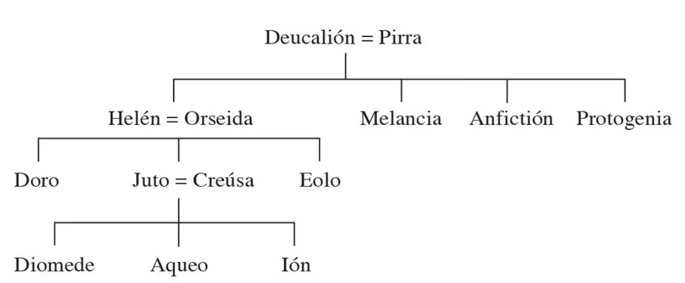

Tucídides. *Historia de la guerra del Peloponeso*. Edición de Juan José Torres Esbarranch. Libros I-II. España, Gredos, 1990.

## Sinopsis

1\. Prólogo. La importancia de la Guerra del Peloponeso.

2-19\. La «Arqueología». Debilidad de épocas anteriores en relación con la Grecia de la Guerra del Peloponeso. Crítica histórica.

20-22\. La investigación de Tucídides. El método histórico.

23\. La magnitud de la Guerra del Peloponeso. Sus causas.

24-55\. Conflicto de Corcira.

29\. Victorias de Corira.

31\. Embajadas de corcireos y corintios a Atenas.

32-36\. Discurso de los corcireos.

37-43\. Discurso de los corintios.

44-45\. Alianza defensiva de Atenas y Corcira. Intervención ateniense.

46\. Preparativos de los corintios.

47\. Preparativos de los corcireos.

48-52\. Batalla naval de las islas de Síbota.

53\. Conversaciones entre atenienses y corintios.

54\. Corintios y corcireos reivindican la victoria.

55\. Los corintios y los atenienses regresan a su patria.

56-66\. Conflicto de Potidea.

57\. Intrigas de Perdicas contra los atenienses.

58\. Sublevación de Potidea.

59\. Los atenienses en Macedonia.

60\. Ayuda de Corinto.

61\. Expedición de Calías.

62-63\. La Batalla de Potidea.

64-66\. Asedio de Potidea.

67-88\. El debate de Esparta.

68-72\. Discurso de los corintios.

73-79\. Discurso de los atenienses.

80-85\. Discurso de Arquidamo.

86\. Discurso de Estenelaidas.

87\. El tratado ha sido violado.

88\. El miedo de Esparta al poderío de Atenas. La verdadera causa.

89-118\. La «Pentecontecia». Historia de Atenas después de las Guerras Médicas. Formación del Imperio ateniense.

90-93\. La reconstrucción de las murallas de Atenas. Actuación de Temístocles.

94\. Expedición de Pausanias contra Chipre y Bizancio.

95\. Acusaciones contra Pausanias. La hegemonía pasa a los atenienses.

96\. La Confederación ático-delia.

97-100\. Orígenes y crecimiento del poderío ateniense. De la hegemonía al Imperio. Expediciones de Cimón, Tracia, Naxos, Eurimedonte, Tasos.

101\. La rebelión de los hilotas. Rendición de Tasos.

102\. Diferencias entre Esparta y Atenas. El incidente de Itome.

103\. Fin de la resistencia de Itome. Alianza de Mégara y Atenas.

104\. Los atenienses en Egipto.

105-106\. Guerras contra Corinto, Epidauro y Egina.

107\. Expedición lacedemonia a Grecia Central.

108\. Batallas de Tanagra y de Enófita. Expediciones atenienses. Atenas acaba sus Muros Largos.

109-110\. Derrota de los atenienses en Egipto.

111\. Los atenienses en Tesalia, en el Peloponeso y en Acarnania.

112\. Tregua de cinco años con Esparta. Expedición a Chipre. Muerte de Cimón. Victoria de Salamina de Chipre. Guerra Sagrada.

113\. Batalla de Coronea. Derrota ateniense en Grecia Central.

114\. Sublevación de Eubea y de Mégara.

115-117\. La Paz de Treinta años. La Guerra de Samos.

118\. Fin de la «Pentecontecia». Embajada lacedemonia a Delfos.

119-125\. Asamblea de la Liga del Peloponeso en Esparta.

120-124\. Discurso de los corintios.

125\. Se decide la guerra.

126-139\. Reclamaciones y pretextos.

126-127\. Primera embajada lacedemonia a Atenas. El sacrilegio de los Aicmeónidas.

128-134\. Réplica ateniense. El sacrilegio del Ténaro. Traición de Pausanias.

135-138\. El caso de Temístocles.

139-145\. La Asamblea de Atenas.

139\. Nuevas embajadas lacedemonias a Atenas. El ultimátum. La Asamblea.

140-144\. Discurso de Pericles.

145\. Respuesta de Atenas.

146\. Acaba el relato de las causas y antecedentes de la Guerra del Peloponeso.

## 1. Prólogo. La importancia de la Guerra del Peloponeso

1. Tucídides de Atenas1 escribió la historia de la guerra entre los peloponesios y los atenienses2 relatando cómo se desarrollaron sus hostilidades3, y se puso a ello4 tan pronto como se declaró, porque pensaba que iba a ser importante y más memorable que las anteriores5. Basaba su conjetura en el hecho de que ambos pueblos la emprendían en su mejor momento gracias a sus recursos de todo tipo6, y en que veía que los restantes griegos, unos de inmediato y otros disponiéndose a ello, se alineaban en uno u otro bando. Esta fue, en efecto, la mayor conmoción7 [2] que haya afectado a los griegos y a buena parte de los bárbaros8; alcanzó, por así decirlo, a casi toda la humanidad9. Pues los acontecimientos anteriores, y los todavía más antiguos10, era imposible, ciertamente, conocerlos con precisión a causa de la distancia del tiempo; pero por los indicios a los que puedo dar crédito cuando indago lo más lejos posible, no creo que ocurriera nada importante ni en lo referente a las guerras ni en lo demás.

### Notas de Juan José Torres Esbarranch.

1. El historiador no se dirige exclusivamente a sus conciudadanos (cf. pasajes como II 19, 2; 34, 7; VIII 67, 2, con explicaciones superfluas para un ateniense), sino que piensa en un público amplio y en la posteridad. Por eso da su nombre unido al nombre de su ciudad, como habían hecho Hecateo (cf. F. JACOBY, *Die Fragmente der griechischen Historiker [FGrHist]*, Berlín-Leiden, 1923. . . , 1, F 1) y Heródoto (I, *Proemio*) en una línea de afirmación de la personalidad que se inició con la lírica. Sin embargo, cuando habla de sí mismo como estratego ateniense (cf. *infra*, IV 104, 4) se cita con el nombre con el que se le conocía oficialmente en Atenas: Tucídides de Óloro (*Thoukydídēs Olórou*).
2. Esta guerra del 431-404 supuso la culminación de la oposición entre Atenas y Esparta.
3. Es la historia de cómo evolucionó la guerra y de la política relacionada con ella. No se trata de una historia general de la época y otros aspectos pasan a segundo plano. El objetivo de la investigación tucididea es la guerra en sí misma en sus diversas fases y con todas sus causas, implicaciones y consecuencias, y no es la guerra en su aspecto superficial —aunque es un magnífico observador y narrador de los hechos bélicos—, sino que se interesa de forma especial por su trasfondo, sus raíces y derivaciones; le importan las causas profundas y los motivos que se esgrimieron, así como las consecuencias morales que provocó. Y todo ello sabe mirarlo con ojo clínico. Una guerra para un historiador imbuido del método hipocrático era como una enfermedad. Así como en el estado normal de salud no pueden observarse las anomalías fisiológicas, del mismo modo en las épocas de paz no se patentizan los desarreglos y alteraciones del organismo social. Igual que el médico estudia la salud y sus características mediante la observación de cuerpos enfermos, el historiador y el sociólogo pueden entender mejor las leyes que rigen la comunidad humana mediante el análisis de las guerras, las épocas críticas en las que se pone de manifiesto el trasfondo de la salud de los pueblos. Quedan entonces al descubierto todas las alteraciones y las tendencias elementales de la sociedad, el fenómeno del poder, el derecho y la fuerza, la ambición política, etc. Todas esas cuestiones constituyen el centro del interés de la Historia de Tucídides (cf. sobre ello el libro de J. ALSINA, *Tucídides: Historia, ética y política*, Madrid, 1981). El tema, pues, está perfectamente delimitado desde el principio: «la guerra entre los peloponesios y los atenienses». No es una historia «cultural» de su tiempo, y en función de esto se explican algunos «silencios» del historiador; se ciñe a unos hechos militares y políticos concretos: la guerra y sus causas profundas, los móviles que la desencadenaron, las fuerzas, leyes e ideas subyacentes, su evolución y el papel de los políticos y de los pueblos. . . En resumen, un objetivo restringido, y vasto a la vez, dentro de cuyos límites Tucídides aspira a lograr un *ktêma es aieí*, es decir, una «adquisición para siempre» (cf. *infra*, I 22, 4).
4. Su preocupación por narrar la guerra comenzó con la guerra misma, y su genio lo llevó a analizar con extraordinaria profundidad los sucesos contemporáneos. Desde el principio de la guerra, comenzó, por tanto, a reunir y preparar los materiales de su *Historia*.
5. En comparación con el pasado remoto, al que se refiere la *Arqueología*, y con el pasado reciente y actuante de la *Pentecontecia*, Tucídides analiza su época y la guerra que le ha tocado vivir; ello le lleva a una afirmación de la importancia y superioridad del presente y a minimizar, en relación con la Guerra del Peloponeso, todas las anteriores, la de Troya inclusive.
6. Y del mismo modo que sitúa su guerra frente a las que la precedieron, él mismo pretende distanciarse de sus predecesores; su obra quie re ser distinta en concepción y métodos y, a lo largo de sus páginas, encontramos frecuentes pruebas de su voluntad de novedad y singularidad. Su obra, en consonancia con su época, ha de ser *borrón y cuenta nueva* respecto a concepciones y a métodos anteriores, en relación con Homero, con los logógrafos y con Heródoto, y, junto a esta pretensión de novedad y singularidad, se evidencia, asimismo, la voluntad de permanencia de una obra concebida como «adquisición para siempre», como lección y ejemplo para generaciones futuras y con el mismo afán de utilidad en que se inspiran las observaciones clínicas de un médico (cf. *infra*, II 48, 3). Estas aspiraciones tucidídeas se evidencian a lo largo de una obra tan densa y ardua como atractiva, una obra en la que se reflejan una inteligencia que constantemente relaciona, un pensamiento profundamente analítico y un espíritu apasionado, un intelectual y un artista, una obra llena de tensiones y contrastes donde tan pronto sobresale la época y el ambiente y su formación sofística como la original personalidad del historiador, donde unas veces prima lo racional y otras lo irracional y lo trágico; donde coexiste el científico, su afán de precisión, concisión y su espíritu antitético, con el poeta que quiere atraer la atención sobre la grandiosa y trágica aventura de su patria, sobre una guerra que considera más memorable que las anteriores. Todo ello se refleja perfectamente en su léxico y en su estilo, en los que se conjugan asimismo las influencias de una época y los rasgos únicos de una extraordinaria individualidad, tal como se revela a quien lo lee sin precipitación.   Cf. infra, I 19, y 118, 2.
7. *Kínēsis*. Sobre este término, cf. H. PATZER, reseña de F. BIZER, *Untersuchungen zur Archäologie des Thukydides*, tesis, 1937, *Gnomon* 16 (1940), 350; N. G. L. HAMMOND, «The arrangement of the thought in the proem and in other parts of Thucydides I», *The Classical Quarterly* 11 (1952), pág. 132.
8. Los griegos utilizaban el término *bárbaros* para designar al extranjero que no pertenecía a su estirpe, mientras que *xénos* servía para indicar al extranjero griego (cf. HERÓDOTO, II 160, 4), que era ciudadano de una *pólis* distinta a la propia. Los espartanos, sin embargo, no hacían distinción alguna (cf. HERÓDOTO, IX 11, 2; 53, 2; 55, 2). *Bárbaros* es una forma onomatopéyica indoeuropea para designar a una persona que tiene dificultad para hablar una lengua, que hace *«bar-bar»* al hablar (piénsese, por ejemplo, en la raíz sánscrita *barbara* para significar «tartamudear»); y de ahí la idea de «extranjero». Cf. J. POKORNY, *Indogermanisches etymologisches Wörterbuch I*, Berna-Berlín, 1959, págs. 91 ss.
9. Muchos pueblos no griegos, como los epirotas, tracios, macedonios, sículos y, en cierta medida, los persas, se vieron implicados en la contienda. Si la guerra arquidámica (431-421) fue esencialmente griega, después de la Paz de Nicias los horizontes se ampliaron. Cf. A. W. GOMME, *A historical commentary on Thucydides I*, Oxford, 1945, pág. 91.
10. Pasaje de dudosa interpretación. Se ha discutido mucho sobre el sentido de «los acontecimientos anteriores, y los todavía más antiguos». Para Stahl, lo primero se refería a la época entre la Guerra de Troya y las Guerras Médicas, y lo segundo a los lejanos tiempos anteriores a Troya. Schadewaldt piensa que «los acontecimientos anteriores» (*tà prò autôn*) se refieren a las Guerras Médicas y «los todavía más antiguos» (*tà éti palaítera*), a la Guerra de Troya. Según Classen, en lo primero habría una alusión a los sucesos inmediatamente anteriores a la Guerra del Peloponeso a partir de las Guerras Médicas, y en lo segundo, a los acontecimientos anteriores al enfrentamiento con Persia. Pero resulta chocante que la dificultad señalada por Tucídides para llegar a un conocimiento preciso pueda referirse a los cercanos hechos de la *Pentecontecia* (años 479-432; cf. infra, I 89-118), de los que no debían de faltar los testimonios. El mismo Tucídides —en I 97, 2— dice que ha estudiado este período de forma más amplia y precisa que Helánico. También se contaba con el testimonio de Heródoto para las Guerras Médicas. Parece, pues, más verosímil que, cuando Tucídides habla de dificultades para conocer los hechos con precisión, piense sobre todo en la historia más antigua, a la que se aproxima mediante indicios menos seguros.

## 2-19. La "Arqueología". Debilidad de épocas anteriores en relación con la Grecia de la Guerra del Peloponeso. Crítica histórica

2. Es evidente11, en efecto, que la tierra que ahora se llama Grecia no estaba habitada antiguamente de forma estable, sino que al principio hubo migraciones y todos abandonaban fácilmente su territorio forzados por otros pueblos cada vez más numerosos. El [2] comercio no existía y las comunicaciones entre los pueblos no eran seguras ni por tierra ni por mar; cada uno sacaba de su propia tierra solo lo indispensable para vivir, y no acumulaban riquezas ni efectuaban plantaciones12, puesto que nadie sabía cuándo otros se les echarían encima y, al no estar protegidos por murallas, los despojarían; en consecuencia, pensando que en cualquier parte iban a conseguir el indispensable alimento cotidiano, emigraban sin dificultad, y por ello no eran poderosos ni por la magnitud [3] de sus ciudades ni por otro tipo de recursos13. Las tierras más fértiles, mayormente, experimentaban continuos cambios de habitantes: así la que ahora se llama Tesalia y Beocia y la mayor parte del Peloponeso14 con la excepción de Arcadia, y de las restantes, las que eran mejores. [4] Gracias a la fertilidad de la tierra, las fortunas de algunos aumentaban y eran causa de disensiones internas que provocaban la ruina de los pueblos, a la vez que los dejaban más expuestos a los ataques de tribus del exterior. Pero el Ática, según esto, por vivir [5] desde los tiempos más remotos sin disensiones internas debido a la aridez de su suelo15, fue habitada sin interrupción por los mismos hombres16. Y una demostración bastante clara de mi teoría 6 la constituye el hecho de que las otras regiones no progresaron en la misma medida a causa de las migraciones. En efecto, los hombres más poderosos, al ser desterrados del resto de Grecia debido a guerras o a disensiones internas, se refugiaban en Atenas por aprecio a su estabilidad y, convirtiéndose en ciudadanos17, desde los primeros tiempos acrecentaron todavía más la población de la ciudad, hasta el punto de que más tarde, al resultar el Ática insuficiente, incluso enviaron colonias a Jonia18.

3. Me demuestra también, y no con menor claridad, la debilidad de los antiguos el hecho de que, antes de la Guerra de Troya19, la Hélade no parece haber acometido ninguna [2] empresa en común; pienso, además, que este nombre20 no solo no designaba todavía al país en su totalidad, sino que antes de Helén, el hijo de Deucalión21, ni siquiera existía tal denominación, y que las diferentes gentes, y sobre todo los pelasgos22, extendían el nombre de su propio pueblo. Pero cuando Helén y sus hijos se hicieron poderosos en la Ftiótide23, y los solicitaban para acudir en auxilio de otras ciudades, los diferentes pueblos, desde entonces, debido a aquellas relaciones, dieron una mayor difusión al nombre de helenos, denominación que, sin embargo, durante mucho tiempo, no pudo imponerse [3] a todos. Homero lo prueba mejor que nadie, pues, aunque vivió en una época muy posterior a la de la Guerra de Troya24, en ninguna parte aplicó el nombre colectivamente, ni tampoco a otros que no fueran los compañeros de Aquiles, procedentes de Ftiótide, que fueron precisamente los primeros helenos25, sino que en sus poemas, al referirse a todos, los llamó dánaos, argivos y aqueos. Tampoco utilizó el término de bárbaros26 por la razón de que los griegos, según creo, todavía no se distinguían [4] con un solo nombre que fuera el contrario. Así, pues, aquellos que recibieron el nombre de helenos, primero separadamente, ciudad tras ciudad a medida que se comprendían entre sí, y en conjunto después, no realizaron nada en común antes de la Guerra de Troya a causa de [5] su debilidad y aislamiento. Y marcharon juntos a esta expedición solo cuando su experiencia del mar fue mayor27.

4. Minos28 fue el primero, de los que conocemos por la tradición29, en procurarse una flota30 y extender su dominio por la mayor parte de lo que hoy llamamos mar griego31; sometió las islas Cícladas32 y fue el primer colonizador de la mayor parte de ellas, expulsando a los carios33 y estableciendo como gobernadores a sus propios hijos. Y, como era natural, para que le llegaran con mayor seguridad los tributos, procuró, hasta donde alcanzó su poder, limpiar el mar de piratas. Los [5] griegos de otro tiempo, en efecto, y los bárbaros que vivían en la costa del continente o en las islas, una vez que empezaron a pasar con sus naves de unas tierras a otras con mayor frecuencia, se dedicaron a la piratería34 bajo el mando de hombres que, sin ser ellos los de menos recursos, buscaban su propio provecho y sustento para los débiles. Cayendo sobre poblaciones sin murallas formadas por aldeas dispersas, las saqueaban y obtenían de allí la mayor parte de sus medios de vida, pues esta actividad no comportaba ningún deshonor, sino que más bien proporcionaba una cierta gloria. Lo demuestran aún [2] hoy algunos pueblos del continente, para quienes el éxito en estas acciones constituye un honor, y también los poetas antiguos, que en todas las ocasiones dirigen la misma pregunta de si son piratas35 a los navegantes que desembarcan, señal de que quienes eran interrogados no desdeñaban aquella actividad, y que aquellos que se preocupaban de informarse no la reprochaban. En tierra también [3] se dedicaban al pillaje unos contra otros. Y hasta nuestros días se vive a la manera antigua en muchas zonas de Grecia, en la región de los locros ozolos36, de los etolios37 y de los acarnanios38 y por aquella parte del continente. La costumbre de llevar armas que tienen estos pueblos continentales es una supervivencia de la antigua piratería.

6. Toda Grecia, en efecto, llevaba armas debido a que sus viviendas carecían de protección y a que las comunicaciones entre los pueblos no eran seguras; se acostumbraron [2] a la vida en armas, igual que los bárbaros. Y las zonas de Grecia que todavía viven así constituyen un indicio de que en otro tiempo formas de vida semejantes se daban [3] por todas partes. Entre aquellos griegos, los atenienses fueron los primeros en abandonar el hierro y pasarse, por la libertad de sus costumbres, a una vida más muelle. No hace mucho tiempo que en Atenas los más viejos de los ricos dejaron de llevar, como signo de su vida de lujo, guitones de lino39 y de recoger las guedejas de su cabello en la cabeza mediante la inserción de cigarras de oro40; de aquí proviene que esta moda imperara también durante mucho tiempo entre los viejos jonios, debido a su parentesco41. [4] Por el contrario, los lacedemonios42 fueron los primeros en usar vestidos sencillos43, a la moda de ahora, y, en general, quienes poseían una mayor fortuna adoptaron, antes que nadie, el mismo modo de vida de 5 la masa. También fueron los primeros en mostrarse desnudos44 y en desvestirse en público y untarse con aceite en los ejercicios gimnásticos. Antiguamente, en cambio, e incluso en los Juegos Olímpicos45, los atletas competían llevando un ceñidor46 que les cubría las vergüenzas, costumbre que se ha perdido no hace muchos años. Pero todavía hoy día hay pueblos bárbaros, en especial los asiáticos, que, al celebrar competiciones de pugilato y lucha, lo hacen cubiertos con taparrabos. En muchos otros aspectos, [6] asimismo, se podría demostrar que el mundo griego antiguo vivía de modo semejante al mundo bárbaro de hoy47.

7. Respecto a las ciudades, las de fundación más reciente, que, por ser las circunstancias más favorables para la navegación, tenían recursos en mayor abundancia, fueron construidas con murallas en la misma costa y cerraron los istmos48 pensando en el comercio y la defensa de cada una frente a sus vecinas. Las ciudades antiguas, por el contrario, tanto las insulares como las continentales, fueron fundadas generalmente lejos del mar49 a causa de la piratería, que se mantuvo durante mucho tiempo (pues no solo se robaban entre sí, sino que también robaban a todos los que, aun sin vivir del mar, habitaban junto a la costa), y hasta hoy día han seguido en el interior.

8. No fueron menos piratas los isleños, que eran carios50 y fenicios51, pueblos que, como es sabido, colonizaron la mayor parte de las islas. He aquí una prueba: cuando, durante la guerra que nos ocupa52, Delos fue purificada por los atenienses53 y fueron retiradas todas las tumbas de los que habían muerto en la isla, se vio que más de la mitad pertenecían a carios54; fueron identificados por el tipo de armas enterradas con ellos y por la forma de [2] enterramiento, que todavía es la misma actualmente. Pero cuando fue creada la flota de Minos, las comunicaciones por mar entre los pueblos resultaron más fáciles (pues expulsó a los malhechores de las islas55 cuando estableció 3 colonias en la mayoría de ellas), y los que habitaban junto al mar acrecentaron su fortuna y empezaron a vivir de forma más estable, e incluso algunos, al verse más ricos de lo que eran antes, se rodearon de murallas. Por el deseo de ganancias, los más débiles aceptaban su sumisión a los más fuertes, y los más poderosos con su abundancia se granjeaban el vasallaje de las ciudades más pequeñas56. Y ya se había consolidado esta situación cuando, posteriormente, 4 emprendieron la expedición contra Troya.

9. Me parece, además, que Agamenón consiguió reunir las fuerzas expedicionarias porque era el más poderoso de sus contemporáneos, y no tanto por ir al frente de los pretendientes de Helena, obligados por el juramento prestado a [2] Tindáreo57. Dicen, por cierto, quienes han recogido de los antepasados las tradiciones más precisas sobre los peloponesios58, que primero Pélope59, gracias a la gran fortuna con la que desde Asia llegó a un pueblo sin recursos, se hizo con el poder y, a pesar de ser extranjero, alcanzó el honor de dar su nombre al país, y que después el poder de sus descendientes todavía aumentó cuando Euristeo60 murió en el Ática a manos de los Heráclidas tras haber confiado, al partir hacia la guerra, Micenas61 y su imperio a Atreo debido a su parentesco, ya que Atreo (desterrado entonces por su padre a causa de la muerte de Crisipo)62 era hermano de la madre de Euristeo. Y como que Euristeo ya no regresó, Atreo heredó el reino de Micenas y todos los dominios de Euristeo, tal como quisieron los micénicos por miedo a los Heráclidas y porque, además, parecía un hombre fuerte y se había ganado al pueblo. Así los Pelópidas se hicieron más poderosos [3] que los Perseidas63. Agamenón, en mi opinión, gracias a que había recibido esta herencia y, además, por tener una mayor fuerza naval que los otros, pudo emprender y llevar a cabo la expedición, no tanto por el reconocimiento de que era objeto como por el temor que inspiraba. Es evidente, en efecto, que fue él quien llegó con el mayor número de naves, y que también proporcionó algunas a los arcadios64, tal como Homero lo demuestra, si su testimonio se considera válido65. Y, además, en la [4] transmisión del cetro66 dice de él que «reinaba en muchas islas y en toda Argos»67. Ahora bien, viviendo en el continente, si no hubiese tenido una flota68, no hubiera podido ejercer su dominio sobre otras islas que no fueran las vecinas (y esas no serían *muchas*). Por esta expedición, [5] asimismo, hay que conjeturar cómo eran las circunstancias anteriores a ella.

10. No se utilizaría un indicio exacto si, basándose en que Micenas era pequeña o en que alguna ciudad de las de entonces parece ahora sin importancia, se pusiera en duda que la expedición fue tan grande como los poetas la han [2] cantado y como la tradición mantiene; pues si fuera desolada la ciudad de los lacedemonios69, y solo quedaran los templos y los cimientos de los edificios, pienso que, al cabo de mucho tiempo, los hombres del mañana tendrían muchas dudas respecto a que la fuerza de los lacedemonios correspondiera a su fama. Sin embargo, ocupan dos quintas partes70 del Peloponeso y su hegemonía se extiende a la totalidad71 y a sus muchos aliados del exterior; pero, a pesar de esto, dado que la ciudad no tiene templos ni edificios suntuosos y no está construida de forma conjunta, sino que está formada por aldeas dispersas72 a la manera antigua de Grecia, parecería muy inferior. Por el contrario, si les ocurriera esto mismo a los atenienses, al mostrarse ante los ojos de los hombres del mañana la apariencia de la ciudad, conjeturarían que la fuerza de Atenas era doble de la real. No hay razón, pues, para [3] plantear dudas ni para prestar más atención a las apariencias de las ciudades que a sus fuerzas reales, sino que hay que creer que aquella expedición fue más importante que las anteriores73, aunque inferior a las de ahora, si es que también en este caso debemos confiar en los versos de Homero74, quien, aunque es verosímil que, como poeta, la ponderara para engrandecerla, aun así, sin embargo, deja clara su inferioridad. En efecto, en la flota de mil [4] doscientas naves atribuye a las de los beocios ciento veinte hombres75 y a las de Filoctetes cincuenta76, indicando, en mi opinión, las mayores y las menores; en el Catálogo de las Naves77 al menos, no se menciona nada acerca del tamaño de las otras. Que todos eran a la vez remeros y combatientes, lo demuestra al referirse a las naves de Filoctetes, pues dice que eran arqueros todos los que manejaban los remos78. Y no es probable que fueran a bordo muchos pasajeros, a excepción de los reyes y de los dignatarios principales, sobre todo dado que tenían que atravesar el mar con los pertrechos de guerra y que no tenían, además, barcos con puentes, sino construidos a la antigua usanza, [5] más bien al modo de los piratas. Así, pues, si sacamos la media de las naves mayores y menores, es evidente que no fueron muchos combatientes, tratándose de una expedición enviada en común por toda Grecia79.

11. La causa no era tanto la escasez de hombres como la falta de recursos. Debido a la dificultad de aprovisionamiento80, transportaron un ejército reducido en proporción a los medios de vida que esperaban obtener en el país mientras combatían. Y después que vencieron en el combate que siguió a su llegada (hecho evidente, pues, de lo contrario, no hubieran construido la fortificación del campamento)81, se ve que ni siquiera entonces utilizaron todas sus fuerzas, sino que, a causa de la dificultad de aprovisionamiento, se dedicaron a cultivar las tierras del Quersoneso y a la piratería82. Por este motivo principalmente, los troyanos, al estar dispersos los griegos, pudieron resistir durante diez años de lucha abierta, ya que sus fuerzas eran equivalentes al retén que sucesivamente quedaba [2] frente a ellos. Por el contrario, si los griegos hubieran llegado con abundancia de provisiones, y si todos a la vez, sin dedicarse a la agricultura y a la piratería, hubieran proseguido la guerra sin interrupción, fácilmente se hubieran impuesto en el combate y hubieran tomado la ciudad, dado que, incluso sin actuar a la vez, solo con la parte del ejército que sucesivamente estaba presente, resistieron; y si se hubieran establecido en torno a ella para sitiarla, hubieran tomado Troya en menos tiempo y con [3] menos dificultades. Pero así como la debilidad de las empresas anteriores fue debida a la falta de recursos, sin duda ocurre lo mismo con la Guerra de Troya, que si bien ha obtenido más renombre que las anteriores, los hechos demuestran que fue inferior a su fama y a la tradición que, gracias a los poetas, prevalece actualmente.

12. Lo ierto es que, incluso después de la Guerra de Troya, Grecia todavía siguió sometida al proceso de migraciones y colonizaciones que impidieron la paz necesaria para desarrollarse. El regreso de los griegos de Ilión después [2] de tanto tiempo provocó muchos cambios, y en la mayor parte de las ciudades se produjeron disensiones internas a consecuencia de las cuales los que eran desterrados fundaban [3] nuevas ciudades. Así, los actuales beocios, sesenta años después de la toma de Ilión83, tras ser expulsados de Arne84 por los tesalios, ocuparon la Beocia de hoy, que antes se llamaba tierra cadmea85 (una rama de este pueblo ya estaba antes en esta tierra, y algunos de ellos participaron en la expedición contra Ilión)86, y, ochenta años después de la misma fecha, los dorios con los Heráclidas se apoderaron del Peloponeso87. Cuando finalmente, [4] después de mucho tiempo, Grecia alcanzó una paz estable y se acabaron las migraciones, empezó a enviar colonias al exterior; los atenienses ocuparon Jonia y las más de las islas88, mientras que los peloponesios colonizaron la mayor parte de Italia89 y de Sicilia90 y algunos lugares del resto de Grecia91. Todas estas colonias fueron fundadas después de la Guerra de Troya.

13. Al hacerse Grecia más poderosa y dedicarse todavía más que antes a la adquisición de riquezas, en la mayoría de las ciudades se establecieron tiranías con el aumento de los ingresos (antes había monarquías hereditarias con prerrogativas delimitadas), y Grecia se puso a equipar flotas y a vivir más de cara al mar. Se dice que los corintios [2] fueron los primeros en ocuparse de las construcciones navales con técnicas muy semejantes a las actuales y que las primeras trirremes92 de Grecia se construyeron en Corinto. Se sabe, asimismo, que Aminocles93, un armador [3] corintio, construyó cuatro naves para los samios; y fue unos trescientos años antes del fin de nuestra guerra94 [4] cuando Aminocles fue a Samos. La más antigua batalla naval de la que tenemos noticia se disputó entre los corintios y los corcireos95, unos doscientos sesenta años antes de [5] la misma fecha96. Los corintios, con su ciudad situada en el istmo, tuvieron ya desde antiguo un centro comercial, dado que antiguamente los griegos, al comunicarse más por tierra que por mar, tanto los de dentro como los de fuera del Peloponeso se relacionaban entre sí a través del territorio de los corintios, que, así, se convirtieron en una potencia económica, como lo demuestran incluso los poetas antiguos al dar al lugar el calificativo de opulento97. Y cuando los griegos se dedicaron más a la navegación, los corintios se procuraron naves y procedieron a eliminar la piratería98, y debido a que ofrecían un centro comercial terrestre y marítimo a la vez, gracias a la afluencia de riqueza, tuvieron una ciudad poderosa. [6] Más tarde, en tiempo de Ciro99, el primer rey persa, y de su hijo Cambises100, los jonios también tuvieron una flota considerable, y en su guerra contra Ciro dominaron durante un cierto tiempo el mar cercano a sus costas101. Policrates, que fue tirano de Samos102 en tiempos de Cambises, asimismo fue poderoso gracias a su flota, y, entre otras islas que sometió, tomó Renea103 y la consagró a Apolo delio104. Y los foceos, que fundaron Marsella105, combatiendo por mar vencieron a los cartagineses106.

14. Estas eran, sin duda, las flotas más poderosas. Pero incluso estas, a pesar de que se formaron muchas generaciones después de la Guerra de Troya, tenían, al parecer, pocas trirremes, y estaban compuestas por pentecóntoros y naves largas, como las flotas antiguas107. Sin embargo, [2] poco antes de las Guerras Médicas108 y de la muerte de Darío, que fue rey de los persas después de Cambises109, los tiranos de Sicilia y los corcireos tuvieron trirremes en número considerable; estas fueron las últimas flotas dignas de mención que hubo en Grecia antes de la expedición de [3] Jerjes110, pues las que poseían los eginetas, los atenienses y algunos otros eran pequeñas y estaban formadas en su mayor parte por pentecóntoros; fue más tarde cuando Temístocles111 persuadió a los atenienses, que estaban en guerra con los eginetas112 a la vez que a la espera del ataque de los bárbaros, a construir las naves con las que combatieron; y estas todavía no tenían puentes en toda su extensión113.

15. Así fueron, pues, las flotas de los griegos, las antiguas y las que se formaron más tarde. Lograron, sin embargo, un poder nada despreciable quienes se dedicaron a ellas, gracias a la afluencia de riqueza y al dominio sobre otros pueblos, pues en sus expediciones navales conquistaban las islas especialmente quienes no tenían un territorio suficiente. Por tierra no se disputó ninguna guerra de [2] la que pudiera derivar algún poder, sino que todas las que se produjeron eran las de cada pueblo con sus propios vecinos, y los griegos no salieron a expediciones al exterior a mucha distancia de su país con miras a la conquista de otros. Esto fue así porque no se habían constituido alianzas bajo la dirección de las ciudades mayores, y ni siquiera emprendían expediciones comunes en igualdad de derechos, sino que las ciudades vecinas se hacían la guerra más bien unas a otras separadamente114. Fue, ante todo, en la guerra [30] que tuvo lugar antiguamente entre los calcideos y los eretrieos115 cuando el resto del mundo griego se dividió para aliarse con uno u otro bando.

16. Cada pueblo encontró obstáculos de distinto tipo en su desarrollo. Así, contra los jonios116, en un momento de gran prosperidad, Ciro y el imperio persa, tras destronar a Creso117 y conquistar todos los territorios situados entre el río Halis118 y el mar, hicieron una expedición y sometieron las ciudades del continente; y Darío, más tarde, gracias a la flota fenicia119, se apoderó también de las islas120.

17. Por lo que respecta a los tiranos, todos los que estaban establecidos en las ciudades griegas, mirando solo por sus intereses, tanto por su seguridad personal como por el engrandecimiento de su propia casa, gobernaban las ciudades con la máxima prudencia posible, y no llevaron a cabo ninguna empresa digna de mención, salvo alguna guerra particular contra sus vecinos respectivos. Los tiranos de Sicilia, en cambio, llegaron a los niveles más altos de poder121. Así, por motivos de todo tipo, Grecia se vio obligada durante mucho tiempo a no realizar nada notable en común y a que las empresas de cada una de sus ciudades carecieran de audacia.

18. Pero después que los tiranos de Atenas122 y los del resto de Grecia —regida también antes en muchos sitios por tiranías—, es decir, la mayoría de los tiranos y los últimos si exceptuamos los de Sicilia123, fueron derrocados por los lacedemonios (pues Lacedemonia, después de su fundación por los dorios124 que la siguen habitando actualmente, aunque fue, de los que conocemos, el país que sufrió disensiones internas durante más tiempo, sin embargo desde muy antiguo tuvo buenas leyes125 y siempre se vio libre de tiranos, con lo que son unos cuatrocientos años o unos pocos más los que han pasado hasta el final de nuestra guerra126 desde que los lacedemonios tienen la misma Constitución127, y por esto se han hecho poderosos y han impuesto su criterio en las otras ciudades), después de la expulsión de los tiranos de Grecia, como decía, no muchos años después, tuvo lugar la batalla [2] de Maratón128 entre los medos129 y los atenienses. Y diez años después de esta vinieron de nuevo los bárbaros contra Grecia con su gran expedición para someterla130. Ante la amenaza de este gran peligro, los lacedemonios, por la superioridad de sus fuerzas, tomaron el mando de los griegos aliados, mientras que los atenienses, al avanzar los medos, decidieron abandonar la ciudad y, recogiendo sus bienes, se embarcaron en las naves y se hicieron marinos131. Tras rechazar en común a los bárbaros, no mucho después, tanto los griegos que se habían rebelado contra el Rey132 como los que se habían aliado frente a él se dividieron en dos bandos en torno a los atenienses y a los lacedemonios133; estos pueblos, en efecto, se habían revelado como los más poderosos134, ya que los unos eran fuertes [3] por tierra y los otros por mar. La alianza militar135 se mantuvo durante corto tiempo; luego los lacedemonios y los atenienses tuvieron divergencias y se hicieron la guerra con la ayuda de sus aliados136; y a partir de entonces los otros griegos, en los casos en que estaban en desacuerdo, acudían a ellos. De modo que desde las Guerras Médicas hasta nuestra guerra, unas veces en paz, otras en guerra, bien entre sí, bien contra sus propios aliados en rebeldía137, prepararon cuidadosamente sus recursos para la guerra y adquirieron más experiencia ejercitándose en medio de los peligros.

19. Los lacedemonios ejercían su hegemonía sin tener a sus aliados sujetos a tributo, pero preocupándose de que su régimen fuera oligárquico, de acuerdo únicamente con su propia conveniencia. Los atenienses, en cambio, con el tiempo se habían apropiado de las naves de las ciudades aliadas, salvo de las de Quíos y Lesbos138, y habían impuesto a todas el pago de un tributo139. Y los recursos militares que ellos tenían separadamente al comienzo de esta guerra eran mayores que los de la época de mayor esplendor con la fuerza de la alianza intacta.

### Notas de Juan José Torres Esbarranch.

11. Si tenemos presente la síntesis de la historia de Grecia anterior a la Guerra del Peloponeso que Tucídides hace en la llamada Arqueología (I 2-19), es fácil llegar a la conclusión de que la expresión *tà prò autôn* («los acontecimientos anteriores» a «la mayor conmoción —*kínēsis*— que haya afectado a los griegos») —si no creemos que sea un caso de corrupción del texto (como piensan Steup y otros)— se refiere a la historia de Grecia que va desde la Guerra de Troya hasta la del Peloponeso, dejando un poco al margen la época inmediatamente anterior (tratada de forma sucinta en la *Arqueología* —I 18-19—, pero desarrollada luego ampliamente en los capítulos de la *Pentecontecia* I 89-118), mientras que «los todavía más antiguos» se referirían a la misma Guerra de Troya y a los tiempos anteriores a ella. La Guerra de Troya marcaría, pues, la línea divisoria (cf. I 11, 3-12, 1). En la Arqueología, efectivamente, Tucídides toma como frecuente punto de referencia la Guerra de Troya (cf. *infra*, I 3, 1; 3, 3; 3, 4; 8, 4; 9, 5; 11, 3-12, 1; 12, 4; 14, 1) y continuamente habla del «antes» y el «después» de esta guerra. Por un lado estaría, pues, la historia posterior a la Guerra de Troya y anterior a la del Peloponeso, sobre todo en sus épocas peor conocidas, y por otro, la misma Guerra de Troya y los acontecimientos todavía más antiguos, la leyenda, en suma. La llamada *Arqueología* sirve para demostrar la primera afirmación de Tucídides respecto a que la guerra que historió era más grande y memorable que las precedentes debido a que Grecia, antes de la Guerra del Peloponeso, no estaba preparada ni económica ni militarmente para guerras importantes.
12. De árboles frutales, cepas y olivos, cuyo fruto no hubieran podido recoger. Solo cultivaban la tierra para satisfacer sus necesidades inmediatas. Tampoco se había iniciado la acumulación de riqueza (cf. *infra*, 7; 13, 1), tan importante luego en el ámbito político-social.
13. Inestabilidad en los asentamientos, inseguridad en las comunicaciones, provisionalidad y pobreza: tales eran las características de la Grecia primitiva por oposición a la forma de vida posterior, ligada a un centro urbano y un territorio, con una organización estable y una capacidad para la creación de riqueza. La idea de «progreso» preside toda la *Arqueología*. Cf. J. DE ROMILLY, «Thucydide et l'idée de progrès», *Annali della Scuola Normale Superiore di Pisa* 35 (1966), 143-191.
14. Peloponeso: «Isla de Pélope» (cf. *infra*, nota 59), por cuanto que estaba casi completamente rodeado por el mar (salvo los 8 km del istmo de Corinto). El Peloponeso, excepto la zona central, la Arcadia feliz, que era poco apta para la agricultura, como tierra montañosa, y pobre en recursos, era una tierra rica y contaba con los fértiles valles de Laconia y Mesenia.
15. El territorio del Ática, con un terreno poco apto para los cereales, de los que debía abastecerse mediante importación, se prestaba, sin embargo, al cultivo de árboles y, en especial, al del olivo. Paradójicamente, la organización política y la ausencia de disensiones se unen a la pobreza del suelo. Cf. M. H. B. MARSHALL, «Urban Settlement in the second chapter of Thucydides», *The Classical Quarterly* 69 (1975), 26-40.
16. Los atenienses se consideraban autóctonos. Cf. *infra* la afirmación que se hace en el discurso fúnebre (Il 36, 1) y EURÍPIDES, *Medea* 825-26.
17. Esta facilidad para obtener la ciudadanía ateniense pertenecía, desde luego, al pasado. En el siglo V, Atenas era mucho más reacia a ampliar su ciudadanía.
18. Sobre la colonización de Asia Menor, cf. *infra*, I 12, 4, y HERÓDOTO, I 142-148. Sobre el origen ateniense de los jonios de las Cícladas y de Asia Menor, cf. *infra*, VII 57, 4, y HERÓDOTO, I 146-147; V 97, 2; VII 51, 2; VIII 46, 2-3; IX 106, 3. La propaganda política insistía en el liderazgo de Atenas sobre los jonios.
19. Acontecimiento que se toma con frecuencia como punto de referencia. Según las principales fuentes cronológicas, su fecha fue el 1184 a. C. (cf. *infra*, I 12, 3, n. 83). Tucídides la colocaba en torno al 1200, o hacia mediados del siglo XIII a. C. , según otros.
20. *Hellás*, «Hélade». *Hellás* fue, originariamente, una zona de Tesalia, próxima a Ftía, que se hallaba bajo el dominio de Aquiles. Cf. Ilíada IX 395.
21. Deucalión era un héroe, hijo de Prometeo, que se casó con Pirra, hija de Epimeteo y de Pandora, la primera mujer. Deucalión y Pirra fueron los únicos supervivientes del diluvio con el que Zeus decidió castigar a los hombres. Por consejo de Prometeo, construyeron un arca en la que flotaron durante nueve días y nueve noches salvándose del diluvio. Se establecieron luego en Tesalia, donde reinaron sobre los primeros hombres que, tras el diluvio, surgieron de las piedras —los huesos de la Tierra— que Deucalión y Pirra lanzaron por orden de Zeus. Uno de sus hijos fue Helén, mítico fundador de los helenos, de cuyos hijos, Doro, Eolo y Juto, descienden los dorios, eolios, jonios y aqueos. (Cf. DIODORO, IV 60, 2; APOLODORO, I 7, 2-3. ) He aquí el árbol genealógico de esta familia mítica:

    

    En la interpretación del mito que nos ofrece Tucídides es de destacar la idea de que el nombre de *helenos* se difundió debido a la fuerza de Helén y sus hijos. Un nombre se difundía igual que se extendían los dominios, debido a la fuerza. No se dan pruebas. Solo está la afirmación de que la difusión del nombre debió de producirse porque Helén y sus hijos se hicieron poderosos. El poderío de Helén se infiere de la difusión de su nombre, y subyace la idea de la fuerza como elemento determinante de la historia.

22. Con los nombres de pelasgos, léleges y carios se conocía a los primitivos habitantes de las tierras que luego fueron ocupadas por los griegos o helenos. Estos pueblos, antes de la llegada de los griegos, se extenderían por toda Grecia, y los pelasgos, en concreto, según los testimonios de Homero (cf. *Ilíada* II 681-684 y 840-843) y de Heródoto, estarían situados preferentemente en las regiones septentrionales, de donde se verían obligados a emigrar al producirse las invasiones de los grupos indoeuropeos. Heródoto (I 56-58) los consideraba autóctonos e indicaba que su lengua no era griega; los pueblos autóctonos pelásgicos, como era el caso de los atenienses, que luego se convirtieron en griegos, cambiaron sin duda de lengua (cf. HERÓDOTO, I 57, 2-3; VIII 44). Una vez instalados los helenos y ya helenizada la población autóctona ateniense, los pelasgos no asimilados quedarían como grupos marginales; tal sería el caso de los que se instalaron en Lemnos tras ser expulsados del Ática por los atenienses, pelasgos que realizarían incursiones contra el Ática y sobre los que se organizaría una campaña propagandística a mediados del siglo V a. C. para justificar la toma de Lemnos por Milcíades (cf. HERÓDOTO, VI 137-140; E. LUPPINO, «I Pelasgi e la propaganda política del V secolo a. C. », *Contributi dell'Istituto di Storia Antica* I [1972], 71-77). De todas formas, el planteamiento de Heródoto del problema pelásgico es, por lo menos, algo complicado (cf. HERÓDOTO, I 56-58; 146, 1; II 51-52; VI 137-140; VII 94-95; VIII 44). Su identificación histórica no es segura, y ya Éforo en el siglo IV a. C. señalaba que los nombres de estos pueblos eran términos imprecisos que servían para designar a distintos grupos que habitaban en la cuenca del Egeo cuando llegaron los griegos. Tucídides no profundiza en el complejo problema de los pelasgos y se limita a considerarlos como la población más numerosa y extendida de la Grecia prehelénica. Sobre esta cuestión, cf. F. LOCHNER VON HÜTTENBACH, *Die Pelasger*, Múnich, 1960, y la reseña de G. NEUMANN, Gnomon 34 (1962), 370-374.
23. Región situada al sudeste de Tesalia, en la que se encontraba Ftía, la patria de Aquiles.
24. Cf. HERÓDOTO, II 53. Según Heródoto, Homero y Hesíodo fueron contemporáneos y vivieron a mediados del siglo IX a. C.
25. Cf. HOMERO, *Ilíada* II 683-684; IX 395; 447-448; XVI 595; Odisea XI 496.
26. En *Ilíada* II 867, sin embargo, se habla de los carios *barbaróphōnoi* (cf. ESTRABÓN, XIV 2, 28), por lo que se piensa que Tucídides desconocía el verso o rechazaba su autenticidad o su valor probatorio respecto al uso del término *bárbaroi* (cf. *supra*, nota 8).
27. Cf. *infra*, I 9, 3-4. 28  Mítico rey de Creta, cuyo nombre representa probablemente un título o un gentilicio, hijo de Zeus y de Europa según la tradición. Tucídides le atribuye la creación de la primera gran flota, base de la talasocracia cretense. Este dominio minoico sobre el Egeo y el Mediterráneo oriental, aunque ha sido objeto de controversias e incluso negado por algunos, está de acuerdo con los testimonios antiguos (cf. , por ej. , HERÓDOTO, I 171, 2-3; III 122, 2; PLATÓN, *Leyes* 706a-b; ÉFORO, *FGrHist* 70 F 149; ARISTÓTELES, *Política* II 7, 2 [1271b]; ESTRABÓN, X 4, 8; DIODORO, IV 60, 3; PAUSANIAS, I 27, 9) y ha sido confirmado por las modernas investigaciones arqueológicas que evidencian una supremacía de la cultura y economía cretense sobre las Cícladas, Chipre, Asia Menor y Egipto durante la primera mitad del II milenio hasta el siglo XVI a. C. La talasocracia minoica no es, por tanto, una invención ateniense en la búsqueda de un ilustre precedente para su imperio del siglo V a. C. , aunque Tucídides proyecte en cierto modo las condiciones políticas y económicas de la Atenas de su época sobre el pasado más lejano. Ya antiguamente para crear un imperio las condiciones que se precisaban eran, según el historiador, recursos financieros y la posesión de una flota, tributos y naves, es decir, las circunstancias que permitieron la expansión imperial ateniense. Tucídides identifica imperio y talasocracia (cf. *infra*, I 8, 2-4) desde su óptica de una ciudad marítima e imperial.
28. Mítico rey de Creta, cuyo nombre representa probablemente un título o un gentilicio, hijo de Zeus y de Europa según la tradición. Tucídides le atribuye la creación de la primera gran flota, base de la talasocracia cretense. Este dominio minoico sobre el Egeo y el Mediterráneo oriental, aunque ha sido objeto de controversias e incluso negado por algunos, está de acuerdo con los testimonios antiguos (cf. , por ej. , HERÓDOTO, I 171, 2-3; III 122, 2; PLATÓN, *Leyes* 706a-b; ÉFORO, *FGrHist* 70 F 149; ARISTÓTELES, *Política* II 7, 2 [1271b]; ESTRABÓN, X 4, 8; DIODORO, IV 60, 3; PAUSANIAS, I 27, 9) y ha sido confirmado por las modernas investigaciones arqueológicas que evidencian una supremacía de la cultura y economía cretense sobre las Cícladas, Chipre, Asia Menor y Egipto durante la primera mitad del II milenio hasta el siglo XVI a. C. La talasocracia minoica no es, por tanto, una invención ateniense en la búsqueda de un ilustre precedente para su imperio del siglo V a. C. , aunque Tucídides proyecte en cierto modo las condiciones políticas y económicas de la Atenas de su época sobre el pasado más lejano. Ya antiguamente para crear un imperio las condiciones que se precisaban eran, según el historiador, recursos financieros y la posesión de una flota, tributos y naves, es decir, las circunstancias que permitieron la expansión imperial ateniense. Tucídides identifica imperio y talasocracia (cf. infra, I 8, 2-4) desde su óptica de una ciudad marítima e imperial.
29. La *akoḗ*, la tradición oral. Cf. *infra*, I 23, 3; 73, 2, etc.
30. Cf. *infra*, I 8, 2. Sobre la construcción naval en Creta, cf. S. MARINATOS, «La marine créto-mycénienne», *Bulletin de correspondance héllenique* 62 (1933), 170-235.
31. El Egeo.
32. Archipiélago del Egeo meridional, al sudeste del Ática y de Eubea, con islas como Naxos (la mayor de ellas con una extensión de unos 450 km2), Paros, Andros. . . , formando un círculo (*kýklos*) alrededor de Delos.
33. Cf. *infra*, I 8, 1. Sobre los orígenes de este pueblo, véase HERÓDOTO, I 171 (cf. HERÓDOTO, *Historia* I-II, intr. F. R. ADRADOS, trad. y notas de C. SCHRADER, Madrid, BCG 3, 1977, págs. 230-231. ) Tucídides está en desacuerdo con otras fuentes respecto a la expulsión de los carios de las islas, que, según él, fue obra de Minos. Según Heródoto, sin embargo, fueron expulsados por los dorios y los jonios (cf. HERÓDOTO, I 171, 5). Según el historiador de Halicarnaso, los carios no se dedicarían a la piratería y estarían en buenas relaciones con Minos, cuya supremacía reconocerían, e incluso contribuirían a equipar sus naves (cf. HERÓDOTO, 171, 2). En época histórica vivían en el suroeste de Asia Menor. Sobre ellos, cf. , asimismo, ESTRABÓN, XIV 2, 27-28.
34. En estos capítulos de la Arqueología, el tema del mar, de la importancia de su dominio y de su relación con el progreso, es un *leitmotiv*, tal como demuestran las continuas referencias al uso y al control de las rutas marinas (cf. I 2, 2; 3, 5; 4, 7; 8, 2-3; 9, 3-4; 10, 4; 13, 1-6; 14, 1-3; 15, 1) y al tema de la piratería (cf. I 7; 8, 1-3; 10, 4; 11, 1-2; 13, 5). La valoración tucidídea de la piratería no es negativa; va unida al desarrollo de la navegación y al progreso de las comunidades, procura medios de subsistencia a los más débiles y poder, autoridad y gloria a los más poderosos, que con está actividad se aseguran el apoyo y la obediencia de los primeros. Este juicio positivo coincide perfectamente con la visión de PLATÓN (*Leyes* VII 823b) y de ARISTÓTELES (*Política* I 3, 4, 1256a), para los cuales la piratería es un *modus vivendi* tan natural como la agricultura, la pesca o la caza. Cf. en este sentido *infra*, I 11, 1, donde Tucídides, al hablar de la actividad de los griegos en Troya, dice que «a causa de la dificultad de aprovisionamiento, se dedicaron a cultivar las tierras del Quersoneso y a la piratería». La piratería, igual que la práctica del bandidaje en tierra (cf. *infra*, I 5, 3), está en muchos aspectos relacionada con la guerra y con la actividad comercial. Su desarrollo y sus modalidades van cambiando según las épocas, pero difícilmente desaparece. Coexiste peor, sin embargo, con la existencia de una talasocracia. Así, por ejemplo, campó menos a sus anchas durante el período de la hegemonía marítima de Atenas, que impuso su ley y se preocupó de combatirla (cf. PLUTARCO, *Cimón* 8, 3-5; *Pericles* 19, 1), pero en otras épocas de la historia de Grecia experimentó un notable auge e incluso fue reglamentada y en cierto modo institucionalizada como guerra de corso; así ocurrió en muchos Estados de la época helenística. Es, pues, un fenómeno ligado al progreso, que perduró en el Mediterráneo. Sobre este tema, cf. H. A. ORMEROD, *Piracy in the Ancient World*, Londres, 1924; G. BIRAGHI, «La pirateria greca in Tucidide», *Acme* 5 (1952), 471-477; Y. GARLAN, «Signification historique de la piraterie grecque», *Dialogues d'histoire ancienne* 4 (1978), 1-16.
35. Cf. HOMERO, *Odisea* III 71-74; IX 252-255; *Himno a Apolo* 452-455.
36. Habitantes de la Lócride Ozolia o Hesperia, en la parte occidental de la costa norte del golfo de Corinto, entre la Fócide y la Etolia. Se distinguen de los locros opuntios, que habitaban la Lócride Opuntia u Oriental, territorio que se extendía frente a Eubea, al norte de Beocia. Cf. *infra*, I 103, 3; 108, 3.
37. Habitantes de Etolia, territorio situado al norte de la Lócride Ozolia y del golfo Calidonio, su salida al mar.
38. Población de Acarnania, región al oeste de Etolia, bañada por el mar Jonio. El río Aqueloo la separa de Etolia.
39. El quitón era el vestido normal en Grecia, usado tanto por los hombres como por las mujeres. El de estas solía ser largo hasta los pies, mientras que era más corto el de aquellos. Sus características particulares dependían de una serie de factores como la edad, el sexo, los gustos y las modas, etc. Sin embargo, en líneas generales, había que distinguir entre dos tipos: el jónico y el dórico. El quitón jónico era una fina túnica de lino, con mangas (por lo que se le llamaba *cheirodōtós chitṓn*) y cosida por ambos lados, de modo que no fueran necesarias las fíbulas, mientras que el vestido dórico era de lana, no tenía mangas y solo iba cerrado por un costado; por el otro estaba abierto (de ahí la denominación de *schistós chitṓn* y el que Íbico llamara a las espartanas *phainomêrídas* por enseñar las piernas por ese lado) y se abrochaba con fíbulas. La evolución del vestido masculino a la que se refiere Tucídides en este pasaje no coincide, sin embargo, con el cambio de la moda femenina al que hace referencia Heródoto en V 87-88, donde el historiador nos da una explicación anecdótica (la muerte del único superviviente ateniense de una expedición contra Egina a manos de las mujeres atenienses, que, a punzadas de fíbula, hicieron pagar a aquel la muerte de sus maridos) para justificar el paso del vestido dórico, con fíbulas, al jónico, evitando así la utilización de las fíbulas. La moda del quitón de lino sin aquel «peligroso cierre» procedía de Jonia, y los jonios, se cree, la habrían recibido de los carios (cf. HERÓDOTO, I 146, 2; V 88); en enterramientos arcaicos atribuidos a carios, según se ha observado (cf. R. LONG, «Greeks, Carians and the Purification of Delos», *American Journal of Archaeology* 62 [1958], 303), no aparecen fíbulas. Según este pasaje de Tucídides, por el contrario, la evolución no fue del modelo dórico al jónico, tal como explica Heródoto, sino viceversa. Y las representaciones que nos ofrecen la escultura y la cerámica permiten pensar que en Atenas, durante la época arcaica, se usaba el vestido jónico, y que, después de las Guerras Médicas, se fue imponiendo el modelo dórico, posiblemente como reacción contra el lujo y refinamiento orientales.
40. Se refiere a la moda de recoger los cabellos en la coronilla o encima de la nuca, que podemos observar en las figuras de los vasos del período comprendido entre mediados del s. VI y el 470 a. C. , aproximadamente. Las «cigarras» (*téttiges*) serían unos adornos o pasadores para sujetar el pelo. Se han identificado con unas espirales que se insertaban en los cabellos. Sobre este uso, cf. ARISTÓFANES, *Caballeros* 1321-34, *Nubes* 984-986. Es probable que el nombre se debiera a su forma, aunque faltan testimonios seguros al respecto. Cf. , asimismo, ATENEO, XII 512b-c.
41. Todas estas modas lujosas que compartieron los jonios y los atenienses no debieron de iniciarse en Atenas y pasar luego a Jonia, sino que debió de ocurrir al revés.
42. El término «lacedemonios» era la denominación oficial de los espartanos y se refería tanto a los espartiatas, los ciudadanos de pleno derecho, como a los periecos (cf. *infra*, n. 563 y 809).
43. *Metriíi esthêti* se refiere a la sencillez del modo de vestir dorio, pero también nos hace pensar en el largo del vestido. El dorio era más corto que el jonio.
44. Cf. PLATÓN, *República* V 452c. Platón dice que los cretenses fueron los primeros en usar los gimnasios (dando a esta palabra su sentido etimológico, es decir, refiriéndola a los lugares en que los hombres se ejercitaban desnudos), y que luego les siguieron los lacedemonios. Según otras fuentes, sin embargo, la costumbre de la desnudez en los ejercicios atléticos fue introducida por un personaje concreto: por el lacedemonio Acanto, según DIONISIO DE HALICARNASO (VII 72, 3), y por el megareo Orsipo, según PAUSANIAS (I 44, 1) y el escolio a este pasaje de Tucídides. Esta supresión del *diázōma* se habría producido en la XV Olimpíada, en el 720 a. C.
45. Juegos panhelénicos que se celebraban cada cuatro años en Olimpia, en la Élide. La lista de los vencedores de las Olimpíadas se iniciaba en el 776 a. C. , y la referencia a los años olímpicos constituía un sistema cronológico.
46. El *diázōma* es una especie de taparrabo.
47. En el pasaje citado de Platón se recuerda, refiriéndose al hecho de dejarse ver desnudos, que «no ha mucho les parecía a los griegos vergonzoso y ridículo lo que ahora se lo parece a la mayoría de los bárbaros». Cf. también a este respecto HERÓDOTO, 10, 3.
48. Tal es el caso de Corinto (cf. *infra*, 13, 5), Epidamno (1 24, 1-2; 26, 5) y Potidea (I 56, 2; IV 120, 3), entre otros.
49. Puede pensarse en ciudades como Argos, Micenas, Cnoso y en la misma Atenas.
50. Cf. *supra*, 4, n. 33.
51. Respecto a los fenicios en el Egeo, cf. HERÓDOTO, I 1, sobre el mítico rapto de Ío por los fenicios; II 44, 4, donde se habla de la colonización de Tasos por navegantes fenicios; II 54 y 56, sobre la intervención en la fundación del oráculo de Dodona de una mujer consagrada, raptada por los fenicios en Tebas de Egipto y vendida en Grecia; III 107, acerca de la exportación de incienso a Grecia por los fenicios; y IV 147, 4-5, sobre los fenicios en la isla de Tera.
52. Literalmente «esta guerra», que se refiere naturalmente a la que es objeto de la *Historia* de Tucídides; cf. *infra*, 97, 1; II 47, 1, etc.
53. En el 426 a. C; cf. III 104, 1-2. Esta afirmación de Tucídides ha sido confirmada por el hallazgo en Renea (cf. *infra*, 13, 6, n. 103) de un depósito de material funerario correspondiente en general al período que va del siglo VIII al V a. C.
54. El problema relativo a las tumbas carias es complejo. Lo cierto es que quienes efectuaron la purificación de que habla Tucídides se encontraron con tumbas muy diferentes a las suyas, que no podían identificar. Probablemente se trata en general de enterramientos griegos de época arcaica. De todas formas, con apreciaciones como esta se demuestra el interés de Tucídides por los datos arqueológicos. Cf. R. M. COOK, *Annual of the British School at Athens* 50 (1955), 266-270.
55. Cf. *supra*, 4, nota 33. En cuanto a la importancia de la proximidad al mar y del amurallamiento, de lo que se habla a continuación, recuérdese que son precisamente dos elementos a evitar en la ciudad ideal de PLATÓN (*Leyes* 704d-707d; 778d; cf. D. PLÁCIDO SUÁREZ, «Platón y la Guerra del Peloponeso», *Gerión* 3 [1985], 43-62).
56. Sobre la comunidad de intereses entre débiles y poderosos, cf. *supra*, I 5, 1, n. 34. Es una idea que encontramos en diversos pasajes. El imperio puede resultar útil a los súbditos y a los dominadores. La unión hace la fuerza. Cf. en particular, en el discurso de Eufemo, VI 87, 3-4.
57. Padre «humano» de Helena (hija, en realidad, de Zeus y de Leda), que, siguiendo el consejo de Ulises, hizo jurar a los pretendientes de su hija que aceptarían la elección de esta y que ayudarían, en caso de necesidad, al elegido. Este fue el juramento invocado por Menelao para que todos los caudillos griegos emprendieran la expedición contra Troya. Cf. ISÓCRATES, X 40; APOLODORO, III 10, 9, y PAUSANIAS, III 20, 9. Tucídides racionaliza el mito.
58. Probable alusión a Helánico (s. V a. C), que escribió un libro titulado *Argoliká*, en el que recogía tradiciones peloponesias. Cf. *infra*, I 97, 2. Algunos fragmentos conservados se referirían a Atreo y Euristeo; cf. F. JACOBY, *FGrHist* 4, F 155 y 157.
59. El mítico Pélope, hijo de Tántalo, era originario de Asia Menor, y emigró a Europa, expulsado por Ilo. Llegó a Grecia, que era un país pobre, cargado de tesoros, e introdujo el lujo oriental. Después de vencer a Enómao, se casó con su hija Hipodamía, y de este matrimonio nacieron muchos hijos, entre los que se contaban Atreo y Tiestes. Fue rey de Pisa y de la Élide, y extendió su poder por gran parte del Peloponeso, tierra a la que dio nombre (cf. *supra*, n. 14).
60. Euristeo era hijo de Esténelo y nieto de Perseo. Su madre era Nicipe, hija de Pélope. Reinó en Micenas debido a una astucia de Hera, que logró que Euristeo naciera antes que Heracles, otro perseida, a quien Zeus destinaba al trono. Impuso los «trabajos» a Heracles, que se había puesto al servicio de Euristeo por mandato del oráculo. Siempre temeroso de Heracles, procuraba mantenerlo alejado y, tras la muerte del héroe, persiguió a sus descendientes, los Heráclidas, que se refugiaron en el Ática. Finalmente marchó contra los atenienses y fue vencido y muerto por Hilo, que iba al frente de los Heráclidas. Sus dominios pasaron entonces a manos de un pelópida, Atreo, hermano de Nicipe, la madre de Euristeo. Cf. HERÓDOTO, IX 27, 2; DIODORO, IV 57-58; PAUSANIAS, 44, 10; APOLODORO, II 8, 1.
61. La famosa ciudad de la Argólide que ha dado nombre al mundo micenico y que tuvo un papel capital en la Grecia de los siglos XVI-XII a. C. Con posterioridad fue una ciudad débil que acabó incorporada a Argos (hacia el 468; cf. DIODORO, XI 65, 1-5).
62. Crisipo era hijo de Pélope y de la ninfa Axíoque; era hermanastro, por tanto, de Atreo. En una de las versiones que existen sobre su muerte, fue muerto por Atreo a instigación de Hipodamía.
63. Con Atreo, al que pasaron los dominios de Euristeo, los Pelópidas sustituyeron en la hegemonía a los Perseidas. Tomando en consideración una tradición según la cual los Perseidas tendrían su sede en Tirinto y los Pelópidas en Micenas, se podría pensar aquí en una fase en que la segunda se impusiera sobre la primera.
64. Cf. *Ilíada* II 576-580 y 609-614: cien naves de Agamenón y sesenta proporcionadas a los arcadios.
65. Tucídides da poco crédito a Homero; piensa que su poesía embellece los hechos y aumenta su importancia. Cf. *infra*, I 10, 3; II 41, 4, y VI 2, 1. A pesar de ello, lo utiliza para la reconstrucción de la historia más antigua (cf. *supra*, I 5, 2, nota 35).
66. Cf. *Ilíada* II 100-109: el cetro había sido obra de Hefesto para el Crónida Zeus, quien lo entregó a Hermes, y de este pasó a Agamenón a través de Pélope, Atreo y Tiestes.
67. Cf. *Ilíada* II 108. En Homero «Argos» puede referirse tanto a la ciudad de este nombre como a la Argólide o a Grecia en general, especialmente al Peloponeso o a los territorios continentales del reino de Agamenón, como en este caso.
68. Tucídides insiste en la importancia del dominio del mar como base de poderío, de influencia política y de expansión económica. Cf. , por ejemplo, *supra*, I 3, 5; 4; 7, 1; *infra*, 13, 1; 143, 4; II 62, 2; 65, 7; 89, 10. Es uno de los principios básicos del historiador.
69. Esparta constituye un buen ejemplo para el razonamiento de Tucídides de que la potencia de una ciudad no está en relación directa con la magnificencia de sus edificios.
70. No se refiere a las regiones, ya que estas eran seis: Laconia, Mesenia, Élide, Acaya, Argólide y Arcadia. Aun uniendo Mesenia a Laconia, a la que estaba sometida, no podría referirse a las regiones, puesto que entonces se trataría de una quinta parte. Seguramente, Tucídides se refiere a que Laconia y Mesenia suponían los dos quintos del territorio peloponesio, aunque la extension de las dos regiones era en realidad inferior a las dos quintas partes.
71. Es una afirmación exagerada, puesto que Argos, la segunda potencia del Peloponeso, se mantenía aparte y no intervino hasta la segunda fase de la guerra, después de la Paz de Nicias, y entonces se alineó al lado de Atenas hasta el 404. Esta afirmación ha sido utilizada en relación con el problema de la composición de la Historia de Tucídides. F. W. ULLRICH, *Beiträge zur Erklärung des Thukydides*, Hamburgo, 1846, pág. 124 ss. : considerando que la hegemonía de Esparta, después de la derrota de Atenas en el 404, se extendería, más que al Peloponeso, a toda Grecia, concluyó que este pasaje habría sido compuesto con anterioridad al 404. Por el contrario, W. H. FORBES, *Thucydides* I, Oxford, 1895, defendió la tesis de que fue escrito no después del 421, sino con posterioridad al 404, argumentando que Argos fue aliada de Atenas entre el 420 y el 404.
72. Cf. *supra*, I 5, 1. Esparta no era una ciudad-estado con la estructura urbana de otras ciudades griegas contemporáneas. Era en realidad una agrupación de *ōbaí*, aldeas (Limnas, Cinosura, Mesoa, Pitana y Amiclas) que habían llegado a la unidad mediante un proceso de sinecismo. Cf. PAUSANIAS, III 2, 6; 16, 9; 19, 6; POLIBIO, V 19, 1-2; W. G. FORREST, *A History of Sparta* 950-192 B. C. , Londres, 1968, págs. 24-34.
73. También HERÓDOTO (VII 20, 2) consideraba que la expedición contra Troya había sido inferior a la expedición de Jerjes.
74. Cf. *supra*, I 9, 3, nota 65.
75. Cf. *Ilíada* II 510.
76. Cf. *Ilíada* II 719.
77. Se trata del libro II de la Ilíada, que constituye una relación de los pueblos que participaron en la Guerra de Troya y de las fuerzas con que contaban.
78. Cf. *Ilíada* II 719-720.
79. Según el cálculo de Tucídides, se alcanza un total de 102. 000 hombres, partiendo de una media de 85 hombres por barco (dado que las naves beocias, que eran las más grandes, llevaban 120 hombres y las de Filoctetes, las más pequeñas, 50) y de un número de 1. 200 naves. Era una cifra considerable, tratándose de una expedición por mar y comparándola incluso con expediciones atenienses de las que nos habla luego Tucídides (cf. , por ejemplo, *infra*, 116, 1-2; 117, 2; II 56, 1-2; 58, 1-3, etc. ). Es cierto, de todos modos, que se trataba de una expedición panhelénica, lo que reducía la significación de aquel número.
80. En la antigua Grecia, las guerras no solían ser de larga duración y en su mayor parte enfrentaban a pueblos vecinos por cuestiones de fronteras. En estos casos el problema del abastecimiento de las tropas tenía menos importancia; los mismos soldados llevaban sus víveres. Sin embargo, cuando se emprendían expediciones más largas y lejos de la propia ciudad, los soldados solo llevaban provisiones para un período corto y tenían que preocuparse luego del abastecimiento, que podía ser facilitado por los aliados o podían conseguirlo mediante compra, estableciendo un mercado, por ejemplo, como en Potidea, o por medio del saqueo de territorios enemigos (cf. *infra*, 62, 1; IV 6, 1; 80, 1; 83, 5; V 47, 6; etc. ). Tanto en esta cuestión del aprovisionamiento como en otros detalles que siguen, el relato de Tucídides respecto al desembarco griego en Troya presenta notables analogías con operaciones y desembarcos que tuvieron lugar en la misma Guerra del Peloponeso: ocupación o desembarco de un territorio asegurándose el terreno mediante una victoria inicial, después de lo cual viene el establecimiento de un campamento y su fortificación o el bloqueo de la ciudad objeto del ataque, si ello es posible (cf. *infra*, III 6, 1-2; VI 23, 2; 66, 2, etc. ). Se trata, pues, en cierto modo, de otra proyección del presente sobre el pasado.
81. (*Dêlon dè: tò gàr éryma tôi stratopédōi ouk àn eteichísanto*). Ha sido objeto de polémica el conflicto entre estas diez palabras de Tucídides relativas a la construcción de una fortificación tras el desembarco, en el primer año, y los pasajes de la *Ilíada* (VII 336-343; 436-463), donde se describe la construcción de una fortificación en el décimo año y no se hace referencia a una fortificación construida en el primero, de la que tampoco parece estar enterada la tradición épica, aunque algunos testimonios parecen sugerir su existencia (HERÓDOTO, II 118; PROCLO, resumen de los *Cantos Ciprios*; cf. sobre el tema y los problemas que puede plantear la interpretación de este pasaje: E. DOLIN, «Thucydides on the Trojan War: a Critique of the text of I 11. 1», *Harvard Studies in Classical Philology* 87 [1983], 119-149). Tucídides se refiere a una fortificación (*éryma*) construida rápidamente tras el desembarco, tal como era usual, según hemos dicho, en su época; en un día se levantó la de VI 66 y en dos y medio la de IV 90, 2. Cf. E. WATSON WILLIAMS, «Eryma; Thucydides I, 11», *Eranos* 60 (1962), 101-104; O. TSAGARAKIS, «The Achaean Wall and the Homeric Question», *Hermes* 97 (1969), 129-135.
82. Sobre lo primero no habla la *Ilíada*. Posiblemente lo hacían los *Cantos Ciprios*. Respecto a la piratería, cf. *Ilíada* I 366 ss. , IX 328 ss. y XX 91 ss. Lo notable es que la agricultura y la piratería están en el mismo plano. Cf. *supra*, I 5, 1, n. 34.
83. Los logógrafos (cf. *infra*, I 21, 1) habían establecido las fechas de los principales acontecimientos de la historia antigua, incluso de los sucesos míticos (cf. HERÓDOTO, II 142 ss. ). Tucídides puede haber tomado estas fechas de Helánico (cf. *supra*, I 9 nota 58), que había escrito sobre los sucesos posteriores a la caída de Troya. Esta fue tomada, según Eratóstenes (s. III a. C), en el 1184 a. C. , pero según los modernos descubrimientos arqueológicos la caída se produjo hacia el 1250 a. C. , fecha con la que están de acuerdo los cálculos de HERÓDOTO (II 145, 4).
84. La ciudad de Arne estaba situada en Tesalia central. Los tesalios, según HERÓDOTO, VII 176, 4, procedían de Tesprotia, región del Epiro.
85. De Cadmo, mítico fundador de Cadmea, acrópolis de Tebas. Había salido de Tiro en busca de su hermana Europa, raptada por Zeus. En cumplimiento de una orden del oráculo de Delfos fundó la ciudadela cadmea en el sitio que luego se llamó Tebas. Cf. HERÓDOTO, V 57 ss. ; ESTRABÓN, IX 2, 3; PAUSANIAS, IX 5, 1-2. Sobre la migración beocia, cf. D. W. PRAKKEN, «The Boeotian Migration», *American Journal of Philology* 64 (1943), 417-423.
86. Cf. *Ilíada* II 494-510.
87. Después de vencer a Euristeo (cf. *supra*, I 9 y n. 60), los Heráclidas conducidos por Hilo se establecieron en el Peloponeso. Pero, al cabo de un año, sobrevino una peste, que el oráculo atribuyó a la cólera divina, provocada por el hecho de que los Heráclidas habían regresado al Peloponeso antes del tiempo fijado por el destino. Entonces los Heráclidas, obedientes al oráculo, abandonaron el Peloponeso y volvieron al Ática, donde se pusieron a esperar que llegara el momento de regresar al Peloponeso. Una vez que llegó el momento indicado por el oráculo (a «la tercera cosecha»), Hilo, al frente de los suyos, avanzó por el istmo de Corinto, pero le salió al encuentro Équemo, rey de Tegea. Entre los dos jefes se acordó un combate singular. Si vencía Équemo, los Heráclidas renunciarían a todo intento de entrar en el Peloponeso durante cien años (o cincuenta según otros). Hilo fue vencido y muerto, y los Heráclidas se retiraron. Su nieto Aristómaco fue de nuevo a consultar el oráculo que le prometió la victoria si atacaba «por el camino estrecho». Entendió que se refería al istmo y fue por allí. Encontró la muerte y los Heráclidas fueron vencidos otra vez. Finalmente, Témeno, hijo de Aristómaco, logró que el oráculo le ayudara a dar una interpretación correcta a sus respuestas. Por «tercera cosecha» debía entenderse «tercera generación», y el «camino estrecho» se refería a los «estrechos» entre la costa de Grecia continental y la del Peloponeso. Prepararon una flota, pero un desafortunado incidente fue causa de un nuevo fracaso. Al fin, sin embargo, con la ayuda de Óxilo, rey de la Élide, el tuerto montado en su caballo, que era el guía «de tres ojos» al que se había referido el oráculo, lograron apoderarse del Peloponeso, después de vencer a Tisámeno, el hijo de Orestes. La tradición ha solido identificar este retorno de los Heráclidas con la invasión doria (siglo XII a. C. ). La emigración doria y su entrada en el Peloponeso sería el regreso de los descendientes de Heracles a la tierra de su antecesor. Este movimiento de los dorios ha sido diversamente valorado e interpretado por la historiografía moderna. Unos insisten en el carácter destructivo e innovador de la llamada invasión de los dorios y de los movimientos de pueblos que acabaron con la civilización micénica y pusieron las bases para el desarrollo de un mundo nuevo, el de los siglos X-IX a. C. Otros, por el contrario, creen que debe reducirse la dimensión y el alcance de este acontecimiento, que no significaría una ruptura entre dos períodos y dos culturas. Posiblemente ambas tendencias interpretativas tienen parte de razón. Es cierto que la invasión doria fue un movimiento violento y que supuso una transformación e innovaciones importantes, pero tampoco deben olvidarse los elementos de continuidad, las afinidades étnicas y los fenómenos de aculturación entre los invasores y las poblaciones anteriores.
88. Cf. *supra*, I 2, 6 y nota 18. Algunas islas, sin embargo, fueron colonizadas por dorios. Tal era el caso de Melos, Tera y Rodas.
89. HERÓDOTO (cf. III 136 y 138) y TUCÍDIDES (cf. VI 44, 2; VII 33, 4 y VIII 91, 2) llamaban Italia al extremo sur de Italia actual (la Calabria y Lucania de hoy, incluyendo Tarento).
90. Sobre la colonización de Sicilia, cf. *infra*, VI 3-5.
91. Colonias como Corcira (cf. *infra*, I 24, 2; 25, 2-3), Léucade (cf. *infra*, I 30, 2) y Ampracia (cf. *infra*, II 80, 3).
92. Cf. *infra*, I 13, 3 nota 94; 14, nota 107.
93. Nada más sabemos sobre este personaje que impulsó las construcciones navales. Cf. , asimismo, DIONISIO DE HALICARNASO, *Tucídides* 19; PLINIO, *Historia natural* VII 207.
94. En este pasaje y en otros semejantes se ha discutido sobre si Tucídides se refiere a la Guerra del Peloponeso en su totalidad (hasta el 404) o solo al final de la guerra arquidámica (421). De ello depende, naturalmente, la determinación de las fechas en cuestión. Nosotros nos inclinamos por la primera hipótesis, con lo que el viaje de Aminocles a Samos se habría realizado hacia el 704 a. C. , fecha en que, según este testimonio, y si se considera, de acuerdo con el contexto, que las naves construidas para los samios eran realmente trirremes, lo que no queda del todo claro, podría haberse iniciado la construcción de este nuevo modelo en Grecia. Esta fecha, sin embargo, considerada excesivamente alta, tiene un valor aproximado. Sobre ella se ha venido discutiendo y modernamente investigadores sobre la marina en la Antigüedad apoyan una fecha cercana a la de Tucídides para las primeras trirremes; el cálculo de nuestro historiador, teniendo en cuenta una posible diferencia en el cómputo de las generaciones, podría rebajarse unos 50 años, pero en el siglo VII a. C. debió de darse el paso de la birreme a la trirreme, cuyo uso se propagaría lentamente a partir del 650 a. C. más o menos (cf. J. S. MORRISON, R. T. WILLIAMS, *Greek Oared Ships* 900-322 B. C. , Cambridge, 1968, págs. 158-159; L. CASSON, *Ships and Seamanship in the Ancient World*, Princeton, 1971 [reed. 1986], pág. 81; A. B. LLOYD, «Were Necho's triremes Phoenician?», *Journal of Hellenic Studies* 95 [1975], 45-61; J. S. MORRISON, «The first triremes», *The Mariner's Mirror* 65 [1979], 53-63; J. S. MORRISON-J. F. COATES, *The Athenian Trireme, The history and reconstruction of an ancient Greek warship*, Cambridge, 1986, págs. 36-45); otros, sin embargo, expresan sus reservas al respecto (cf. J. A. DAVISON, «The first Greek Triremes», *The Classical Quarterly* 41 [1947], 18-24; C. G. STARR, «Thucydides on sea power», *Mnemosyne*, s. 4, 31 [1978], 343-350). Así, aceptando el testimonio de Tucídides, se puede defender la hipótesis de una invención en Corinto, en una fecha no muy lejana a la calculada a partir de ese pasaje, y de una difusión a partir de la segunda mitad del siglo VII a. C. , durante el reinado de Cipselo o el de Periandro. Es posible, pues, pensar en un origen corintio, admitiendo la anterioridad de las trirremes griegas respecto a las fenicias, tema sobre el que se ha mantenido una importante controversia que ha opuesto a dos investigadores como A. B. LLOYD y L. BASCH (cf. A. B. LLOYD, art. cit. , *Journal of Hellenic Studies* 95 [1975], 45-61; L. BASCH, «Trières grecques, phéniciennes et égyptiennes», *Journal of Hellenic Studies* 97 [1977], 1-10; A. B. LLOYD, «M. Basch on triremes: some observations», *Journal of Hellenic Studies* 100 [1980], 195-198; L. BASCH, «M. Le Professeur Lloyd et les trières: quelques remarques», *Journal of Hellenic Studies* 100 [1980], 198-199). Lloyd afirma que la trirreme griega es anterior a la fenicia sobre la que influyó, mientras que Basch insiste en la anterioridad de la trirreme fenicia, que habría servido de modelo a la egipcia. Una posición intermedia es la que ofrecen E. VAN'T DACK, H. HAUBEN («L'apport égyptien à l'armée 95navale lagide», en *Das ptolemäische Aegypten*, Maguncia, 1978, pág. 68, n. 79), quienes afirman que la trirreme fue una invención griega, pero que Necao no las construyó en su forma original, ya que sus ingenieros eran fenicios. El obstáculo que supone la ausencia de representaciones de trirremes en la cerámica de la época se salvaría con la consideración de que la trirreme todavía no había sustituido al pentecóntero como principal barco de guerra, hecho que se fue produciendo posteriormente hasta llegar al siglo V, en que la trirreme se convirtió en la nave fundamental de las armadas griegas. Cf. *infra*, 14, 1, nota 107.   Corcira, que al parecer estaba habitada por un pueblo ilírico, fue colonizada por los corintios en el siglo VIII (el año 733 a. C. es la fecha tradicional). Corinto, muy interesada en las islas por su situación estratégica en la ruta comercial entre Grecia e Italia, fundó la capital y los puertos más importantes. Pero la colonia prosperó y surgieron las diferencias. Tenemos escasa información respecto a esta batalla del siglo VII a. C. entre Corcira, la actual Corfú, y su metrópoli Corinto. Constatamos aquí su enemistad, enemistad que se manifestó de forma violenta a raíz del asunto de Epidamno en los años que precedieron a la Guerra del Peloponeso (cf. *infra*, I 24-56), a pesar de sus relaciones coloniales, y que venía de antiguo (cf. *infra*, I 38, 1; HERÓDOTO, III 48-53).
96. Es decir, hacia el 664 a. C. , si calculamos también en este caso a partir del 404. Es frecuente, como se ve, el uso de la Guerra del Peloponeso como punto de referencia cronológico. Cf. infra, I 18, 1-3; 118, 1-2.
97. Cf. HOMERO, *Ilíada* II 570, donde aparece el mismo adjetivo (*aphneiós*) utilizado por Tucídides, y PÍNDARO, *Olímpicas* 13, 4. Era proverbial la opulencia de Corinto; su lujo y su riqueza derivaban de su extraordinaria actividad comercial favorecida por su situación estratégica en el istmo; desde antiguo cobró elevados derechos de tránsito por el paso de mercancías y en época romana se seguía celebrando el lujo corintio y el refinamiento y cotización de sus prostitutas: *non licet omnibus adire Corinthum*.
98. Corinto, como Minos (cf. *supra*, 4, n. 28 y 33) y como cualquier talasocracia, combatía la piratería.
99. Ciro el Grande, hijo de Cambises y de Mandane, hija del rey de los medos Astiages, de la familia de los Aqueménidas, rey de Anyan desde el 559, derrotó a Astiages y acabó con la supremacía meda en el año 550; fue el iniciador del poderío persa y su reinado (hasta el 530, o hasta el 529 a. C. , según CTESIAS, F. JACOBY, *FGrHist* 688, F 8, y JUSTINO, 8) se caracterizó por una política expansiva; entre sus conquistas estuvo la de Lidia, con la sumisión de Creso y la toma de Sardes (546 a. C), que puso en contacto las ciudades griegas de la costa asiática como el Imperio persa.
100. Hijo de Ciro y de Casandane, reinó desde el 530, tras sofocar algunos intentos de rebelión a la muerte de su padre, hasta el 522 a. C. (cf. A. T. OLMSTEAD, *A History of the Persian Empire*, Chicago, 1948, págs. 86 ss. ). Se caracterizó, según la tradición, por su carácter violento.
101. Cf. *infra*, I 16; HERÓDOTO, I 161-169. El relato de Heródoto no dice nada de un control temporal del mar por los jonios en una guerra que acabó con la sumisión de estos al dominio persa. Se puede pensar, sin embargo, en un cierto dominio inicial del mar a partir de comentarios de Heródoto sobre la potencia naval de algunas ciudades jonias (cf. HERÓDOTO, I 17, 3; 27; 151, 3).
102. Policrates, hijo de Éaces, perteneciente a una de las más importantes familias de Samos, enriquecido mediante la fabricación de objetos de bronce, derrocó el régimen oligárquico de los grandes terratenientes con el apoyo del partido popular (cf. C. MOSSÉ, *La tyrannie dans la Grèce Antique*, París, 1969, págs. 15-20). Gobernó Samos entre el 540 y el 522 a. C. , año en que el sátrapa persa Oretes le dio una muerte infame. Cf. HERÓDOTO, III 39-47; 54-57 y 120-125. Policrates se preocupó por el dominio del mar y contaba con una gran escuadra, de cien pentecónteros, según HERÓDOTO, III 39.
103. Isla separada de Delos por un canal. Era la necrópolis de Delos y los hallazgos de las excavaciones allí realizadas se hallan en gran parte en el Museo Arqueológico de la vecina isla de Míconos. Tucídides vuelve a hablar de ella en III 104, 2. Cf. *supra*, nota 53.
104. En la isla de Delos, en las Cícladas, estaba uno de los más importantes santuarios de Apolo (cf. *infra*, III 104, 3-6). Centro religioso de los jonios, fue elegida como sede de la Liga ático-delia.
105. Massalía, hoy Marsella, fue fundada hacia el 600 a. C. , según una buena parte de las fuentes antiguas (cf. TIMEO, F. JACOBY, *FGrHist* 566, F 71; ARISTÓTELES, fr. 549 Rose; JUSTINO, XLIII 3, 4, etc. ), cronología alta con la que están de acuerdo los hallazgos arqueológicos y que es admitida por la mayor parte de los historiadores modernos. Existe, sin embargo, otra tradición antigua que conecta la fundación de esta colonia con la emigración de los foceos que huyeron de su ciudad asediada por los persas poco después de la toma de Sardes en 546-545 a. C. , tradición que comporta importante rebajamiento en la cronología (cf. ISÓCRATES, *Discursos* I, VI 84, pág. 347; Intr. , trad. y notas de J. M. GUZMÁN HERMIDA, Madrid, BCG, 1979; TIMÁGENES, F. JACOBY, *FGrHist* 88, F 2; PAUSANIAS, X 8, 6 etc. ). Steup piensa que Tucídides participa de esta tradición (J. STEUP, *Thukydides* 1, 5. ªed, Berlín, 1919). Este pasaje de Tucídides, sin embargo, es un caso aparte, que ha sido diversamente interpretado. Cf. nota siguiente. Acerca de Massalía, cf. M. CLAVEL-LEVEQUE, *Marseille grecque, Marsella*, 1977; sobre la colonización focea, cf. *I Focei dall'Anatolia all'Oceano*, Nápoles, 1984.
106. *Phōkaês te Massalían oikízontes Karchēdoníous eníkōn naumachoûntes*. Es este un texto problemático. Se ha discutido si esta victoria naval de los foceos sobre los cartagineses tiene que ver con la de Alalia o si se trata de otra batalla anterior o posterior o si, en fin, el pasaje sería una referencia general a un dominio del mar manifestado en una serie de victorias. Todo estriba en la interpretación que demos a estas pocas palabras. ¿Cuál es la relación entre los dos acontecimientos, la fundación de Marsella (*Massalían oikízontes*) y la victoria naval sobre los cartagineses (*Karchēdoníous eníkōn naumachoûntes*)? ¿Es estricta la simultaneidad que, según la interpretación más general y ortodoxa, expresa el participio de presente *oikízontes* en relación con la acción expresada por *eníkōn*?, ¿o hay una cierta laxitud en ello con un sentido general que encubra una anterioridad real incluso? ¿En qué época sitúa Tucídides los hechos?, ¿de qué batalla se trata? Estas y otras cuestiones relativas al valor exacto de los verbos y al contexto histórico y cronológico son las que han hecho correr mucha tinta respecto a este pasaje. Todo ello, por supuesto, aceptando el texto tal como ha sido transmitido por los manuscritos y sin recurrir a otras «soluciones», como la de ver una interpolación en el Massalían *oikízontes* o la de proponer la corrección del texto. Si entendemos «los foceos, cuando estaban fundando Marsella, vencieron a los cartagineses en una batalla naval» y situamos a Tucídides en la tradición que fechaba la fundación de Marsella hacia el 600 a. C. , hemos de pensar en una victoria masaliota por aquellas fechas, tal como hacía A. SCHULTEN (*Fontes Hispaniae Antiquae* III, Barcelona, 1935, pág. 4) basándose en este pasaje y relacionando esta victoria con los hechos narrados por JUSTINO, XLIII 5, 2; pero un enfrentamiento entre cartagineses y griegos coincidiendo con la fundación de Marsella se considera improbable. Si no se admite, pues, esta posibilidad, debemos pensar que Tucídides se refería a un enfrentamiento naval de época posterior y hemos de tratar de resolver el problema de la relación temporal entre los dos hechos. HERÓDOTO, I 166-167, nos cuenta que los foceos, después de huir de Focea a causa del ataque persa, se
106. *Phōkaês te Massalían oikízontes Karchēdoníous eníkōn naumachoûntes*. Es este un texto problemático. Se ha discutido si esta victoria naval de los foceos sobre los cartagineses tiene que ver con la de Alalia o si se trata de otra batalla anterior o posterior o si, en fin, el pasaje sería una referencia general a un dominio del mar manifestado en una serie de victorias. Todo estriba en la interpretación que demos a estas pocas palabras. ¿Cuál es la relación entre los dos acontecimientos, la fundación de Marsella (*Massalían oikízontes*) y la victoria naval sobre los cartagineses (*Karchēdoníous eníkōn naumachoûntes*)? ¿Es estricta la simultaneidad que, según la interpretación más general y ortodoxa, expresa el participio de presente *oikízontes* en relación con la acción expresada por *eníkōn*?, ¿o hay una cierta laxitud en ello con un sentido general que encubra una anterioridad real incluso? ¿En qué época sitúa Tucídides los hechos?, ¿de qué batalla se trata? Estas y otras cuestiones relativas al valor exacto de los verbos y al contexto histórico y cronológico son las que han hecho correr mucha tinta respecto a este pasaje. Todo ello, por supuesto, aceptando el texto tal como ha sido transmitido por los manuscritos y sin recurrir a otras «soluciones», como la de ver una interpolación en el Massalían *oikízontes* o la de proponer la corrección del texto. Si entendemos «los foceos, cuando estaban fundando Marsella, vencieron a los cartagineses en una batalla naval» y situamos a Tucídides en la tradición que fechaba la fundación de Marsella hacia el 600 a. C. , hemos de pensar en una victoria masaliota por aquellas fechas, tal como hacía A. SCHULTEN (*Fontes Hispaniae Antiquae* III, Barcelona, 1935, pág. 4) basándose en este pasaje y relacionando esta victoria con los hechos narrados por JUSTINO, XLIII 5, 2; pero un enfrentamiento entre cartagineses y griegos coincidiendo con la fundación de Marsella se considera improbable. Si no se admite, pues, esta posibilidad, debemos pensar que Tucídides se refería a un enfrentamiento naval de época posterior y hemos de tratar de resolver el problema de la relación temporal entre los dos hechos. HERÓDOTO, I 166-167, nos cuenta que los foceos, después de huir de Focea a causa del ataque persa, se refugiaron en Alalia, colonia de reciente fundación en la costa oriental de Córcega. Allí, el choque de intereses con los etruscos y cartagineses los llevó a la batalla naval de Alalia, que tuvo lugar hacia el 540 a. C; vencieron los foceos, pero fue una victoria pírrica (o «cadmea» como la llama Heródoto en alusión al combate fratricida entre Polinices y Eteocles, descendientes de Cadmo, fatal para ambos), pues sufrieron graves pérdidas y, según el relato de Heródoto, abandonaron Alalia dirigiéndose al sur de Italia, a Regio, de donde partieron después para establecerse en Hiélē (Elea o Velia, ya ocupada con anterioridad), a pesar de lo cual Alalia no supuso un corte del comercio griego, como ha demostrado la arqueología.
107. La trirreme (*triḗrēs*) era el barco de guerra por excelencia; fue un navío que alcanzó gran difusión en el siglo V a. C. y constituyó un instrumento esencial del poderío ateniense. Las noticias sobre sus orígenes son inseguras, lo que ha dado lugar a conjeturas (cf. *supra*, nota 94). Las relaciones y diferencias entre la trirreme griega iniciada en Corinto y la trirreme fenicia también son, como vimos, objeto de polémica. De acuerdo con la cronología de Tucídides, el análisis de A. B. LLOYD da la precedencia a la griega. Para Lucien Basch, sin embargo, la invención sería fenicia y, según un texto de CLEMENTE DE ALEJANDRÍA (*Stromateis* I 16, 76), debería situarse en Sidón en la primera mitad del siglo VII a. C. La trirreme que se generalizó en Grecia llevaba tres hileras de remeros en cada banda a distinto nivel. El tema de la colocación de los remeros también ha sido objeto de debate. Según J. S. MORRISON (*op. cit.*, págs. 170-176; 269-289), estaban dispuestos en tres hileras a distinto nivel; J. TAILLARDAT («La trière athénienne et la guerre sur mer», en J. P. VERNANT, *Problèmes de la guerre et Grèce ancienne*, París-La Haya, 1968, págs. 183-205) apoya esta tesis en contra de la teoría que rechazaba tal superposición, teoría que aún mantiene CH. G. STARR en el artículo «Trireme» de Oxford Classical Dictionary, 2. ªed, 1970, pág. 1095.
108. *Tà Mēdiká*, las «Guerras Médicas», término con el que Tucídides se refiere al conflicto entre griegos y persas, comprendiendo las expediciones de Darío y de Jerjes (490-479 a. C). El uso de términos como *Mêdoi*, *tà Mēdiká*, etc. , para referirse a los persas es, sin duda, una pervivencia de la denominación dada por los griegos al imperio asiático antes del cambio de supremacía. Sobre el valor en Tucídides de las expresiones *tà Mēdiká*, *tó Mēdikón* y *ho Mēdikòs pólemos*, cf. N. G. L. HAMMOND, «Tò Mēdikón and tà Mēdiká», *The Classical Review* 71 (1957), 100-101.
109. Darío reinó desde el 522 hasta el 486 a. C.
110. Hijo de Darío, reinó entre el 486 y el 465 a. C.
111. Uno de los grandes atenienses del siglo V, muy admirado por Tucídides. Cf. *infra*, I 74, 1; 90, 3-93, 8; 135, 2-138, 6. Es esta la primera mención de Temístocles en la Historia de Tucídides.
112. Sobre el enfrentamiento entre Atenas y Egina a finales del s. VI a. C. , cf. HERÓDOTO, V 82-89; VI 49-50 y 85-93. Temístocles había hecho construir la flota que venció a los persas en Salamina para luchar contra Egina (cf. HERÓDOTO, VII 144). Cf. N. G. L. HAMMOND, «The war between Athens and Aegina, c. 505-481 B. C. », *Historia* 4 (1955), 406 ss; A. ANDREWES, «Athens and Aegina 510-480», *Annual of the British School of Athens* 37 (1936/37), ss. ; L. H. JEFFERY, «The campaign between Athens and Aegine (VI, 87-93)», *American Journal of Philology* 83 (1962), 44 ss.
113. Cf. *supra*, I 10, 4; 13, 2. Según PLUTARCO, *Cimón* 12, 2, fue Cimón quien, con ocasión de la batalla de Eurimedonte, unió el puente de proa al de popa para posibilitar un aumento del número de combatientes y dar más capacidad ofensiva a las trirremes.
114. Guerras entre vecinos, resultado del individualismo y de la pasión autonómica de las *póleis* griegas sin pensar en alianzas ni en empresas comunes de mayor alcance.
115. La guerra lelantina, en la que se enfrentaron Calcis y Eretria, ciudades de la costa occidental de Eubea, por el dominio de la llanura de Leíanlo. Fue algo más que una guerra entre ciudades vecinas, pues diversas ciudades se alinearon a su lado dando lugar a un enfrentamiento entre dos ligas por el control del comercio entre Asia Menor y la Magna Grecia. Probablemente se inició como un conflicto entre vecinos durante el siglo VIII a. C. y luego se generalizó en el siglo VII. Acabó con la victoria de Calcis hacia el 570 a. C. (cf. HERÓDOTO, V 99; ESTRABÓN, X 1, 12; 3, 6; PLUTARCO, *Diálogo sobre el amor* 17, 760e-761b; C. BERARD, *Eretria* III, Berna, 1970, págs. 68 ss. ).
116. Cf. HERÓDOTO, 141-171.
117. En el 546 a. C. , Creso, hijo de Aliates, de la familia de los Mérmnadas, fue el último rey de Lidia. Cf. *supra*, I 13, 6, nota 99; HERÓDOTO, I 46-86.
118. El río Halis, el actual Kisil-Irmak, recorre el centro de Asia Menor formando un amplio meandro y desemboca en el mar Negro. En tiempo de Creso señalaba la frontera entre Lidia y Persia (cf. HERÓDOTO, I 6, 1; 72, 2-3). Luego, Ciro construyó una serie de fortalezas a lo largo de su curso para controlar la zona (cf. JENOFONTE, *Ciropedia* VII 6, 1). Sobre el sometimiento de las ciudades griegas de Asia Menor en tiempos de Ciro, cf. HERÓDOTO, I 161-169.
119. Persia era una potencia terrestre; en el mar utilizó siempre las flotas de países sometidos, en particular la de los fenicios. Cf. *infra*, I 100, 1; 110, 4; etc.
120. En el 494 y 493 a. C. , después de la batalla naval de Lade. Cf. HERÓDOTO, VI 14 ss. ; VI 31-32.
121. En este breve inciso alude, como en I 18, 1, al caso aparte de los tiranos de Sicilia, Gelón, Hierón y Terón, posteriores a los de Grecia y con un proyecto de Estado territorial que significaba una superación de la ciudad-estado; cf. *supra*, I 15, 2, n. 114.
122. En el 510 a. C. acabó la tiranía de Hipias, expulsado de Atenas por la intervención de los Alcmeónidas (cf. n. 140) y con la ayuda del rey espartano Cleómenes (cf. *infra*, VI 59, 4; HERÓDOTO, V 62-65; ARISTÓTELES, *Constitución de los atenienses* 19, 4). La colaboración de Esparta se debió probablemente, más que a su odio a las tiranías, a su deseo de extender la confederación peloponesia al norte del istmo incluyendo a Atenas entre sus aliados; debía de preocuparles, asimismo, la política proargiva de los Pisistrátidas, que suponía un peligro para su preeminencia en el Peloponeso (cf. J. A. O. LARSEN, «Sparta and the Ionian Revolt. A study of Spartan foreign policy and the genesis of the Peloponnesian League», *Classical Philology* 27 [1932], 136 ss. ).
123. Como en I 17, se contempla como caso aparte el de los tiranos de Sicilia.
124. Cf. *supra*, I 12, 3 n. 87.
125. Sobre la *eunomía* espartana, cf. *infra*, VIII 24, 4; HERÓDOTO, I 65-66.
126. Cf. *supra*, n. 94.
127. Según este pasaje de Tucídides, la *eunomía* de Esparta no tendría su origen a fines del VII o a comienzos del VI a. C. , sino que se originaría hacia los años 830-810. La idea de Tucídides parece apuntar a que la Constitución espartana se mantenía desde hacía cuatro siglos a pesar de un largo período de luchas civiles. Ello no está en desacuerdo con un mejoramiento de las leyes hacia el 600. Tucídides no dice nada sobre la oscura figura del legislador; sobre Licurgo, cf. HERÓDOTO, I 65-66; PLUTARCO, *Licurgo*; PAUSANIAS, III 16, 6.
128. En el 490 a. C. Famosa batalla en que los plateos lucharon al lado de los atenienses (cf. HERÓDOTO, VI 108 ss). Tucídides se refiere a esta acción destacándola del conjunto de las Guerras Médicas en diversos pasajes (cf. *infra*, I 73, 4; II 34, 5; VI 59, 4). 129  Cf. *supra*, n. 108.
130. Alusión a la expedición de Jerjes del 480.
131. Si la expedición de Darío fue rechazada por tierra, en Maratón, la victoria contra Jerjes se consiguió fundamentalmente en el mar, en Salamina, gracias a la flota de Temístocles. Ambas victorias son hitos importantísimos en la historia de Grecia, y en este caso se prestigia la vocación marinera de Atenas, base de su política imperialista del siglo V a. C.
132. El rey por antonomasia es el de Persia.
133. Los atenienses estaban al frente de la Liga de Delos, que fue fundada en el 477 a. C. (cf. *infra*, I 96). Esta liga prosiguió la guerra contra los persas hasta la Paz de Calias (449 a. C). Comprendía la mayor parte de la costa de Asia Menor, la mayoría de las islas del Egeo y gran parte de la costa norte del Egeo. Esparta dirigía la Liga del Peloponeso, ya existente en la segunda mitad del siglo VI, a la que estaban vinculados la mayoría de los Estados peloponesios y algunos de Grecia central (cf. *infra*, la *Pentecontecia* I 89-118). Si antes de las Guerras Médicas Esparta era la primera potencia de Grecia, después de ellas, tras las victorias navales, Atenas aumentó enormemente su prestigio; las restantes *póleis* se fueron alineando en uno u otro bando y el mundo griego se fue dividiendo en dos grandes bloques, división que en el 431 llevó a la Guerra del Peloponeso.
134. Cf. HERÓDOTO, I 56, 1-2. Según Heródoto, ya eran los más poderosos en tiempos de Creso (546 a. C). Apreciación seguramente exagerada en el caso de Atenas.
135. *Homaichmía*, alianza militar frente a una situación de emergencia, no una verdadera *symmachía*.
136. Los enfrentamientos entre Atenas y Esparta fueron frecuentes entre el 460-459 a. C. y la paz de treinta años del 445. Cf. *infra*, I 103-115.
137. Deseosos de recuperar su independencia. Cf. *infra*, I 98, 4; 100, 2-101, 3.
138. Quíos y Lesbos conservaban una situación de cierto privilegio dentro de la Liga (cf. *infra*, III 3, 1; VI 85, 2; VII 57, 4-5); eran autónomas por cuanto poseían una marina propia y contribuían con sus recursos militares en lugar de pagar un tributo. En otros aspectos, como el jurídico, estaban subordinadas a Atenas, hecho que explica el valor originario del término autónomo: «el que posee su propia parte», sin referencia al aspecto jurídico, es decir, relacionado con *némō* «distribuir», no con *nómos*, «ley». Cf. E. J. BICKERMAN, «Autonomia. Sur un passage de Thucydide (I 144, 2)», *Revue Internationale des Droits de l'Antiquité* 5 (1958), 313-344.
139. Cf. *infra*, I 96, n. 530.

## 20-22. La investigación de Tucídides. El método histórico

20. Así fueron, pues, según mi investigación, los tiempos antiguos, materia complicada por la dificultad de dar crédito a todos los indicios tal como se presentan, pues los hombres reciben unos de otros las tradiciones del pasado sin comprobarlas, aunque se trate de las de su propio [2] país. La mayoría de los atenienses, por ejemplo, cree que Hiparco era el tirano140 cuando fue asesinado por Harmodio y Aristogitón141, y no saben que era Hipias, por ser el mayor de los hijos de Pisístrato, quien gobernaba, y que Hiparco y Tésalo eran sus hermanos, y que, al sospechar Harmodio y Aristogitón, en el día fijado y en el último momento, que algo había sido revelado a Hipias por sus propios cómplices, se apartaron de él creyéndolo advertido; pero, queriendo, antes de ser apresados, arriesgarse en la realización de alguna hazaña, encontraron a Hiparco junto al llamado Leocorio142 mientras organizaba [3] la procesión de las Panateneas143 y lo mataron144. Hay muchos otros hechos, incluso contemporáneos y no olvidados por el tiempo, sobre los cuales los demás griegos tienen ideas inexactas, como la creencia de que los reyes de los lacedemonios dan, cada uno, no un solo voto sino dos, y la de que tienen una *compañía de Pitana*, la cual no ha existido jamás145. ¡Tan poco importa a la mayoría la búsqueda de la verdad y cuánto más se inclinan por lo primero que encuentran!

21. Sin embargo, no se equivocará quien, de cuerdo con los indicios expuestos, crea que los hechos a los que me he referido fueron poco más o menos como he dicho y no dé más fe a lo que sobre estos hechos, embelleciéndolos para engrandecerlos, han cantado los poetas, ni a lo que los logógrafos146 han compuesto, más atentos a cautivar a su auditorio147 que a la verdad, pues son hechos sin pruebas y, en su mayor parte, debido al paso del tiempo, increíbles e inmersos en el mito 148. Que piense que los resultados de mi investigación obedecen a los indicios más evidentes y resultan bastante satisfactorios para tratarse de hechos antiguos. [2] Y esta guerra de ahora, aunque los hombres siempre suelen creer que aquella en la que se encuentran ellos combatiendo es la mayor y, una vez acabada, admiran más las antiguas, esta guerra, sin embargo, demostrará a quien la estudie atendiendo exclusivamente a los hechos que ha sido más importante que las precedentes149.

22. En cuanto a los discursos150 que pronunciaron los de cada bando, bien cuando iban a entrar en guerra bien cuando ya estaban en ella, era difícil recordar la literalidad misma de las palabras pronunciadas, tanto para mí mismo en los casos en los que los había escuchado como para mis comunicantes a partir de otras fuentes. Tal como me parecía que cada orador habría hablado, con las palabras más adecuadas a las circunstancias de cada momento, ciñiéndome lo más posible a la idea global de las palabras verdaderamente pronunciadas, en este sentido están redactados los discursos de mi obra. [2] Y en cuanto a los hechos acaecidos en el curso de la guerra, he considerado que no era conveniente relatarlos a partir de la primera información que caía en mis manos, ni como a mí me parecía, sino escribiendo sobre aquellos que yo mismo he presenciado151 o que, cuando otros me han informado, he investigado caso por caso, con toda la exactitud posible152. [3] La investigación ha sido laboriosa porque los testigos no han dado las mismas versiones de los mismos hechos, sino según las simpatías por unos o por otros o según la memoria de cada uno. Tal vez la falta del elemento mítico153 en la narración de estos hechos restará encanto a mi obra ante un auditorio, pero si cuantos quieren tener un conocimiento exacto de los hechos del pasado y de los que en el futuro serán iguales o semejantes154, de acuerdo con las leyes de la naturaleza humana155, si éstos la consideran útil, será suficiente. En resumen, mi obra ha sido compuesta como una adquisición para siempre más que como una pieza de concurso para escuchar un momento156.

### Notas de Juan José Torres Esbarranch.

140. En este asunto Tucídides está de acuerdo con HERÓDOTO (V 55, 62 ss. ; VI 123; cf. , asimismo, ARISTÓTELES, *Constitución de los atenienses* 18, 1; 19, 1), contrariamente a la opinión del escoliasta que ve una acusación a Heródoto. En realidad, la crítica de Tucídides sale al paso de un error que circulaba por Atenas, error que contaba con el apoyo de altas esferas y que había sido acogido por Helánico (cf. F. JACOBY, *Atthis. The Local Chronicles of Ancient Athens*, Oxford, 1949, págs. 158-159; sobre Helánico, cf. *supra*, n. 58). Se creía que Hiparco era el hijo mayor de Pisístrato y, como tal, su sucesor, cuando en realidad lo era Hipias. El error se encuentra en otros textos (cf. D. L. PAGE, *Poetae Melici Graeci*, Oxford, 1962, fr. 893, 895-896; PLATÓN, *Hiparco* 228b, y *Marmor Parium* A 45). Según este error, Harmodio y Aristogitón, al matar a Hiparco (en el 514 a. C), habrían liberado a Atenas de la tiranía, lo que no era cierto, puesto que Hipias siguió en su puesto (hasta el 510 a. C). Esta exaltación de Harmodio y Aristogitón, sin duda, era fomentada por los adversarios de los Alcmeónidas, cuyos partidarios afirmaban que eran estos los verdaderos liberadores de Atenas con su intervención en el derrocamiento de la tiranía (cf. A. J. PODLECKI, «The political signifiance of the Tyrannicide-cult», *Historia* 15 [1966], 129 ss. , y C. W. FORNARA, «The cult of Harmodius and Aristogeiton», *Philologus* 114 (1970), 155 ss. Cf. el análisis del pasaje en K. VON FRITZ, *Die griechische Geschichtsschreibung*, Berlín, 1967, Anmerkungen, págs. 269-273, n. 51).
141. Harmodio y Aristogitón pertenecían a los Gefireos, clan establecido en el norte del Ática y procedente, al parecer, de Eubea (cf. K. J. Davies, *Athenian Propertied Families* 600-300 B. C. , Oxford, 1972, págs. 472-479).
142. Templo en honor de las hijas del héroe ático Leo, sacrificadas para devolver la abundancia a Atenas. Su ubicación es problemática. Estaba en la zona del Cerámico o, concretamente, en el extremo noroeste dei Ágora. Cf. J. TRAVLOS, *Pictorial Dictionary of Ancient Athens*, Nueva York, 1971, 3, 5, 578; R. E. WYCHERLY, *The Stones of Athens*, Princeton, N. J. , 1978, págs. 63, 98. Sobre el Leocorio, cf. , asimismo, DEMÓSTENES, 54, 7-8.
143. Las Panateneas eran una fiesta anual en honor de Atenea que se celebraban con especial solemnidad cada cuatro años (las Grandes Panateneas). Éstas tenían lugar en el tercer año de las Olimpíadas, durante el mes de hecatombeón (julio-agosto). La culminación de las fiestas era la procesión que partía del Cerámico y se dirigía a la Acrópolis a través del Ágora. Se llevaba a Atenea un peplo nuevo que nueve meses antes de la fiesta habían comenzado a tejer las doncellas seleccionadas por el arconte rey. El cortejo fue perpetuado por Fidias en ei célebre friso del Partenón.
144. Tucídides se referirá de nuevo a este episodio en VI 53, 3-59, 4.
145. Estos dos errores se encuentran en Heródoto, aunque la alusión de Tucídides es más general. En Heródoto, VI 57, 5 se entiende que los reyes espartanos disponen de dos votos cada uno; afirma que, si ellos no asisten a las sesiones del Consejo de Ancianos, los miembros de este consejo más estrechamente emparentados con ellos disponen de dos votos además de un tercero a título personal (cf. A. W. Gomme, *op. cit.* 1, págs. 137-38). En IX 53, 2, Heródoto se refiere a la presencia de la compañía de Pitana en la batalla de Platea. Pitana era una de las aldeas (*ōbaí*) que formaron Esparta (cf. *supra*, I 10, 2, n. 72), y seguramente las divisiones del ejército no estaban basadas en ellas (sobre la organización del ejército espartano, cf. *infra*, V 67, 1). Para un análisis sobre diversos puntos y aspectos de la crítica de Heródoto efectuada por Tucídides, cf. S. Cagnazzi, «Tre note tucididee», *Studi Italiani di Filología Classica* 49 (1977), 197-208, que se refiere, asimismo, a los pasajes en que Heródoto parece servir de fuente a Tucídides. Herodiano, historiador influenciado por Tucídides (cf. Herodiano, *Historia del Imperio Romano después de Marco Aurelio*, trad. , introd. y notas por J. J. Torres Esbarranch, Madrid, B. C. G. 80, 1985, págs. 12, 32-33, 51, 60, 118 n. 95, etc. ), cuenta que Caracalla creó una «cohorte laconia de Pitaña». Parece que el Emperador seguía más a Heródoto (cf. HERODIANO, *op. cit.* IV 8, 3, pág. 226, n. 331). Los prosistas, por oposición a los poetas; se refiere sobre todo a Heródoto y a otros historiadores y cronistas anteriores y contemporáneos. El término logographos, que originariamente sólo significaría «escritor de obras en prosa», adquirió un valor negativo de «narrador de historias poco fiables« (cf. A ristóteles, Retórica II II, 7 [1388b]; Polibio, VII 7, 1-8), y más tarde se utilizó también para denominar a los que escribían discursos por encargo. En el caso de Tucídides, a pesar de ser él mismo un «escritor de obras en prosa», es claro que se sitúa frente a los logógrafos, con indudable propósito de hacer una historia nueva (cf. supra, n. 5), con lo que el término ya parece tener una cierta connotación negativa relativa al modo de hacer la historia, aunque algunos comentaristas como Gomme (cf. op. cit. , pág. 139) no lo juzgan necesario, considerando que el matiz negativo no está en el término mismo sino en todo caso en el contexto.
147. En las lecturas públicas que hacían los logógrafos y los poetas. El mismo Heródoto presentó su obra en estas lecturas, que exigían una obra más agradable y atractiva que rigurosa y profunda. Con Tucídides se pasa de una historiografía de tono básicamente oral a otra marcada por el carácter escrito de la transmisión. Sobre el tránsito de Heródoto a Tucídides, cf. D. PLÁCIDO, «De Heródoto a Tucídides», *Gerión* 4 (1986), 17-46.
148. Cf. *infra*, I 22, 4.
149. Cf. *supra*, II.
150. La *Historia* de Tucídides está compuesta de discursos (*lógoi*) y hechos (*érga*). Por un lado el relato exacto de los acontecimientos, ordenados cronológicamente según su principio de la estación del buen tiempo y la del mal tiempo de cada año. Estos hechos son presentados de una forma objetiva, con escasos comentarios por parte del historiador (aunque se trata de una objetividad sometida a discusión: piénsese, por ejemplo, en la persuasión subliminal de la que habla W. P. Wallace (*Phoenix* 18 (1964), 251), o en la tesis relativa al desacuerdo entre la verdad de Tucídides y la realidad histórica de D. Kaoan, *The oubreak of the Peloponnesian war*, Ithaca - Londres, 1969, especialmente págs, 345-374), o en su visión de Cleón (cf. A. G. Woodhead, «Thucydides portrait of Cleon», *Mnemosyne* s. 4. 13 (1960), 289-317), o en la habilidad tucidídea para la relación y repetición de palabras y motivos o *topoi*, que serían una guía para el lector, en sus paralelismos de esquemas, situaciones y personajes (cf. V. HUNTER, *Thucydides the artful reporter*, Toronto, 1973; «The composition of Thucydides' History: a new answer to the problem», Historia 26 (f977), 269-294; la precisión y el amor a la verdad de Tucídides han sido, sin embargo, tradicionalmente reconocidas, a pesar de las humanas limitaciones). Para dar a entender los móviles de los hechos están los discursos.
151. Ahí radica un aspecto importantísimo de la originalidad de Tucídides respecto a Heródoto y a sus predecesores. Tucídides hará historia rigurosamente contemporánea.
152. En el relato de los acontecimientos, la precisión es primordial; no cabe el parecer o la interpretación, como era posible en los discursos, en los que el historiador atendía a la idea general de las palabras verdaderamente pronunciadas. El afán de exactitud, al que se refiere en este pasaje en el que se trasluce su deseo de oponerse a los logógrafos y a Heródoto, es constante en la exposición de los hechos. Tucídides observa los hechos y deja que éstos hablen por sí mismos y si merece el nombre de historiador es porque parte de los hechos que ha investigado personalmente con rigor y porque ¡as ideas generales que pone ante nosotros proceden de los hechos (cf. H. D. F. KITTO, *Poiesis. Structure and Thought*, Berkeley-Los Ángeles, 1966, págs. 285 ss. ). Hay, no obstante, junto a la exactitud y a la eficacia expositiva, la elección de la materia, que depende, lógicamente, de la concepción del historiador. «Tucídides —decía Hobbes, que se sirvió de nuestro historiador en su apología de la monarquía inglesa— construye sus narraciones sobre la base de una elección determinada de la materia, las expone según un preciso juicio y se expresa de una manera tan perspicua y eficaz que, como dice Plutarco, convierte a quien lo escucha en un espectador» (Th. H obbes, ed. W. MOLESWORTH, T*he English Works* VIII, Londres, 11 vols. , 1839-45 (reed. fot. Aalen, 1961), pág. VIII). En la Historia de Tucídides, en suma, la objetividad está unida paradójicamente a la intervención del autor. Lo expresó certeramente J. DE ROMILLY (*Histoire et raison chez*, Thucydide, Paris, 1956, págs. 12-13).
153. Cf. *supra*, 21, 1. El elemento mítico o fabuloso era frecuente en otros historiadores como Heródoto.
154. Hallamos aquí la idea de la repetición o paralelismo de los procesos históricos, la concepción cíclica de la historia que explica ia aspiración de Tucídides de que su *Historia* sea una enseñanza útil para el futuro, una adquisición para siempre. Pensemos, a este respecto, en las palabras de A. J. TOYNBEE: «La guerra de 1914 me encontró explicando a Tucídides a los estudiantes de Balliol que se preparaban para seguir las *Litterae Humaniores*; y en ese momento mí entendimiento se iluminó de súbito. La experiencia por que estábamos pasando en nuestro mundo actual ya había sido vivida por Tucídides en el suyo. Ahora, en una nueva lectura, lo comprendía en otra forma, percibía el verdadero significado de sus palabras, los sentimientos latentes en sus frases, que sólo ahora me conmovían, al hallarme a mi vez en esa crisis histórica que le indujo a escribir su obra. Tucídides, tal se veía, había pisado antes ese mismo terreno. Él y la generación a que pertenecía habían estado antes que yo, antes que mi propia generación, en el estadio de la experiencia histórica al que, respectivamente, habíamos arribado; en realidad su presente había sido mi futuro. Pero esto convertía en absurda la notación cronológica que calificaba a mi mundo como «moderno» y como «antiguo» al de Tucídides. Pese a lo que pudiera sostener la cronología, el mundo de Tucídides y el mío propio acababan de probar que eran filosóficamente contemporáneos» (cf. J. A; TOYNBEE, *Civilization on trial = La civilización puesta a prueba* [trad. M. C. ], Buenos Aires, 1949, pág. 15). La Guerra del Peloponeso ha sido llamada la «primera guerra europea o mundial de Occidente» y muchos autores han insistido ciertamente en esta contemporaneidad de Tucídides, sobre todo a raíz de las dos guerras europeas y de la llamada «guerra fría» entre los dos bloques encabezados por los Estados Unidos y la Unión Soviética, y han pensado en la similitud general de dichos enfrentamientos y en paralelismos concretos como el del sometimiento de Melos por los atenienses y las intervenciones de las grandes potencias contemporáneas en Hungría y Vietnam (cf. J. BERENGUER AMENÓS, «Atenas, una democracia imperialista: Melos, 416 a. C. Hungría 1956 - Vietnam 1966», *Destino* 1503, 28 de mayo de 1966, 40-41). Entre las muchas publicaciones en este sentido, merece la pena citar algunas: A. THIBAUDET, *La campagne avec Thucydide*, Ginebra, 1922; W. DEONNA, «L'éternel présent», *Revue des Études Grecques* 35 (1922), 1 ss. ; L. E. LORD, *Thucydides and the World War*, Cambridge Mass. , 1945; A. G. WOODHEAD, *Thucydides on the nature of Power*, Cambridge Mass. , 1970. Por otra parte, esta correspondencia entre pasado y futuro ya habría sido puesta de relieve por el mismo Tucídides en la estructura de su *Historia*, según la tesis defendida por Hunter R. Rawlings III, en el sentido de que Tucídides habría pretendido dividir la Guerra del Peloponeso en dos conflictos paralelos de diez años, de forma que ciertas partes de la primera mitad (libros I-IV) encontrarían sus paralelos o correspondencias en la segunda mitad (libros V-VIII). Cf. H. R. RAWLINGS III, *The Structure of Thucydides History*, Princeton, N. J. , 1981. En cuanto a los paralelismos, cf. , asimismo, los trabajos de Virginia Hunter con sus correspondencias entre la guerra arquidámica y la campaña de Sicilia.
155. Se ha situado a Tucídides al principio de una corriente de pensadores realistas con una idea del poder como móvil básico de la naturaleza humana, idea de la fuerza en la que se fundamentan sus concepciones sobre el comportamiento del hombre y de los Estados. En esta corriente se hallan pensadores como Maquiavelo, Hobbes y Nietzsche, respecto a los cuales se han señalado con frecuencia coincidencias con Tucídides. Decía, por ejemplo, Maquiavelo: *«Perché gli uomini in sostanza sono sempre gli stessi ed hanno le medessime passioni: cosi quando le eircunstanze sono identiche, le medessime ragioni portano i medessimi efetti, e quindi gli stessi fatti debbono suggerire le stesse rególe di condotta»* (palabras citadas por P. SHOREY, «On the implicit Ethics and Psychology of Thucydides», *Transactions of the American Philological Society* 24 (1983), n. 51). Y sobre cómo profundiza Tucídides en la naturaleza humana, cuyo conocimiento le lleva a creer en la similitud de los procesos históricos, ha dicho P. SHOREY: «ha estudiado la naturaleza humana a la luz reveladora de la guerra, la peste y la revolución, y, por más arropadas que estén las figuras que halla en su vida cotidiana, su penetrante imaginación descubre al hombre desnudo que se oculta en el fondo» (art. cit. , 66, y trad, de J. Alsina, *op. cit.*, pág. 278).
156. Es una «adquisición para siempre», «una posesión para la eternidad», (*ktêma es aieí*), no una «pieza de concurso» (*agdnisma*) para deleite momentáneo. Alusión a los concursos en los que Heródoto había leído su obra. Este deseo de permanencia se reñeja en el estilo: «Tanto Tucídides como Tácito —decía Nietzsche— han pensado, al confeccionar sus obras, en la inmortalidad: si no lo supiésemos por otros medios lo adivinaríamos por su estilo. El uno creía dar dureza a sus ideas reduciéndolas por ebullición, y el otro, poniendo sal en ellas; y ninguno de los dos, según parece, se equivocó» (cf. F. NIETZSCHE, *El viajero y su sombra*, Barcelona [s. a. ], págs. 94-95 n. 144). Hobbes, cuya primera publicación fue la *Peloponnesian Warre*, la traducción de la *Historia* de Tucídides, consideraba a nuestro Historiador el punto culminante de la Antigüedad en cuanto a la narración de la verdad que debía ser puesta delante de los hombres como testimonio permanente para el futuro, como «posesión para la eternidad» (cf. Th. HOBBES, *op. cit.* VIII, pág. XXI).

## 23. La magnitud de la Guerra del Peloponeso. Sus causas.

23. De los hechos anteriores el más importante157 fue la guerra contra los medos, a pesar de que ésta se decidió rápidamente en dos batallas navales y dos terrestres158. La duración de esta guerra nuestra, por el contrario, ha ido mucho más allá, y ha ocurrido que en su transcurso se han producido en Grecia desastres sin parangón en un período igual. [2] Nunca tantas ciudades fueron tomadas y asoladas, unas por los bárbaros159 y otras por los mismos griegos160 luchando unos contra otros (algunas hay incluso que cambiaron de habitantes al ser conquistadas)161; nunca tampoco había habido tantos destierros y tanta mortandad, bien en la misma guerra bien a causa de las luchas civiles. [3] E historias que antes refería la tradición, pero que raramente encontraban una confirmación en la realidad, dejaron de resultar inverosímiles: historias acerca de terremotos162, que afectaron a la vez a extensas regiones y que fueron muy violentos; eclipses de sol163, que ocurrieron con mayor frecuencia de lo que se recordaba en tiempos pasados; y grandes sequías en algunas tierras y hambres como secuela, y, en fin, la calamidad que no menos daños causó y que destruyó a una parte de la población, la peste164. [4] Todos estos males cayeron sobre Grecia junto con esta guerra. La comenzaron los atenienses y los peloponesios al romper el tratado de paz de treinta años que habían concertado después de la conquista de Eubea165. [5] Para explicar por qué rompieron he expuesto en primer lugar las razones de esta ruptura y las diferencias que la ocasionaron, a fin de que nunca nadie se pregunte por qué se produjo entre los griegos una guerra tan importante166. [6] La causa más verdadera167, aunque la que menos se manifiesta en las declaraciones168, pienso que la constituye el hecho de que los atenienses al hacerse poderosos e inspirar miedo a los lacedemonios les obligaron a luchar. Pero las razones declaradas públicamente, por las cuales rompieron el tratado y entraron en guerra, fueron las siguientes por parte de cada bando.
### Notas de Juan José Torres Esbarranch.

157. La magnitud o importancia de los acontecimientos era para Tucídides una categoría fundamental del conocimiento histórico. Cf. *supra*, I 1, 2; n. 11.
158. La «guerra contra los medos»: *tó Medikón*. Tucídides se refiere probablemente, tal como anotaba el escoliasta, a Artemisio y Salamina (480 a. C. ) y a las Termopilas (480 a. C. ) y Platea (479 a. C. ). Piensa que el enfrentamiento contra los persas en la Segunda Guerra Médica se decidió en Europa y por ello no alude a la batalla de Mícale (a fines del otoño del 479 a. C. ), cuyo escenario ya fue el Asia Menor. Esta «guerra contra los medos» se refiere sólo a la expedición de Jerjes. Cf. *infra*, I 90, 1; 97, 1; HÉRODOTO, VII 61-100.
159. Tal fue el caso de Colofón (cf. *infra*, III 34) y de Micaleso (cf. *infra*, VII 29-30).
160. Como lo fueron, por ejemplo, Platea (cf. *infra*, III 68, 3) y Tirea (cf. *infra*, IV 57).
161. Como Solio (cf. *infra*, II 30), Potidea (cf. *infra*, II 70), Anactorio (cf. *infra*, IV 49), Escione (cf. *infra*, V 32, I) y Melos (cf. *infra*, V 114-116).
162. Cf. *infra*, II 8; III 87, 4; 89, 1-5; IV 52, 1; V 45, 4 y 50, 5; VIII 6, 5; 41, 2. En las creencias populares había una conexión entre la guerra y estas catástrofes naturales que agravaban los efectos de aquélla.
163. La *Historia* de Tucídides hace mención de dos: el del 3 de agosto del 431 a. C. (cf. II 28) y el del 21 de marzo del 424 (cf. IV 52, 1). Ha llamado la atención que Tucídides no mencionara aquí los eclipses de luna, uno de los cuales —el del 413 descrito en VII 50, 4— fue importante para las tropas atenienses en Sicilia.
164. La peste que afectó principalmente a Atenas. Cf, *infra*, II 47-54, y III 87.
165. La revuelta de Eubea tuvo lugar en el 446 a. C. ; fue inmediatamente sofocada por los atenienses, que en el invierno del 446-445 concluyeron un tratado de paz con Esparta, tratado aí que se alude con frecuencia a lo largo del libro I (cf. *infra*, I 35, 1; 36, 1; 40, 2; etc. ). Sobre la conclusión de este tratado (*spondai*), cf. *infra*, I 115, 1.
166. Nótese el mismo espíritu que inspira la descripción médica de la peste en II 48, 3.
167. Tucídides distingue aquí entre «la causa más verdadera» (*îèn mén alèthestâtên próphasin*), es decir, la causa profunda, y «las razones declaradas» (*hai d'es to phanerôn legómenai aitiai*), los motivos inmediatos (*aittai en este caso*) frente a la verdadera causa (expresada aquí con el término *próphasis*): el motivo psicológico profundo, que no era otro que el temor que inspiraba a los lacedemonios el poderío de Atenas. Por un lado, las cuestiones de Corcira y Potidea (cf. *infra*, I 24-66), con la breve referencia al decreto contra Mégara (cf. *infra*, I 67, 4); por el otro, el extraordinario crecimiento del poder de Atenas (cf. *infra*, I 89-117). El término *próphasis*, sin embargo, utilizado en este pasaje para referirse a la «causa profunda», tiene con mayor frecuencia el valor de «pretexto» (opuesto a menudo a *aitía*, «causa»), sentido con el que suele emplearlo Tucídides a partir del libro III (cf. P. HUART, *Le vocabulaire de l'analyse psychologique dans l'oeuvre de Thucydide*, Paris, 1968, pág. 259; sobre el doble valor de próphasis, cf. K. WEIDAUER, *op. cit.*, pág. 14).
168. La idea del temor inspirado por la expansión de Atenas no era nueva (cf. nota anterior) y estaba presente en discursos y comentarios. Sin embargo, la *próphasis* no se sacaba a relucir en las embajadas (cf. *infra*, I 126, 1-2; 139, 1-3), en las que se esgrimían las *aitíai*; la causa más verdadera era la menos aparente en las declaraciones, y también debía aparecer menos que las aitíai en los comentarios populares. Atenas, además, no confesaría que su propia expansión fuera la causa de la guerra.
